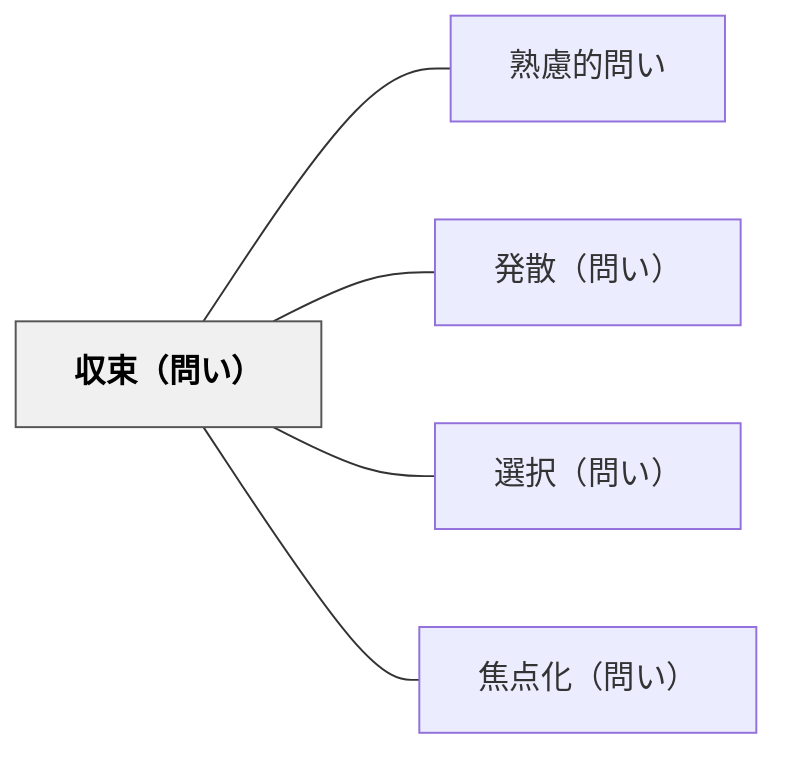

# 収束（問い）

> 「どれが最もよいか？一番大切なのは？」と問い、広がった思考を最良の選択へと絞り込む。

## 背景（Context）
発散によって多くのアイデアや選択肢が生まれた後、そのままでは行動に移れない。
収束とは、生まれた可能性の中から基準に照らして最善を選び取るプロセスだ。
「すべてが重要」という状態は、「何も重要ではない」と同じ意味を持つことがある。
優先順位をつけ、核心を選び取る力は、思考と実践を結びつける重要な能力だ。

## 問題（Problem）
学習者が多くのアイデアや情報を持っているとき、その中から最もよいものを選び、根拠をもって絞り込む力をどう育てるか。

## 力のかたち（Forces）
- 選択には必ず基準が必要であり、基準を明示することが収束を意味あるものにする。
- 「一つに絞る」ことへの抵抗感（他を捨てることへの不安）を和らげる必要がある。
- 集団での収束では、多数決ではなく、理由に基づく合意を促すことが重要だ。
- 収束を急ぎすぎると発散が不十分なまま選択が行われる。

## 解決（Solution）
「どれが一番重要ですか？なぜ？」「もし一つだけ選ぶとしたら？」「どんな基準で選びますか？」と問いかける。
選択の理由・根拠を必ず言語化させ、「なんとなく」を許さない。
選択の基準を事前に共有することで、収束がより論理的・公平になる。
「捨てたアイデアの良い点は何か？」を問うことで、惜しまれる選択の知的誠実さを保つ。

## 結果（Consequences）
多くの可能性の中から根拠を持って選択する力が育つ。
「なぜこれか」という説明責任を果たす習慣が生まれる。
発散→収束のサイクルが学習のリズムとして定着する。
一方で、収束を強制すると、重要なアイデアが捨てられることへの不満が生じることもある。

## 関連パタン
- [[パタン/熟慮的問い]] — 親パタン
- [[パタン/発散（問い）]] — 収束の前段として可能性を広げる問い
- [[パタン/選択（問い）]] — 選択とその根拠を問う類似のパタン
- [[パタン/焦点化（問い）]] — 核心に絞る問い

## クラスター図

## Actionable Insight

- ブレインストーミングの後「もし1つだけ選ぶとしたら、どれで・なぜか？」と収束の問いを続ける——「なんとなく」を許さず理由を求めることが思考と選択の質を高める
- 収束させる前に「選択の基準」を学習者と共有する——基準が明確なほど収束が論理的・公平になる
- 「捨てたアイデアの良い点は何だったか？」を問う——惜しまれる選択の誠実さが発散と収束のサイクルを豊かにする

## 出典
- [[文献/熟慮的問いのパターンリスト（動画記録）]]
