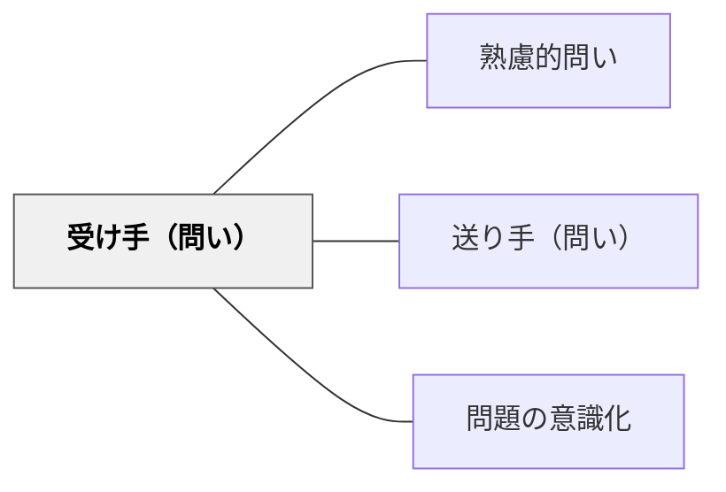

# 受け手（問い）

> 問いを届けるまえに、受け取る相手の状態・文脈・理解を「見立てよ」。

## 背景（Context）

問いは一人では完結しない。問いを受け取る相手（学習者）の認知状態・経験・関心・文脈によって、同じ問いがまったく異なる意味を持つ。相手を「見立てる」ことなく設計された問いは、学習者に届かないか、誤った方向に誘導することがある。

## 問題（Problem）

問いを設計する際に受け手の状態・前提知識・感情的文脈を考慮しないと、問いが難しすぎて沈黙を生んだり、簡単すぎて思考を促さなかったり、的外れになったりする。問いの意図がいくら良くても、受け手に届かなければ学びは生まれない。

## 力のかたち（Forces）

- 教師には「教えたいこと」の視点が強く働き、学習者の現在地から問いを設計することが難しい。
- 学習者の理解状態・感情・興味は多様であり、クラス全体を一つの「受け手」として扱うことには限界がある。
- 相手を見立てる丁寧さが、問いの適切さと学びの深さを決定する。

## 解決（Solution）

問いを設計する前に、「この相手は今どのような理解・関心・感情の状態にあるか」を想像し、具体的にイメージする。安西ゆきが示す「見立てる」プロセスを活用し、学習者の言葉・反応・記録から受け手像を形成したうえで問いの言葉と難度を決める。問いが届く相手を具体的に思い描くことが、問いの質を高める。

## 結果（Consequences）

受け手を見立てたうえで設計された問いは、学習者の思考を適切なゾーンで刺激し、探究の意欲と深い理解を引き出す。一方で「見立て」が固定的になりすぎると相手の成長や変化を見落とす可能性があるため、常に更新し続ける姿勢が必要である。

## 関連パタン
- [[パタン/熟慮的問い]] — 親パタン
- [[パタン/送り手（問い）]] — 対になるパタン
- [[パタン/問題の意識化]] — 受け手の「分からないこと」を把握する

## クラスター図

## Actionable Insight

- 問いを投げかける前に「この学習者は今どんな理解・感情・関心の状態にあるか」を30秒考える——受け手の現在地の想像が問いの適切な難度と言葉選びを変える
- 授業中の学習者の反応・表情・発言から受け手像を常に更新する——固定した「見立て」は成長を見落とすため継続的な観察が必要
- 問いが届かなかったとき「受け手の状態に合っていたか？」を振り返る——問いの失敗の原因を「受け手の問題」でなく「設計の問題」として捉え直すことが次の問いの質を高める

## 出典
- [[文献/熟慮的問いのパターンリスト（動画記録）]]
