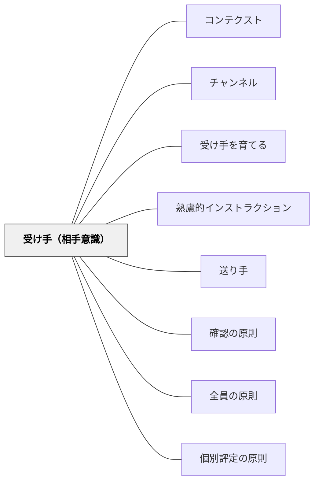

# 受け手（相手意識）

> 受け手はアクティブに行動する責任ある参加者である。

## 背景（Context）
インストラクションは送り手から一方的に届けられるものと思われがちだが、受け手なしには成立しない。受け手がインストラクションを理解し、行動に移して初めてシステムは完成する。送り手が受け手を常に意識することが、インストラクション設計の核心にある。

## 問題（Problem）
受け手を「命令に従う人」「受け身で処理するだけの人」と捉えると、インストラクションは一方通行になり、伝わったかどうかの確認がなくなる。受け手が理解できなかったとき、誰も責任を取らないまま動きが止まる。

## 力のかたち（Forces）
- 受け手は理解したかどうかを送り手に伝える責任を持つ
- 送り手は受け手の知識・経験・状況に合わせて内容を設計する必要がある
- 受け手を主体的参加者として扱うことで、理解の質が上がる
- 受け手の多様性（知識量・文化的背景・処理速度）は常に存在する

## 解決（Solution）
**受け手を「インストラクションの能動的な参加者」として位置づけ、送り手は常に受け手の視点に立って内容・チャンネル・コンテクストを設計する。**

受け手が理解できているかを確認する仕組みをインストラクションに組み込む。「わからなかったら聞いてよい」ではなく、「理解したかどうかを確認するステップ」として双方向のやり取りを設計する。受け手を「あなた」として具体的にイメージしながら設計する。

## 結果（Consequences）
- 受け手が主体的にインストラクションに関わるようになる
- 送り手は一方的な伝達で満足せず、受け手の反応を確認するようになる
- インストラクションの双方向性が高まり、失敗の早期発見につながる

## クラスター図

## Actionable Insight

- 指示の後に「最初に何をしますか？」と一問確認する——双方向のチェックが受け手の理解の状態を送り手に伝える唯一の手段になる
- 指示を設計するとき「特定の一人の学習者（例えばAさん）がこれを受け取ったら理解できるか？」と想像する——具体的な相手のイメージが指示の精度を高める
- 「分からなかったら聞いて」ではなく「ここまで分かりましたか？」という確認ステップを指示に組み込む——受け手が主体的に関与できる仕組みがインストラクションの双方向性を生む

## 出典

- 一つの教育のパタン・ランゲージ（岩井輝久）

## 関連パタン
- [[パタン/コンテクスト]]
- [[パタン/チャンネル]]
- [[パタン/受け手を育てる]]
- [[パタン/熟慮的インストラクション]] — 親パタン
- [[パタン/送り手]] — 受け手と対になる要素
- [[パタン/確認の原則]] — 受け手の理解を確認する実践
- [[パタン/全員の原則]] — すべての受け手に届けることを意識する
- [[パタン/個別評定の原則]] — 個別の受け手へのフィードバック
