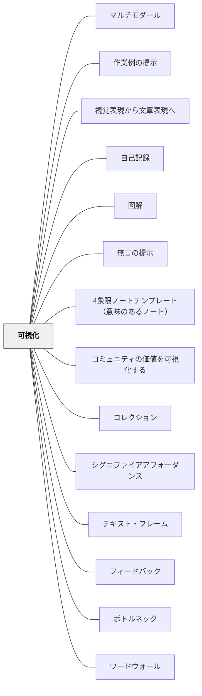

# 可視化

**一文でいうと**：思考・手順・目標・評価・成長を見える形にして、学習者が自分で動けるようにする。

## 使いどころ・使いすぎ注意

| 観点         | 内容                                     |
| ------------ | ---------------------------------------- |
| 使いどころ   | 目標・手順・思考・成長が見えにくいとき。 |
| 使いすぎ注意 | 何でも見せると、見るべき焦点がぼやける。 |

---

## [Pattern Connection]

**出典**: 深田浩嗣（2012）.『ゲームにすればうまくいく ―＜ゲーミフィケーション＞９つのフレームワーク』NHK出版（LEVEL 1：可視化）

- **既存パタンとの関連**：本パタンが「何を可視化するか」という大きな問いを立てるのに対して、深田（2012）はゲーミフィケーションにおける可視化の3ポイントを具体的に提供し、特に「何を可視化するかの選択が行動を決定する」という鋭い視点を追加する。
- **補強された点**：深田（2012）の「指標の選択が結果を決める」という事例——コールセンターの指標を「平均通話時間・売り上げ目標」から「年間購入回数」に変えただけで購入回数が5割増加した——は、「何を可視化するかを間違えない」ことの重大さを具体的に示す。
- **修正・拡張された点**：「ビジュアル化による直感的な理解」を可視化の独立した要素として追加する。数値よりグラフ、表よりアイコン——直感的に理解できる形が「自分へのフィードバック」として機能する。
- **他のパタンへの波及**：[[パタン/ゲーム]] の9ブロックフレームワークの第1ブロックが可視化であり、それなしでゲーミフィケーションは始まらない。[[パタン/おもてなし]] のマインドで「この子に何を見えるようにすべきか」を問うことが、可視化の設計を変える。
- **いるかどり（2023）統合（2026-05-20）**：いるかどり（2023）は、発達障害のある子どもにとって「次に何が起きるか分からない」ことが不安・混乱・問題行動の主要因であることを示す。この文脈での可視化は**スケジュールの可視化**——「今日何をするか」「次は何か」を見えるようにすること——として特別支援固有の意味を持つ。重要な知見は「**見通しの粒度は子どもによって異なる**」点だ。全日程・次2〜3活動・直前の3粒度があり、一律のスケジュール表ではなく観察に基づいた個別設計が必要となる。これは既存の「何を可視化するか」という問いを特別支援の文脈で鋭く問い直す——「いつ何をするか」の可視化が、この子にとって最も重要な可視化である場合がある。また「授業中に誰が困っているか」という状態の可視化においても、[[パタン/合図システム]] との接続が生まれる——合図は「困っている状態」を教師に可視化させるデザインとして読める。

**ゲーミフィケーションにおける可視化の3ポイント（深田, 2012）**：

1. **数値として表現できるものを選び記録する**——行動が数値化されることで「自分の行動へのフィードバック」になる
2. **「なにを」可視化するかを間違えない**——コールセンター事例：通話時間を可視化→通話を短くする行動を誘発。年間購入回数に変えると→購入頻度を上げる行動を誘発
3. **ビジュアルにして変化・比較を直感的にわかりやすくする**——「計るだけダイエット」が機能するのは、体重変化が右下がりのグラフとして直感的に見えるから

**「何を可視化するか」が教室文化を決める**：テストの点数を可視化する教室と、「問いの面白さ・仲間への貢献・解法の多様性」を可視化する教室では、子どもたちが向かうものが根本的に違う。可視化するものが「価値のある行動」を定義する。

---

> 可視化せよ。教室では見えない・不明・曖昧であることがボトルネックとなる。教育はそのボトルネックを可視化していくことでより効果的になる。

## 背景（Context）

「可視化」という言葉には3つの意味がある：

1. そのまま見えるようにする
2. 見えないものを見えるようにする
3. 不明なこと・曖昧なことを**明らかにする・はっきりさせる**

教室には「見えないこと」「分からないこと」が溢れている：

- 思考は見えない
- 声に出して伝えた音声は消えていく
- 何ができるのか分からない
- 何をすべきか分からない
- どこを目指すべきか分からない
- どのような行動が望ましいのか分からない
- どのように評価されているのか分からない
- 自分の善し悪しを判断する基準がないため、自分に満足できず不安である
- 被教育者は「自分は成長していない」という

> 「定理52　自己満足は理性から生ずることができる。そして理性から生ずるこの満足のみが、存在しうる最高の満足である。」
> ——スピノザ『エチカ』第四部 定理五十二

## 問題（Problem）

見えない・不明・曖昧なことが学習のボトルネックになる。思考・目標・評価・成長・教室の状態——これらが見えないまま教育を進めると、学習者は自分の学習を自律的にコントロールすることができない。

## 力のかたち（Forces）

- 思考は目に見えず、音声は消えていく——可視化しないと教師も学習者も共有できない
- 目指す姿・評価基準が見えないと、学習者は自己判断の基準を持てない
- 教室の状態が見えないと、誰が困っているか・助けが必要かが分からない
- 自分の成長の記録がなければ、成長を振り返ることも自信を得ることもできない
- 可視化は教育において大きな経済（節約）となる

## 解決（Solution）

**可視化せよ。**

ジョン・ハッティは「可視化する教育（Visible Learning）」というテーマを掲げて研究・著作を進めている。可視化は**教育を左右するとても重要な大きなパターン**だ。

---

### 可視化のアプローチ①：マルチモダール（思考・手順の可視化）

音声で伝えたことは消えていく。**聴覚だけではなく視覚にも訴えることで、より伝わるようにする**——これをマルチモダールという。

例えば読んで考えたことは見えない。それを可視化することで被教育者の思考をつなげ合うことができる。手順を話すだけよりも手順を可視化することによって、学習への取り組みが大きく変わってくる。

---

### 可視化のアプローチ②：アフォーダンス・シグニファイア（教材の可視化）

教材を見ても、それが何を可能とするものなのか・どのようにするべきなのか分からないことがある。

- **アフォーダンス**（D.A.ノーマン）：何を可能とするものなのか、人とモノとの関係を示す
- **シグニファイア**：するべきことを知覚させるもの

被教育者に提供する教材が、アフォーダンスやシグニファイアに欠けるデザインになっていないか。

---

### 可視化のアプローチ③：目指す姿・価値観の可視化

被教育者は、どのような姿を目指すのか・どのような行動が望ましいのか分からないことがある。

- **国際バカロレアの学習者像**のように、どのような姿を目指すのかを可視化する
- 子どもたちが教材との交流を通してどのような姿を目指すのかを構成・可視化していく
- **プロジェクトアドベンチャーのビーイング**：チームにとって大切にしたいことをみんなで考えて言語化・可視化していく

---

### 可視化のアプローチ④：評価の透明化

被教育者は自分がどのように評価されるのか分からないことがある。評価方法を透明化・可視化することで、被教育者は自分の学習を**自律的にコントロール**できるようになる。

---

### 可視化のアプローチ⑤：ポートフォリオ（成長の可視化）

ポートフォリオとは元々美術大学で学生が書いた絵をファイリングして保存したところから、他の教育現場に応用されたものだ。**学んだことの積み重ねをポートフォリオとして見えるようにすることで、被教育者は自分の成長を実感できる。**

---

### 可視化のアプローチ⑥：類推的学習と基準の可視化

被教育者は何が良いのか判断する基準を持っていないことがある。類推的学習がこの問題を解決する。

例えば**良い俳句を読み比べることで**、良い俳句にはどのような特徴があるのかを考えてリスト化する——これが可視化だ。何が「良い俳句」なのかという不明確なものを明らかにする。このように教育設計すれば被教育者はどのような俳句が良いのかという視点・知識を自ら構成できるようになる。構成した視点で俳句を作ったり評価したり鑑賞したりすることができるようになる。

---

### 具体例①：学び合い——班の状態を黒板で可視化

西川純さんの二重丸学び合いの実践者である「ジジさん」の教室で見て学んだ実践。英語・算数などで使っていた。

**方法**：

- 黒板に班の番号を書く（7班クラスなら `1 2 3 4 5 6 7`）
- 授業の終末、練習問題の場面などで**全員できた班はその番号を丸で囲む**
- または色違いの両面の名前マグネットを作って、課題が終わったらひっくり返す
- または黒板を区切って名前マグネットを移動して課題の完了を可視化する
- 表で課題の進行を可視化する方法もある

**効果**：

- 「全員できた」「あの班はまだ終わっていない→困っている人がいるかもしれない」という状態が全員に見える
- 教師がその班に向かって状況を把握し助けることができる
- 困っている人がいると分かって友達が助けに行くことができる
- 「教えて」と声をかけるきっかけになる

---

### 具体例②：ポートフォリオの実践エピソード

子どもたちに「成長したところを教えて」と聞くと、「分からない」という答えが返ってくることがある。

しかしポートフォリオファイルに**作品（作文・絵・俳句など）を保存**していれば、具体的にそれを見て成長を可視化することができる。例えば俳句がファイルに入っていれば「火を使えている」「季語が工夫されている」などと具体的に分かる。何の記録も保存もなければ、自分がよくできたことも何ができたのかも思い出せないことがある。だから「成長したところを具体的に振り返ろう」と言っても「分からない」という答えが返ってくる。

---

### 具体例③：6年生「海の命」読書会——名簿による進行状況の可視化

ある授業研究で見た6年生の国語授業（「海の命」読書会）。「成長」という鍵概念を軸に、話し合う価値のある7つのテーマを教師と子どもたちで作った。

テーマ例：「村一番と一人前の違いはどのように違うのか」など7テーマ

**名簿での可視化の方法**：

- 名簿の上に7つのテーマを配置する
- 各テーマについて話し合い、納得できる回答が得られたらそこに印（チェック・すみなど）を入れていく
- 名簿を見れば、自分が7つのテーマのうちどれだけ友達と話せたか・どのグループで読書会ができたかの状態が一目で分かる

**なぜこれが有効だったか**：教室の読書会の状態が名簿で可視化されていたことで、子どもたちが**自律的にグループを組み直し**、新しい話し合いへ向かっていくことができた。

この名簿による可視化はライティングワークショップでも使える——各自の作文作成プロセス（下書き→推敲・修正→清書）のどの段階にいるかを名簿で可視化することで、教師も子どもも全体の状態を把握できる。

---

## 結果（Consequences）

- 思考・目標・評価・成長・教室の状態が見えることで、教師も学習者も自律的に動けるようになる
- 学習者が自分の学習を自律的にコントロールできるようになる
- 教師が誰に支援が必要かを把握しやすくなる
- 学習者が自分の成長を実感し、スピノザのいう「理性から生じる自己満足」に近づける
- 可視化によって教育の経済（無駄の削減）が実現する

## 関連パタン
- [[特別支援/視覚支援]]
- [[パタン/マルチモダール]]
- [[パタン/作業例の提示]]
- [[パタン/視覚表現から文章表現へ]]
- [[パタン/自己記録]]
- [[パタン/図解]]
- [[パタン/無言の提示]]
- [[パタン/4象限ノートテンプレート（意味のあるノート）]]
- [[パタン/コミュニティの価値を可視化する]]
- [[パタン/コレクションと趣味]]
- [[パタン/シグニファイアアフォーダンス]]
- [[パタン/テキスト・フレーム]]
- [[パタン/フィードバック]]
- [[パタン/ボトルネック]]
- [[パタン/ワードウォール]]
- [[パタン/概念型の目標]]
- [[パタン/環境調整]]
- [[パタン/橋渡し推論]]
- [[パタン/語彙の指導]]
- [[パタン/作家のクラフト]]
- [[パタン/算数シンキング・タスク]]
- [[パタン/視覚的数学]]
- [[パタン/自己調整]]
- [[パタン/習慣化脱習慣]]
- [[パタン/熟慮的インストラクション]]
- [[パタン/上級者向け]]
- [[パタン/図画・地図]]
- [[パタン/発達特性と環境調整]]
- [[パタン/表現して学ぶ]]

- [[パタン/思考の可視化]] — シンキングルーティンで内部の思考を外化・共有する
- [[パタン/形成的評価]] — 学習途中の理解状態を可視化して授業を調整する
- [[パタン/シンクアラウド]] — 教師が思考を声に出すことで読解プロセスを可視化する
- [[パタン/精緻化]] — 既知と新知識のつながりを図・言葉で見えるようにする
- [[パタン/アンカーチャート]] — 学習内容を教室の壁に常時掲示して学びの参照点をつくる
- [[パタン/目の前に山があれば登りたくなる]] — ゴールを見えるようにすることで自発的に向かう力を引き出す
- [[パタン/熟慮的教材教具]] — 教材・道具が何をすべきかを示す設計に可視化の視点が宿る

## このパタンが働く実践
- [[実践/2列メモ（シンクシート）]]
- [[実践/BDA読解授業の設計]]
- [[実践/インクルーシブ授業の設計]]
- [[実践/テキストコーディング]]
- [[実践/発達特性別の環境調整]]

| 実践パタン                                                      | どのように可視化しているか                                                                                                                                                                             |
| --------------------------------------------------------------- | ------------------------------------------------------------------------------------------------------------------------------------------------------------------------------------------------------ |
| [[パタン/視覚的数学]]                                           | 「どのように見えますか？」という問いで、数・図形・代数の概念を視覚的経路で捉え直す——数学固有の可視化実践                                                                                               |
| [[パタン/ナンバートーク]]                                       | 複数の計算方法を式・図・言葉として板書し、頭の中の計算過程を共有可能にする                                                                                                                             |
| [[パタン/数学ワークショップ]]                                   | 問題解決の途中で図・式・表・ジャーナルを使い、考え方・語彙・つまずきを見える形にする                                                                                                                   |
| [[パタン/リーディング・ワークショップ]]                         | 読書記録、目標、図書コーナー、カンファランス記録によって読書の状態を見えるようにする                                                                                                                   |
| [[パタン/チェックイン（Checking In）]]                          | 独立読書中の全員の状態（本のタイトル・ページ・評価・ゾーン・次の本）を「ステータス・オブ・ザ・クラス」として一覧表に記録し、誰が止まっているか・ゾーンに入れていないかを教師と学習者が見えるようにする |
| [[パタン/ブッククラブ]]                                         | 読書会のテーマ、進行状況、読みの変化を見える形にし、対話を自律的に進めやすくする                                                                                                                       |
| [[実践/ローベルみたいな物語を書こう]]                           | 交流会のモデルや構成表によって、相談・助言・手直しの過程を見えるようにする                                                                                                                             |
| [[実践/俳句と短歌を楽しもう]]                                   | よい俳句・短歌の特徴を確認し、感想や修正の観点として使えるようにする                                                                                                                                   |
| [[実践/詩を紹介する・詩を創作する]]                             | 詩の工夫を黒板で示し、付箋で感想を残る形にする                                                                                                                                                         |
| [[実践/言葉をよりすぐって俳句を作ろう]]                         | よい俳句の特徴リストを、推敲ポイントとして見える形にする                                                                                                                                               |
| [[実践/10や100を単位にして計算しよう]]                          | 数カード・図・式・言葉で、10や100を単位とする見方を見える形にする                                                                                                                                      |
| [[実践/カエルの算数：勝ちやすさを表で考えよう]]                 | サイコロの和の組み合わせを表や色分けで見える形にし、勝ちやすさを考えられるようにする                                                                                                                   |
| [[実践/個別支援級の複式算数：重さと面積をわたり・ずらしで学ぶ]] | 複式指導で教師が離れている間も、手順・既習事項・考えを書き残す欄を見える形にする                                                                                                                       |

## このパタンが働く教材

| 教材                                              | どのように可視化しているか                                                           |
| ------------------------------------------------- | ------------------------------------------------------------------------------------ |
| [[教材/増える算数辞典]]                           | 算数語彙を図・例・使う場面・似ている言葉として見える形にし、言葉の輪郭を明らかにする |
| [[教材/リーディング・ワークショップの小さい付箋]] | 読書中に気になった箇所や根拠になる箇所を、あとで戻れる形で見えるようにする           |
| [[パタン/数学語彙の文脈的指導]]                   | 語彙を図・例・非例・ワードウォールとして見える形にする                               |
| [[パタン/図に表せないか]]                         | 問題の構造を図・数直線・表などに変換して見えるようにする                             |

- [[パタン/ボトルネック]] — 見えないことが教育のボトルネックになる
- [[パタン/類推的学習①]] — 良い例を比較することで「良さの基準」を可視化する
- [[パタン/ポートフォリオファイル]] — 学習の成果を保存して成長を可視化する
- [[パタン/イメージ]] — 目指す姿を見えるようにする
- [[パタン/フィードバック]] — 可視化があって初めて有効なフィードバックができる
- [[パタン/自己調整]] — 可視化によって学習者の自律的なコントロールが生まれる
- [[パタン/視覚的数学]] — 算数・数学における可視化の固有実践。「どのように見えますか？」という問いが計算問題を思考問題に変える
- [[パタン/発達特性と環境調整]] — スケジュールの可視化・見通しの粒度（いるかどり, 2023）
- [[パタン/合図システム]] — 「困っている状態」を教師に可視化させるデザイン

## クラスター図

## Actionable Insight

- 今週の授業で「見えていないもの」を1つ特定し、黒板・名簿・マグネットで可視化する——まず1つだけ試す
- 授業目標を口頭だけでなく黒板に書いて残す——「今日何をする授業か」が常に見えていると学習者の自律性が高まる
- 班の課題完了状態を黒板の番号に丸で示す——「どの班がまだか」が見えるだけで子どもたちが自律的に動き出す

## 出典
- [[文献/一つの教育のパタン・ランゲージ]]

スピノザ『エチカ』第四部 定理五十二  
D.A.ノーマン（アフォーダンス・シグニファイア）  
ジョン・ハッティ "Visible Learning"（可視化する教育）  
国際バカロレア（学習者像）  
プロジェクトアドベンチャー（ビーイング）  
西川純（二重丸学び合い）  
岩井輝久「岩井輝久『一つの教育のパタン・ランゲージ』」（2026-04-29 vault収録）  
岩井輝久「パタン　可視化（動画記録）」https://youtu.be/60PRqWjABKc
