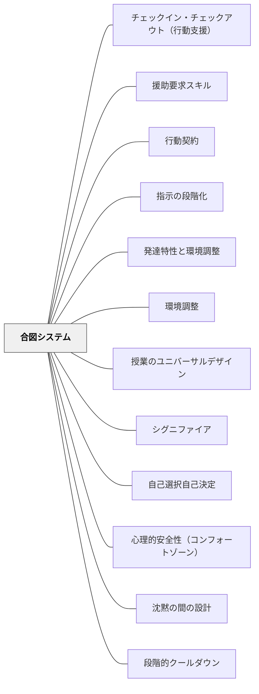

# 合図システム

> 「助けが必要です」を声に出させない——目立たない合図が、子どもの自己主張を守る。

## [Pattern Connection]

- **既存パタンとの関連**：[[パタン/環境調整]] の「社会的環境の調整」として位置づけられる。[[パタン/シグニファイア]] とも連動する——合図は「このサインをすると〇〇が起きる」という知覚可能な手がかりをシステムとして設計する行為。[[パタン/自己選択自己決定]] の最小単位——子どもが「今必要なこと」を自分で選んで伝えられる構造をつくる。
- **補強された点**：特別支援において「困っているのに声が出ない」という問題を、事前の設計で解決する。支援の要求を「周囲に目立たない形で」行える仕組みが、子どもの尊厳を守りながら自己主張を可能にする。
- **修正・拡張された点**：合図は教師→子どもの一方向ではなく、子ども→教師（「助けが必要」）と教師→子ども（「今は聴いて」）の双方向で設計するときに最も機能する。
- **いるかどり（2023）統合（2026-05-20）**：[[パタン/援助要求スキル]] との明確な接続。援助要求スキルの発達において、合図システムは「声に出せない段階の子が使える援助要求の形式的手段」として機能する。言葉で「助けてください」と言う前の発達段階に、合図という足場を提供することで、援助要求の経験を積める。最終的には言語的な援助要求への移行が目標となる。
- **他のパタンへの波及**：[[パタン/沈黙の間の設計]] ——合図があることで、子どもは沈黙の中でも「自分の状態を教師に伝えられる」安心感を持てる。[[パタン/心理的安全性（コンフォートゾーン）]] ——合図システムは「いつでも助けを求められる」環境をつくる構造的な担保。

## 背景（Context）

特別支援が必要な子ども、また内向的な子どもは「助けが欲しい」「動き回りたい」という状態を、言葉で、あるいは人前で主張することが難しい。しかし黙っていると支援が届かず、苦しい状態が続く。一方で、声で「助けてください」と言うことは、クラスメートの視線を集めるリスクがある。

## 問題（Problem）

学習中に「わからない」「集中が切れた」「動く必要がある」という状態になったとき、子どもが適切に教師に伝えられる手段がなければ、問題行動（立ち歩き・シャットダウン・授業妨害）として表れることがある。あるいは、ただ苦しいまま何も言えないまま授業が終わる。

## 力のかたち（Forces）

- 「困っている」を声で伝えることへの心理的ハードルが高い子どもがいる
- 公の場で「助けが必要」と言うことは、周囲の目を気にする子どもには辛い
- 教師も、クラス全体を見ながら個別の状態変化を見逃しやすい
- 事前に合図を決めていると、子どもは「伝える選択肢がある」という安心感を持てる
- 小さな身体的な合図（指の数・目のサイン）は、授業の流れを止めない

## 解決（Solution）

**授業が始まる前に、子どもと教師が「特定の場面でどんな合図を使うか」を具体的に決め、練習してから使い始めよ。**

---

### 子ども→教師の合図（自己主張の合図）

子どもが自分の状態を教師に伝えるための合図。人目を引かずに伝えられることが核心。

| 合図 | 意味 |
|------|------|
| 指1本を静かに立てる | 「助けが必要です」 |
| 指2本を静かに立てる | 「席を立って動く許可が欲しい」 |
| 赤いカードを机の隅に出す | 「今、気持ちが大変な状態です」 |
| 青いカードを出す | 「ちょっと休憩が必要です」 |

**設計のポイント**
- 使うサインは2〜3個まで。多すぎると覚えられない
- 子どもと一緒に決める——「何か困ったとき、どんなサインで教えてくれる？」
- 合図の意味を確認してから使い始める（ロールプレイで練習する）
- 合図を使ったとき、教師は素早く、静かに、目立たず応答する

---

### 教師→子どもの合図（授業中の無言リマインダー）

教師が子どもの注意を促すための目立たないサイン。言葉で指摘するより子どもの尊厳を守る。

| 合図 | 意味 |
|------|------|
| 目を触る（指で目を指す） | 「今、こっちを見て」 |
| 耳を触る（耳に手を当てる） | 「聴く時間だよ」 |
| 口の横に指を当てる | 「今は話さない時間だよ」 |
| 指を鼻に当てる（鼻に触れる） | 「答える前にもう一度考えて」 |

**設計のポイント**
- 子どもに事前に説明しておく（「先生がこのサインをしたら〇〇って意味だよ」）
- サインは落ち着いた表情で使う——責めるニュアンスにならないよう注意
- 特定の子だけでなく、クラス全体に向けても使える

---

### 導入の手順

1. **個別に、授業の前に合図を決める**——クラス全体で一斉にやらない。子どもと1対1で「今日から使ってみる？」と確認する
2. **ロールプレイで練習する**——「じゃあ、もし困ったらどうする？」と実際にサインを出してもらう
3. **最初は1つだけ**——「困ったら指1本」だけから始め、慣れたら追加する
4. **合図を使ったら必ず応答する**——応答しないと、子どもは「使っても無駄」と学習してしまう

## 結果（Consequences）

- 「困っている」を声で言えなかった子どもが、サインで伝えられるようになる
- 問題行動になる前に、状態が教師に届く
- 子どもは「いつでも伝えられる」という安心感を持って学習に集中できる
- 教師のリマインダーが言葉でなく合図になることで、授業の流れが止まらない
- 子どもの自己主張スキル（自己アドボカシー）が少しずつ育つ

## 関連パタン
- [[パタン/チェックイン・チェックアウト（行動支援）]]
- [[パタン/援助要求スキル]]
- [[パタン/行動契約]]
- [[パタン/指示の段階化]]
- [[パタン/発達特性と環境調整]]

- [[パタン/環境調整]] — 社会的環境の調整（親パタン）
- [[パタン/授業のユニバーサルデザイン]] — インクルーシブな設計の枠組み
- [[パタン/シグニファイア]] — 合図は知覚可能な手がかりのシステム設計
- [[パタン/自己選択自己決定]] — 合図は「今必要なこと」を選ぶ最小単位の選択
- [[パタン/心理的安全性（コンフォートゾーン）]] — 伝えられる構造が安心の土台
- [[パタン/沈黙の間の設計]] — 合図があることで沈黙の中でも安心できる
- [[パタン/段階的クールダウン]] — 合図でサインを出した後の次のステップ

## クラスター図

## Actionable Insight

- 今週、「困ったら指1本」だけを1人の子どもと決めて使い始める——2〜3個いっぺんに導入せず、まず1つを定着させる
- 教師自身が「目を触る」サインを授業中1回使ってみる——言葉での注意喚起と何が違うか観察する
- 授業の最初に「今日もし困ったとき、どうしたらいい？」と合図の確認を一言するだけで、子どもは「使っていい」と思えるようになる

## 出典

Hammeken, P. A. (2007). *The Teacher's Guide to Inclusive Education: 750 Strategies for Success!* Corwin Press. (2nd ed.)

> "Ask the student to use prearranged signals or words, such as one finger raised means 'I need help' and two fingers means 'I need permission to get up and move around.'" — Hammeken (2007), Strategy #698

> "Use private visual cues. Touching your eye means 'look at me,' your ear, 'time to listen' and the side of your mouth, 'no talking.'" — Hammeken (2007), Strategy #699
