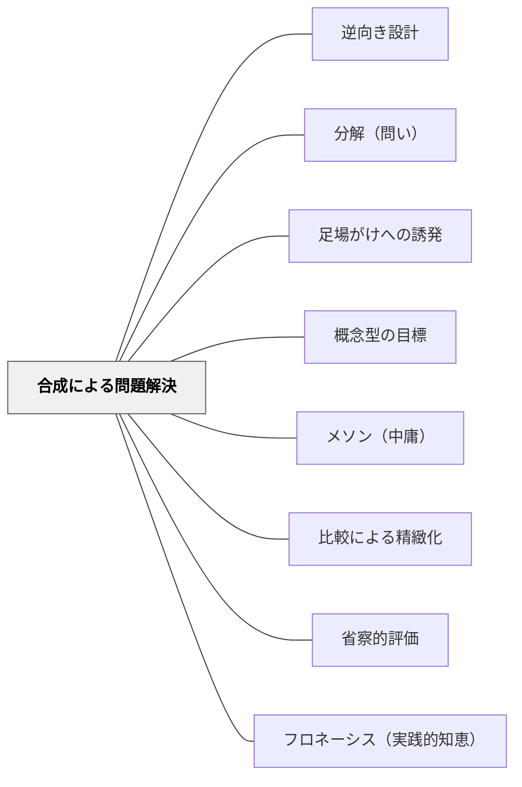

# 合成による問題解決

## Pattern Connection

**既存パタンとの関連**

本パタンは [[パタン/分解（問い）]] と [[パタン/逆向き設計]] を橋渡しする位置にある。「分解（問い）」が「どの要素で構成されているか」を問う視点を与えるのに対し、本パタンは分解した要素を「どう再合成するか」の設計論を扱う。「逆向き設計」が宣言的にゴールを設定することに対し、本パタンはそのゴールへ向かう射の連鎖をどう設計するかを扱う。

**補強された点**

Milewski（2023）の圏論により、「分解→再合成」という授業設計の直感に、認知科学的根拠（Miller の7±2チャンク）と数学的構造（射の合成・結合律・恒等射）が与えられた。「直感でやっていたこと」が構造として記述できるようになる。

**修正・拡張された点**

従来の授業設計論では「活動の並び」として単元が設計されがちだった。本パタンは「射の連鎖」として設計することを提案する——これにより、各活動の「入口（前提）」と「出口（結果）」の噛み合いが明示的な設計対象になる。

**他のパタンへの波及**

[[パタン/省察的評価]] — 授業後に「どの射が機能したか」を評価する視点。[[パタン/フロネーシス（実践的知恵）]] — 「射を見ることで対象を知る」実践的知慧。[[概念/圏論と教育]] — 本パタンの数学的基盤。

---

> 「合成はプログラミングの本質であり、教育の本質でもある——問題を独立した小片に分解し、それぞれを解いて、解を合わせる。」

## 背景（Context）

教師が単元を設計するとき、大きなゴール（「分数の意味を理解する」「説明的文章の構造をつかむ」）をそのまま授業に持ち込もうとすると行き詰まる。大きな問題は、そのままでは扱えないからだ。

人間の作業記憶は7±2チャンクしか同時に保持できない（Miller, 1956）。これは教師にも児童にも当てはまる。ゴールが大きいまま提示されれば、認知負荷は限界を超え、誰も動けなくなる。

この限界は人間の脳の欠陥ではなく、「合成」という戦略を必然とする構造的な事実である。問題を独立した小片（射）に分解し、それぞれを個別に解き、解を合わせて（合成して）全体のゴールへ到達する——これが知的活動の本質的なパタンだとMilewskiは言う。圏論はこの構造を数学的に記述する言語であり、教育設計にも同じ構造が見出せる。

## 問題（Problem）

授業の問題設定や単元設計で、大きなゴールを「分解せずに提示してしまう」ことで、児童も教師も身動きが取れなくなる。逆に、細かく分解しすぎると、各活動が何のためにあるかが見えなくなり、「再合成」——部分から全体を取り戻す設計——が抜け落ちる。

**分解はするが、再合成を設計しない**という失敗が最も頻繁に起きる。活動を並べることと、活動を合成することは違う。

## 力のかたち（Forces）

- **分解が細かすぎると全体が見えなくなる**: バラバラになった部品は、誰も全体像を見失う。分解の粒度には適正がある（[[パタン/メソン（中庸）]]）。
- **合成のためには「出口と入口が噛み合う」ことが必要**: A→B の出口（B に到達した状態）が、次の B→C の入口（C に向かうための前提）と一致していないと、合成は成立しない。これは発達段階の連続性（ZPD）とも対応する。
- **結合律が柔軟性を与える**: 圏論における結合律 h∘(g∘f) = (h∘g)∘f は、「括弧のかけ方（活動のまとめ方）が変わっても全体の結果は同じ」であることを意味する。授業の順序・グループ分け・時間割には、この柔軟性が働く。
- **恒等射の大切さ**: 何も変換しない射（恒等射）は合成の中で欠かせない要素である。「何もしない時間」「余白」「待つこと」は合成の中でその場を占めている——無駄ではない。
- **分解は分類ではない**: 分解は「全体とその部品の関係」を問う。分類（同じ種類でまとめる）と混同しやすいが、合成の設計では分解的視点が必要である（[[パタン/分解（問い）]]）。

## 解決（Solution）

**学習のゴール（C）から逆算して、B→C の射（最後の変換）を設計し、次に A→B の射（その前の変換）を設計する。各射（活動・問い・指示）は独立して設計・評価でき、合成によって全体のゴールに到達する。**

設計のステップ：

1. **ゴールの宣言（宣言的アプローチ）**: 単元の最後に「児童がどんな状態にあるか」を先に宣言する。これが C（終点）の状態。
2. **射の設計（逆向きに）**: C から B への射、B から A への射を逆算で設計する。各射は「入口と出口」を持つ独立した変換として設計する。
3. **接続部の確認**: B（中間状態）で「A→B の出口」と「B→C の入口」が噛み合っているか確認する。ここで型の不一致（前提の欠如・ZPD の飛びすぎ）が発見できる。
4. **恒等射の設計**: どこかに「余白・沈黙・再訪」を意図的に配置する。すべての活動が変換でなくてもよい。

---

**実践例1：算数のスパイラル**

加法（A）→乗法（B）→分数（C）の射の合成。

- A→B: 「同じ数を何度も足すことをまとめる方法はないか」という問いが射として機能する
- B→C: 「1より小さい数を乗法の言葉で表すとどうなるか」が射として機能する
- 各射は独立して評価でき、どの接続部が薄いかが診断できる

---

**実践例2：単元設計の3ステップ合成**

素材（A）→概念の発見（B）→応用・表現（C）。

- A→B: 具体的な素材・活動・問いの中で概念に触れる（[[パタン/足場がけへの誘発]]）
- B→C: 概念を別の文脈・別の表現形式に適用する（[[パタン/比較による精緻化]]）
- 「素材だけで終わる授業」「応用だけを求める授業」は合成の途中で止まっている

---

**実践例3：協働学習の合成設計**

個（A）→ペア（B）→グループ（C）→全体共有（D）。

- A→B: 個人の考えをペアに開示・比較する射
- B→C: ペアの考えをグループで統合・検討する射
- C→D: グループの知見を全体で共有・評価する射
- 各射の「出口」が次の「入口」に何を渡すかを設計することで、単なる「形式の切り替え」ではなく「思考の変換の連鎖」になる

## 結果（Consequences）

- **診断の精度が上がる**: 各「射」（活動）を独立して評価できるため、「どの部分が機能していないか」が特定できる。「授業がうまくいかなかった」という感覚が「A→B の接続部が薄かった」という具体に変わる。
- **改善が局所的に可能になる**: 射の合成は全体を作り直さなくても、一つの射だけを改善することができる。結合律が保証する柔軟性。
- **順序の選択肢が生まれる**: 結合律により、活動をまとめる括弧のかけ方が変わっても全体のゴールへの到達は変わらない。授業の時間配分・グループ分け・順序の入れ替えに自由度が生まれる。
- **余白の正当化**: 「何もしない時間」を設計に組み込む根拠（恒等射）が得られる。

## 関連パタン

- [[パタン/逆向き設計]] — 宣言的ゴールを起点とする合成設計。本パタンの「ゴールの宣言」ステップと直接対応する
- [[パタン/分解（問い）]] — 問いによる分解の実践。合成の前提としての分解を担う
- [[パタン/足場がけへの誘発]] — 合成のつなぎ目として機能する足場。A→B の接続部を支える
- [[パタン/概念型の目標]] — 合成の「終点」（到達すべき概念）を設計する
- [[パタン/メソン（中庸）]] — 合成の粒度（細かすぎず大きすぎず）の調整
- [[パタン/比較による精緻化]] — B→C の射として機能する比較の操作
- [[パタン/省察的評価]] — 合成の全体を事後に評価する。どの射が機能したかの診断
- [[パタン/フロネーシス（実践的知恵）]] — 「射を見ることで対象を知る」実践的知慧との接続
- [[概念/圏論と教育]] — 合成の数学的基盤。本パタンが依拠する理論的枠組み
- [[文献/Category Theory for Programmers（Milewski）]] — 本パタンの出典文献

---

## クラスター図

## Actionable Insight

- **今週の授業を射の連鎖として描いてみる**: 各活動を矢印（→）でつないだとき、A→B→C の連鎖になっているか紙に書いてみる。矢印が途切れる場所が、設計上の「穴」である。
- **合成の接続部を確認する**: 前の活動の「出口」（子どもが到達した状態）が次の活動の「入口」（その活動を始めるための前提）と噛み合っているか、授業計画を見直してみる。
- **単元全体を分解→再合成の図として描く**: 単元のゴール（C）を先に書き、そこから逆算して B、A を設定してみる。逆向き設計を「射の逆算」として実行する。
- **恒等射を意識する**: 今週の授業に「何もしない余白」を一つ意図的に作る——沈黙、再訪、自由な探索など。それが合成の中でどう機能したかを授業後に振り返る。

---

## 出典

Milewski, B. (2023). *Category Theory for Programmers* (I. Tabachnik, Ed.). CC BY-SA 4.0. (Ch. 1: Category: The Essence of Composition; Ch. 11: Declarative Programming)

Miller, G. A. (1956). The magical number seven, plus or minus two: Some limits on our capacity for processing information. *Psychological Review*, 63(2), 81–97.

[[文献/Category Theory for Programmers（Milewski）]]

> 「合成はプログラミングの本質である——問題を独立した小片に分解し、それぞれを解いて、解を合わせる。これが必要なのは人間の脳が7±2チャンクしか扱えないからだ」——Bartosz Milewski, Ch.1

> 「圏論は対象の内部を見ることを積極的に禁じる。対象について知れることは、他の対象との射（関係）だけだ」——Bartosz Milewski, Ch.1
