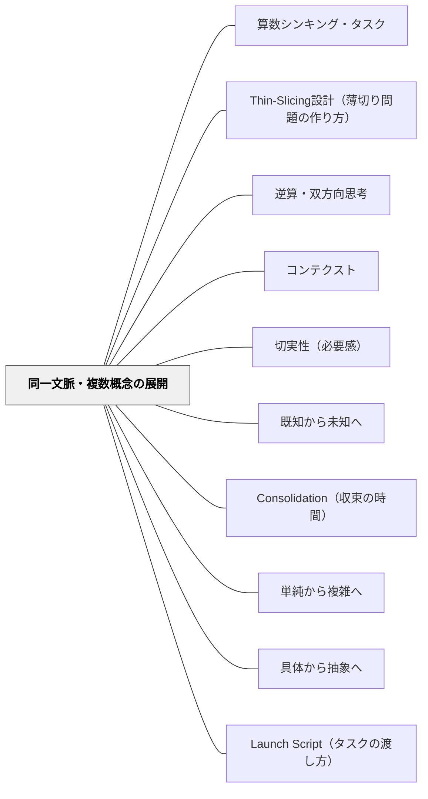

# 同一文脈・複数概念の展開

> 同じ物語を使い続ける。変わるのは「問われること」であって、「場面」ではない。だから子どもは、なぜ違う数学が必要になるのかを自分で感じる。

---

## Pattern Connection

**出典**: Liljedahl & Giroux（2024）、特にTask 37「Garden Fences」（周り→面積→体積）・Task 32〜33「Sum Some More / Subtraction is the Main Attraction」（加法→減法）・Task 38「Track Day」（乗法→除法）

- **既存パタンとの関連**: [[パタン/Thin-Slicing設計（薄切り問題の作り方）]] の特殊形。Thin-Slicingが「同じ概念内で数値を変える」のに対し、このパタンは「同じ文脈内で概念そのものを変える」点が異なる。[[パタン/単純から複雑へ]] の文脈版でもある
- **補強された点**: [[パタン/具体から抽象へ]] が「具体物から記号へ」という素材の変化を扱うのに対し、このパタンは「同じ具体物をめぐる問いが変わる」という文脈維持の価値を明示する
- **修正・拡張された点**: 従来の単元構成は「単元ごとに文脈を変える」が標準だったが、このパタンは「文脈を変えない」ことで概念間の関係（なぜ面積は周りと違う測り方をするのか？）への動機づけが生まれることを示す
- **他のパタンへの波及**: [[パタン/コンテクスト]] と組み合わさるとき、「良い文脈の条件」が「複数の概念を自然に誘い出せること」になる。[[パタン/切実性（必要感）]] への接続——「なぜこの計算が必要なのか」が物語の続きとして自然に生まれる

---

## 背景（Context）

教科書の単元構成では、「加法→（別の単元で）面積→（別の単元で）体積」と、学習内容ごとに文脈が切り替わる。この構成は体系的ではあるが、子どもの視点からは「なぜこの計算を学ぶのか」の動機が単元ごとに新たに必要になる。

一方、現実の場面では「一つの物をめぐって複数の数学的問いが生まれる」ことが多い。花壇を作るとき、設計者は「囲む木の長さ（周り）」「地面に敷くシートの広さ（面積）」「入れる土の量（体積）」を全部考える。これらは断片的な知識ではなく、同じ対象に向けられた異なる問いだ。

## 問題（Problem）

単元を変えるたびに文脈を変えると、**子どもは「なぜこの数学が必要なのか」への答えを、文脈から受け取れない**。面積の授業で花壇の例を出しても、前の単元で周りを扱っていなければ「なぜ面積で測ると周りと何が違うの？」という問いが生まれない。

また、算数を「テーマ別の独立した計算集」として経験した子は、現実の問題（複数の数学が絡む問い）に直面したとき、何を使えばいいか迷う。

## 力のかたち（Forces）

- 文脈が変わるたびに「なぜこれを学ぶか」の動機づけが必要になる
- 同じ対象に向けられた問いが変わることで「なぜ違う計算が必要か」が自然に問いになる
- 子どもの記憶の中では「場面」が概念の引き出し口になっている——同じ場面が続くと、前の学習が「引き出し」として機能する
- 一方、文脈を長く使いすぎると、子どもが「場面」に依存しすぎて「別の場面では使えない」になるリスクがある

## 解決（Solution）

**一つのリアルな文脈（ストーリー）を複数の数学的概念をつなぐ「糸」として使い、概念が変わるたびにその理由（なぜこの計算が必要か）を文脈から引き出す。**

---

### 設計の原則

1. **文脈は「複数の問いを自然に呼び出せる」ものを選ぶ**——花壇・建物の設計・パーティーの準備など、現実に「周り・広さ・容積」を全部考える場面を選ぶ
2. **前の概念を「解決済み」として次の問いへ**——「木の板の長さは決まった。次は地面のシートだが、どう測る？」と前の解決が次の問いを引き出す
3. **概念が変わるときに「なぜ変わる？」を問う**——「周りと面積、どちらが大きい？（比べられる？）」という問いが、単位（m vs m²）の違いの本質的理解につながる
4. **最後に「3つの概念はどう関係しているか？」を収束させる**

---

### 代表例：Task 37「Garden Fences」（花壇）

同じ花壇（例：3m × 4m）をめぐって、問いが3段階に変わる：

```
場面：花壇を作る

問い①：木の板でまわりを囲みます。何mの板が必要？
          ↓（解決：周りの長さ = 14m）

問い②：地面に防草シートを敷きます。何m²必要？
          ↓（解決：面積 = 12m²）

問い③：土を深さ1m入れます。何m³必要？
          ↓（解決：体積 = 12m³）
```

**この設計の力**：「周りは14mなのに面積は12m²」——同じ花壇なのに数値も単位も違う。「なぜ？」が生まれる。

---

### 代表例②：Task 32〜33「カードを合わせる・差を調べる」

同じ「兄弟がポケモンカードを比べる」ストーリーで2授業続く：

```
Task 32（Sum Some More）：
  「2人を合わせると何枚？」→ 加法（繰り上がりあり・なし）

Task 33（Subtraction Is the Main Attraction）：
  「どちらが多い？差は何枚？」→ 減法（繰り下がりあり・なし）
```

同じ登場人物・同じ状況で「問いの向き」だけが変わる。子どもは前の授業を自然に思い出し、「今日は反対の問いだ」と気づく。

---

### 代表例③：Task 38「Track Day」（リレー競技）

同じ「運動会のリレー組分け」で：

```
問い①：3組に4人ずついたら全部で何人？ → 乗法
問い②：12人を3組に分けたら1組何人？  → 除法（等分除）
問い③：25人を4人ずつの組にしたら何組？余りは何人？ → 除法（包含除・余りあり）
```

---

### 文脈を変えるタイミング

文脈は同じまま概念が変わるが、**Consolidation（収束）が終わったら文脈を変えて練習する**——でないと「花壇の問題は解けるが、その他の場面では使えない」になる。文脈は「概念の入口」であり「概念の全て」ではない。

## 結果（Consequences）

- 「なぜこの計算が必要か」が文脈から自然に生まれる——外から動機を与えなくてよい
- 前の概念が「次の問いへの橋」になり、概念間の関係が見えてくる
- 「周りと面積は単位が違う」「加法と減法は方向が逆」という関係的理解が生まれやすい
- ただし、文脈の魅力（犬・花壇・カードなど）が子どもと合わないと、文脈よりも問題が先に見えてしまう
- 文脈に依存しすぎると、「花壇以外の場面では周りを求められない」という転移の失敗が起きうる——Consolidationでの「この考え方はいつでも使える」というまとめが必要

## 関連パタン
- [[パタン/算数シンキング・タスク]]

- [[パタン/Thin-Slicing設計（薄切り問題の作り方）]] — 同一文脈・複数概念展開の「親設計原理」
- [[パタン/逆算・双方向思考]] — 同じ文脈で操作の方向を逆にする（乗法↔除法・加法↔減法）
- [[パタン/コンテクスト]] — 良い文脈の条件：複数の問いを自然に引き出せること
- [[パタン/切実性（必要感）]] — 「なぜこの計算が必要か」が文脈から生まれる
- [[パタン/既知から未知へ]] — 解決済みの概念が次の問いの足場になる
- [[パタン/Consolidation（収束の時間）]] — 複数概念を渡ったあと「3つはどうつながっているか？」を引き出す
- [[パタン/単純から複雑へ]] — 周り（1次元）→面積（2次元）→体積（3次元）という次元の上昇と対応
- [[パタン/具体から抽象へ]] — 具体的な花壇から「周長・面積・体積の公式」への抽象化の流れ
- [[パタン/Launch Script（タスクの渡し方）]] — 同じ文脈を続けるとき、Type変化の渡し方が鍵になる

---

## クラスター図



## Actionable Insight

- **単元計画を「同じ文脈で次の問いは？」の視点で見直す**——「かけ算の単元で扱う文脈（おはじきを並べる）を、次の割り算の単元でも使う」。「前の授業の花壇に戻ると、今度は何を知りたくなる？」という問いが単元をまたぐ架け橋になる
- **「周りと面積はどう違うか？」を文脈を保ったまま問う**——同じ形（3m×4m）で「周りは14m、面積は12m²——どちらが大きい？」と問うと「単位が違うから比べられない」という本質的な発見が生まれやすい
- **収束（Consolidation）で「3つの概念のつながり」を図解させる**——周り・面積・体積の関係を矢印で書かせると、次元（1D→2D→3D）という数学的構造が可視化される

---

## 出典

Liljedahl, P., & Giroux, M.（2024）. *Mathematics Tasks for the Thinking Classroom, Grades K-5*. Corwin（Corwin Mathematics Series）.

> "The context—building a garden bed—carries students from perimeter to area to volume. They don't see the shift; they're still solving the same problem." — Liljedahl & Giroux（2024）, Task 37 Author Notes
