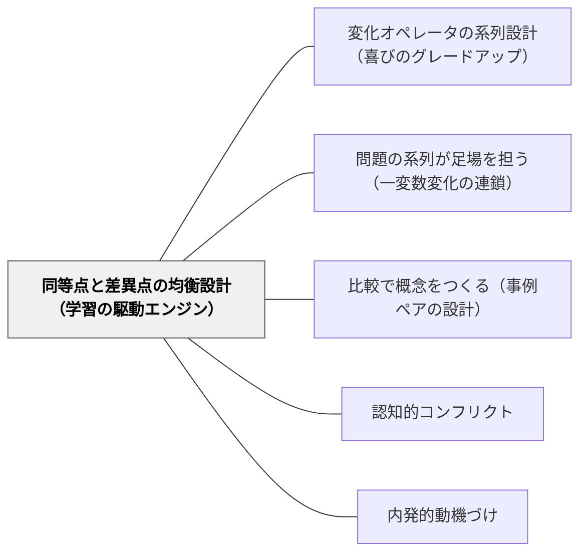

# 同等点と差異点の均衡設計（学習の駆動エンジン）

> 同等性が全然ないこと、差異性が全然ないことが大禁物——戸田城外。安心感と発見の喜びを一つの事例に同居させることが、学習を駆動する。

## 背景（Context）

教材を「難しくする」ことは、多くの教師が量的な一軸で考えがちだ。数値を大きくする、手順を増やす、条件を複雑にする——変化はすべて「難易度」という一本の矢印で表される。この設計では、学習者には「できる」か「できない」かの断絶しか見えない。

戸田城外（1930）は『家庭教育学総論』で「同等性が全然ないこと、差異性が全然ないことが大禁物」と言い切った。同等点のない問題は学習者を迷子にし、差異点のない問題は飽きを生む。どちらの欠如も、学習を止める。

桝田尚之（2006）はこの思想を「同等点の認識が安心感を、差異点の認識が発見の喜びを生む。両方が揃っているとき、考える必然性と喜びが生まれる」と定式化した。戸田の600問超の問題群に息づく設計思想の核心がここにある。

この原理は「何を変えるか（変化の種別）」より前にある上位の問いを扱う——「安心と発見のバランスをどう保つか（均衡の設計）」という動機論的原理である。

## 問題（Problem）

1つの学習事例（問題・課題・テキスト）が、同等点か差異点のどちらかに偏ると、学習が止まる。

- **差異点だけの問題**：前の学習経験と何もつながらない。取り組む糸口がない。「全然わからない」という迷子の状態になり、探究が始まる前に諦める。
- **同等点だけの問題**：前の学習経験と完全に同じ。新しく考えることがない。「またこれか」という飽きが生まれ、学習者は自動処理に入って考えることをやめる。

問題は「難しさの一軸」で変えたとき、この断絶が突然現れることだ。教師には「少しだけ難しくした」つもりでも、学習者には「前とは全然違う問題」に見える——同等点が保たれていないからである。

## 力のかたち（Forces）

- **挑戦 vs 安心感**：新しい差異点が挑戦性を生むが、同等点がなければ安心感の土台がなく挑戦に向かえない
- **新しさ vs なじみやすさ**：差異点が「発見の喜び」を、同等点が「なじみ」による取り組みやすさを担う。どちらも欠かせない
- **個人差（同等点の基準が学習者によって異なる）**：あるクラスメートには「同じ構造」と見える問題が、別の学習者には「全然違う」に見える。同等点の基準は学習者の既有経験に依存する
- **設計の難しさ**：均衡の「7〜8割：1〜2割」はあくまでも感覚値であり、教科・学年・個人によって変わる。精密な数値として捉えると設計が窮屈になる

## 解決（Solution）

**1つの学習事例を設計するとき、「既知との同等点（安心・できる）」と「新しい差異点（発見・驚き）」を意図的に同居させる。同等点が安心感を、差異点が探究動機を担う。どちらが欠けても学習は駆動しない。**

### 設計チェックリスト（1事例を設計するたびに確認する）

1. **同等点**: この問題・課題は学習者がすでに知っている何と同じ構造か？（型・文脈・操作・関係のどれか）
2. **差異点**: 前の経験から何が1つ変わっているか？（数値・未知数の位置・場面・条件のどれか）
3. **バランス**: 同等点が多すぎれば退屈（「またこれか」）。差異点が多すぎれば迷子（「全然わからない」）。1事例に同等点7〜8割・差異点1〜2割が基本の感覚

---

### 具体例1：算数「÷分数」の導入事例

次の2問を並べて考える。

- **前の問題**（既有）：「12 ÷ 4 ＝ □」
- **次の問題**（新しい事例）：「12 ÷ 1/2 ＝ □」

| 観点 | 分析 |
|---|---|
| 同等点 | 割り算の式構造・被除数12・□で答えを求める操作が同じ |
| 差異点 | 除数が「整数」から「分数（1/2）」に変わった1点だけ |
| 機能 | 「整数÷整数と同じようにやってみよう」という安心感（同等点）と「でも、答えが整数より大きくなった。なぜ？」という発見（差異点）が同時に生まれる |

もし「12 ÷ 2/5 ＝ □」から始めていたら（差異点が多い）、学習者は「分数の何が変わったのか」「どこから考えればいいのか」を同時に処理しなければならず、迷子になる。

---

### 具体例2：国語「文章の書き方」の事例ペア

短い文章2本を並べる（比較で概念をつくる設計との組み合わせ）。

- **同等点**：同じ出来事（「公園で遊んだ」）、同じ主語、同じ長さ
- **差異点**：書き方の1点——「直接書く（「楽しかった」）」と「様子で見せる（「砂がきらきら光っていた」）」

この事例ペアでは、学習者は「出来事は同じ（安心）」という土台の上で、「書き方が違うと何が変わるのか（発見）」に集中できる。同等点が土台を固め、差異点が問いの対象を絞り込む。

---

## 結果（Consequences）

**利点**

- 飽きと迷子の両方を防ぐ——「またこれか（同等点過多）」と「全然わからない（差異点過多）」の間に学習者を留めることができる
- 「またできた（同等点からの安心）」と「なるほど（差異点からの発見）」が交互に来る学習リズムが生まれる
- 教材設計の意図が明確になる——「この問題の同等点は何で、差異点は何か」を言語化できると、事後の改善も具体的になる

**注意点・リスク**

- **個別最適化の難しさ**：同等点の基準は学習者の既有経験によって異なる。クラス全員に「同じ同等点」は存在しない。均衡の設計は個人の学習歴を参照する必要がある
- **同等点の勘違い**：教師が「同じ構造」と思っていても、学習者には「全然違う」に見えることがある。均衡の基準は教師の視点でなく、学習者の既有知識の視点から設計する
- **差異点の選択**：何を変えるかの判断（変化の種別）は本パタンの外にある——[[パタン/変化オペレータの系列設計（喜びのグレードアップ）]]が担う

## 関連パタン

- [[パタン/変化オペレータの系列設計（喜びのグレードアップ）]] — 何の種別で変えるか（変化オペレータ：同・逆・＋α・質的変化・複合）と、どのバランスで変えるか（本パタン：均衡設計）の分業。本パタンを前提として変化オペレータが機能する
- [[パタン/問題の系列が足場を担う（一変数変化の連鎖）]] — 一変数だけ変える設計は、同等点を保ちながら差異点を最小化する実装。本パタンの「7〜8割同等点」を系列全体で実現する仕組み
- [[パタン/比較で概念をつくる（事例ペアの設計）]] — 認知的メカニズム（何を揃え何を変えるかの設計技法）を扱う。本パタンは「同等点と差異点の均衡が学習者の動機を駆動する」という動機論的原理（なぜ学ぶか）を扱う。相補的に使う
- [[パタン/認知的コンフリクト]] — 認知的葛藤は差異点が大きすぎるとき（または意図的に驚きを生むとき）の設計。本パタンは均衡を保つことで、コンフリクトの強度を制御する上位の設計思想
- [[パタン/内発的動機づけ]] — SDTの「有能感（できる）」は同等点から生まれ、「自律的探究（知りたい）」は差異点から生まれる。本パタンは内発的動機の二軸（有能感・探究）を1事例の中で同時に育てる設計原理

## クラスター図

## Actionable Insight

- **次の授業の最初の問題を出す前に、「この問題の同等点は何か？」を1文で確認する**——「前の問題と構造が同じなこと」を言語化できれば、学習者にも「前と比べてどこが違う？」という問いかけが自然に出せる。言語化できなければ、問題の並べ方を見直すサイン
- **「詰まっている子」を見たら、同等点と差異点のズレを疑う**——詰まりの原因は「難しすぎる（差異点多すぎ）」か「どこが違うのか見えない（同等点の認識ができていない）」のどちらかが多い。「前の問題と何が同じ？」と問いかけて、同等点の認識を一緒に確認する
- **問題プリントを作るとき、連続する2問の間に「同等点：○○、差異点：○○」というメモを書いておく**——印刷しないで済む設計メモとして。設計意図が明確になり、授業後の振り返りにも使える

## 出典

戸田城外（1930）『推理式指導算術』全3冊
戸田城外（1930）『家庭教育学総論』
桝田尚之（2006）「推理式指導の解明を中心に」『創価教育研究』第5号
