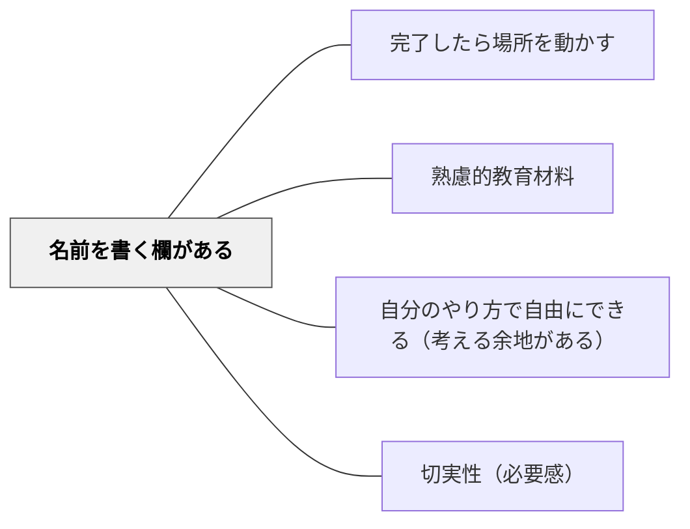

# 名前を書く欄がある

> 教材に名前を書く欄を設けることで、学習者が教材を「自分のもの」として所有する感覚が生まれる。

## 背景（Context）

アナログ実装技法の一つ。ノート・ワークシート・教材冊子に名前記入欄を設けるシンプルな工夫。心理学的には「所有効果（エンダウメント効果）」と関連し、自分のものになった途端に価値が高まる。教材への愛着・責任感・主体性を促す。

## 問題（Problem）

「誰かのための教材」は丁寧に扱われず、学習への主体的関与も生まれにくい。

## 力のかたち（Forces）

- 名前を書く行為が「自分の学びの記録」としての意識を生む
- 小さな仕掛けだが教材への愛着に大きく影響する
- 集合的な教材では所有感が生まれにくい

## 解決（Solution）

**教材の表紙や冒頭に名前・日付などを書く欄を設ける。「私の〇〇帳」など所有を明示する表現を加えることも有効。**

## 結果（Consequences）

- 学習者が教材を「自分のもの」として扱う
- 教材への主体的関与と愛着が生まれる

## 関連パタン
- [[パタン/完了したら場所を動かす]]

- [[パタン/熟慮的教材教具]] — 親パタン
- [[パタン/自分のやり方で自由にできる（考える余地がある）]] — 主体性の確保
- [[パタン/切実性（必要感）]] — 自分ごとにする

## クラスター図

## Actionable Insight

- ワークシートや教材冊子の表紙に名前・日付・「私の○○帳」という欄を設ける——名前を書く行為が「自分の学びの記録」としての意識と教材への愛着を生む
- ワークシートを毎回ファイリングし「自分の成長の記録」として残せる仕組みを作る——積み重なった教材が成長の可視化と学習への責任感を育てる
- 教材の所有感を演出するデザイン（自分の名前が入る・自分で色を選ぶ）を1要素加える——所有効果（エンダウメント効果）が学習への主体的関与を自然に高める

## 出典

- 鈴木克明（2002）『教材設計マニュアル――独学を支援するために』北大路書房
