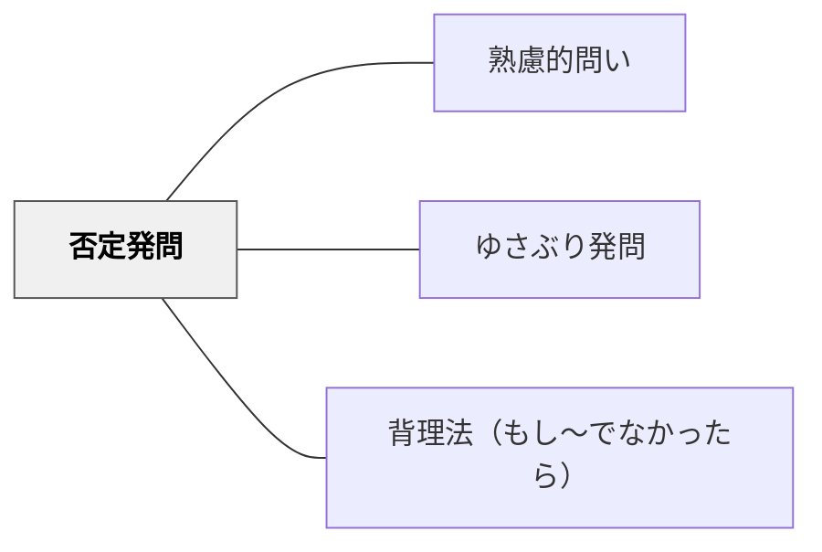

# 否定発問

> 「〇〇でないのはどれか？」「間違っているとすれば？」と否定・例外・反証を問い、論理の穴を見つける力を育てる。

## 背景（Context）
正しいことを確認するだけでなく、「何が正しくないか」を問うことも論理的思考に不可欠である。否定や例外を探す思考訓練は、命題の境界を明確にし、概念の適用範囲を正確に理解させる。

## 問題（Problem）
肯定的な確認だけでは、概念の境界や例外が見えない。学習者は「〇〇はXである」と学んでも、「〇〇でないもの」「Xでない場合」を考える機会がなければ、概念の適用を誤りやすい。

## 力のかたち（Forces）
- 否定形は肯定形と異なる思考回路を使う
- 反例を一つ見つけることで命題の誤りを示せる（反証可能性）
- 「間違い探し」は学習者の興味・関与を高めやすい
- 否定形の思考が、演繹的・批判的思考の基礎になる

## 解決（Solution）
「哺乳類でないものはどれ？」「この法則が当てはまらない場合は？」「もし私の説明が間違っているとしたら、どこが問題だと思う？」と否定的な形で問いかける。たとえば理科で「光合成をしない植物はあるか？」と問い、例外を探させる。算数で「3の倍数でない数を見つけよう」と問い、概念の境界を確かめさせる。

## 結果（Consequences）
- 概念の適用範囲と限界を正確に理解する力が育つ
- 反例・例外を探す批判的思考の習慣が身につく
- 論理の穴を見つける力が、科学的・法的思考の基礎になる

## 関連パタン
- [[パタン/熟慮的問い]] — 親パタン
- [[パタン/ゆさぶり発問]] — 思い込みを揺さぶる
- [[パタン/背理法（もし〜でなかったら）]] — 否定的仮定による推論

## クラスター図

## Actionable Insight

- 概念を学んだ後に「○○でない場合はどんなとき？」と例外を探させる——例外の探索が概念の境界線と適用範囲を正確に理解させる最も効果的な方法
- 「もし私の説明が間違っているとしたら、どこが問題だと思う？」と反証を求める——批判的に問い返す機会が論理の穴を見つける力と自律的な思考を育てる
- 「3の倍数でない数を見つけよう」のように概念の境界を確かめる否定タスクを課す——否定形の思考が肯定確認だけでは見えなかった概念の精度を高める

## 出典
- [[文献/熟慮的問いのパターンリスト（動画記録）]]
