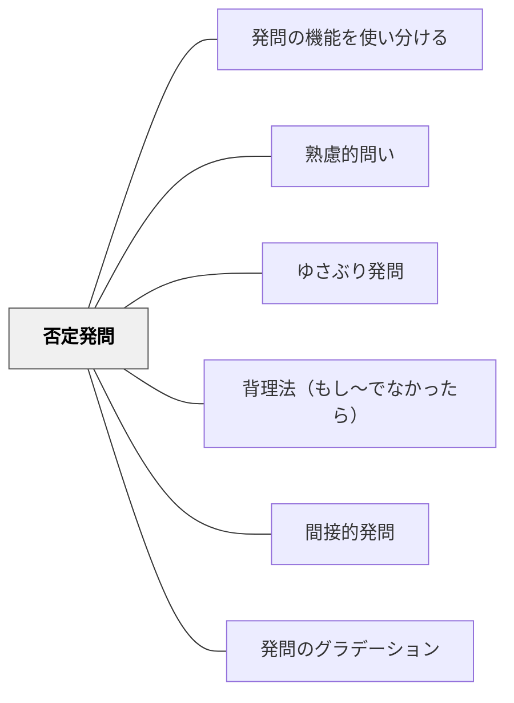

# 否定発問

> 「〇〇でないのはどれか？」「間違っているとすれば？」と否定・例外・反証を問い、論理の穴を見つける力を育てる。

## [Pattern Connection]

- **補強された点（土居正博（2026）より）**：否定発問は「間違い探しが好き」という子どもの心理を活用した発問技法であり、正解を確認する発問より意欲的な取り組みと豊かな表現を引き出すことが実証されている（土居の論文「説明的文章指導における既有知識の再構成を促す発問の研究——否定発問を中心に——」）。普段全く発言しない子が身を乗り出して発言し、本文の言葉を自分なりに解釈して自分の言葉で誤りを指摘する様子が観察された。
- **修正・更新点**：否定発問も [[パタン/ゆさぶり発問]] 同様、「毎時間使えない劇薬」（土居）。頻繁に使うと子どもが慣れて「また先生わざと間違えてる」と見透かされる。
- **他のパタンへの波及**：[[パタン/発問のグラデーション]] の工夫多め段階（段階1〜2）に位置する。[[パタン/間接的発問]] の一形態でもある（誤りを示すことで間接的にねらいに近づける）。

## 背景（Context）
正しいことを確認するだけでなく、「何が正しくないか」を問うことも論理的思考に不可欠である。否定や例外を探す思考訓練は、命題の境界を明確にし、概念の適用範囲を正確に理解させる。

## 問題（Problem）
肯定的な確認だけでは、概念の境界や例外が見えない。学習者は「〇〇はXである」と学んでも、「〇〇でないもの」「Xでない場合」を考える機会がなければ、概念の適用を誤りやすい。

## 力のかたち（Forces）
- 否定形は肯定形と異なる思考回路を使う
- 反例を一つ見つけることで命題の誤りを示せる（反証可能性）
- 「間違い探し」は学習者の興味・関与を高めやすい
- 否定形の思考が、演繹的・批判的思考の基礎になる

## 解決（Solution）
「哺乳類でないものはどれ？」「この法則が当てはまらない場合は？」「もし私の説明が間違っているとしたら、どこが問題だと思う？」と否定的な形で問いかける。たとえば理科で「光合成をしない植物はあるか？」と問い、例外を探させる。算数で「3の倍数でない数を見つけよう」と問い、概念の境界を確かめさせる。

**土居正博の実践事例：**
- 算数で誤った計算の仕方を示し「どこが間違っているかな」と発問
- 体育であえて誤った技の取り組み方を示し「どこがおかしいかな」と発問
- 説明文指導で「正しい図表とは違う図表を示して、子どもに誤りを指摘させる」実践——普段発言しない子も身を乗り出し、本文の言葉を自分なりに解釈して豊かに表現した
- 教師が「あえてとぼける（わざと間違える）」ことで子どもに否定させる「とぼける」技法も否定発問の一種

**吉本均（1977）の位置づけ**：否定発問は「反対物を媒介とし、否定をとおしての本質把握」をねらうものであり、大きな括りではゆさぶり発問の一種とも見なせる。

## 結果（Consequences）
- 概念の適用範囲と限界を正確に理解する力が育つ
- 反例・例外を探す批判的思考の習慣が身につく
- 論理の穴を見つける力が、科学的・法的思考の基礎になる

## 関連パタン
- [[教科/算数・数学で使うパタン]]
- [[パタン/発問の機能を使い分ける]]
- [[パタン/熟慮的問い]] — 親パタン
- [[パタン/ゆさぶり発問]] — 思い込みを揺さぶる（否定発問の大括り上の親）
- [[パタン/背理法（もし〜でなかったら）]] — 否定的仮定による推論
- [[パタン/間接的発問]] — 誤りを示すことで間接的にねらいに近づける
- [[パタン/発問のグラデーション]] — 否定発問は工夫多め段階（段階1〜2）の技法

## クラスター図

## Actionable Insight

- 概念を学んだ後に「○○でない場合はどんなとき？」と例外を探させる——例外の探索が概念の境界線と適用範囲を正確に理解させる最も効果的な方法
- 「もし私の説明が間違っているとしたら、どこが問題だと思う？」と反証を求める——批判的に問い返す機会が論理の穴を見つける力と自律的な思考を育てる
- 「3の倍数でない数を見つけよう」のように概念の境界を確かめる否定タスクを課す——否定形の思考が肯定確認だけでは見えなかった概念の精度を高める

## 出典
- [[文献/熟慮的問いのパターンリスト（動画記録）]]
- 土居正博（2026）『自分で考え、学べる子を育てる！ 発問の技術』学陽書房 — 否定発問の実践的効果と注意点
- 土居正博（2019）「小学校説明的文章指導における既有知識の再構成を促す発問の研究——否定発問を中心に——」国語科学習デザイン学会編『国語科学習デザイン』2巻2号
- 吉本均（1977）『発問と集団思考の理論』明治図書
- [[文献/自分で考え、学べる子を育てる！ 発問の技術]]
