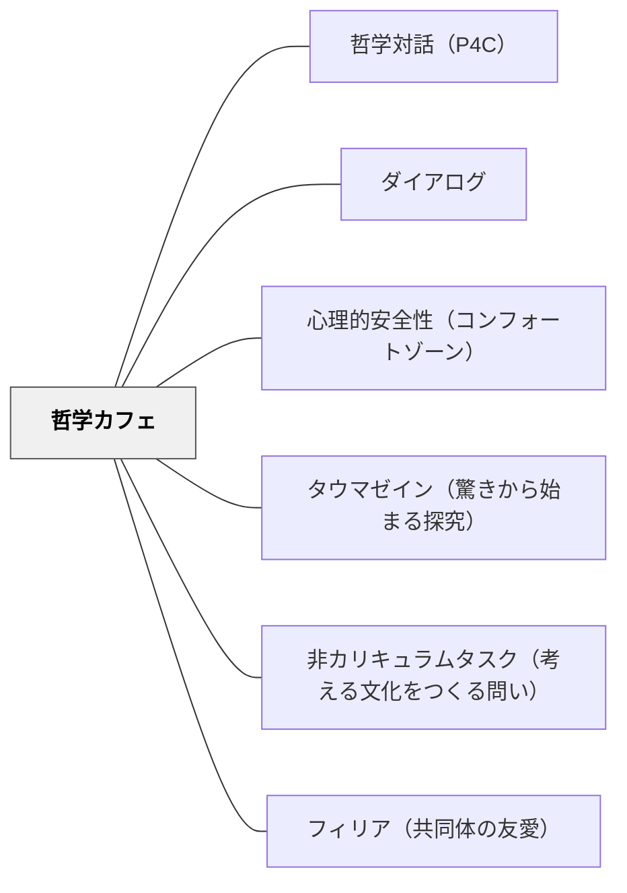

# 哲学カフェ

> 喫茶店に集まって日々の仕事と生活をしばし忘れ、思考に没頭するひととき——どこであれ、人々が自らの意志で集まって哲学対話をおこなえばそこが哲学カフェになる。

## [Pattern Connection]

### 土屋陽介（2019）僕らの世界を作りかえる哲学の授業——1992年パリ発祥と日本への展開

**起源：1992年夏、パリのカフェ・デ・ファール**

フランスの哲学者マルク・ソーテ（1947–1998）が偶然に始めた。パリ政治学院の教授だったソーテが仲間との研究報告会をカフェ・デ・ファール（バスティーユ広場付近）で開いていたところ、前日のラジオ番組を聴いたリスナーが誤解して押しかけてきた。集った15名ほどを前に「死」をテーマに即興で哲学討論をおこなったところ、これが好評で毎週日曜に自然と人が集まるようになった。最終的に150人以上が押しかける回も生まれた。

ソーテは1998年に49歳で急逝したが、カフェ・デ・ファールでは今も定期的に哲学カフェが開かれ「哲学カフェ発祥の地」として有名になっている。フランス全土・ヨーロッパ・世界に広がった。

**日本への展開**

日本で哲学カフェが始まったのは2000年前後。関東では「関東実験哲学カフェ」、関西では大阪大学臨床哲学研究室（荻田六ら）が大阪市内のお寺で最初の哲学カフェを開いた——パリのカフェから始まったものが日本ではお寺で始まったという事実に著者は「フランスと日本それぞれの社会でカフェとお寺が果たしてきた役割が色濃く反映されている」と指摘する。

**アジール機能——大人のための「居場所」：**

哲学カフェに参加するのは主にビジネスパーソン・学生・主婦など「哲学の専門家でない人たち」。参加者たちが哲学カフェに惹かれる理由として共通して語るのは、「日常の立場・職業・年齢を一旦脱いで、対等に語り合える場」「仕事でも学校でもない第三の場所」という感覚。

これは学校の哲学対話のアジール機能（保健室的役割）の大人版である——「職場の論理・評価の秩序・人間関係の序列」が及ばない空間が、大人にも必要とされている。著者は「社会人サークル」の感覚で運営される哲学カフェを「あたまのピクニック」と表現する。

**既存パタンとの関連：**
- **補強点**：哲学対話（P4C）の探究の共同体が「学校の外」にも広がることが示される。アジール機能は学校空間に限らない普遍的な必要性を持つ。
- **拡張点**：哲学対話は子どもと教師の間に設計されるが、哲学カフェは「職業・年齢・立場が異なる市民」の間に自然発生的に広がる——「市民の哲学実践」という次元が加わる。
- **波及するパタン**：[[パタン/哲学対話（P4C）]] — 学校版の哲学対話；[[概念/探究の共同体（Community of Inquiry）]] — 哲学カフェが形成するものの概念的名称

---

## 背景（Context）

日常生活では「哲学的な問い」——「なぜ私は生きているのか」「正義とは何か」「幸福とは何か」——を真剣に語り合う場がほとんどない。職場では「役に立たない話」として敬遠され、家庭でも「暗い話」として避けられやすい。カウンセリングではあまりに個人的すぎる。大学では専門知識が前提とされる。

哲学対話が子どもたちの教室に「探究の共同体」を作り出すように、大人たちにも「一緒に哲学的な問いを考える場」への渇望がある。

## 問題（Problem）

「哲学に関心があるが、話し相手がいない」という孤立。または「居酒屋での愚痴」にとどまる対話——本当に気になっていることを丁寧に考え合う場の欠如。学校や職場の「答えのある問い」「成果を求める議論」から離れた純粋な思考の遊び場が大人社会にない。

## 力のかたち（Forces）

- 哲学的な問いは孤独に考えるだけでは限界がある——他者の驚き・問い・反論が思考を前進させる
- 日常の人間関係では「立場」が発言を制約する——上司・部下・親・子という関係性が本音の思考を封じる
- 専門知識なしに参加できる場でないと多様な人が集まれない
- 「答えを出さない」という文化が習慣化されていないと、すぐ結論を急ぐ議論になる

## 解決（Solution）

**哲学的な問いを中心に、職業・立場・年齢を問わず誰でも参加できる場を設計する。「特殊なお店」でなく「人々が集まるどんな場所でも」哲学カフェになる。**

### 哲学カフェの基本設計

- **場所の選択**：喫茶店・図書館・お寺・市民センター・学校の空き教室——「非日常的な知的遊び場」という雰囲気が出る場所
- **参加条件の緩さ**：事前知識不要・事前申し込み不要・途中参加・退出可能な形式が理想
- **テーマの設定**：日常の素朴な疑問から出発する問い（「なぜ働くのか」「お金とは何か」「美しいとはどういうことか」など）——専門知識があると「答えが分かってしまう」テーマは向かない
- **進行役（ファシリテーター）の役割**：まとめない、結論を出さない、多様な声を引き出す——開智日本橋スタイルの「議論が導くところについていく」態度

### 学校版との主な違い

| 軸 | 学校の哲学対話（P4C） | 哲学カフェ |
|---|---|---|
| 参加者 | 同学年の子どもたちと教師 | 多様な職業・年齢・背景の市民 |
| 継続性 | 年間カリキュラムに組み込む | 単発・定期どちらも可 |
| 主催 | 教師（フィロソファー・イン・レジデンス） | 市民・NPO・社会人サークル |
| アジール機能 | 学校的秩序からの一時的解放 | 職場・社会の論理からの一時的解放 |
| ゴール | 思考力・探究の共同体の育成 | 「あたまのピクニック」としての楽しみ |

### 具体例：喫茶「さろん」での対話（「お金と休日」）

著者が紹介する哲学カフェの一場面。「お金はどれだけほしいか？」という問いから始まり、「労働と社会のつながり」「自分と社会の境界」へと対話が自然に深まった。2時間があっという間に過ぎ、参加者3人が発言待ちになるほど盛り上がって進行役が「どうもありがとうございました」と言って閉じた——「まとめも結論もなく終わる」哲学カフェの典型例。

## 結果（Consequences）

- 日常では話せない「本当に気になっていること」を語れる居場所が生まれる
- 職業や年齢が違う人の視点に触れることで、固定した思考の枠が揺らぐ
- 「答えが出ない問いを考え続ける」という知的態度が育つ
- 子どもの哲学対話と大人の哲学カフェが連動すると、「学ぶことと生きることをつなぐ文化」が地域に生まれる

## 関連パタン

- [[パタン/哲学対話（P4C）]] — 子ども版の哲学対話。共通の構造を持つ
- [[概念/探究の共同体（Community of Inquiry）]] — 哲学カフェが形成する集団的状態の概念名称
- [[パタン/ダイアログ]] — Bohmのダイアログとの構造的共通点・差異
- [[パタン/心理的安全性（コンフォートゾーン）]] — 「知的に安全な空間」の大人版
- [[パタン/タウマゼイン（驚きから始まる探究）]] — 哲学カフェに人を引き付ける「驚き・不思議」の力
- [[パタン/非カリキュラムタスク（考える文化をつくる問い）]] — 余白の時間に「考える文化」を作る
- [[パタン/フィリア（共同体の友愛）]] — 哲学カフェで生まれる知的友愛
- [[文献/僕らの世界を作りかえる哲学の授業（土屋）]] — 本パタンの主要出典

## クラスター図

## Actionable Insight

- 職員研修や学年会議の冒頭15分を「哲学カフェ形式」にしてみる——「今週気になったこと」という問いだけで始めて、まとめず閉じる。答えを出さないことに慣れる練習
- 保護者会や地域との話し合いに哲学カフェを導入する——「正解がない問いを一緒に考える」体験が学校と地域の関係を変える可能性がある
- 放課後や課外活動で子どもが自主的に「ミニ哲学カフェ」を開ける仕組みを作る——著者が報告するように「放課後に友達同士で自主的な哲学対話の会をひらく」現象が起きることがある

## 出典

土屋陽介（2019）『僕らの世界を作りかえる哲学の授業』青春出版社（青春新書インテリジェンス）

> 「哲学カフェという遊びは、いまから四半世紀ほど前、パリの街角のカフェで生まれました。哲学者のマルク・ソーテが始めたとされますが、哲学カフェは誕生した瞬間から、偶然の要素を多分に含んでいました」——著者
