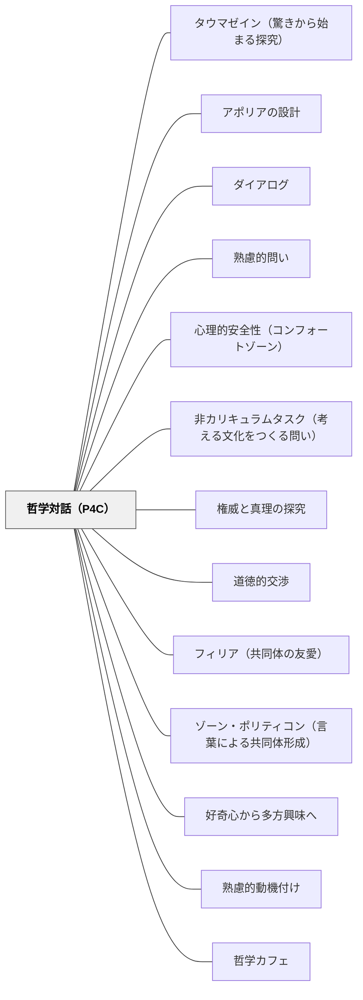

# 哲学対話（P4C）

> 答えのない問いを「議論が導くところについていく」——考えることだけを目的として対話する場が、教室を探究の共同体に作りかえる。

## [Pattern Connection]

### 土屋陽介（2019）僕らの世界を作りかえる哲学の授業——具体的授業例・アジール・哲学カフェ

本書は「フィロソファー・イン・レジデンス（学校駐在哲学者）」として開智日本橋に勤務する著者が、P4Cの理論・世界展開・具体的授業実践を一冊にまとめたものである。

**3つの具体的授業例（開智日本橋）：**

| 学年 | 素材 | 中心的な問い |
|---|---|---|
| 中1 | 初代アンパンマン（やなせたかし）の童話 | 「アンパンマンの言う正義とは何か」——自己犠牲・暴力・独りよがりへと問いが深まる |
| 中2 | 「素晴らしきYAMASUKIの世界」（仏語×日本語混合音楽）| 「言語は統一されるべきか」——多様性と理解可能性のジレンマ |
| 中3 | ゲノム編集の倫理問題（賀建奎教授事件）| 「ゲノム編集はアリ？ナシ？」——「本人の同意がない」という軸で深まる |

これらの例が示す原理：素材は「落とし所が見える教訓話」でなく、「複数の価値がぶつかり、ジレンマがある」ものを選ぶ——そのとき哲学対話は「概念の洗練」と「無知の気づき」の両方を起動できる。

**アジール（型域・避難所）としての哲学対話教室：**

著者は哲学対話の教室を「保健室に似た空間」として描写する。

> 「哲学対話がおこなわれている教室は、学校のなかにありながらも、その時間だけは学校的な秩序が相対化された『アジール（型域・避難所）』となる」——著者

この視点は既存の「知的に安全な空間」の概念を超えて、「学校制度そのものへの批判的緊張」を含む。学校的秩序（成績・人間関係・正解を求める文化）が及ばない「暗がり」を意図的に設計することで、常識に馴染めない子どもが輝ける場が生まれる。勉強が苦手な生徒が「人が変わったように」発言してクラス担任を驚かせることは世界各地の実践家が報告している。

**Qワード——「意見より質問を大事にする」の具体的道具：**

NHK・Eテレ『Q〜こどものための哲学』が哲学対話を促進する問いかけを「Qワード」と名付け教材化。代表例：「たとえば？」（具体例）・「本当に？」（前提を疑う）・「どうして？」（理由を求める）・「もう少し詳しく言える？」（掘り下げ）。

これらは心得④「意見より質問を大事にする」を実践する具体的なツールであり、進行役だけでなく子ども同士が使い合えるようになることが目標。

**「負けることの重要性」——論破ではなく自分の弱点への気づき：**

著者は授業の最初に必ず次のように伝える：

> 「哲学対話では、議論に『勝つ』ことよりも『負ける』ことのほうが重要だ。質問を突きつけられたり反論されたりすることで、自分の意見の弱点に自分で気づいて考えを前に進められるようになることが大事なんだ」

「自分の意見に自分で反論する」のは非常に難しい——だからこそ「論敵」が最良の思考の助けになるという逆説。

**哲学カフェという拡張形態——マルク・ソーテのパリ1992年：**

1992年夏、パリのカフェ・デ・ファールで哲学者マルク・ソーテが偶然始めた（ラジオリスナーが押しかけてきた即興討論「死」について）。最終的に毎回150人以上が集まるようになり、ソーテが1998年に急逝した後も「哲学カフェ発祥の地」として続いている。

日本では2000年前後に大阪大学臨床哲学研究室（お寺での開催！）と関東実験哲学カフェとして始まった。「カフェ」ではなく「お寺」で始まった事実に著者は「それぞれの文化の中でカフェとお寺が果たす役割が色濃く反映されている」と指摘する。

**既存パタンとの関連：**
- **補強点**：5ステップの各ステップに具体的な授業例と教材が加わった。「知的に安全な空間」がアジール論として社会批判的含意を持つことが明確になった。
- **拡張点**：哲学対話の場が「学校の外（哲学カフェ）」にも拡張されること、その起源が1992年のパリにあることが加わった。
- **波及するパタン**：[[パタン/タウマゼイン（驚きから始まる探究）]] — アリストテレスの「驚きから哲学が始まる」がP4Cの哲学的原型；[[パタン/心理的安全性（コンフォートゾーン）]] — アジール機能の拡張として

---

### 中江兆民（1887）三酔人経綸問答——「問いで終わる」対話劇の先例

三酔人経綸問答は、P4Cが20世紀末に「発見」した対話的探究の形式を、1887年の明治日本で実践した先例として読める。

解説（山田博雄）は本書の本質をこう評価する：

> 「読者に自ら自由に考えることをうながす書物」「問題の解答を、ではなくて、問題の所在とその幅と深さを提示して、開かれたままに終わる」——解説

> 「楽しませて、笑わせて、そして教えながら、しかし真面目な議論へと読者を導いていく」——解説

これはP4Cの「議論が導くところについていく」「答えを出さずに終わることが失敗でない」という精神と構造的に一致する。

**三酔人のP4C的特徴：**

| 三酔人の構造 | P4Cの対応 |
|---|---|
| 南海先生が「問いを保持」し、結論を急がない | ファシリテーターが「答えを出さない」 |
| 洋学紳士・豪傑の対立が問いを深める | 多様な意見が探究を進める |
| 眉批が「それはどうかな」と疑問を挿入する | 「意見より質問を大事にする」（心得④） |
| 結論は「平凡な答え」（立憲制）で客に笑われる | 「わからない」と言えることが肯定される（心得③） |
| 物語は「解決なし」で終わる | 探究は「一回で完結しない」 |
| 問答が書物（種）として残る | 対話の記録・ノートが思考を持続させる |

**洋学紳士とP4Cの「知的に安全な空間」：**

洋学紳士が「理念的に正しいが架空の構想」と評された非武装中立論を一夜中主張し続けられたのは、南海先生が「論理の筋道に従って順序だてて話してください」と受け止め続けたからだ。相手の論を頭ごなしに否定せず最後まで聴く場——それがP4Cの「知的に安全な空間（Intellectually Safe Community）」の実践形態に他ならない。

**「批判」の定義（解説引用）：**

> 「批判とは、現実をよりよく作りかえるために必要な一つの人間的操作」——中野重治（解説に引用）

これはP4Cの「論破でなく掘り下げを目指す」（心得④）と同じ方向を向いている。批判は「相手を攻撃すること」でなく「問いをよりよくすること」。

**既存パタンとの関連：**
- **補強点**：P4Cが20世紀に洗練した「開かれた問いによる対話的探究」が、明治の政治哲学書にすでに実装されていたことを確認できる。「哲学対話は特別な外来技術ではなく、問いを大切にする文化の自然な形式である」という認識が深まる。
- **接続点**：[[パタン/ダイアログ]] — 兆民の対話の7つの意義（ミル）がBohmの対話論を補完する。
- **波及するパタン**：[[パタン/思想の種まき（長期変革論）]] — 哲学対話の長期的効果は「思想の種まき」として現れる；[[文献/三酔人経綸問答（中江兆民）]] — 本統合の出典

---

## 背景（Context）

1960年代末、コロンビア大学の哲学者マシュー・リップマン（Matthew Lipman）は、大学生の思考力の低下を憂い「子どものうちから哲学的に考える習慣を育てる必要がある」と確信し、**P4C（Philosophy for Children：子どもの哲学）**を開発した。リップマンの問題意識は「言葉で考えられない大人が暴力に訴える」という危機感だった。

P4Cはフランス・オーストラリア・ハワイ・韓国・台湾など世界各地に広がり、日本でも2010年代以降急速に学校現場に根づいている。日本では「哲学対話」の名で知られ、私立学校・公立学校・保育園まで多様な場で実践されている。

哲学対話における「哲学」は学術的な意味ではない。アリストテレスの言葉「直異することによって人間は知恵を愛求し[哲学し]始めた」が示すとおり、「驚きから問いを持ち、真理を愛し求める（フィロソフィア）」ことが哲学の原型であり、哲学対話はその原型を教室で実現しようとする実践である。

## 問題（Problem）

学校での「話し合い」は多くの場合、**意思決定のための議論**（文化祭の出し物を決める）か、**感想の共有**（修学旅行の振り返り）かのどちらかに限られる。「ただ考えること自体を深めるために対話する」という経験は、子どもにも大人にもほとんどない。

また道徳の授業では、「分かりきった正解」を言わせるだけ、読み物の登場人物の心情を答えさせるだけの形式的な授業が課題とされてきた。子どもが本気で考える必要のない授業は、まっとうな思考力を育てない。

## 力のかたち（Forces）

- 「考えること」は「答えを出すこと」と混同されやすい——正解があると思うと本気で考えない
- 沈黙や「わからない」は学校では否定的に評価される——言いやすいことだけ言う文化が生まれる
- 議論では「勝ち負け」が目的化し、相手の意見を参考にしなくなる
- クラス全体で話し合う形式では、参加できない子が出やすい
- 一度だけの哲学対話は効果が低い——習慣・文化として続けることが必要

## 解決（Solution）

**答えが簡単には見つからない哲学的な問いについて、参加者全員が「議論が導くところについていく」ように対話する。サークル状に座り、コミュニティボールを使って全員が等しい思考者として場に参加する。**

### 哲学対話の心得5つ

| 心得 | ねらい |
|---|---|
| ①手を挙げて話すよりよく考えることを大事にする | 発言量より思考の深さ |
| ②真剣に考えたことであれば何でも自由に話してよい | タブーをなくし思考を解放する |
| ③わからないときは「わからない」と言おう | 「無知の気づき」を肯定する |
| ④「意見」より「質問」を大事にする | 論破でなく掘り下げを目指す |
| ⑤相手の話をよく聞こう | 他者の意見が自分の思考を進める |

心得③の背景にある重要な概念：**「知的に安全な空間（Intellectually Safe Community）」**——「わからない」が言えて、お互いに「わからない」を問い合える場。これなくして哲学対話は機能しない。

### 哲学対話の5ステップ

**ステップ1：顔を見合える体勢で座る**
机を四隅に寄せ、椅子だけでサークルを作る。教員も生徒と同じ位置に座る。「問いの前では誰もが等しい」という構造を体でつくる。

**ステップ2：思考の素材をシェアする**
絵本・映像・写真・童話・社会的ニュースなど、参加者の「なぜ？」「どういうこと？」を引き出す素材を全員で共有する。「落とし所が見える」教訓話や道徳的お説教は素材に向かない——ジレンマがあり、複数の価値観がぶつかる素材が良い。

**ステップ3：問いを作る**
素材に触れて生まれた疑問を全員が「疑問文」として出し合う。似た問いをまとめ、多くの人が考えたいと思う問いを整理・選択する。**問いは参加者が自分で作ることが推奨される**——他者が作った「出来合いの問い」は思考の駆動力が弱い。

向いていない問いの2タイプ：①調べれば答えがわかる問い（スマホで検索できる）、②特定の知識がないと参加できない問い（事前説明なしでは全員参加できない）。

**ステップ4：問いをめぐって哲学対話する**
進行役（教員）もサークル内に座り、自分自身も問いの答えを真剣に考えながら進める。コミュニティボールを持った人だけが話す。「議論が導くところについていく」——誰の発言か・自分の立場・常識はいったん脇に置いて、目の前の議論の流れだけを追う。

哲学対話で「思考が深まった」と感じられる2つの方向：
- **概念の洗練**（世界が透明化）：漠然としていた概念（「幸せとは？」など）が対話を通してより明確・洗練されたものになる
- **無知の気づき**（世界が不透明化）：当たり前と思っていたことが実はよくわかっていなかったと気づく。「そもそも？」という問いが探究を一段掘り下げる

**ステップ5：振り返る**
「まわりの人の話をよく聞けたか」「安心して考えに集中できたか」「新しい発見があったか」の3点を自己評価する。発言できなかった子どもがワークシートで考えを書いていた場合、対話参加の証拠になる。振り返りを省略して「もやもやしたまま終わる」ことで考え続けるきっかけになる場合もある。

---

### 探究の共同体（Community of Inquiry）

リップマンは「理想的な哲学対話がおこなわれる教室」を**探究の共同体（Community of Inquiry）**と呼んだ。

> 「教室が探求の共同体に作りかえられたとき、議論が導くところについていくためのステップは論理的なステップである。探求の共同体がゆっくりと前進するにつれて、探求のどのステップも何らかの新たな要求を生み出していく」——リップマン（土屋2019に引用）

特徴：参加者全員が協力して「真理を愛し求める」場。子どもと大人・生徒と教師が真に対等になる——大人も教師も「そうであるという理由だけで」尊敬されることはなく、議論への貢献度のみで評価される。

---

### 哲学対話と道徳科

2018年からの学習指導要領で、道徳科は「考え、議論する道徳」に転換した。中央教育審議会答申（2016）は「多様な価値観の、時には対立がある場合を含めて、誠実にそれらの価値に向き合い、道徳としての問題を考え続ける姿勢こそ道徳教育で養うべき基本的資質」と記した。この方向性は哲学対話のねらいとほぼ一致する。道徳科の授業時間に哲学対話を継続的に組み込むことが現実的な実施方法として提案されている。

## 自己教育での適用例

自分のWikiを書くとき・本を読むとき・授業を振り返るとき、「一人哲学対話」として問いを立てて考え続けることができる。「概念の洗練」と「無知の気づき」は一人でも起きる。ただし他者の問いかけが自分の弱点を暴くことは一人ではできない——だからこそ対話の場が必要になる。

## 結果（Consequences）

- 「考えること自体を楽しむ」という知的文化が教室に生まれる
- 沈黙・「わからない」が肯定的に受け止められるようになる
- 対話を通してクラスメイトへの独特の連帯感と敬意が生まれる
- 教師と生徒が「共に知らない問いに向かう」ことで関係性が変わる
- 哲学的問いへの粘り強さ・思考の耐性が育つ
- 「勝つより負けること（反論されること）が重要」という態度が育つと、批判的思考力が高まる

## 関連パタン

- [[パタン/タウマゼイン（驚きから始まる探究）]] — 哲学対話の原点にある「驚き」の哲学
- [[パタン/アポリアの設計]] — 「無知の気づき」を引き起こす設計
- [[パタン/ダイアログ]] — Bohm/Sengeのダイアログとの共通点・差異
- [[パタン/熟慮的問い]] — よい問いを設計・選択する視点
- [[パタン/心理的安全性（コンフォートゾーン）]] — 知的に安全な空間の構築
- [[パタン/非カリキュラムタスク（考える文化をつくる問い）]] — 思考文化をつくる余白の時間
- [[パタン/権威と真理の探究]] — 権威より論理の流れにしたがう
- [[パタン/道徳的交渉]] — 道徳科での哲学対話の実践
- [[パタン/フィリア（共同体の友愛）]] — 探究の共同体の友愛
- [[パタン/ゾーン・ポリティコン（言葉による共同体形成）]] — 哲学対話が作る言葉の共同体
- [[パタン/好奇心から多方興味へ]] — 子どもの知的好奇心との接続
- [[パタン/熟慮的動機付け]] — 内発的探究心を育てる上位パタン
- [[パタン/哲学カフェ]] — 学校外・大人向けの哲学対話。P4Cの市民的拡張形態
- [[概念/探究の共同体（Community of Inquiry）]] — リップマンが提唱した「理想的な哲学対話がおこなわれる教室」の概念名称
- [[文献/僕らの世界を作りかえる哲学の授業（土屋）]] — 本パタンの主要出典

## クラスター図

## Actionable Insight

- 道徳の授業1コマを使って哲学対話を試す——まず絵本1冊をみんなで読んで「気になった問い」を付箋に書いてもらうところから始める
- 問いを選ぶ前に「調べれば分かる問いは省く」というルールだけ教える——それだけで子どもが「本当に気になること」を出しやすくなる
- 最初の授業で「哲学対話では負けることのほうが重要」と伝えてみる——この一言がクラスの対話文化を変えるきっかけになりうる
- 沈黙をとめないで30秒待つ練習をする——沈黙は思考中のサイン、気まずさではないことを体験させる

## 出典

土屋陽介（2019）『僕らの世界を作りかえる哲学の授業』青春出版社

> 「哲学対話がもたらす最も重要な効能は、教室に『知的に安全な空間』をつくることである。そこでは、どんな発言も敬意をもって真剣に聞かれ、非難や人格攻撃とはまったく異なった、相手の考えを深めるための質問や反論が行き交う」——土屋陽介（著者）
