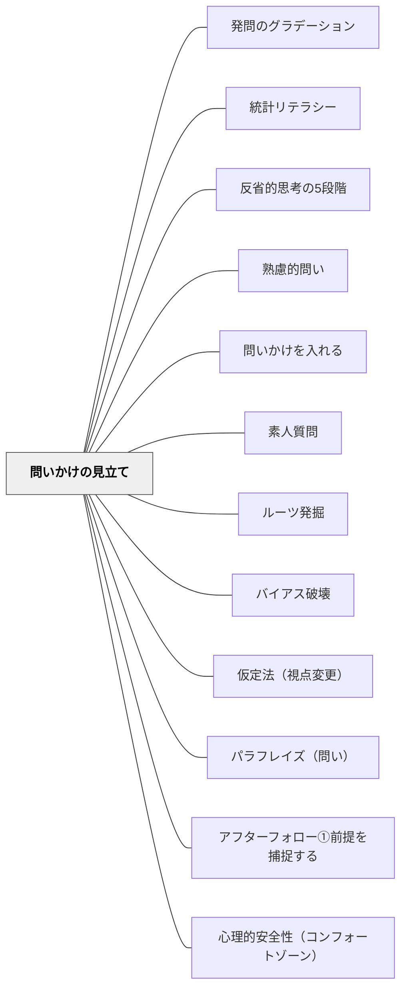

# 問いかけの見立て

> 問いかける前に、場の状態を観察して仮説を立てる。三角形モデルで「必要な変化」を逆算することが、問いの精度を決める。

## Pattern Connection（安斎勇樹, 2021）

**既存パタンとの関連**：[[パタン/熟慮的問い]] は問いを「目的・相手・方法・文脈から設計する」ことを中心としているが、その設計の前段階——「今この場でどんな問いが必要か」を診断する技法が本パタンで補完される。[[パタン/問いかけを入れる]] が問いの組み込み方の実装ならば、本パタンはその準備段階（事前観察と仮説形成）を担う。

**補強された点**：安斎（2021）の「見立て」は、教師がファシリテーターとして機能するための、体系的な観察プロトコルを提供する。これにより「なんとなく問いを立てる」から「目的から逆算した問いを立てる」へ転換できる。

**他のパタンへの波及**：[[パタン/素人質問]]・[[パタン/ルーツ発掘]]・[[パタン/バイアス破壊]] のどれを使うかは、この「見立て」によって判断される。見立てが先にあって、問いの選択が後に来る。

---

## 背景（Context）

問いかけには「使う技術」と「選ぶ判断」の両方が必要である。どんなに洗練された問いのレパートリーをもっていても、今この場でなぜその問いが必要かを観察なしに選ぶことはできない。  

教師やファシリテーターは自分の「いつもの問い」に頼りがちである。「どう思う？」「理由は？」という定番の問いは場面を選ばず使えるが、チームや学級の固有の状態には応えられない。問いかける前に「この場は今どういう状態にあるか」を読む力が、問いの質を根本から左右する。

## 問題（Problem）

問いかけのタイミング・内容を選ぶ基準が、教師の経験的直感に委ねられている。  
「なんとなくこの子は何かを我慢しているな」という感覚はあっても、それを問いの設計に落とし込む手順がない。  
その結果、問いが場の状態にかみ合わず、「漠然とした問い」や「いつもの言葉」になってしまう。

## 力のかたち（Forces）

- 見立ては観察から始まるが、観察には「何を見るか」の視点が必要——視点なしの観察はノイズになる
- チームや学級の状態は常に変化するため、一度の見立てで固定してはならない
- 見立てが深いほど問いは精緻になるが、見立てに時間をかけすぎると場の流れを失う
- 教師は「授業の目的」を持っているため、「見たい光景」が固定されやすく、現在の様子を正確に見逃しやすい

## 解決（Solution）

**三角形モデルで「必要な変化」を逆算する。**

3つの頂点を押さえる：
1. **場の目的**——この時間（授業・会議・活動）が目指す状態は何か
2. **見たい光景**——この場で引き出したい子どもの姿・発言・関わりは何か
3. **現在の様子**——実際に今どういう状態にあるか

3点のギャップから「必要な変化」が見えてくる。「こだわりを育てる」（フカボリ）のか「とらわれを崩す」（ユサブリ）のかが、この逆算によって決まる。

---

**観察の4チェックポイント**

場の現在の様子を観察するとき、次の4点を確認する：

1. **何かにとらわれていないか？**——固定観念・役割のよどみ・目的の形骸化がないか
2. **こだわりはどこにあるか？**——誰が何に強い関心を持っているか
3. **こだわりはずれていないか？**——場の目的とこだわりの方向にズレがないか
4. **何かを我慢していないか？**——言いたいことを飲み込んでいる子はいないか

---

**着眼点3つ**

| 着眼点 | 観察すること |
|---|---|
| ①評価する発言 | 「〜だからよい」「〜は違う」という評価的発言は価値観の表れ |
| ②未定義の頻出ワード | 繰り返し使われるがだれも定義していない言葉に固定観念が潜む |
| ③姿勢と相貌 | 声・表情・視線・身体の向きが内面状態を示している |

---

**教師の授業設計への転用**

授業前の準備として：
- 「この授業の場の目的」を一文で書く
- 「見たい光景（引き出したい子どもの姿）」を具体的に1〜2書く
- 「前回・昨日の子どもたちの様子」を振り返り、現在の様子を仮設する
- ギャップから「今日はフカボリとユサブリのどちらが必要か」を判断する

授業中の観察として：
- 子どもが繰り返し使っているが定義されていない言葉をメモする（未定義の頻出ワード）
- 「我慢しているかも」と感じた子に目を向け、足場かけ（ハードルを下げる・手がかりを渡す）を先に用意する

## 結果（Consequences）

問いかけが「場の状態に応答したもの」になり、子どもの発言・思考とかみ合いやすくなる。  
教師が「見立て→問い選択→投げかけ」という体系的な行為として問いを設計できるようになる。  
見立てが空振りだったとき（問いがかみ合わなかったとき）に、次の見立ての根拠として振り返ることができる。  
一方で、見立ての精度は観察の量と質に依存するため、短時間の観察では誤読のリスクがある。

## 関連パタン
- [[パタン/発問のグラデーション]]
- [[パタン/統計リテラシー]]
- [[パタン/反省的思考の5段階]]

- [[パタン/熟慮的問い]] — 問い設計の親パタン
- [[パタン/問いかけを入れる]] — 見立てた後の問いの実装
- [[パタン/素人質問]] — フカボリモードの代表技法
- [[パタン/ルーツ発掘]] — フカボリモード：こだわりの源泉を聞き込む
- [[パタン/バイアス破壊]] — ユサブリモードの代表技法
- [[パタン/仮定法（視点変更）]] — ユサブリモード：制約を外して視点を変える
- [[パタン/パラフレイズ（問い）]] — ユサブリモード：別の言葉への言い換えを促す
- [[パタン/アフターフォロー①前提を捕捉する]] — 問いが難しすぎたときの足場かけ
- [[パタン/心理的安全性（コンフォートゾーン）]] — 見立てが機能する前提となる場の安全

---

## クラスター図

## Actionable Insight

- 授業前に「場の目的・見たい光景・現在の様子」を付箋3枚に書いてみる——3点のギャップが「今日の問い」を教えてくれる
- 子どもが繰り返し使うが定義されていない言葉を授業中にメモする——そこに「未定義の頻出ワード」があれば、次の問いの材料になる
- 「この子は我慢しているかも」と感じたとき、「無理に良いことを言わなくていいよ」と先に言う——観察から生まれた足場かけが、飲み込まれていた言葉を解放することがある

---

## 出典

安斎勇樹（2021）『問いかけの作法 チームの魅力と才能を引き出す技術』ディスカヴァー・トゥエンティワン

> 「問いかけとは、チームの変化の可能性、そしてメンバーひとりひとりの隠れた魅力や才能に光を当て直す『スポットライト』のようなものなのです」——安斎勇樹

- [[文献/問いかけの作法（安斎勇樹）]]
