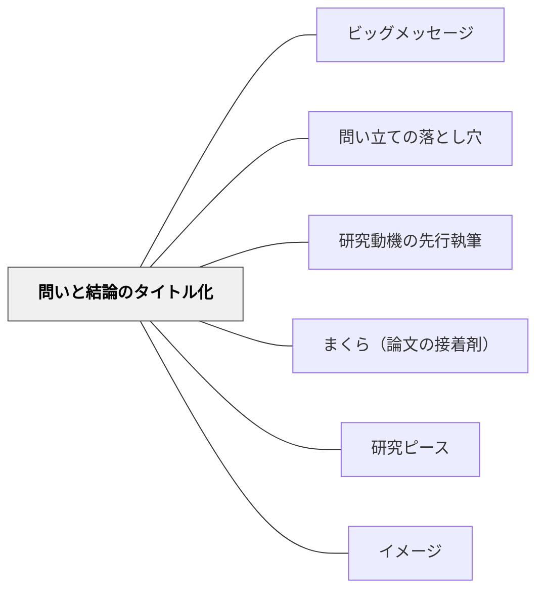

# 問いと結論のタイトル化

> タイトルは「最も短い論文」だ。メインタイトル（問い）＋サブタイトル（結論）の二層構造が、1年半の研究を一行に凝縮する。

---

## Pattern Connection

**卒業論文のデザイン（片岡則夫, 2025）統合（2026-05-27）：**

清教学園中学校の論文指導ガイドブック第5章「どんなタイトルがよいタイトルか」より統合する。

- **既存パタンとの関連**：[[パタン/ビッグメッセージ]] の「論文全体の主張を一言で」という原則が、サブタイトル（結論）として形式化されたもの。ビッグメッセージが決まることでタイトルが書ける
- **補強された点**：[[パタン/問い立ての落とし穴]] で精製された「良い問い」が、そのままメインタイトルになる。問いとタイトルの設計は同じ作業
- **他のパタンへの波及**：[[パタン/研究動機の先行執筆]] — タイトルは研究完成後に決まるが、動機が最初にあることでタイトルへ向かう方向性が生まれる

---

## 背景（Context）

論文が完成した後の最後の最後まで決まらないのがタイトルだ。テーマと結論が出てから、かなり悩む。

一方で、タイトルは「店の看板」「本の背表紙」でもある。看板や背表紙がいい加減だったり、魅力に欠けていたりしては、誰も店に入らず、本は手に取ってもらえない。「関心のない論文を読んでもらうために」も、タイトルは書かれる。

清教学園では「タイトルは最も短い論文」として、メインタイトル（問い）＋サブタイトル（結論）の二層構造を標準とする。この形式が定まることで、生徒は論文の核心（問いと答えの関係）を常に意識しながら研究を進められる。

## 問題（Problem）

タイトルを「論文のタイトルっぽいもの」として形式的につけると、テーマと結論の関係が読者に伝わらない。サブタイトルが「感想」「大きな言葉」「メインタイトルの繰り返し」になってしまうのはよくある失敗。

また「?」を使いたくなるが、オープンな問い（「はい/いいえ」で答えられない問い）には「?」は不要だ。

## 力のかたち（Forces）

- 論文を極限までシンプルにすると「問い」と「答え」だけが残る——それがタイトルになる
- メインタイトルの言葉をサブタイトルで繰り返してはいけない——同じ言葉がある場合、整理されていない証拠
- 「はい/いいえ」で答えられる問いはタイトルに向かない——オープンな問いをメインタイトルにする
- 良いサブタイトルには「重要な論点」が残る——結論のうちの決定的な言葉が入ること

## 解決（Solution）

**論文のテーマ（問い）をメインタイトル（疑問文・「?」なし）に、論文の結論（答え）をサブタイトルに配置する。メインとサブは同じ言葉を使わず、サブには結論の中の重要な論点を残す。**

---

### タイトルの設計ルール

| 項目 | メインタイトル | サブタイトル |
|------|---------------|-------------|
| **内容** | テーマ（問い）なので疑問文 | 結論（答え）を簡潔に表現 |
| **注意①** | 「?」を使わない | メインタイトルに使った単語を使わない |
| **注意②** | 「はい/いいえ」で答えられる問いにしない（オープンな問い） | 結論のうちの重要な論点を残す |

---

### 良いタイトルの例（清教学園先輩作品より）

- ジブリ飯はなぜ美味しそうに見えるのか：「食べる」から「生きる」を表現する
- 外来生物のカメにはどのような対策が必要なのか：関心を持ってもらう国営プロジェクト
- 殺処分をゼロにするにはどうすればいいのか：ペット市場全体を見直す法律改正
- ポケモンは家庭用ゲームをどう変えたか：ゲームが生むコミュニケーション
- ガンプラはなぜ親子二代のヒット商品となったのか：ニーズとともに歩む

**共通点**：シンプルで同じ単語が使われていない。「?」がない。「はい/いいえ」で答えられる問いでない。

---

### 悪いタイトルの類型

#### ①サブタイトルが結論になっていない
```
×「ボカロはどのように作られているのか：歌い手とボカロの関係について」
→「歌い手との関係」はメインの問いの答えになっていない

○「ボカロはどのように作られているのか：〜によって作られている」
```

#### ②同じ言葉の繰り返し
```
×「電気通信が社会に与える影響とはなにか：電気通信が社会をより便利にする」
→「電気通信」「社会」が重なっている

○「電気通信はどのような影響を社会に与えてきたか：便利になった」（整理後）
```

#### ③勉強不足で幼い
```
×「仮面ライダーとお金はどのようにつながっているのか：密接に関わることで生み出す人気」
→「お金」が幼い。「売上」「グッズ」「消費者」「玩具」という業界用語を使うべき段階
```

---

## 結果（Consequences）

- メインとサブの二層構造が身につくと、論文を読む前に「何を問い、何が答えか」を読者が把握できる
- タイトルを設計する過程で、研究者自身が「自分の論文の核心は何か」を再確認する機会になる
- 「タイトルから読んで大まかにテーマと結論がわかる」という基準が、論文の構成を逆照射する——サブタイトルが書けないということは、まだ結論が出ていないサインになる

## 関連パタン

- [[パタン/ビッグメッセージ]] — タイトルのサブタイトル（結論）はビッグメッセージそのもの
- [[パタン/問い立ての落とし穴]] — 良い問いがメインタイトルになる
- [[パタン/研究動機の先行執筆]] — 動機から問いが生まれ、問いがタイトルになる
- [[パタン/まくら（論文の接着剤）]] — タイトルが決まると論文全体のストーリーが明確になる
- [[パタン/研究ピース]] — ピースが揃いコメントが積み上がることでサブタイトル（結論）が見える
- [[パタン/イメージ]] — 「最後の姿（タイトル）を先にイメージする」という原則との共鳴

## クラスター図



## Actionable Insight

- 授業の「まとめ」を「問いとその答えの一文」で書かせてみる——「今日の問いは〇〇だった。答えは〇〇だ」という形式が、タイトル設計の先行練習になる
- 図書館の本のタイトルを観察させる——主タイトル（テーマ・問い）とサブタイトル（内容・視点）の関係を発見させると、タイトルの二層構造が体感的に理解される
- 子どもが作文や発表の題名をつけるとき「誰がどんな問いを持って読むと面白いタイトルかな？」と問いかける——読み手の視点を取り入れる意識が、「店の看板」としてのタイトルへの理解を深める

---

## 出典

山崎勇気・片岡則夫・南百合絵（2025）『卒業論文のデザイン：「なんでやねん」2025』清教学園中学校, pp.121-122

[[文献/卒業論文のデザイン（片岡則夫）]]
