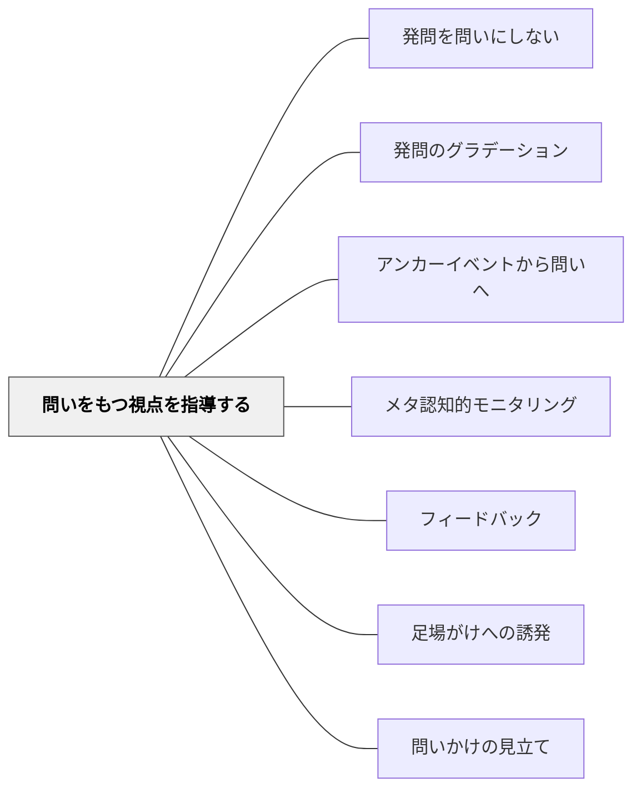

# 問いをもつ視点を指導する

> 「何か疑問に思ったことはある？」だけでは子どもは動けない——問いのつくり方を5W1Hで明示的に教え、問いを振り返る評価をセットにすることで、子ども自身が質の高い問いを育てていけるようになる。

## [Pattern Connection]

- **既存パタンとの関連**：[[パタン/発問を問いにしない]] が「教師の発問をなくしていく」方向を扱うのに対し、本パタンは「子どもが問いをもてるようになるための指導法」という具体的なプロセスを扱う。[[パタン/発問のグラデーション]] のグラデーション段階5（子どもが問いを出す）を実現するための足場かけである。
- **補強された点**：問いをもつ機会を「保障」するだけでなく、問いのつくり方を「明示的に指導」することと、問いの質を「振り返りと評価によって高める」という三層の構造が土居（2026）によって整理された。
- **他のパタンへの波及**：[[パタン/メタ認知的モニタリング]] に接続し、「自分が出した問いが学びを深めたか」を振り返ることが問いの自己調整につながる。[[パタン/フィードバック]] の視点から、教師の評価コメントが問いの視点の精緻化を支援する。

## 背景（Context）

教師の発問を手渡しにして子ども自身が問いをもてるようになることは、自立した学び手を育てる上で欠かせない。しかし、「何か疑問に思ったことはある？」と場を設けるだけでは、多くの子どもは何をどう問えばよいかわからず、問いを出せないか、浅い問いしか出てこない。

## 問題（Problem）

問いをもつ機会を与えても、どのような視点から問えばよいかを知らなければ、子どもは「なんとなく不思議に思った」という程度の問いに止まる。また、出した問いが良かったのかどうかを振り返る機会がないと、問いの質はなかなか高まらない。

## 力のかたち（Forces）

- 抽象的に「問いをもちなさい」と促すだけでは、問いのもち方を知らない子どもには届かない
- 観点（5W1H）を示すだけで「どう考えればいいかがわかる」——特に学習が苦手な子に有効（土居正博（2026））
- 問いをもつ機会を繰り返すことで徐々に質は高まるが、明示的指導と振り返りが加わると質の高まりが加速する
- 出した問いが授業の深まりにつながったかどうかは、子どもだけでは判断しきれないため、教師からのフィードバックが不可欠である

## 解決（Solution）

**問いをもつ機会を確保し、5W1Hの観点を明示的に指導する。さらに単元後に問いを振り返らせ、教師が的確な評価を返すことで、子どもが問いをもつ視点を自分のものにしていけるようにする。**

### ① 問いをもつ機会を確保する

発問が活発な段階であっても、子どもが自ら問いをもつ機会をなくしてはいけない（土居正博（2026））。単元の中で「この単元・この教材について、疑問に思うことは何ですか」と問いを出させる場を意図的に設ける。

例：「（各段落の内容を全体で確かめた上で）この段落について、何か疑問に思わない？」

### ② 5W1Hで問いの視点を明示的に指導する

深谷達史（2021）の「ビリヤード法」を援用し、問いをつくる観点として5W1H（Who / What / When / Where / Why / How）を子どもに明示する。

> 「抽象的なテーマに対してビリヤードの球のように様々な観点からの問い（『誰が』『どういう意味？』『いつから？』『どこで？』『なぜ？』『どのように？』）をぶつけることで、具体的な問いをつくり出す」——深谷達史（2021）

「問いを出しましょう」と抽象的に促すのではなく、「Who・What・Why・Howのどれかを使って問いをつくってみよう」と観点を明示するだけで、問いの出発点が具体的になる。学習が苦手な子どもへの参加の足場となる。

### ③ 問いを振り返り、教師がフィードバックを返す

香月正登（2025）の「国語学習サイクル」——問いを出す→学習を進める→問いを省察する→新たな問いを出す——を参考に、単元後に問いを振り返る場を設ける。

教師は子どもの振り返りに対して的確な評価を返す。

**社会科の例（土居正博（2026））**：
水産業の学習で「人々の工夫や努力」についての問いが出た単元後に：「人々の工夫や努力に注目した問いを出したことで、米の生産に励む人々の学習とのつながりが見えてきたよね。こうやって、生産に取り組む人々の努力や工夫・思いまで考えていけると、社会科の学習は深まるよね。」

**国語科の例（土居正博（2026））**：
「○○の心情の変化は？」という問いで学習を進めた単元後に：「心情の変化について考えたことによって、この物語から伝わってくるテーマがよくわかったよね。だから良い問いだったと言えるね。」

こうした評価を繰り返すことで、子どもは「この教科ではこういう問いをもつと深まるんだな」という教科固有の問いの視点を獲得していく。

## 結果（Consequences）

- 「何か疑問に思ったことはある？」という一言で、子どもたちが実際に問いを書き始めるようになる
- 特に学習が苦手な子が、5W1Hを手がかりに問いをもつ経験を積めるようになる
- 問いの振り返りと教師の評価によって、子どもの問いの質が単元を追うごとに高まる
- 「この教科ではこういう問いが深まりにつながる」という教科固有の見方が子ども自身の中に蓄積される

## 関連パタン

- [[パタン/発問を問いにしない]] — 教師の発問をなくしていく方向性の上位パタン
- [[パタン/発問のグラデーション]] — 段階5（子どもが問いを出す）を実現する足場
- [[パタン/アンカーイベントから問いへ]] — 問いが自然に湧く文脈づくりと本パタンの組み合わせ
- [[パタン/メタ認知的モニタリング]] — 自分の問いの質を振り返る認知的プロセス
- [[パタン/フィードバック]] — 問いの省察に対する教師の評価コメントが問いを精緻化する
- [[パタン/足場がけへの誘発]] — 5W1Hは問いをもつための足場かけとして機能する
- [[パタン/問いかけの見立て]] — 子どもの問いの質を見取り次の指導に活かす

## クラスター図

## Actionable Insight

- 「疑問に思ったことは？」と聞くだけでなく「Who/What/Why/Howのどれかを使って問いをつくってみよう」と観点を添える——学習が苦手な子も問いをもてる入口ができる
- 単元末に子どもが出した問いを1〜2分で振り返らせ、「この問いのおかげで何が深まったか」を一言書かせる——問いの質を自己評価する習慣が育つ
- 振り返りに対して「○○に注目した問いが、△△の学習を深めたね」と教師がコメントする——何が「良い問い」かという教科固有の視点が子どもに伝わる

## 出典

- 土居正博（2026）『自分で考え、学べる子を育てる！ 発問の技術』学陽書房
- 深谷達史（2021）『学習科学の知見を活かした国語授業のアップデート』明治図書出版
- 香月正登（2025）『国語学習サイクルで深める文学授業』東洋館出版社
- [[文献/自分で考え、学べる子を育てる！ 発問の技術]]

> 「どのように問いをもつかをある程度明示的に指導していくことで、質の高まりも増します」——土居正博（2026）
