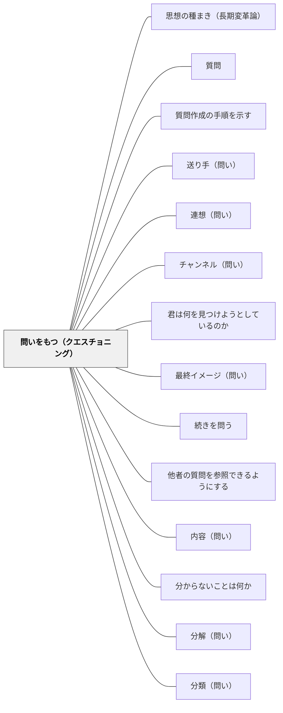

# 問いをもつ（クエスチョニング）

> 問いをもつことは、能動的な読者の証しである。問いは読書を「情報の受け取り」から「意味の探求」へと変える。

---

## Pattern Connection

**Harvey & Goudvis（2007）統合（2026-05-17）：**

*Strategies That Work* の第8章は、Questioning（問いをもつ）を「能動的な関与の最も基本的なサイン」と位置づける。

- **既存パタンとの関連**：[[パタン/不思議を育てる]] が「問いを育てる文化」を扱うのに対し、本パタンは「読書中に問いをどう使い、どう記録し、どう推論へ発展させるか」という実践レベルの設計を提供する
- **補強された点**：[[パタン/深める問い]] の「行間を読む問い」と本パタンの「シック・クエスチョン（Thick Questions）」は同じ方向を指している——1〜2語で答えられる問いから、考え・議論・解釈が必要な問いへの転換
- **他のパタンへの波及**：[[パタン/推論する（インファリング）]] — I Wonder/I Think チャートで問いを推論へ変換する。[[パタン/統合する（シンセサイジング）]] — 問いが統合の駆動力になる。[[パタン/背景知識]] — 背景知識が問いを生む（三宅・ノーマン, 1979）

---

## 背景（Context）

読書研究が示す「能動的な読者」の特徴のひとつは、読みながら問いをもち続けることである。しかし学校の読書指導では、問いは「授業の終わりに先生が出すもの」であることが多く、子どもたちは問いをもつことを「自分の仕事」として経験していない。

Harvey & Goudvis（2007）は言う：「問いをもつことは、能動的で関与した読書の証し」——問いは、読者がテキストと本気で対話しているサインである。

読書前・読書中・読書後のいずれの段階でも問いは生まれる。問いは混乱のサインでもあり、好奇心のサインでもあり、深い理解への入り口でもある。

## 問題（Problem）

「読んで問題に答えなさい」という指導では、子どもたちは「問いをもつ」のではなく「問いに答える」だけになる。問いを「自分で立てる」経験がないと、読書は受動的な情報受け取りになり、自分の理解に関与する力が育たない。

また「どんな問いも同じ」という扱いでは、表面的な問い（テキストを見れば答えられる）と深い問い（考えないと答えられない）の区別ができない。

## 力のかたち（Forces）

- 問いは読者を読書に集中させ続ける——問いがあるから読み続ける
- 「答えが見つかる問い」と「考え続ける問い」は質が違う——区別して扱うことで思考が精緻化される
- 問いを記録することで、自分の「何を知りたいか」が可視化される
- ノンフィクションでは、テキスト特徴（見出し・グラフ・太字）が問いの自然な入口になる
- 問いが共有されると、教室が「答えを出す場所」から「一緒に考える場所」に変わる

## 解決（Solution）

**読書前・中・後のあらゆる段階で問いをもち、その問いを記録・共有・発展させることで、読書を能動的な意味の探求にする。**

---

### シン・クエスチョン vs シック・クエスチョン

Harvey & Goudvis は問いを2種類に区別して教える：

| 種類 | 意味 | 例 | 特徴 |
|------|------|----|------|
| **Thin Questions（薄い問い）** | テキストに答えがある問い。調べれば分かる | 「主人公の名前は何？」「この出来事はいつ起きた？」 | 正解がある。読むのを止める必要はない |
| **Thick Questions（厚い問い）** | 考え・議論・解釈が必要な問い。テキストだけでは答えられない | 「なぜ主人公はこういう選択をしたのか？」「著者はこれを通じて何を伝えたいのか？」 | 正解がない。対話が生まれる |

**指導のポイント**：Thin Questions は確認に使い、Thick Questions を読書後の対話・書くことの核心に置く。「この問いは Thin？Thick？」を子どもたちの言葉にする。

---

### ワンダー・ウォール（Wonder Wall）

教室の壁（またはボード）に「I Wonder...（〜かな？）」で始まる問いを付箋で貼っていく場所。

**機能**：
- 読書前・読書中に生まれた問いを記録する
- テキスト・ユニット・単元が進む中で、問いが増え、答えられ、新しい問いが生まれる過程が見える
- 「まだ答えが出ていない問い」が学習を前へ進める動力になる

**使い方**：
1. 単元の最初にテキストを見渡して「I Wonder...」を書く（問いを「予測」として使う）
2. 読書中に「Huh?」「I Wonder...」が生まれたら付箋に書いて追加
3. 単元の終わりに「答えが出た問い」と「まだ残っている問い」を仕分ける

---

### I Wonder / I Think チャート

問いを推論へ変換する2列チャート：

| I Wonder...（問い） | I Think...（推論） |
|---------------------|-------------------|
| この先どうなるのかな | 主人公が謝りに行くと思う。なぜなら…… |
| なぜ著者はこの順番で書いたのか | 最初に結末を知ることで読者が引き込まれるからだと思う |

**意図**：「問いを持つ → 問いに対して思考する」というプロセスを習慣化する。I Wonder だけで終わらせず、I Think に展開させることで問いが推論の訓練になる。

---

### ノンフィクションでの問い

ノンフィクションのテキスト特徴は「問いの入口」として機能する：

- **見出し・小見出し**を見たとき：「この章では何を教えてくれるのかな？（I Wonder）」
- **グラフ・図表**を見たとき：「このグラフは何を示しているのか？なぜ著者はここに入れたのか？」
- **太字の語**を見たとき：「なぜこの語が重要なのか？どう使われているのか？」

テキスト特徴を "Question Prompts" として使うと、ノンフィクション読書が「ページをめくるだけ」から「問いを立てながら読む」に変わる。

---

## 結果（Consequences）

- 読書が受動的な情報受け取りから、能動的な意味の探求に変わる
- 「わからない」が「Huh?」（Fix-up の入口）と「I Wonder」（深める問いの入口）に分類され、対処しやすくなる
- Thick Questions が読書後の対話・書くことの中心になり、表面的な「感想」から脱する
- ワンダー・ウォールが教室の「学習の地図」になる——単元を通じて何を探求したかが見える
- 問いを共有することで、「みんなが同じ疑問を持つことがある」という学習コミュニティの感覚が生まれる

⚖ **緊張関係**: [[緊張関係マップ]] — [[パタン/発問セット指示]]・[[パタン/発問内容の具現化]] と拮抗する。判断軸：〈設計は足場・創発がゴール〉

## 関連パタン
- [[パタン/思想の種まき（長期変革論）]]
- [[実践/カンファリング（読書会議）]]
- [[実践/リーダーズ・ノートの起動]]
- [[実践/リテラチャー・サークルの起動]]
- [[実践/文学討論グループの設計]]
- [[パタン/質問]]
- [[パタン/質問作成の手順を示す]]
- [[パタン/送り手（問い）]]
- [[パタン/連想（問い）]]
- [[パタン/チャンネル（問い）]]
- [[パタン/君は何を見つけようとしているのか]]
- [[パタン/最終イメージ（問い）]]
- [[パタン/続きを問う]]
- [[パタン/他者の質問を参照できるようにする]]
- [[パタン/内容（問い）]]
- [[パタン/分からないことは何か]]
- [[パタン/分解（問い）]]
- [[パタン/分類（問い）]]
- [[パタン/未来を問う]]
- [[パタン/理由・根拠を問う]]
- [[パタン/いつ？（問い）]]
- [[パタン/だれ？（問い）]]
- [[パタン/どこ？（問い）]]
- [[パタン/どのくらい？（問い）]]
- [[パタン/どのように？（問い）]]
- [[パタン/PICO①Patient・Problem]]
- [[パタン/PICO②Intervention]]
- [[パタン/PICO③Comparison]]
- [[パタン/PICO④Outcome]]
- [[パタン/重要性の見極め]]
- [[パタン/反省的思考の5段階]]

- [[パタン/不思議を育てる]] — 問いを育てる文化の上位パタン
- [[パタン/深める問い]] — 「行間を読む問い」と Thick Questions の接続
- [[パタン/推論する（インファリング）]] — I Wonder を I Think へ変換するプロセス
- [[パタン/統合する（シンセサイジング）]] — 問いが統合（思考の進化）の駆動力になる
- [[パタン/シンクアラウド]] — 問いをもつプロセスを声に出してモデリングする
- [[パタン/メタ認知的モニタリング]] — 「Huh?」と「I Wonder」はどちらもモニタリングの表れ
- [[パタン/背景知識]] — 知識があることで問いが生まれる（三宅・ノーマン, 1979）
- [[パタン/アンカーチャート]] — Thick/Thin の区別をチャートで教室に定着させる
- [[実践/テキストコーディング]] — 「?」「Huh?」コーディングと問いの記録
- [[パタン/問い立ての落とし穴]] — Thick Questions（考えないと答えられない問い）への転換とNGパターン除外が対応

## クラスター図

## Actionable Insight

- 読み語りの後に「この本を読んでいる間に出てきた疑問を1つ書いてみて」と問う——問いを書く経験が「読みながら考える」習慣の入口になる
- 子どもの問いを「Thin？Thick？」で仕分けてみる——1語で答えられる問いに対して「もっと大きな疑問に変えられないかな？」と問い返す
- ノンフィクションを読む前に、目次と見出しだけを見て「I Wonder を3つ書いてみて」と問う——テキスト特徴を問いに変えるだけで読書が変わる

---

## 出典

Harvey, S., & Goudvis, A. (2007). *Strategies That Work: Teaching Comprehension for Understanding and Engagement* (2nd ed.). Stenhouse Publishers.

> "Asking questions is the hallmark of active, engaged reading. Questions keep readers focused and alert as they read."

[[文献/Strategies That Work（Harvey & Goudvis）]]
