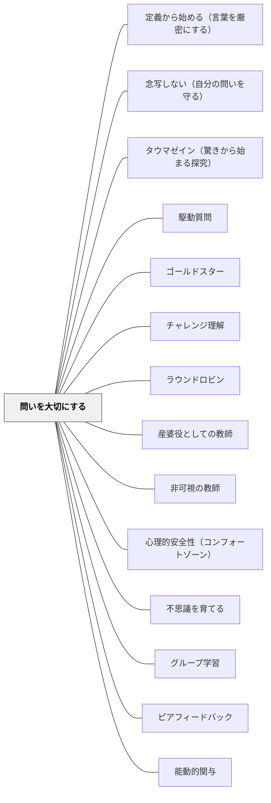

# 問いを大切にする

> 正しい答えより深い問いを称えよ——問いこそが学習の核心であり、学習者が問いを持てる文化が探究を生む。

## [Pattern Connection]

Bergin et al.（2012）の *Pedagogical Patterns* における「Honor Questions」パタンは、問いを発することへの恐れを文化的に取り除く実践として提示される。既存のWikiパタンとの接続点は次のとおり。

- **補強点**：[[パタン/心理的安全性（コンフォートゾーン）]] では「失敗できる環境」が中心だが、本パタンはさらに一歩進み「問うこと自体を最も価値ある行為として積極的に称える」という能動的な文化形成を提示する
- **拡張点**：「バズグループ（Buzz Groups）」という具体的な技法を通じて、問いが生まれた瞬間にグループ全体の対話を引き起こす構造を提示する——問いを教師に向けるのではなく、学習者コミュニティ全体で扱う
- **他のパタンへの波及**：[[パタン/グループ学習]] のバズグループ技法、[[パタン/不思議を育てる]] の問いを育む文化形成、[[パタン/ゴールドスター]] の称賛実践

---

## 背景（Context）

教師は学習者に積極的に問いを発してほしいと思っている。しかし多くの教室では、問いを発することへの恐れや羞恥心が学習者の口を閉ざしてしまう。誤解や疑念は、言語化されない限り教師には見えない。問いが生まれない教室では、表面的な理解のまま学習が進み、深い誤概念が蓄積される。

## 問題（Problem）

学習者は「愚かな質問」をすることを恐れる。文化的背景によっては（東アジアの一部の文化圏では特に）、目上の者に問いを発することが不遜とみなされる場合もある。問いが抑圧されると、誤概念は隠れたままになり、教師は「理解できている」と誤認したまま授業を進めてしまう。問いのない教室では、学習者が持つ深い思考や洞察も表に出てこない。

## 力のかたち（Forces）

- 問いを発することは「知らないこと」の表明であり、自尊心と抵触する
- 「愚かな質問はない」と言葉で言っても、文化的・経験的な恐れは容易には消えない
- 誤概念は問いを通じてのみ表面化し、修正される機会を得る
- 深い問い（誤概念を暴く問い）は、正しい答えよりも学習を前進させる
- 称えられた行動は繰り返される——問いを称えることが問いの文化をつくる

## 解決（Solution）

**学習者が問いを発することを最も価値ある行為として扱い、積極的に称える。正しい答えよりも深い問いに最高の賞賛を与える。**

問いを生みやすくする具体的な技法として「バズグループ（Buzz Groups）」がある。グループ内で誰かの問いが生まれたとき、すぐに全体の場に出すのではなく、まずそのグループ内で2〜3分間対話させる。問いに対する仮説・意見を出し合ってから全体で共有する。この手順によって、問いが「一人の恥ずかしさ」ではなく「グループの探究の種」として扱われる。

---

**具体例1：ゴールドスターを問いに与える**

Joe Bergin（本パタンの著者の一人）は授業で「Gold Stars（称賛）」を配布するが、最も多くのゴールドスターを得るのは正しい答えを出した学生ではなく、誤概念を暴く深い問いを発した学生だと述べている。称賛の対象を「答え」から「問い」にシフトすることで、学習者の行動が変わる。

**具体例2：法学教授の極端な実践**

ある法学教授は講義中に一切の発言をせず、学生からの問いのみに応じ、さらにその問いに問いで返す（ソクラテス式問答）という極端な実践を行った。初めは戸惑いが大きかったが、やがて学生は自分たちで問いを立て、互いに問い返し合う文化を身につけた。

**具体例3：問いを「声に出しにくい」文化への対処**

全体の場での発言が難しい場合は、まず付箋やカードに問いを書かせ、それを収集・読み上げる「Question Box」方式も有効である。問いを匿名化することで、発言への心理的障壁を下げながら問いの文化を育てることができる。

## 結果（Consequences）

- 学習者が問いを発することへの恐れが減り、教室に問いの文化が育まれる
- 隠れていた誤概念が表面化し、教師が学習者の実際の理解状態を把握できるようになる
- 深い問いが対話を生み、学習が探究として深まる
- 正しい答えを求めるよりも、問い続ける知的態度が育つ
- 称賛の対象が「答え」から「問い」に移ることで、学習者の参加の動機が変わる

## 関連パタン
- [[パタン/定義から始める（言葉を厳密にする）]]
- [[パタン/念写しない（自分の問いを守る）]]
- [[パタン/タウマゼイン（驚きから始まる探究）]]
- [[パタン/駆動質問]]
- [[パタン/ゴールドスター]]
- [[パタン/チャレンジ理解]]
- [[パタン/ラウンドロビン]]
- [[パタン/産婆役としての教師]]
- [[パタン/非可視の教師]]

- [[パタン/心理的安全性（コンフォートゾーン）]] — 問いを発するための安全な環境
- [[パタン/不思議を育てる]] — 問いを文化として根付かせる
- [[パタン/グループ学習]] — バズグループで問いを全体の探究に変える
- [[パタン/ピアフィードバック]] — 問いを仲間に向ける実践
- [[パタン/能動的関与]] — 問いを発することは最も能動的な学習行為
- [[パタン/メタ認知的モニタリング]] — 「わからない」の認識が問いの起点になる
- [[パタン/誰も完璧ではない]] — 「知らない」と言える教師の姿勢が問いを歓迎する文化の最強のモデルになる
- [[パタン/問い立ての落とし穴]] — 問いを大切にしながら、良い問いとNGパターンを区別する
- [[メタパタン/非知の文化]] — 問いを称える文化は「非知の文化」の土台になる

## クラスター図

## Actionable Insight

- 今週の授業で「一番いい質問をした人」を明示的に称える——答えではなく問いに賞賛を向けることで、学習者の行動が変わり始める
- グループ活動後の全体共有の前に「グループで出た問いを一つ発表してください」という指示を加える——問いがグループの成果物として扱われ、発言への恐れが下がる
- 単元の最後に「まだ答えが出ていない問いは何ですか」と学習者に書かせる——「わからないこと」を言語化させることで、誤概念の発見と次の探究への橋がかかる
- 教師自身が「先生もここはよくわからない」と問いの形で言語化してみる——教師のモデリングが最も強力な文化形成の道具になる

## 出典

Bergin, J., Eckstein, J., Manns, M. L., Sharp, H., & Voelter, M. (2012). *Pedagogical Patterns: Advice For Educators*. Joseph Bergin Software Tools. (CC BY-SA 3.0)

> "Always honor questions more than bright answers."——Bergin et al.（2012）

> "Motivate the participants to ask questions, by ensuring that there are no stupid questions."——Bergin et al.（2012）
