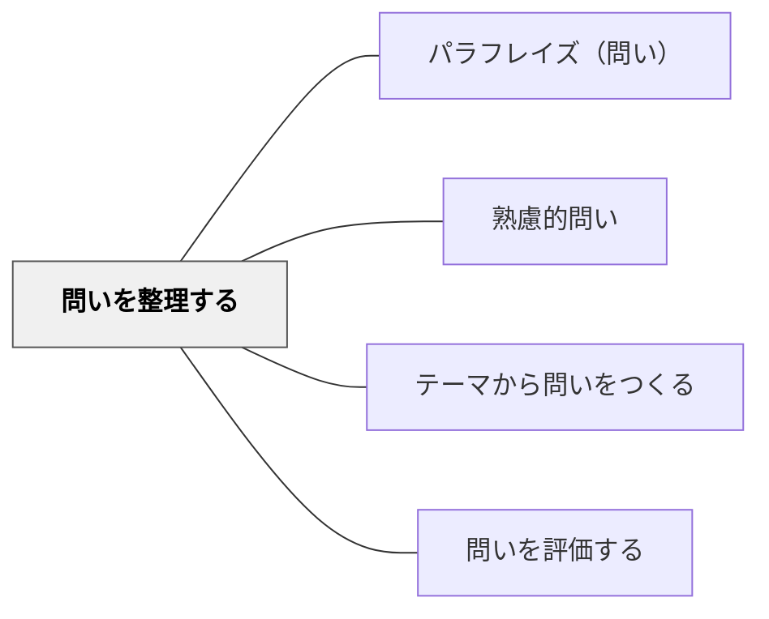

# 問いを整理する

> 立てた問いを分類・構造化・優先順位付けする。

## 背景（Context）
探究活動や授業で多くの問いを出すと、次第にどの問いから着手すべきかが分からなくなる。
問いは単に「多い」だけでは力にならず、整理・構造化されて初めて探究の道筋となる。
問いのマトリクス（例：closed/open、事実/解釈/評価）や問いのマップを使うことで、問いの全体像が見えてくる。
問いを整理する行為そのものが、テーマへの理解を深め、次の探究方向を定める思考活動である。

## 問題（Problem）
多くの問いが出されたまま整理されず、どれが中心的な問いかが見えなくなることがある。
問いの種類（事実を問うものと価値・解釈を問うものなど）が混在していると、探究の方法も混乱する。
問いの優先順位が共有されないまま活動が進むと、グループの方向性がばらばらになる。

## 力のかたち（Forces）
- 問いには階層性がある（大きな問いと、それに付随する小さな問い）。
- 問いを分類するための枠組み（事実・解釈・評価、短期・長期など）が整理の助けになる。
- 視覚化（ポストイット・マインドマップ・マトリクス）は問いの構造を共有しやすくする。
- 整理は一度ではなく、探究の進行とともに繰り返し行うべき反復プロセスである。

## 解決（Solution）
立てた問いをポストイットや付箋などに書き出し、類似したものをグルーピングする。
「この問いに答えるには何が分かれば良いか？」という問いの階層を意識した構造化を行う。
問いのマトリクス（例：事実系／解釈系、自分で調べられる／他者に聞く必要がある）を使い分類する。
最終的に「この探究で最も答えたい問いはどれか」を一つ選び、中心的なリサーチクエスチョンとして位置づける。

## 結果（Consequences）
問いの全体像が可視化され、探究の道筋が明確になる。
問いの種類に応じた適切な探究方法を選べるようになる。
中心的な問いが定まることで、探究活動に焦点と推進力が生まれる。
整理に時間をかけすぎると探究の実行に移れなくなるため、整理はあくまで手段として位置づける必要がある。

## 関連パタン
- [[パタン/パラフレイズ（問い）]]
- [[パタン/熟慮的問い]] — 親パタン
- [[パタン/テーマから問いをつくる]] — 問いを生成する前段
- [[パタン/問いを評価する]] — 整理の後、質を吟味する

## クラスター図

## Actionable Insight

- ブレインストーミングで出た問いをポストイットに書き出し、「事実系」「解釈系」「評価系」の3列に並べ替えさせる——種類を区別するだけで探究の方法論が明確になる
- 整理した問いの中から「この探究で最も答えたい問いはどれか」を一つ選ばせ、その理由を隣の人に1分説明させる——中心的なリサーチクエスチョンが焦点化する
- 問いの間に「→」でつながりを書かせてマップ化する——階層構造が見えることで探究の道筋が生まれる

## 出典
- [[文献/熟慮的問いのパターンリスト（動画記録）]]
