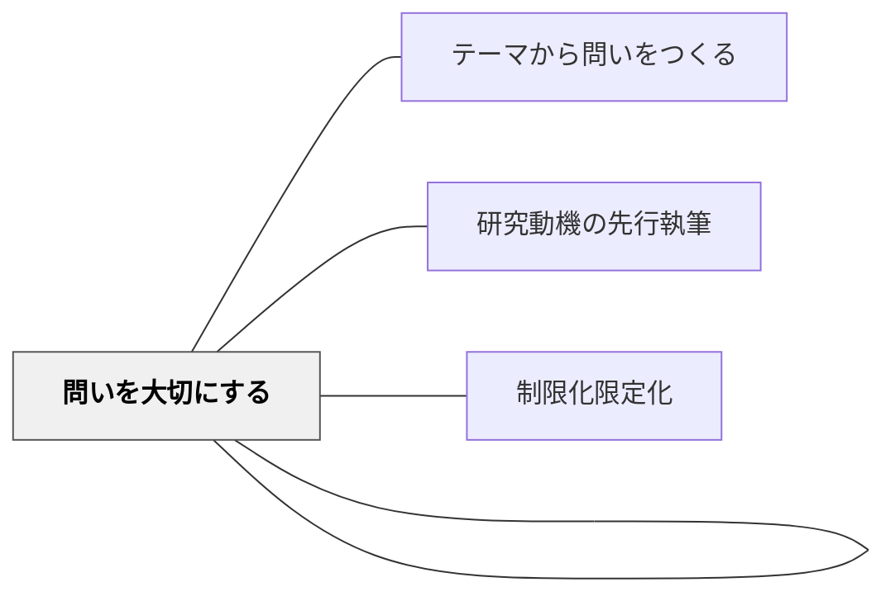

# 問い立ての落とし穴

> 「こんなテーマはあかん」——研究テーマには失敗しやすい8つのパターンがある。落とし穴を知ることが、本物の問いへの近道になる。

---

## Pattern Connection

**卒業論文のデザイン（片岡則夫, 2025）統合（2026-05-27）：**

清教学園中学校の論文指導ガイドブック第5章「テーマを絞り論文をデザインする」より統合する。

- **既存パタンとの関連**：[[パタン/テーマから問いをつくる]] が「問いの生成」を扱うのに対し、本パタンは「問いの評価・除外」を担う。[[パタン/問いを評価する]] の実践的具体例として機能する
- **補強された点**：[[パタン/問いをもつ（クエスチョニング）]] の Thin Questions / Thick Questions の区別が、「こんなテーマはあかん」の基準（ハウツー＝Thin、好き好き＝動機の不在）と対応している
- **他のパタンへの波及**：[[パタン/研究動機の先行執筆]] — NGテーマの多くは動機の欠如から来る。[[パタン/問いと結論のタイトル化]] — 良い問いから良いタイトルが生まれる

---

## 背景（Context）

探究学習・総合学習で「テーマを決めなさい」と言われた子どもたちは、しばしば「大きすぎる問い」「答えが決まっている問い」「ハウツーの問い」を研究テーマとして持ってくる。

こうした問いを選んだ子どもたちが悪いのではない——どんな問いが研究論文に向くかを、明示的に教えていないことが問題だ。

清教学園中学校では「こんなテーマはあかん」として8パターンを明示し、生徒が自分のテーマをセルフチェックできるようにしている。

## 問題（Problem）

「自分でテーマを決めてよい」という自由は、問いの選び方を知らない子どもにとっては「何を選んでもよい」という戸惑いになる。選んでも「それは調べ学習になる」「それはハウツー本でよい」と言われ、テーマを決め直す負担が生じる。

8つのNGパターンを知らないと、研究を進めた後で「これは論文にならない」と気づくことになる。

## 力のかたち（Forces）

- 「大きすぎるテーマ」は収拾がつかない——絞る（制限化）が必要
- 「まんまテーマ」は問いになっていない——「〇〇とはなにか」という定義問題か、テーマを問いに変換する必要
- 「好き好きテーマ」は動機だけで研究がない——対象から距離をおいて「経営者視点」「研究者の視点」で見直す
- 「ハウツーテーマ」は答えが本に書いてある——「なぜそうするのか」という理由の問いに変換する
- 「上から目線テーマ」は結論が先にある——ツッコミ（批判的コメント）が入った段階で根拠を示せなくなる

## 解決（Solution）

**テーマを決める前に「こんなテーマはあかん 8パターン」で自分のテーマをセルフチェックする。NGパターンに該当したら、問いを変換・修正する方法を試す。**

---

### こんなテーマはあかん 8パターン

| # | パターン | 問題 | 変換の方向 |
|---|---------|------|-----------|
| ① | **大きすぎ** | 「環境問題を解決するには」——範囲が広すぎて絞れない | 「〇〇地域の〇〇問題に対する〇〇の取り組みはどうか」に絞る |
| ② | **まんまテーマ** | テーマをそのまま問いにしただけ。問いになっていない | 「なぜ」「どのように」「〇〇と〇〇はどう違うか」に変換 |
| ③ | **解決済み** | すでに答えが出ている問い。図書館で調べれば終わる | 「なぜ解決されたか」「今の問題は何か」に転換 |
| ④ | **ハウツー** | 「どうすればうまくできるか」——方法の紹介になる | 「なぜその方法が有効なのか」「どんな理由で人気があるのか」に変換 |
| ⑤ | **未来予測** | 「〇〇はどうなるか」——根拠なき予測になりやすい | 「なぜ今そうなっているか」という現在・過去の問いに変換 |
| ⑥ | **好き好き** | 「私が好きな〇〇の魅力」——自分の好みの確認になる | 対象から距離をおき「経営者」「研究者」「消費者」の視点で見直す |
| ⑦ | **上から目線** | 「〇〇のどこが問題か・改善すべきか」——根拠なき批判 | 「なぜ問題が起きているか」「どんな取り組みがあるか」に変換 |
| ⑧ | **言いたいことを言うため** | 結論が先にある。研究は飾り | テーマと結論の間に「なぜそう言えるか」という問いを挿入する |

---

### やめた方がいい10分野（清教学園の経験則）

清教学園では長年の蓄積から、中学生が研究論文にしにくい分野として以下を挙げている：

タレント・心理学系・疑似科学・民間療法・美容・犯罪・作品論（映画・アニメ感想）・SNS・高度科学・資格専門職

理由：①信頼できる文献が少ない ②専門的すぎてFWが困難 ③「好き好き」に陥りやすい ④「まんまテーマ」になりやすい

---

### 「好き好きテーマ」攻略法

好き好きテーマは動機が強い分、視点を変えれば良い論文になる。

```
例：「ガンプラが好き」→「なぜガンプラは親子二代でヒット商品なのか：ニーズとともに歩む」

視点の変換：
消費者の視点（好き） → 経営者・研究者の視点（なぜ売れるか・どんな社会的意味があるか）
```

「対象からいったん距離をおいて眺める」だけで、好き好き問いが研究論文の問いに変わることがある。

---

## 結果（Consequences）

- 8パターンを知ることで、テーマ決定前のセルフチェックが可能になり、無駄な試行錯誤が減る
- 「こんなテーマはあかん」を知ることで、逆に「こういうテーマなら研究になる」という感覚が育つ
- 教師がテーマ却下の理由を毎回個別に説明しなくても、子どもが自己判断できるようになる
- 「動機があれば問いを変換できる」という理解から、探究のモチベーションが保たれやすい

## 関連パタン

- [[パタン/テーマから問いをつくる]] — 問いの生成の次に問いの評価・除外を行う
- [[パタン/問いを評価する]] — 良い問いの基準とNGパターンの対応
- [[パタン/問いをもつ（クエスチョニング）]] — Thick Questions（考えないと答えられない問い）への転換
- [[パタン/研究動機の先行執筆]] — 動機が曖昧だとNGテーマに流れやすい
- [[パタン/問いと結論のタイトル化]] — 良い問いから良いタイトルが生まれる
- [[パタン/問いを大切にする]] — 問いの質を高め続ける文化との接続
- [[パタン/制限化限定化]] — 「大きすぎるテーマ」の絞り方として

## クラスター図



## Actionable Insight

- 探究学習でテーマを発表させる際に「こんなテーマはあかん 8チェック」をシートとして配る——自分のテーマが①〜⑧に当てはまるかを事前にセルフチェックさせると、指導が格段に楽になる
- 「好き好きテーマ」を持ってきた子どもに「それのどこが一番面白い？なんでそうなってるんだろう？」と問い返す——「なぜ」に答えようとすることで、自然と研究論文の問いに変換される
- 「ハウツーテーマ」と気づいたら「なんでその方法が効果的なんだろうね？」と問いかける——方法の「理由」を探ることが、調べ学習から研究論文への転換点になる

---

## 出典

山崎勇気・片岡則夫・南百合絵（2025）『卒業論文のデザイン：「なんでやねん」2025』清教学園中学校, pp.110-116

[[文献/卒業論文のデザイン（片岡則夫）]]
