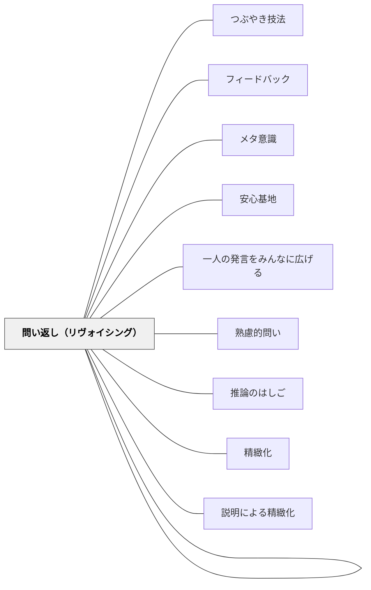

# 問い返しのデザイン

## 背景（Context）

学習の場面では、教員が子どもの発言や行動を受け止め、**その意味や背景に気づくための対話**が求められる。しかし現実には、発言を聞いて終わり、次の指導に流れてしまうことが多く、せっかくの気づきの芽が流されてしまう。

## 問題（Problem）

子どもが語ったことが、**教師によって深められないまま処理されてしまう**と、発言の価値が見過ごされ、子ども自身も「自分の考えには意味がない」と感じてしまう。教師が即時的な評価や指導に走ることで、思考の余白や問いの持続が妨げられる。

## 力のかたち（Forces）

- 教師には「教えなければ」という圧力がある
- 子どもは一度言葉に出しても、すぐに自分の発言を忘れてしまう
- 「問いを返す」には、教師自身の思考の柔軟性と余白を許す姿勢が必要

## 解決（Solution）

子どもの発言や行動に対して、**評価や誘導ではなく、問いとして返す**ことで、子どもが自分の思考を深めたり広げたりする時間を持てるようにする。

**問い返しの形：**
- 「なんでそう思ったの？」
- 「他にはどうかな？」
- 「それって、どういうこと？」
- 「もう少し詳しく聞かせてくれる？」

これらは**答えを急がず、思考の空間を広げる問い**としてデザインされる。

**実践例：**
- 子：「あいつズルいと思った」 → 教：「そう思ったんだね。なんでそう感じたのか、少し教えてくれる？」
- 子：「この答えじゃないかと思った！」 → 教：「そう思ったってことは、どんなことを考えたの？」
- 子のつぶやきを黒板にメモしながら → 教：「この言葉、誰かにも問い返したい人いる？」

## 結果（Consequences）

- 子どもが、自分の考えを**掘り下げて再構成する契機**となる
- 教室内で、問い合い・考え合いの空気が生まれる
- 教師が「教える人」ではなく、「共に問う人」として位置づけられる
- 子どもの**メタ意識の芽生え**を促す

## 関連パタン
- [[教科/LowFloorHighCeilingタスク集]]
- [[教科/国語]]
- [[教科/分数パズル（youcubed）]]
- [[実践/読み語りの実践]]
- [[パタン/つぶやき技法]]
- [[パタン/フィードバック]]
- [[パタン/メタ意識]]
- [[パタン/安心基地]]
- [[パタン/一人の発言をみんなに広げる]]
- [[パタン/熟慮的問い]]
- [[パタン/推論のはしご]]
- [[パタン/精緻化]]
- [[パタン/説明による精緻化]]
- [[パタン/問い返し（リヴォイシング）]]

## このパタンが働く教材

| 教材 | どのように問い返しを支えるか |
|------|------------------------------|
| [[教材/読書会の質問（テーマ）集]] | 「どこからそう思った？」「もっとくわしく教えて」など、読書会中に使える問い返しを子どもが選べるようにする |

- [[パタン/メタ意識]] — 問い返しによってメタ意識が促される
- [[パタン/発問を問いにしない]] — 問いでなくつぶやきで促す補完的パタン
- [[パタン/余白をつくる]] — 問い返した後に考える時間を確保する
- [[パタン/フィードバック]] — 評価ではなく問いで返すフィードバック
- [[パタン/精緻化]] — 問い返しが精緻化の契機になる

## クラスター図

## Actionable Insight

- 子どもの発言に対して「評価せず問いで返す」を1回意識的に試す——「なんでそう思ったの？」の一言が、教師と子どもの関係を「共に考える人」に変える
- 授業中のつぶやきを聞き逃した時は「ちょっと待って、今の言葉もう一回教えて」と返す——発言を拾って問い返すだけで子どもが「自分の考えに価値がある」と感じる
- 「もう少し詳しく」「例えば？」の2つの問い返しだけを今週使い続ける——たった2つでも問い返しの習慣が対話の質を変える

## 出典

- パタン集/問い返しのデザイン.md
