# 問い返し（リヴォイシング）

> 相手の発言を問いとして返し、思考を明確化・深化させる。

## Pattern Connection

### クセノフォン（前370年代）——ソクラテスの連鎖的問い返し

クセノフォン『ソクラテスの思い出』（相澤拓訳、光文社古典新訳文庫 2022）に記録されたソクラテスの問答は、リヴォイシングの最古の体系的な実例である。ソクラテスの連鎖的問い返しの構造：

1. 相手の前提（自信ある主張）をそのまま受け取る
2. 「それなら〜ではないか？」と論理的帰結を問いとして返す
3. 相手が同意したら「では、〜の場合はどうだろうか？」と一段深める
4. この連鎖を通じて、相手が自らの言葉で矛盾または新たな認識に至る

**アリスティッポスとの対話の例（第一巻第五章）**：
- 前提：「食べなければ誰も生きていけません」
- 問い返し：「さて、それでは、食事をとりたいという気持ちは湧いてくるのではないか？」
- 同意を得て：「では、何か飲みたくなったときに、喉の渇きに耐える力も、同じ人のほうに割り当てるべきではないか？」
- さらに：「では、眠気に打ち勝って、やるべきことを終えることができる力も…」

この「では→〜ではないか？」の連鎖は、相手の同意を積み重ねながら、相手自身が発言した言葉を足場として深化させていく。

- **既存パタンとの関連**：現代の「リヴォイシング」技法は「〇〇ということ？」と問いとして返すことを重視するが、ソクラテスはさらに「帰結を問いとして連鎖させる」というステップを加える——1回の問い返しで止まらず、3〜5回の連鎖が相手の思考を一段階深い場所まで連れて行く。
- **補強された点**：「相手の言葉を足場にする」という原理は、リヴォイシングの本質だが、クセノフォンのソクラテスはこれを「連鎖的に積み上げる」ことで、単なる確認から思考の深化の技法へと昇華させた。
- **波及するパタン**：[[パタン/アポリアの設計]] — 連鎖的問い返しが最終的に到達するアポリアの状態；[[パタン/産婆役としての教師]] — 問い返しが産婆役の主要な道具；[[文献/ソクラテスの思い出（クセノフォン）]] — 本統合の出典

---

## 背景（Context）
学習者が発言したとき、その内容があいまいであったり、本人が言語化しきれていないことがある。教師がすぐに評価や補足をすると、学習者の思考が止まってしまう。発言を丁寧に問い返すことで、本人が自分の考えをより明確に意識できる。

## 問題（Problem）
学習者の発言を単に「正解/不正解」で処理すると、思考の過程や意図が埋もれてしまう。また、発言が不完全でも教師が補ってしまうと、学習者の自己表現・自己理解の機会が失われる。

## 力のかたち（Forces）
- あいまいな発言を問い返されると、本人の思考が引き出される
- 言い換えられることで自分の考えを客観的に見られる
- 教師のリヴォイシングはクラス全体への共有にもなる
- 間違いを直接否定しないため、心理的安全性が保たれる

## 解決（Solution）
学習者の発言を「〇〇ということ？」「つまり、△△と考えたんだね？」と問いとして返す（revoicing）。そのまま繰り返すのではなく、少し言い換えたり焦点を絞ったりすることで、本人に「そうです／少し違います」と確認させる。たとえば「三角形は安定している」という発言に対し「辺の数が関係していると思ったんだね？」と返す。

## 結果（Consequences）
- 学習者が自分の考えを再確認・修正する機会を得る
- 教師と学習者の対話が深まり、相互理解が進む
- クラス全体が一人の思考を共有しやすくなる

## 関連パタン
- [[パタン/ゾーン・ポリティコン（言葉による共同体形成）]]
- [[パタン/熟慮的問い]] — 親パタン
- [[パタン/問い返しのデザイン]] — 関連パタン
- [[パタン/意味を問う（それはどういうことかな）]] — 意味の明確化

- [[パタン/深める問い]] — 問い返しが表面的な応答を深い思考へ変える
- [[パタン/聴き合う文化]] — 問い返しを受け入れる聴き合う文化の土台
- [[パタン/コミュニティをつくる]] — 問い返しが機能するコミュニティの構築
- [[文献/ソクラテスの思い出（クセノフォン）]] — 連鎖的問い返しの最古の体系的実例
- [[パタン/待ち時間（問いのあとの3秒）]] — 問い返しの前には応答後の待ち時間（Wait Time II）が来る
- [[パタン/IRE型応答の脱却（Talk Move）]] — 教師の第3ターンを評価からTalk Moveへ組み替える構造パタン。本パタンを束ねる上位の設計思想

- [[パタン/理解のしるしを読む（fit と match）]] — 正答した子に「どうしてそう思った？」と返すことが、fit と match を見分ける最短の手立てになる
- [[パタン/聴き方を変える（評価的・解釈的・解釈学的）]] — 同じ問い返しが、評価的な構えの下では誘導に、解釈的な構えの下では情報収集になる。技法の下の構えの層

- [[パタン/練り上げ（比較検討の全体交流）]] — 「集める→要約する→違いを問う」の「要約する」を担う技
- [[パタン/答えの出どころを推し量る（誤答の解釈）]] — 判定の前に一手挟むための技。内容に沿って聞き返す
- [[パタン/偶発の瞬間を活かす（コンティンジェンシー）]] — 偶発の瞬間で教師が打てる、最も小さな一手

## クラスター図

```mermaid
flowchart LR
    ne5958fe38184e8bf94e38197efbc88e383aae383b4e382a9e382a4e382b7e383b3e382b0efbc89["問い返し（リヴォイシング）"]
    ne382bee383bce383b3e383bbe3839de383aae38386e382a3e382b3e383b3efbc88e8a880e89189e381abe38288e3828be585b1e5908ce4bd93e5bda2e68890efbc89["ゾーン・ポリティコン（言葉による共同体形成）"]
    ne7869fe685aee79a84e5958fe38184["熟慮的問い"]
    ne5958fe38184e8bf94e38197e381aee38387e382b6e382a4e383b3["問い返しのデザイン"]
    ne6848fe591b3e38292e5958fe38186efbc88e3819de3828ce381afe381a9e38186e38184e38186e38193e381a8e3818be381aaefbc89["意味を問う（それはどういうことかな）"]
    ne6b7b1e38281e3828be5958fe38184["深める問い"]
    ne881b4e3818de59088e38186e69687e58c96["聴き合う文化"]
    ne382b3e3839fe383a5e3838be38386e382a3e38292e381a4e3818fe3828b["コミュニティをつくる"]
    ne5be85e381a1e69982e99693efbc88e5958fe38184e381aee38182e381a8e381ae33e7a792efbc89["待ち時間（問いのあとの3秒）"]
    n495245e59e8be5bf9ce7ad94e381aee884b1e58db4efbc8854616c6b204d6f7665efbc89["IRE型応答の脱却（Talk Move）"]
    ne79086e8a7a3e381aee38197e3828be38197e38292e8aaade38280efbc8866697420e381a8206d61746368efbc89["理解のしるしを読む（fit と match）"]
    ne881b4e3818de696b9e38292e5a489e38188e3828befbc88e8a995e4bea1e79a84e383bbe8a7a3e98788e79a84e383bbe8a7a3e98788e5ada6e79a84efbc89["聴き方を変える（評価的・解釈的・解釈学的）"]
    ne7b7b4e3828ae4b88ae38192efbc88e6af94e8bc83e6a49ce8a88ee381aee585a8e4bd93e4baa4e6b581efbc89["練り上げ（比較検討の全体交流）"]
    ne7ad94e38188e381aee587bae381a9e38193e3828de38292e68ea8e38197e9878fe3828befbc88e8aaa4e7ad94e381aee8a7a3e98788efbc89["答えの出どころを推し量る（誤答の解釈）"]
    ne581b6e799bae381aee79eace99693e38292e6b4bbe3818be38199efbc88e382b3e383b3e38386e382a3e383b3e382b8e382a7e383b3e382b7e383bcefbc89["偶発の瞬間を活かす（コンティンジェンシー）"]

    ne5958fe38184e8bf94e38197efbc88e383aae383b4e382a9e382a4e382b7e383b3e382b0efbc89 --- ne382bee383bce383b3e383bbe3839de383aae38386e382a3e382b3e383b3efbc88e8a880e89189e381abe38288e3828be585b1e5908ce4bd93e5bda2e68890efbc89
    ne5958fe38184e8bf94e38197efbc88e383aae383b4e382a9e382a4e382b7e383b3e382b0efbc89 --- ne7869fe685aee79a84e5958fe38184
    ne5958fe38184e8bf94e38197efbc88e383aae383b4e382a9e382a4e382b7e383b3e382b0efbc89 --- ne5958fe38184e8bf94e38197e381aee38387e382b6e382a4e383b3
    ne5958fe38184e8bf94e38197efbc88e383aae383b4e382a9e382a4e382b7e383b3e382b0efbc89 --- ne6848fe591b3e38292e5958fe38186efbc88e3819de3828ce381afe381a9e38186e38184e38186e38193e381a8e3818be381aaefbc89
    ne5958fe38184e8bf94e38197efbc88e383aae383b4e382a9e382a4e382b7e383b3e382b0efbc89 --- ne6b7b1e38281e3828be5958fe38184
    ne5958fe38184e8bf94e38197efbc88e383aae383b4e382a9e382a4e382b7e383b3e382b0efbc89 --- ne881b4e3818de59088e38186e69687e58c96
    ne5958fe38184e8bf94e38197efbc88e383aae383b4e382a9e382a4e382b7e383b3e382b0efbc89 --- ne382b3e3839fe383a5e3838be38386e382a3e38292e381a4e3818fe3828b
    ne5958fe38184e8bf94e38197efbc88e383aae383b4e382a9e382a4e382b7e383b3e382b0efbc89 --- ne5be85e381a1e69982e99693efbc88e5958fe38184e381aee38182e381a8e381ae33e7a792efbc89
    ne5958fe38184e8bf94e38197efbc88e383aae383b4e382a9e382a4e382b7e383b3e382b0efbc89 --- n495245e59e8be5bf9ce7ad94e381aee884b1e58db4efbc8854616c6b204d6f7665efbc89
    ne5958fe38184e8bf94e38197efbc88e383aae383b4e382a9e382a4e382b7e383b3e382b0efbc89 --- ne79086e8a7a3e381aee38197e3828be38197e38292e8aaade38280efbc8866697420e381a8206d61746368efbc89
    ne5958fe38184e8bf94e38197efbc88e383aae383b4e382a9e382a4e382b7e383b3e382b0efbc89 --- ne881b4e3818de696b9e38292e5a489e38188e3828befbc88e8a995e4bea1e79a84e383bbe8a7a3e98788e79a84e383bbe8a7a3e98788e5ada6e79a84efbc89
    ne5958fe38184e8bf94e38197efbc88e383aae383b4e382a9e382a4e382b7e383b3e382b0efbc89 --- ne7b7b4e3828ae4b88ae38192efbc88e6af94e8bc83e6a49ce8a88ee381aee585a8e4bd93e4baa4e6b581efbc89
    ne5958fe38184e8bf94e38197efbc88e383aae383b4e382a9e382a4e382b7e383b3e382b0efbc89 --- ne7ad94e38188e381aee587bae381a9e38193e3828de38292e68ea8e38197e9878fe3828befbc88e8aaa4e7ad94e381aee8a7a3e98788efbc89
    ne5958fe38184e8bf94e38197efbc88e383aae383b4e382a9e382a4e382b7e383b3e382b0efbc89 --- ne581b6e799bae381aee79eace99693e38292e6b4bbe3818be38199efbc88e382b3e383b3e38386e382a3e383b3e382b8e382a7e383b3e382b7e383bcefbc89

    classDef hub fill:#f0f0f0,stroke:#555,color:#000,font-weight:bold
    class ne5958fe38184e8bf94e38197efbc88e383aae383b4e382a9e382a4e382b7e383b3e382b0efbc89 hub
```

## Actionable Insight

- 学習者の発言を「〇〇ということ？」と問い返し、「そうです／少し違います」と自分で確認させる——即座の判定を避けることで思考が継続する
- あいまいな発言を「どの部分のことを言っているの？」と焦点を絞った問い返しで言語化を促す——焦点化された問い返しが曖昧な理解を言葉にさせる
- リヴォイシングした内容を「○○さんが言ったことは…ということだね」とクラス全体に向けて共有する——一人の思考が全体の学習資源になる

## 出典
- [[文献/熟慮的問いのパターンリスト（動画記録）]]
