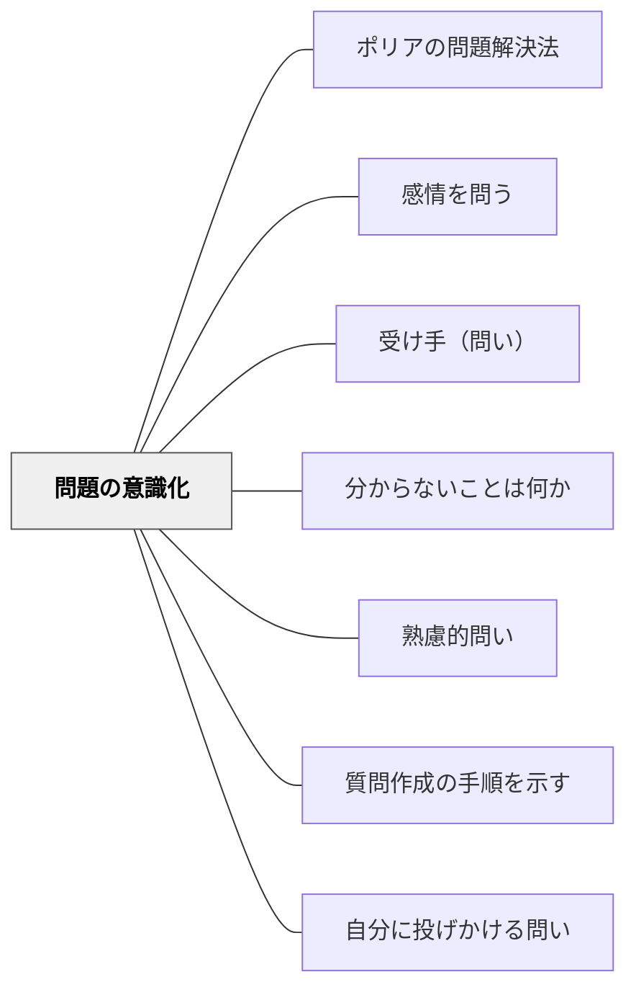

# 問題の意識化

> 「何が分からないか、何を知りたいか」を言語化させることで、問いを立てる前提となる認識のギャップを明確にする。

## 背景（Context）
問いを立てるためには、まず「自分が何を知らないか」「何が分からないか」に気づく必要がある。しかしこの「分からないことの自覚」は自然に生まれるものではなく、意識的に促さなければ学習者の内側にとどまったまま言語化されない。メタ認知の観点から、自分の理解状態を把握することが、問いを立てる前段階として不可欠である。

## 問題（Problem）
「分からないことが分からない」状態の学習者は、問いを立てることができない。あるいは、分かっていないことに気づかないまま授業が進み、後から重大なつまずきが発覚する。また、漠然とした「難しい」という感覚を、具体的な「この部分が分からない」という言語化に変えられないと、支援を求めることも難しくなる。

## 力のかたち（Forces）
- 分からないことを言語化するには、安全に「分からない」と言える環境が必要
- 「何が分からないか」の粒度が粗いと問いにならず、細かすぎると混乱する
- 理解のモニタリング（何を知っていて何を知らないか）はメタ認知の核心スキル
- KWLチャート（Know / Want to know / Learned）などのツールが有効

## 解決（Solution）
授業の最初や学習前に「今この話題について何を知っている？逆に何が分からない・疑問に思っている？」と問いかける。KWLチャートを使い、既知・知りたいこと・学んだことを整理させる。例えば、新しい単元に入る前に「この題名を見て、知っていること・疑問に思うことを書いてみよう」と活動させる。理解確認の場面では「一番モヤモヤしているのはどの部分？」と問い、分からない場所を特定させる。

## 結果（Consequences）
- 学習者が「分からない」を具体的に言語化する習慣が身につく
- 問いを立てる前段階が整い、より具体的で探究可能な問いが生まれやすくなる
- 教師が学習者のつまずきの場所を早期に把握でき、適切な支援が可能になる

## 関連パタン
- [[パタン/ポリアの問題解決法]]
- [[パタン/感情を問う]]
- [[パタン/受け手（問い）]]
- [[パタン/分からないことは何か]]
- [[パタン/熟慮的問い]] — 親パタン
- [[パタン/質問作成の手順を示す]] — 問題を意識化した後、問いの形にする手順が必要
- [[パタン/自分に投げかける問い]] — 自己への問いかけで理解状態をモニタリングする

## クラスター図

## Actionable Insight

- 単元の最初に「この話題について知っていることと、疑問に思うことをそれぞれ1つ書いてみよう」と問いかける——KWLの「K」と「W」を整理させるだけで問いを立てる前段が整う
- 授業の中盤に「今一番モヤモヤしているのはどの部分？」と1文書かせる——分からない場所を特定させることが教師の支援精度を高める
- 学習後に「今日の授業の前と後で、どこが分かるようになったか」を書かせる——学習前後の理解の変化を言語化させることがメタ認知の習慣をつくる

## 出典
- [[文献/熟慮的問いのパターンリスト（動画記録）]]
