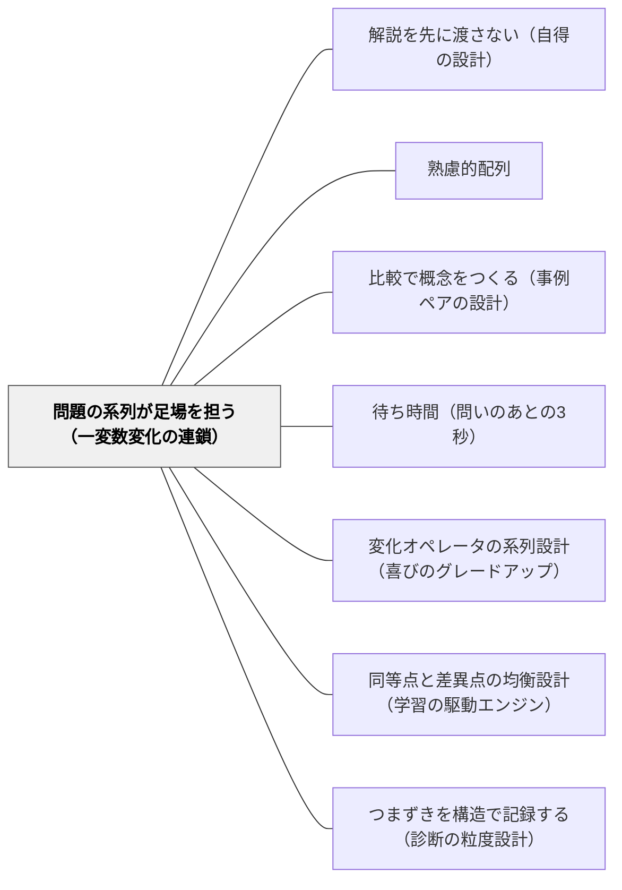

# 問題の系列が足場を担う（一変数変化の連鎖）

> 前の問題が次の問題の解説になる。そう設計できれば、外から足場を加える必要はない。

## 背景（Context）

外部足場を増やすほど授業は「手厚く」見える。線分図の枠を印刷したワークシート、穴埋め式の解答欄、問題ごとに添えられた解説コメント——支援の手応えは確かで、子どもはその時間に「できた」と感じる。しかし定期テストや翌週の授業で足場を外した途端、同型の問題が解けなくなる。

戸田城外（1930）『推理式指導算術』は、この構造に正反対の答えを出した。全3冊・合計600問以上にわたって、解説ゼロ、ヒントは「基本原形と比較せよ」の指さしのみ。解説を書かない理由は「書く必要がないように問題を並べた」からだと、桝田尚之（2006）は読み解く——「配列そのもの——次の問題が前の問題の解説を兼ねている」。

外部足場の肥大化は「今すぐ解かせたい」という動機から生まれる。問題の系列設計は「問題を解く経験の中に足場を埋め込む」という設計の転換を要求する。

## 問題（Problem）

外部足場（解説・ヒントカード・線分図の枠・穴埋めワークシート）を増やすほど、学習者は足場に依存する。足場を外した途端に解けなくなるのは怠惰ではない——足場が「あって当然」の環境で解く練習しかしていないからである。

この依存の構造は、増やすほど深まる。丁寧にしようとするほど自立を遠ざけるという、教師の善意の逆説がここにある。

## 力のかたち（Forces）

- **「今すぐ解けさせたい」vs「自分で解く力をつけたい」**：次の授業の正答率と3ヶ月後の保持は逆向きになりやすい
- **丁寧さ vs 自立**：丁寧な足場は「今この場」では子どもを助ける。しかし足場のない状況への転移を妨げる
- **設計コスト vs 指導コスト**：問題の系列を精緻に設計するには事前の教材研究がかかる。しかし一度設計すれば授業中のヒントが最小になる
- **順序の統制 vs 発見の余白**：系列を厳密にすると子どもの問いに応答しにくくなる。完全に整った系列が常に正解とは限らない

## 解決（Solution）

**問題を「一度に一箇所だけ変わる系列」として設計する。前の問題が次の問題の足場になり、外部足場なしに難度が上がれる。**

設計の原則は4つ。

**原則1：基本原形を置く**

系列の冒頭に「暗算で解けるほど容易」な問題を1問置く。戸田はこれを「基本原形」と呼んだ。基本原形は全系列の足場の土台である——ここが難しいと系列全体が崩れる。子どもが「これは分かる」と感じる出発点から始める。

**原則2：一度に一箇所だけ変える**

各問題で変化させる要素を1つに絞る。変化させる候補は：
- 数値（整数 → 小数 → 分数）
- 未知数の位置（□＋3＝7 → 3＋□＝7 → □＋□＝7）
- 場面（買い物 → 速さ → 割合）
- 条件の数（1条件 → 2条件 → 3条件）

1問で2つ以上を同時に変えると、学習者は「何が変わったのか」を判断できず、比較による自得が起きない。

**原則3：段階的に配列を外す**

戸田は全3冊でこの移行を実現した。
- 『その一』：難易度順に整列（配列が明示的な足場になっている）
- 『その二』：少し変動する（配列への依存を減らす）
- 『その三』：必ずしも難易度順でない（配列という足場自体が外れている）

系列設計は「教材の配列」という足場を段階的に外す設計でもある。

**原則4：外部足場を最初から必要としない設計**

系列が機能すれば、ヒントは「前の問題と比べよ」の指さしで足りる。解説を書かなくて済む。もし第3層（解説・worked example）が必要な問題が頻発するなら、それは基本原形か一変数の原則に問題がある——問題の系列に戻って再設計するサインである。

---

**算数の具体例1：「÷分数」の系列設計（一変数変化の連鎖）**

基本原形から始め、一度に一箇所だけ変えて系列を組む。

```
① 12 ÷ 4 ＝               ← 基本原形。整数÷整数
② 12 ÷ 2 ＝
③ 12 ÷ 1 ＝
④ 12 ÷ 1/2 ＝             ← 除数が「整数→1/2」。①③と比べると関係が見える
⑤ 12 ÷ 1/3 ＝
⑥ 12 ÷ 1/4 ＝
⑦ 6 ÷ 1/2 ＝              ← 被除数が変わる
⑧ 6 ÷ 2/3 ＝              ← 分子が1でない分数へ
```

子どもは③④を並べて「÷1と÷1/2で答えが倍になった」と気づく。教師の解説は不要——前の問題が解説を兼ねている。

---

**算数の具体例2：「速さ」の場面設計（未知数の位置を変える）**

```
① 時速4kmで3時間歩くと、何km進む？       ← 距離が未知
② 時速4kmで何時間歩くと、12km進む？      ← 時間が未知
③ 何kmで3時間歩くと、12km進む？          ← 速さが未知
④ 時速4kmで3時間歩いたとき、12kmは正しい？  ← 検証型
```

同じ数値・同じ場面で未知数の位置だけを変える。「どれが分かっていて、どれが分からないのか」を判断する力が、比較によって育つ。

## 結果（Consequences）

**利点**

- 外部足場への依存が生まれない——「系列を進む」こと自体が学習者の力を育てる
- ヒントが最小になる——「前の問題と何が違う？」の一言で子どもが動き始める
- 第3層（解説・worked example）が必要な場面が頻発したとき、それは系列設計の改善サインとして機能する。「なぜここで詰まるか」の診断ができる
- 教材ストックが蓄積すると授業の準備コストが下がる。一度設計した良い系列は何度でも使える

**注意点・リスク**

- 基本原形の設計が難しい——易しすぎると挑戦が生まれず、難しすぎると系列全体が崩れる
- 一変数に絞るコストがある——特に単元の中盤以降、複数の変化を組み合わせた問題へ移行するタイミングを見極める必要がある
- 系列通りに進めることへの固執は禁物——子どもの問い・つまずきが系列の外に出ることがある。そのときは系列を離れて応答する柔軟さが要る
- 配列が崩れると比較が成立しない——問題の順序を子どもが自由に変える場面では系列のメカニズムが機能しなくなる

## 関連パタン

- [[パタン/解説を先に渡さない（自得の設計）]] — 系列設計（本パタン）と、ヒントを渡す際の設計（自得の設計）は相補的——系列が機能すれば解説も最小で済む
- [[パタン/熟慮的配列]] — 易→難の配列原則（上位）と、一変数変化の連鎖（具体的メカニズム）。本パタンは熟慮的配列の「難易度次元」を算数問題設計に具体化した実装
- [[メタパタン/足場は消えるために組む（フェードアウト）]] — 外部足場を「外す時間設計」（フェードアウト）と「最初から最小化する問題設計」（本パタン）の分業
- [[パタン/比較で概念をつくる（事例ペアの設計）]] — 比較を「問題ペアで設計する」という共通点。比較軸の数を1に絞る点で一致。本パタンは系列全体の比較、事例ペアの設計は2事例の比較
- [[パタン/待ち時間（問いのあとの3秒）]] — 系列設計があって初めて「前の問題と比べよ」の問いが活きる。待つ姿勢は系列設計が前提になって機能する
- [[パタン/変化オペレータの系列設計（喜びのグレードアップ）]] — 一変数に絞る設計（本パタン）と、何をどの種別で変えるか設計する（変化オペレータ）の分業。両パタンを組み合わせて使う
- [[パタン/同等点と差異点の均衡設計（学習の駆動エンジン）]] — 一変数だけ変える設計は、同等点を保ちながら差異点を最小化する均衡設計の具体的実装。本パタンは「7〜8割同等点」という均衡を系列全体で実現する仕組み
- [[パタン/つまずきを構造で記録する（診断の粒度設計）]] — 一変数に絞った系列の設計（本パタン）と、どの変数で詰まったかを種別ごとに記録する設計（診断の粒度設計）は相補的——記録データが次の系列設計の修正根拠になる

## クラスター図



## Actionable Insight

- **次の単元の最初の問題を「暗算で解けるほど易しい」1問にする**——その問題が全系列の土台になる。難しすぎる基本原形は系列を崩す。まずここを見直す
- **教材プリントを作るとき、連続する2問で「何が1つ変わったか」を確認する**——変化が2つ以上あれば1問をキャンセルして系列を整理する。「1問で1変化」をチェックの基準にする
- **子どもが詰まった問題に第3層（解説）を渡す前に、問題の番号を指さして「1つ前と何が違う？」と1回だけ問う**——解説より先にこの一言。これで動ければ系列が機能している。動けなければ系列の設計に問題がある

## 出典

- 戸田城外（1930）『推理式指導算術』全3冊
- 桝田尚之（2006）「推理式指導の解明を中心に」『創価教育研究』第5号
