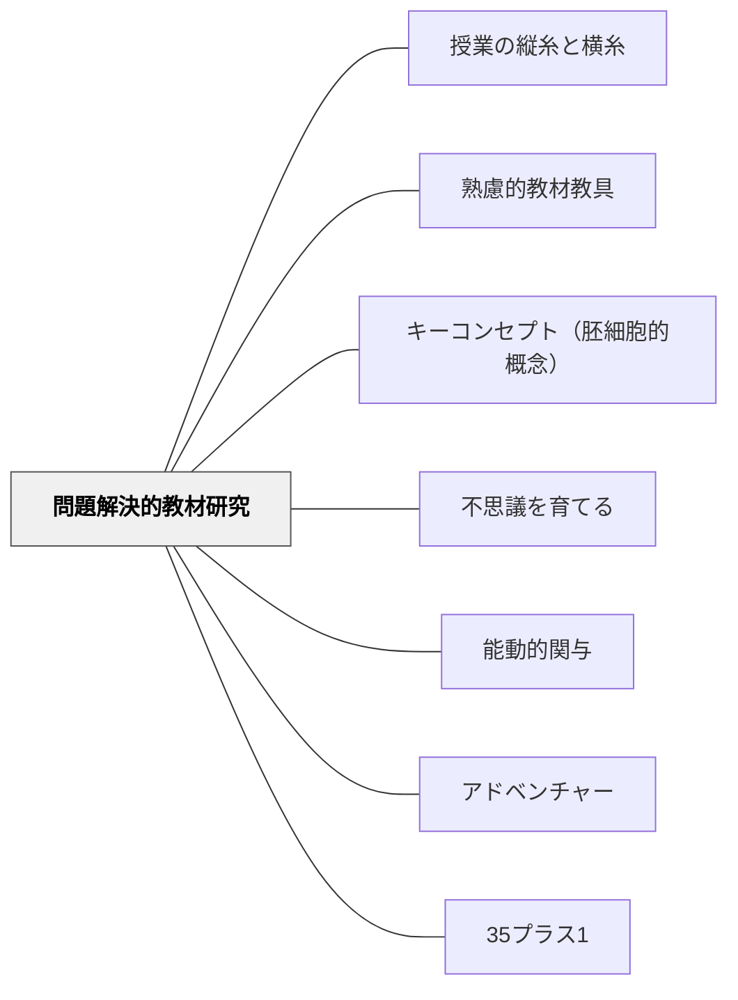

# 問題解決的教材研究

> 教材研究とは、教師自身の問題解決的な学びである——教師が「驚き・行き詰まり・解決」の体験をしたとき、子どもも同じ道を歩める授業が生まれる。

---

## 背景（Context）

教師が教材を「調べてまとめる」だけの教材研究と、教師が「問いをもって本気で追いかける」教材研究では、授業の質が根本から異なる。後者においては、教師自身が「なぜだろう」「どうして？」という感情とともに知識を獲得している。その感情の痕跡が授業に宿り、子どもに届く。

有田和正は「アンテナを張って引っ掛けておく」という言葉でこの姿勢を表現した。教師が日常から意識的にアンテナを張り、引っかかった疑問を教材の種として育てることが教材研究の出発点だ。

## 問題（Problem）

「授業に間に合わせるための教材研究」では、教師は解答を知っている状態で授業に臨む。すると教師は自然と「答えに向けて子どもを誘導する」構造（追い込み漁）をとりやすくなる。教材への本物の驚きも疑問も体験しないまま教えるとき、授業は「情報の伝達」にとどまり、子どもは学び手というより聴衆になる。

## 力のかたち（Forces）

- 教師が「わからない」「気になる」と感じた事象は、子どもも同じ反応をしやすい——共感の根拠になる
- 教材研究に時間をかけすぎると学習指導要領との接続を見失い、授業が成立しにくくなる
- アンテナを張ることは習慣であり、「今日から始める」スイッチが必要
- 教材への共感（人の営みへの感動）がなければ、知識の構造だけを教えることになる

## 解決（Solution）

**教師自身が「問い → 調べる → 行き詰まる → 決め手を見つける → 感動する」という問題解決のプロセスを実際に体験してから授業を設計する。その体験が授業の骨格になる。**

---

### 問題解決的教材研究の6ステップ

小倉が実際に行った「釜石の奇跡は奇跡ではない」の教材化事例：

| ステップ | 具体的な行動 |
|---------|------------|
| **①疑問をもつ** | TVニュースで中学生の「奇跡ではない」という言葉に衝撃を受ける |
| **②調べる** | 新聞記事・インターネット・震災関連本・特集番組DVDを視聴 |
| **③行き詰まる** | 調べ活動では解決の糸口が見つからない |
| **④決め手を見つける** | 地元TV局特集番組＋釜石市役所への実地取材 |
| **⑤驚き・感動・解決** | 「防災教育の必然だった」という理解。自分が感動する |
| **⑥教材化** | 自分の問題解決プロセスを子どもが追体験できる指導計画・資料を作成 |

**核心**：授業は「教師の問題解決的な学び」を子どもが追体験する場である。

---

### アンテナを張る——教材の種を日常から収集する

有田和正の言葉：「詳しく見なくても、ざーっと見て、つまりアンテナを張って引っ掛けておく」

アンテナが引っかかった教材候補の例（小倉の実践より）：

- 「**小金井阿波踊り**」——なぜ東京・小金井で阿波踊りが？
- 「**銀座のミツバチ**」——都市のビルの屋上でなぜ養蜂？
- 「**マグロの蓄養**」——「完全養殖」のはずなのに「養殖」と表示されている矛盾
- 「**開かずの踏切**」——日常の通勤体験から
- 「**三陸の魚がない**」——震災後の魚屋で発見

**実践的方法**：引っかかった記事はスクラップ、思いついたことはメモか録音。「少しずつストックしていく」ことが教材の貯蔵庫になる。

---

### シンプルな問いと解を設定する

教材にのめり込みすぎると「盛りすぎ授業」になる。授業に使う教材の**核心は [問い] と [解] の1セット**に絞り込む。

**例（イザ！カエルキャラバンの教材化）**：
- [問い] 国分寺市は、なぜ、イザ！カエルキャラバンを行っているのか？
- [解] 若い住民（親と子）の防災意識を高めるため

教材の要素が多くても、この [問い] と [解] だけに絞ると授業がパンクしない。

**資料の絞り込み目安**：中心資料1つに対して補助資料2〜3つが1時間の目安。

---

### 教材分析の4視点

教材を分析するとき、次の4つの視点を意識すると社会科的な深みが生まれる：

1. **事実を見る**：何が起きているか、どういう状況か
2. **人の営みを見る**：誰がどんな思いで働いているか
3. **社会的な意味・価値を考える**：なぜそれが重要なのか、社会的にどんな役割を果たしているか
4. **自分のかかわりを考える**：自分の生活・未来とどうつながるか

---

### 人の働きへの共感を大切にする

> 「人々の働き（営み）を通して社会を見るのが社会科。教師が共感しながら開発した教材は、子どもたちへ力強く訴えていくことになる。」——小倉勝登

「釜石の奇跡」の授業で子どもが振り返りに「自分の仕事に誇りをもてる人になりたい」と書いたのは、教師自身が防災に取り組んだ人たちへの共感を体験していたからだ。

---

## 結果（Consequences）

- 教師が本物の疑問と感動を経験した教材は、授業中の説明の「熱」が変わる
- 子どもが同じ問題解決のプロセスをたどれる授業構造が生まれる
- 「なぜ？」という疑問の連鎖が授業の骨格になるため、教師が答えに誘導しにくくなる
- ただし、問題解決的教材研究は時間と手間を要する——「今日の授業のために」では間に合わない
- 教材への没入と学習指導要領との接続を両立させる意識がなければ、魅力的だが目標未達の授業になる

## 関連パタン

- [[パタン/授業の縦糸と横糸]] — 問題解決的教材研究が生んだ「問い」を単元に織り込む設計パタン
- [[パタン/熟慮的教材教具]] — 教材の選択・吟味の上位パタン
- [[パタン/キーコンセプト（胚細胞的概念）]] — 教材の核心（[問い]と[解]）を最小単位で捉える
- [[パタン/不思議を育てる]] — 日常からの問いを持ち続ける教師のアンテナと共鳴する
- [[パタン/能動的関与]] — 教師が探究者として動いていること自体が授業の条件をつくる
- [[パタン/アドベンチャー]] — 「行き詰まり・驚き」を含む教師の学びが冒険の構造を持つ
- [[パタン/35プラス1]] — 教材研究の豊かさが「1×1を1×35に広げる」授業の質を下支えする

---

## クラスター図

## Actionable Insight

- **今週、気になった出来事をメモ1行残す**——教材候補のストック帳を作るのではなく、「今日気になった」を1行書く習慣から始める。アンテナは習慣によって育つ
- **次の単元の教材を1つ選び [問い] と [解] だけを書いてみる**——「この教材で子どもに問わせたい問いは何か」「その答え（解）は何か」だけを1行ずつ。これがシンプルな教材研究の最小単位
- **教材の中の「人」を探す**——社会的な仕組みや統計だけを調べるのではなく、「そこで働いている人は誰で、何を考えているか」を調べる。教師がその人に共感するとき、子どもも共感できる授業になる

---

## 出典
- [[文献/社会科教師の授業・学級づくり「仕掛け学」（小倉勝登）]]

小倉勝登（2020）『社会科教師の授業・学級づくり「仕掛け学」』東洋館出版社

> 「教材研究とは、教師自身の問題解決的な学びである」——小倉勝登
