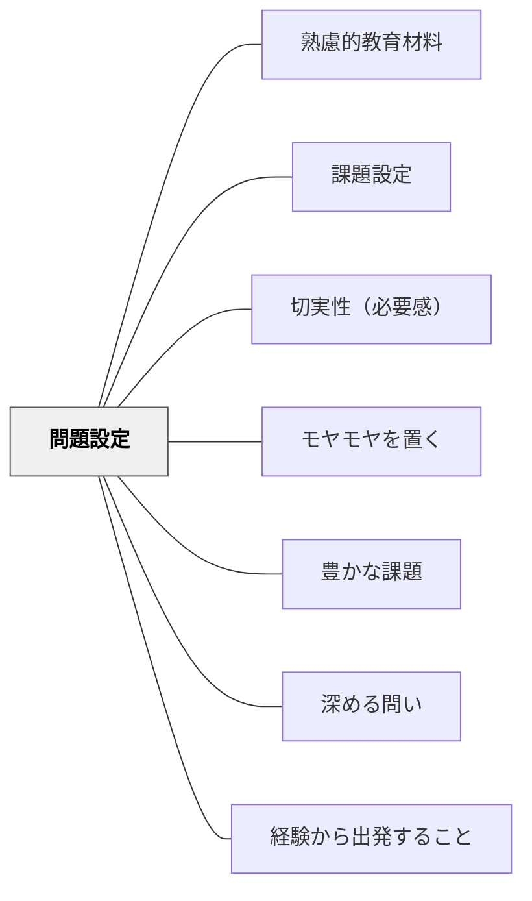

# 問題設定

> 何を解決するための教材かを問い、学習者が取り組む価値のある問題を設定する。

## 背景（Context）

教材設計の出発点として「どんな問題（課題）を解決するために学ぶのか」を明確にする。問題設定が適切であれば学習者の切実性・動機付けが高まる。PBL（Problem-Based Learning）・デザイン思考などでも問題の定義が最も重要とされる。

## 問題（Problem）

問題設定が曖昧または学習者にとって無関係だと、学習の動機が生まれない。

## 力のかたち（Forces）

- 良い問題設定は内発的動機を引き出す
- 問題は学習者の知識・経験と適切な乖離があるもの
- 過度に難しい問題は挫折を生む

## 解決（Solution）

**学習者が「これを解決したい・知りたい」と感じる問題を意図的に設定し、学習の出発点とする。生活・社会の実際の問題と結びつけることで切実性を高める。**

## 結果（Consequences）

- 学習者の動機付けが高まる
- 学習の目的が明確になる

## 関連パタン

- [[パタン/熟慮的教材教具]] — 親パタン
- [[パタン/課題設定]] — 問題を課題に変換する
- [[パタン/切実性（必要感）]] — 切実な問題設定
- [[パタン/モヤモヤを置く]] — 問題としてのモヤモヤ

- [[パタン/豊かな課題]] — 問題設定が豊かな課題の核心をつくる
- [[パタン/深める問い]] — 問題設定が深い探究の出発点になる
- [[パタン/経験から出発すること]] — 体験から問題を設定する

## クラスター図

## Actionable Insight

- 単元の冒頭に「今の生活でこれに困ったことはある？」と問いかけ、学習者の体験から問題を引き出す——生活との接続が切実性を生む
- 「これが解決したら誰が助かるか？」と問い、問題の受益者を具体的に描かせる——社会との接続が動機を高める
- 設定した問題を一文で書かせてから「これを解決したい？」と問い返す——自分ごとになっているかを確認してから活動に移る

## 出典

- 鈴木克明（2002）『教材設計マニュアル――独学を支援するために』北大路書房
