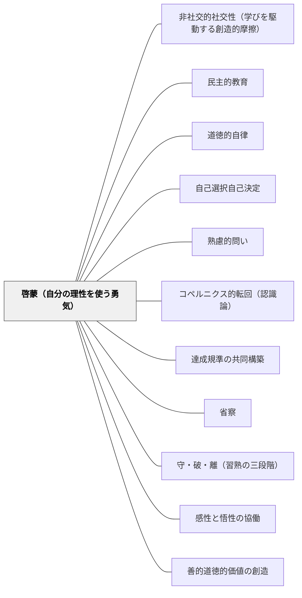

# 啓蒙（自分の理性を使う勇気）

> Sapere aude！——「知る勇気をもて！自分自身の理性を使う勇気をもて！」——カント『啓蒙とは何か』（1784）

---

## [Pattern Connection]

**カント（1784）『啓蒙とは何か』統合：**

- **哲学的基盤の提供**：カントの啓蒙概念（Aufklärung）は、教育の根本目的を「知識の伝達」でなく「理性の自立的使用」に置く視点を哲学的に根拠づける。「先生が言うから」「教科書に書いてあるから」ではなく、「自分が理解したから」で行動する学習者を育てることが啓蒙の教育的実践である
- **補強する既存パタン**：[[パタン/道徳的自律]] — 道徳的自律（「正しいから行う」）はカント実践哲学の核心であるが、啓蒙（「自分で考えてから行う」）はその前段階・認識論的条件。理性を使う習慣なしに真の道徳的自律はない
- **深化する既存パタン**：[[パタン/自己選択自己決定]] — 「自分で選ぶ」は啓蒙の最初の一歩。しかし啓蒙の意味での自律は選択肢の中から選ぶだけでなく、選択基準そのものを自分の理性で問い直すことまで含む
- **接続する概念**：[[概念/世界市民教育とパタン・ランゲージ]] — 真の公教育は国民の育成（国家への私的服従）でなく、世界市民として自ら考える能力の育成（理性の公的利用）を目指すという命題は、カントの啓蒙論に直接根拠を持つ
- **他のパタンへの波及**：[[パタン/批判的評価]] — 評価規準を学習者自身が問い直せることが啓蒙的評価実践。[[パタン/熟慮的問い]] — 「なぜ？」を問える場の設計は啓蒙の入口

---

## 背景（Context）

1784年、カントは「啓蒙とは何か」という問いに答えた。啓蒙（Aufklärung）とは、**人間が自分で招いた未成年状態（Unmündigkeit）から脱け出ること**だとカントは言う。

未成年状態とは「他者の指導なしには自分の理性を使えない状態」である。理性が欠けているためではない——**怠惰と臆病**が原因だ。他人の言葉に頼ることは楽であり、自ら考えることは苦労を伴う。だから多くの人が自ら好んで未成年状態に留まる。

これは教育現場でも起きている。「先生が言ったから」「点数が高かったから」「みんなと同じ答えだから」——このような理由で学習を進める子どもは、まだ未成年状態にある。知識を持っていても、それを自分の理性で問い直す力が育っていない状態である。

## 問題（Problem）

教育が知識・技能の伝達に終始するとき、学習者は他者（教師・教科書・テスト）の指導なしには判断できない状態が続く。「正解」を求めるが「問い」を立てられない、「従う」ことができるが「批判する」ことができない。

これはカントの言う未成年状態の教育的再生産である。学校が意図せず「怠惰と臆病を育てる」装置になる逆説。

## 力のかたち（Forces）

- 他者の指示に従うことは短期的に安全・効率的で、抵抗が少ない
- 自分で考えることは苦労を伴い、間違える危険がある——その危険を避けるのが臆病
- 「自分で考える」と宣言しても、習慣と制度が思考を外注させ続ける
- 革命的に変えようとしても、先入見が別の先入見に置き換わるだけ（啓蒙は段階的で内的なプロセス）
- カントが重要視した区別：**理性の公的利用**（公衆として自由に語る）と**私的利用**（役割として服従する）——学習者にとっては「探究者として問う場面」と「授業の流れに乗る場面」の区別に対応する

## 解決（Solution）

**学習者が「なぜそうなるか」を自分の理性で問い、その問いを公的に表明し、他者との対話で試す機会を繰り返し設計する。**

---

### 実践例①：「なぜ？」を問う習慣

授業の「まとめ」で「だから〜だ」と結論を言う前に「そもそもなぜそうなるのだろう」と問い直す1分間を設ける。教師が答えを与えるのでなく、子どもが問いを持ったまま次の授業へ進むことを許す。

---

### 実践例②：「先生が言うから」を問い返す

「先生が言ったからではなく、あなたはこれが正しいとどうして思う？」と問い返す習慣を持つ。根拠を問うのではなく「自分の理性で確かめているか」という問いである。

---

### 実践例③：理性の公的利用の練習

発表・プレゼン・作文を「職務としての報告」でなく「公衆に向けた自分の考えの表明」として位置づける。「正解を述べる」場でなく「自分の理性が辿り着いた考えを問う場」として設計する。

---

### 実践例④：公開性の原則の適用

評価規準を学習者に公開し、「なぜこの基準なのか」を一緒に考える機会を持つ。公開できない基準で評価することはカントの公開性の原則に反する——公開できる評価のみが正当である。

---

### 「共同で考える」実践

カントは「自分の思想を他者に伝達し、他者の思想を受け取る共同の思考なしには、どれほど正しく考えられるか」と問う。孤独な思考には限界があり、思考は対話の中で完成する。ペアワーク・グループ討論・授業後の振り返り共有は「共同で考える」実践である。

## 結果（Consequences）

- 「正解を探す」姿勢から「問いを立てる」姿勢への移行が起きる
- 権威（教師・教科書）への依存が減り、自分の理性で判断する習慣が育つ
- ただし、啓蒙は「先生が何も言わない」ことを意味しない——足場組みと問い返しを繰り返す教師の役割は重要
- 個人の啓蒙は時間がかかるが、「公衆」としての学習コミュニティが啓蒙されることは、自由な対話の場さえあれば不可避——一人が変わらなくとも場が変わることが大切

## 関連パタン
- [[パタン/非社交的社交性（学びを駆動する創造的摩擦）]]
- [[パタン/民主的教育]]

- [[パタン/道徳的自律]] — 啓蒙の倫理的帰結。理性を使う習慣が道徳的自律の前提
- [[パタン/自己選択自己決定]] — 自己決定は啓蒙の最初の一歩。啓蒙は選択基準まで問い直す
- [[パタン/熟慮的問い]] — 「なぜ？」を問える場の設計が啓蒙の入口。授業全体を動かす本質的問いの哲学的根拠
- [[パタン/コペルニクス的転回（認識論）]] — 啓蒙の認識論的基盤。「対象が学習者に従う」設計は学習者の理性を主体に置く
- [[パタン/達成規準の共同構築]] — 公開性の原則の教育的実践。評価規準を学習者と共に問い直し、公開することで正当な評価を実現する
- [[パタン/省察]] — 自己の思考・行動を問い直す省察は啓蒙のプロセスそのもの
- [[パタン/守・破・離（習熟の三段階）]] — 「守」（既成規範の習得）から「破」（批判的問い直し）への移行が啓蒙の実践形態
- [[パタン/感性と悟性の協働]] — カントの認識論的基盤。感性（経験・直観）と悟性（概念・理性）の協働なしに真の理解は成立しない
- [[パタン/善的道徳的価値の創造]] — 啓蒙によって立法された価値の実践

---

## クラスター図

## Actionable Insight

- 「先生がそう言うから」という発言に対して「あなた自身はどう思う？」と問い返す——その一言が未成年状態を崩す最も簡単な介入
- 授業の最後に「今日の学びで『なぜ？』と感じたことは何か」を1分で書かせる——問いを持つ習慣が啓蒙の土台になる
- 評価規準を授業の冒頭に学習者と共有し「なぜこれが大切かを考えてみよう」と一言添える——公開性の原則の実践であり、学習者の理性を評価の主体に引き込む
- 「みんなと違う答えを出す勇気」を褒める機会を意識的に作る——臆病（みんなと同じでいたい）が未成年状態の最大原因だから
- 学習者同士が「なぜそう思う？」「それはどこから言える？」と問い合う文化を育てる——これが「共同で考える」の教室版であり、思考が社会的プロセスであることを体現する

---

## 出典

Kant, I. (1784). *Beantwortung der Frage: Was ist Aufklärung?* 
邦訳: カント著, 中山元訳（2006）「啓蒙とは何か」『永遠平和のために／啓蒙とは何か 他３編』光文社古典新訳文庫.

→ 全体の文脈は [[文献/永遠平和のために・啓蒙とは何か 他３編（カント、中山元訳）]] を参照。

> 「啓蒙とは、人間が自分で招いた未成年の状態から脱け出ることである。……だから Sapere aude！ 自分自身の理性を使う勇気を持て！ これが啓蒙のスローガンである」——カント
