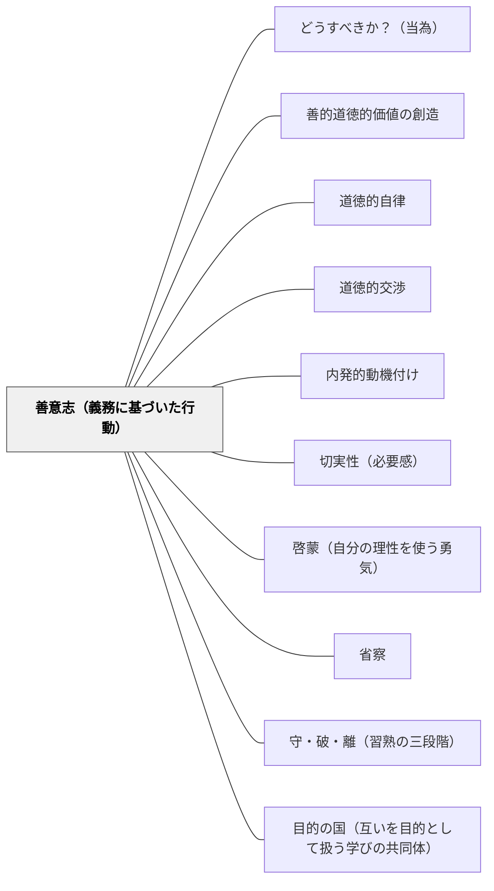

# 善意志（義務に基づいた行動）

> 「この世界で、あるいはそれを超えたところで、制限なしに善と呼びうるものは、善意志のほかにはない」——カント（1785）

---

## [Pattern Connection]

**カント（1785）統合：**

- **補強する既存パタン**：[[パタン/道徳的自律]] — 「善意志」は道徳的自律の内実。自律的に道徳法則を立法する意志が善意志であり、義務に基づいた行動がその外的表現。本パタンは道徳的自律の「動機の側面」を深掘りする
- **深化する既存パタン**：[[パタン/内発的動機付け]] — 内発的動機（SDT: 自律性・有能感・関係性）の中でも「義務に基づいた行動」の動機は最も深い自律的調整に位置する。外部から取り込まれた価値が真に内在化された状態に対応する
- **対比する既存パタン**：[[パタン/切実性（必要感）]] — 欲望・感情からくる切実性と、義務・道徳法則からくる切実性の区別。後者が根本的で持続的な動機になる
- **波及するパタン**：[[パタン/道徳的交渉]] — 「これは義務か、それとも傾向性か」という問いが道徳的交渉の深い形。[[パタン/啓蒙（自分の理性を使う勇気）]] — 善意志は啓蒙された理性の実践的帰結

---

## 背景（Context）

カントは、世界でただひとつ無条件に善いものとして「善意志（guter Wille）」を挙げた。知性・勇気・分別・富・名誉——これらは価値があるが、それを使う意志が善でなければかえって悪になりうる。豊かな才能を持つ詐欺師、勇敢な悪人を想像すれば分かる。

善意志は**結果によって評価されない**。結果が伴わなくても、善意志そのものは宝石のように自らの光で輝く。

同じ行為に見えても、動機によって道徳的価値はまったく異なる：
- **義務に反する行為**：不道徳
- **義務に適った行為（pflichtmäßig）**：結果は正しいが、動機は傾向性（利益・恐れ・好意）——道徳的価値なし
- **義務に基づいた行為（aus Pflicht）**：義務そのものを動機とする——道徳的価値あり

## 問題（Problem）

教育のほとんどが「義務に適った行為」を引き出す設計になっている。褒められたい・テストで点を取りたい・叱られたくない——これらの動機で正しい行動が現れるとき、それは道徳的価値を持たない。

外部の条件が変われば（先生が変わる、テストが終わる、誰も見ていない）、その行動は消える。義務に適った行為を大量に積み重ねても、義務に基づいた行為の習慣は育たない。

## 力のかたち（Forces）

- 外から見ると義務に適った行為と義務に基づいた行為は区別できない——評価が難しい
- 傾向性（感情・利益）は強力で短期的に機能する。義務に基づいた行為は苦しさを伴うことがある
- 疲れ果てた慈善家の例：感情から流れ出た善行は美しいが、義務から行う善行の方が道徳的に純粋——感情が消えても義務は残る
- 義務に基づいた行為を「外から強制」することは矛盾——「義務だから行いなさい」という命令では本質に届かない
- しかし義務の概念を見せる・問う・モデル示すことはできる

## 解決（Solution）

**「誰も見ていなくても、結果が出なくても、この行動をするか」という問いに向き合う体験を授業に意図的に組み込む。義務に基づいた行動の体験と省察を繰り返す。**

---

### 具体例①：「誰も見ていなくてもやるか」の問い

活動の後、「もし先生が見ていなかったらこれをするか？」「点数に関係なくてもこれをやるか？」と問い返す。答えを求めるのではなく、問いと向き合う時間を作る。自分の動機に気づくことが善意志教育の入口。

---

### 具体例②：結果より動機を問う評価

「うまくできた」を評価するだけでなく「なぜそれをしようとしたか」を問い、動機を言語化する機会を作る。「友達に褒められたかったから」と「そうするのが正しいと思ったから」は評価が違う。

---

### 具体例③：疲れ果てた慈善家のエピソード

感情が乗り気でないとき（疲れている・気分が悪い・楽しくない）でも、「それが正しいから」行う体験を小さくデザインする。帰りの掃除を疲れていてもやる、気分が乗らないときでも丁寧に話を聞く——その体験と省察が善意志を育てる。

---

### 具体例④：格率の言語化

「自分は今どんな行動原理で動いているか」（格率の言語化）を問う活動。「自分はこの場面で〇〇する」という個人的な行動原理を書き出し、それが普遍化できるか（全員がそうしたらどうなるか）を問う——定言命法の普遍化定式の入口。

---

## 結果（Consequences）

- 「誰も見ていなくてもやれる」習慣が育つ——外部の評価システムから独立した行動の土台
- 動機の省察が習慣になることで、自分の行動原理に気づく倫理的自覚が育つ
- ただし、善意志は「成果を度外視せよ」とは言わない——義務に基づいた行動の結果も大切にする統合的な姿勢が目標
- 義務に基づいた行動を「強制する」ことは矛盾——種を蒔き、問いを置き、モデルを示すことしかできない

## 関連パタン
- [[パタン/どうすべきか？（当為）]]
- [[パタン/善的道徳的価値の創造]]

- [[パタン/道徳的自律]] — 善意志は自律（自己立法）の動機的側面。本パタンと一体
- [[パタン/道徳的交渉]] — 「これは義務か、傾向性か」という問いが道徳的交渉の深化形態
- [[パタン/内発的動機付け]] — 最も深い自律的調整（義務内在化）はカントの「義務に基づいた行為」と対応する
- [[パタン/切実性（必要感）]] — 欲望的切実性より根本的な道徳的切実性（「これが義務だ」）
- [[パタン/啓蒙（自分の理性を使う勇気）]] — 善意志の前提としての啓蒙。理性を使わなければ義務を認識できない
- [[パタン/省察]] — 動機の省察（「自分は義務から動いているか」）が善意志を育てる実践
- [[パタン/守・破・離（習熟の三段階）]] — 義務に基づいた行動は「守」→「破」→「離」の過程で深まる
- [[パタン/目的の国（互いを目的として扱う学びの共同体）]] — 善意志が集まった共同体が目的の国の実現条件

---

## クラスター図

## Actionable Insight

- 活動の後に「もし誰も見ていなくても、点数に関係なくても、これをするか？」と問いかける——動機の省察が善意志を育てる最初の一歩
- 「うまくできた」だけでなく「なぜそれをしようとしたのか」を問い返す習慣を持つ——結果より動機への注意が義務に基づいた行動の種になる
- 自分が疲れているときや気分が乗らないとき、「それでもこれをする」体験を小さく作る——傾向性ではなく義務から動く感覚を身体で覚える
- 「全員がこの行動をしたらどうなるか」という問いを道徳的議論に使う——定言命法の普遍化テストを子ども向けに翻訳した実践
- 義務に基づいた行動を「命令しない」——問いを置き、モデルを示し、時間を待つ姿勢を保つ

---

## 出典

Kant, I. (1785). *Grundlegung zur Metaphysik der Sitten* [道徳形而上学の基礎づけ].
邦訳: カント著, 中山元訳（2012）『道徳形而上学の基礎づけ』光文社古典新訳文庫.

[[文献/道徳形而上学の基礎づけ（カント、中山元訳）]]

> 「この世界で、あるいはそれを超えたところで、制限なしに善と呼びうるものは、善意志のほかにはない」——カント
