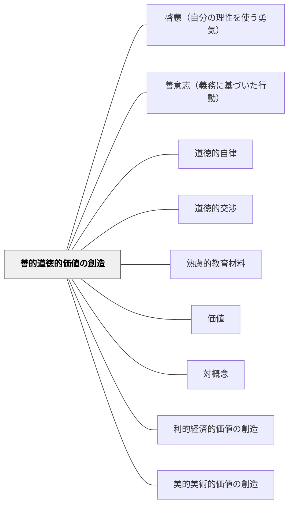

# 善的道徳的価値の創造

> 良いことをする・正しく生きる——道徳的・倫理的価値を育む教育材料。

---

## [Pattern Connection]

**カント（1785）道徳形而上学の基礎づけ統合：**

- **牧口とカントの接続**：牧口常三郎の「善」（社会的な正しさ・他者への利益）とカントの「善意志（guter Wille）」は、同じ問いに異なる角度から答える。牧口は「善は個人の行動の正しさと社会的な善の両面を持つ」と言い、カントは「善は結果でも才能でもなく、義務そのものを動機とする意志から生まれる」と言う。両者を合わせると：**善的価値の創造は、傾向性（褒められたい・得をしたい）ではなく義務から行動するときに初めて真の道徳的価値を持つ**
- **補強する観点**：道徳教材が「教訓の押しつけ」になる問題（本パタンの問題設定）を、カントは哲学的に説明する——外から押しつけられた道徳は「義務に適った行為」であって「義務に基づいた行為」ではない。道徳教材が有効なのは、学習者が自ら道徳的問いを立て、内側から価値を引き受けるときだけ
- **接続するパタン**：[[パタン/善意志（義務に基づいた行動）]] — 善的価値の創造の動機的根拠。義務から行動する意志が善的価値を実現する。[[パタン/道徳的自律]] — 道徳的価値の内面化（本パタンの「結果」）は道徳的自律の始まり
- **他のパタンへの波及**：[[パタン/道徳的交渉]] — 善悪・正義を問う道徳的交渉が、善的価値の創造の実践形態。定言命法の普遍化テストは道徳教材の問いとして使える

---

## 背景（Context）

牧口常三郎の3価値分類の一つ。道徳・特別活動・国語の文学教材など、倫理的・道徳的な価値観の形成に関わる教科・教材が善的価値の創造に関わる。善とは個人の行動の正しさだけでなく、社会的な善も含む。

## 問題（Problem）

道徳教材が「教訓を教える」形式になると、学習者の内省や感情的な葛藤を促さず、外から価値を押しつける形になりやすい。

## 力のかたち（Forces）

- 道徳的価値は教え込むより体験・省察から育つ
- 善悪の対概念が思考の起点になる
- 文脈・状況によって善の内容が変わる

## 解決（Solution）

**道徳的葛藤・倫理的ジレンマを含む物語・事例・体験を通じて、学習者が自ら道徳的価値を考え形成できる教材を設計する。**

## 結果（Consequences）

- 学習者が道徳的価値を内面化する
- 批判的思考と倫理的感受性が育つ

## 関連パタン
- [[パタン/啓蒙（自分の理性を使う勇気）]] — 善的価値の創造の認識論的前提。自分の理性で考えなければ善を内面化できない
- [[パタン/善意志（義務に基づいた行動）]] — 善的価値の創造の動機的根拠。傾向性でなく義務から行動するとき道徳的価値が生まれる
- [[パタン/道徳的自律]] — 善的価値の内面化の到達点。外から教えられた善が自律的に引き受けられた善に変わるプロセス
- [[パタン/道徳的交渉]] — 善悪・正義を問う道徳的交渉が善的価値の創造の実践形態
- [[パタン/熟慮的教材教具]] — 親パタン
- [[パタン/価値]] — 上位パタン
- [[パタン/対概念]] — 善悪の対比による理解
- [[パタン/利的経済的価値の創造]] — 有用性・役立ちという価値を生む兄弟パタン
- [[パタン/美的美術的価値の創造]] — 感動・美という価値を生む兄弟パタン
- [[概念/ラカン倫理学とカント倫理学]] — 善的価値と欲望・義務の倫理的接続
- [[メタパタン/価値を目標とする]] — 利・善・美の価値を目標とするメタパタン
- [[概念/教育の目標と力能]] — 価値の実現が力能の増大につながる
- [[概念/教養と人格形成]] — 価値の創造が人格形成の核心

## クラスター図

## Actionable Insight

- 道徳教材に「登場人物の選択は正しかったか？自分ならどうする？」という問いを必ずセットする——葛藤を問うことで教訓の押しつけではなく内省から価値が育つ
- 明確な答えのない倫理的ジレンマを提示しグループで話し合わせる——正解のない対話が道徳的感受性と批判的思考を同時に育てる
- 「善悪の対概念」を使って「この行動の逆は何か・なぜ悪いと言えるか」と問いかける——対比が価値の輪郭を明確にし、道徳的判断の根拠を言語化させる
- 「この登場人物は褒められたいからそうしたのか、それとも正しいからそうしたのか」を問う——義務に適った行為と義務に基づいた行為の区別が、道徳的価値の深さへの感度を育てる
- 道徳授業の最後に「今日学んだことを誰も見ていなくても実践するか？」と問いかける——外的評価なしに価値を体現しようとする意志（善意志）を問う最も直接的な設問

## 出典

牧口常三郎（1972）『牧口常三郎全集第4巻 創価教育学体系 上』聖教新聞社

Kant, I. (1785). *Grundlegung zur Metaphysik der Sitten* [道徳形而上学の基礎づけ].
邦訳: カント著, 中山元訳（2012）『道徳形而上学の基礎づけ』光文社古典新訳文庫.

→ [[文献/道徳形而上学の基礎づけ（カント、中山元訳）]]
