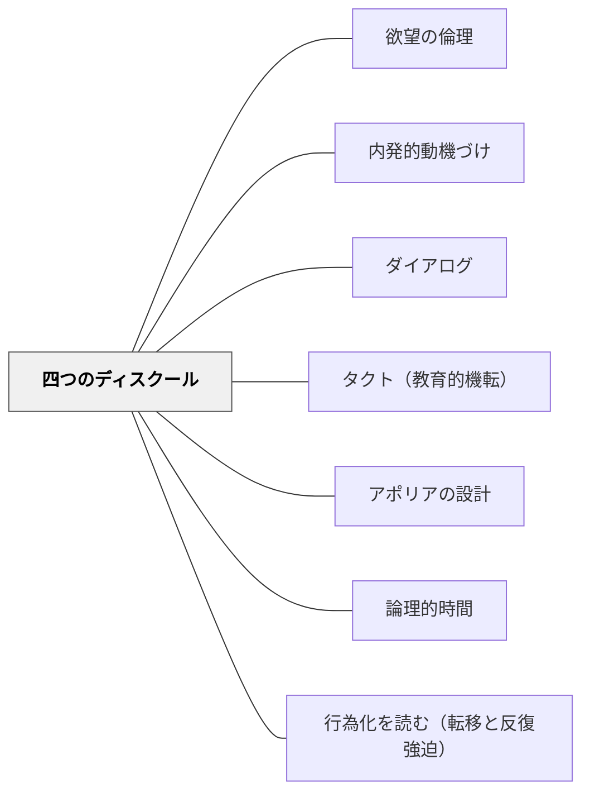

# 四つのディスクール

> 同じ内容を教えても、誰が・何の立場から・どう語るかによって、子どもの主体性は育つか育たないかが決まる。ラカンの「四つのディスクール」は、教師のスタンスを問う最も根本的な問いかけである。

---

## Pattern Connection

**ラカン入門（向井雅明）統合（2026-06-03）：**

ラカンのセミネールXVII「精神分析の裏面（L'envers de la psychanalyse）」（1969-70年）の「四つのディスクール」理論が本パタンの理論的基盤。

- **既存パタンとの関連**：[[パタン/内発的動機づけ]] が「やる気を引き出す」という欲求レベルを扱うのに対し、本パタンは「誰の欲望から学びが動くか」という欲望レベルを扱う。[[パタン/タクト（教育的機転）]] の「状況を読んで応答する」は分析家のディスクールの実践例
- **補強された点**：「教えること」と「学びを生み出すこと」が根本的に異なるスタンスから来ることが明確化した。「大学のディスクール」から「分析家のディスクール」への移行が、主体的学習者を育てる鍵
- **他のパタンへの波及**：[[パタン/欲望の倫理]] における「SSS（想定的知の主体）からの脱却」が四つのディスクールの分析家スタンスとして具体化

---

## 背景（Context）

教師は常に何らかの「語り方（ディスクール）」で子どもに関わっている。内容が同じでも、「誰が・何として・何のために語るか」によって、子どもの主体性が育まれるか、それとも服従と依存が強化されるかが変わる。

ラカンはセミネールXVII（1969-70年）で、社会的絆の形態を四つのディスクール（語り方・言説様式）として定式化した：**主人のディスクール**・**大学のディスクール**・**ヒステリーのディスクール**・**分析家のディスクール**。

各ディスクールは固定した「語る者の立場」ではなく、関係のパターン・社会的絆の構造を指す。

## 問題（Problem）

「いい授業をしているのに、子どもが主体的にならない」という教師の感覚。
「分かりやすく教えるほど、子どもが自分で考えなくなる」という逆説。

これはなぜ起きるか：
- 教師が「知識を持っている者」として語り続けることで、子どもは「受け取る者」として固定される
- 「正解を持っている者」への転移が、子どもの欲望を教師への依存として形成してしまう
- 子どもが「この先生が面白いと思っていること」を学ぶのではなく、「この先生が求める答えを出すこと」を学ぶ

## 力のかたち（Forces）

- 知識は語る者の立場によって、「受け取るべきもの」にも「自分で到達すべきもの」にもなる
- 教師がSSSとして機能し続ける限り、子どもは「教師の欲望の対象」になり続ける
- 教師自身が欲望の担い手であるとき（分析家スタンス）、子どもの欲望が触発される
- 「ヒステリーのディスクール」は、問いかけが主体を動かす構造を持つ——問いを放つことが欲望を生む
- 「主人のディスクール」は権威があれば機能するが、権威なき教師には使えない

## 解決（Solution）

**四つのディスクールの構造を理解し、場面に応じてスタンスを意図的に選択・移行する。特に「大学のディスクール」から「分析家のディスクール」への移行を、主体的学習の核として設計する。**

---

### 四つのディスクールの構造

ラカンのディスクール理論では、各ディスクールは4つの位置と4つの要素の組み合わせで成立する。教育実践のために簡略化して示す：

| ディスクール | 語る者の立場 | 対象 | 生み出されるもの | 特徴 |
|---|---|---|---|---|
| **主人のディスクール** | 主人（権威・権力者） | 奴隷（働く者） | 余剰享楽（剰余価値） | 命令・服従。権威があれば機能する |
| **大学のディスクール** | 知識（それ自体） | 対象a（学習者） | 分裂した主体（$） | 知識の伝達。「これが真理だ」という形で語る |
| **ヒステリーのディスクール** | 分裂した主体（$）| 主人（知っている者）| 知識 | 問いかけ・要求。「あなたは私の答えを知っているはずだ」 |
| **分析家のディスクール** | 対象a（欲望の原因） | 分裂した主体（$） | 知識の産出 | 学習者自身が知識を産出する。分析家は欲望の原因として機能 |

---

### 教育場面でのディスクールの読み方

**主人のディスクール**——規律・ルール・権威的指導

> 「こうしなさい。なぜなら私（あるいはルール）がそう言うからだ。」

- 機能する場面：明確な安全基準・緊急時・集団生活の最低限の規律
- 限界：権威（信頼・強制力）がなければ機能しない。「なぜ？」と問う主体は育たない
- 教育的問題：子どもが服従を学ぶが、欲望の主体にならない

**大学のディスクール**——知識の伝達・説明

> 「これが正解です。これが知識です。これを学べば分かります。」

- 機能する場面：系統的な知識の整理・分かりやすい解説・「まず知識を与える」局面
- 限界：子どもは「受け取る者」として固定される。知識が「先生が持っていて私に渡されるもの」になる
- 教育的問題：分かりやすい授業ほど、子どもが主体的に問いを持たなくなることがある

**ヒステリーのディスクール**——問いかけ・要求

> 「なぜこうなるの？　これはどういうこと？」

- 機能する場面：子どもが「なぜ？」と問い、教師に答えを求める状況そのものを使う
- 特徴：問いかける主体自身が欲望の主体になっている。教師への要求が知識を産出させる
- 教育的応用：子どもの「なぜ？」を、知識を渡す機会ではなく「もっと深く探らせる機会」として返す

**分析家のディスクール**——学習者が知識を産出する構造

> 教師は「欲望の原因（対象a）」として機能し、学習者自身が知識を産出する。

- 特徴：教師は答えを与えない。学習者が「自分で到達する」過程の触媒として機能する
- 機能する場面：探究学習・問題解決・主体的学習・「正解を求めるのではなく問いを深める」場面
- 教育的実践：
  - 「あなたはどう思う？」で返す
  - 「私には分からないが、一緒に考えたい」と示す
  - 教師が「面白い問い」を発し、答えを持っていない状態でともに探る
  - 子どもが出した答えを「正解/不正解」で裁かず、「それはどういうことだろう」で深める

---

### 「大学のディスクール」から「分析家のディスクール」へ

主体的学習者を育てる鍵は、この移行にある。

しかしこれは「教えないこと」ではない。適切な局面で大学のディスクール（知識の整理・解説）を使いながら、学びの核心部分では分析家のディスクール（欲望の触媒）に移行する。

**移行の実践的サイン**：
- 子どもが「先生、これはどういうこと？」と聞いてきたとき：大学（解説を渡す）→ ヒステリー+分析家（「あなたはどう思う？まず考えてみよう」）
- 探究の入口：大学（問題の文脈・前提知識を整理する）→ 分析家（問いを放り投げて消える）
- 振り返りの場面：ヒステリー（「どんな問いが生まれた？」）→ 分析家（その問いを保留したまま次へ）

---

### SSSとしての教師の位置

子どもは教師に「想定的知の主体（sujet supposé savoir / SSS）」を見る——「この先生は私の疑問に答える知識を持っている者」として教師を転移的に位置づける。

- SSSの立場を字義通りに引き受ける（「そうだ、私が知っている」）= 大学のディスクールへの固定
- SSSの立場を意図的に崩す（「私も知らない」「一緒に考えよう」）= 分析家のディスクールへの移行

SSSの崩壊が学びの転換点——「教師が知っているから学ぶ」から「自分が欲望するから探る」への移行。

---

## 結果（Consequences）

- 「分析家のディスクール」への移行によって、子どもが欲望の主体として知識を産出する経験が生まれる
- 「大学のディスクール」しか使わない授業では、子どもの依存を育て、主体的探究が起きにくい
- 四つのディスクールの意識的な使い分けは、授業設計に「誰が知識を産出するか」という問いを持ち込む
- ただし「分析家のディスクール」は「何も教えない」ではない——文脈と前提なき探究は混乱を生む。移行の設計が重要

## 関連パタン

- [[概念/欲望の構造（ラカン）]] — 欲望の大文字の他者からの形成・SSSの構造
- [[概念/享楽と反復]] — SSSの崩壊と分析の終わり
- [[パタン/欲望の倫理]] — 教師が欲望の主体であることと分析家スタンスの接続
- [[パタン/内発的動機づけ]] — 欲求ベースの動機づけとの比較
- [[パタン/ダイアログ]] — 分析家的ディスクールとしての対話
- [[パタン/タクト（教育的機転）]] — ディスクールの移行を可能にするタクト
- [[パタン/アポリアの設計]] — ヒステリーのディスクールとして宙吊りを設計する
- [[パタン/論理的時間]] — 分析家のディスクールの中で「結論の時」を設計する
- [[パタン/行為化を読む（転移と反復強迫）]] — 転移の読み方とSSSの関係
- [[文献/ラカン入門（向井雅明）]] — 四つのディスクールの主出典

---

## クラスター図

## Actionable Insight

- **「あなたはどう思う？」を一回使ってみる**——子どもが正解を求めて聞いてきたとき、一度だけ「あなたはどう思う？」と返してみる。「先生が知らないから返す」ではなく「あなた自身の答えを知りたいから」として聞く
- **探究の入口で消える**——単元の問いを提示した後、解説に入る前に「まずどうなると思うか、3分書いてみよう」と言って静かにする。教師が前に立たない時間を意図的に作る
- **「私も分からない問い」を一つ持ち込む**——今週の授業に、教師自身が「本当に分からない・面白いと思っている問い」を一つ持ち込む。子どもの前で「自分も知らない」状態を見せることが、SSSの崩壊の小さな実践

---

## 出典

向井雅明（2015）．*ラカン入門*．ちくま学芸文庫．

Lacan, J. (1969-70). L'envers de la psychanalyse. (Séminaire XVII)

> 「大学のディスクールから分析家のディスクールへの移行が、主体的学習者を育てる鍵である」——向井雅明（2015年）趣意

> 「患者が分析家を訪れるのは、分析家にSSSを想定しているからだ——私の享楽に関する知を保持している者を私は愛する」——向井雅明（2015年）要約
