# 四つの問いで作品を判断する

> 「どこが良かったか」から始めない。まず課題に応えているかを確かめ、次に全体としてどうかを言い切り、根拠はそのあとで言葉にする。順序そのものが、判断する力を育てる。

## [Pattern Connection]

石田（2021）は、サドラーが2010年の論文で示したピア・アセスメントの具体的な形式——**以下の順序による四つの質問**——を紹介している。ここでいうピア・アセスメントとは、石田の言葉を借りれば「評価エキスパティーズを育成することをもっぱら主眼として、**特別に構造化・設計された**評価活動」であり、教師の手が足りないところを仲間で補う活動ではない。

- **既存パタンとの関連**：本パタンは [[パタン/ピアフィードバック]] の一形式である。ただし目的が違う。ピアフィードバックが「フィードバックの量を増やす」「与える側も学ぶ」「相互に支え合う」を根拠にするのに対し、この四問は **判断力の育成そのもの** を目的として順序が設計されている。相手を助けることは副産物であって主眼ではない
- **補強点**：[[パタン/評価的専門性を渡す（ギルド知識のダウンロード）]] は「教師の質の概念を学習者へ渡す」という方向を示したが、渡すための **手順** までは示していなかった。四つの問いは、その手順の最小構成である。三つ目までが評価エキスパティーズの三側面（課題適合性・質・クライテリア）に、四つ目が1989年論文の第三条件（改善方略のレパートリの拡張）に対応する
- **修正点（このWiki内の矛盾を明示する）**：[[パタン/ピアフィードバック]] の Actionable Insight には「ピアフィードバックを始める前にルーブリックや達成規準を全員で確認する」とある。後期サドラーの立場からは、これは **逆** になる。クライテリアを先に配ると、判断が「規準表との照合作業」に置き換わり、判断力を育てる機会が消える。両者は矛盾するのではなく、**場面が違う**。安全に意見を言い合う練習をしたいときは規準を先に配ってよい。判断する力を育てたいときは、規準を後に置く。この使い分けを、教師が意識して切り替える
- **他パタンへの波及**：[[パタン/授業の中で批評する]] の「星と願い」は建設的な批評の文化をつくる枠組みであり、本パタンとは狙いが異なる（後述）。[[パタン/潜在規準と顕在規準（規準の浮き沈み）]] とは深く接続する——第三の問いは、潜在していたクライテリアを作品との出会いによって顕在化させる操作そのものである。[[パタン/ルーブリック]] は、本パタンを実施している最中には使わない

## 背景（Context）

サドラー（1989）は、学習改善のループが成立するために学習者が満たすべき三条件を挙げた。(1) 目指すべき質がどのようなものかを理解していること、(2) 目指すべき質と比較して自分の作品の質に適切な判断を下せること、(3) 自分の作品を修正する手段・方略の豊かなレパートリーを持っていること。最初の二つが **評価エキスパティーズ（evaluative expertise、評価熟達知）** をなす。

2010年の論文で、サドラーはこの評価エキスパティーズを三つの側面で語り直した。

| 側面 | 意味 |
|---|---|
| **課題適合性（task compliance）** | 課題規程（どんなジャンル・形式の作品を求めるかの指定）で要求された応答の種類と、実際に提出された応答の種類が一致しているか。課題が「批評」を求めているのに「説明」で書かれていれば、批評としての質はそもそも判断できない |
| **質（quality）** | 作品が全体として、どの程度うまくいっているかの度合い |
| **クライテリア** | 作品の質を判断する際に有用となる側面や次元。学習者自身がそれらに精通し、評価行為の中でそれらがどう働くかを深く理解している必要がある |

そして同じ論文で、この三つ＋改善レパートリを育てるための実践形式として、四つの質問からなるピア・アセスメントが提案された。サドラーは2013年の論考で、この四問による自身の教育実践（小エッセイ課題を文脈とするもの）を鮮明に描き出している。**そこではルーブリック等はもちろん用いられない。** 学生たちはピアの多様な作品に接し、四つの質問に則ってホリスティックに評価判断を下し、サドラーの導きのもとでそれを語り合う——石田はこれを **評価ディスコース** と呼んでいる。

## 問題（Problem）

**仲間の作品を見合う活動は、放っておくと「よかったよ」の交換になる。しかしそれを直そうとしてクライテリアの一覧を先に配ると、今度は判断そのものが消える。**

前者はよく知られている。心理的な抵抗と語彙の不足から、「ていねいでした」「くわしかったです」しか出てこない。だから多くの教室では、対策として観点表・チェックリスト・ルーブリックを先に配る。子どもは項目を順に見て、○△×をつけていく。付箋には具体的な言葉が並ぶようになる。活動は成立したように見える。

だが、そこで起きているのは **照合** であって **判断** ではない。サドラーは、これを評価エキスパティーズの発達を阻むものとして厳しく批判した。

> 多くの学生は、事前設定されたクライテリアを使用することが複雑な作品を評価する唯一の方法または最善の方法であるという原則を自明なものとしてしまっている。このような条件付けは、はっきりとアンラーンされなければならない。（Sadler, 2009, p.60）

理由は認識論のレベルにある。サドラーによれば、**クライテリアは具体物を知覚・認識することによって活性化され、潜在的なものから顕在的なものへと現れる**。つまりクライテリアは、作品と出会う前には学習者の中で潜在している。作品を見た瞬間に「あ、ここだ」と浮かび上がってくる。その浮かび上がりこそが、判断が生まれる場面である。**先に紙に印刷して配ってしまうと、この活性化の過程そのものが起こらない。** 顕在化する前から顕在しているものは、もう浮かび上がりようがない。

サドラーはさらに、ルーブリックが「全体としての質」の概念形成を妨げる点も指摘する。

> 特に、ルーブリックは、［中略］全体的な質よりも特定の質（クライテリア）を優先づける傾向があるために、全体としての質の概念形成を阻害する可能性がある。（Sadler, 2010, p.548）

問いはこうなる——**判断を「なんとなく」で終わらせず、しかも規準表の照合にも落とさずに、子どもに質の判断をさせるには、何をどの順で問えばよいか。**

## 力のかたち（Forces）

- **ホリスティックな判断の難しさ vs 分析的手続きの安全さ**：「全体としてどの程度うまくいっているか」を先に問うのは、子どもには難しい。「ふつう」「まあまあ」で止まる危険がある。一方、観点ごとに分けて問えば必ず何かは書ける。だがそれは判断の練習にならない
- **クライテリアを先に配る親切 vs 判断の機会の消失**：規準を先に示すのは不親切の反対であり、特に支援を要する子には情報として不可欠に見える。しかし先に示した瞬間、クライテリアが「浮かび上がってくる」経験は失われる
- **厳しい判断 vs 心理的安全**：第二の問いは、作品によっては「あまりうまくいっていない」という判断を生む。サドラー（1989）自身、仲間の作品を評価させる実践には、摩擦や反感を生まないための手立て、そして苦手な子どもが脅かされたり辱められたりしないための手立てが要ると条件を付けている
- **判断が先 vs 根拠が先**：日本の教室では「理由をつけて言いましょう」が定着しており、根拠のない判断は不作法とされやすい。この四問は逆に、**判断を先に言い切らせてから** 根拠を探させる。判断を保留したままでは根拠が活性化しないからだが、これは既存の指導観と正面からぶつかる
- **課題適合性の段階性**：低学年ほど、第一の問い（課題に応えているか）だけで十分な学習になる。「お話の続きを書く課題なのに、感想文になっている」を見分けられることは、それ自体が大きな評価力である。四問すべてを一度にやらせる必要はない
- **時間 vs 深さ**：一つの作品に四つの問いを丁寧に通すと、一時間で扱えるのは二〜三本である。多くの作品に触れさせたい要求と、一本を深く判断させたい要求がぶつかる

## 解決（Solution）

**次の四つの問いを、この順序のまま、掲示物とカードにして繰り返し使う。順序を入れ替えない。第三の問いより前に、クライテリアの一覧を配らない。**

> **①** この作品は、課題で言われたことに答えていますか。（課題適合性）
> **②** この作品は、**全体として**、どのくらいうまくいっていますか。（質）
> **③** どうしてそう思いましたか。（クライテリア）
> **④** どうすれば、この作品はぐんと良くなりますか。（改善レパートリ）

四つの問いの働きは次のとおり。

- **① 課題適合性**——これは **質の問題ではない**。「批評を書く課題に、説明を書いてしまっている」場合、そもそも批評としての質は判断できない。この問いは質の判断の手前にあるゲートであり、ここで引っかかっているうちは②以降に進めない。子どもにとっては最も入りやすい問いでもある
- **② 質**——ここが判断の中心である。**部分に分けずに、全体として言い切らせる。** 「かなりうまくいっている／まあまあ／あまりうまくいっていない」の三段程度でよい。ここで大事なのは正確さではなく、**根拠を言う前に判断を置く** ことである
- **③ クライテリア**——②の判断を正当化するために、適切なクライテリアを **呼び出させる**。「どこを見てそう思ったか」。ここで初めてクライテリアが言葉になる。判断が先、クライテリアは後。この順序で出てきた言葉が、その子のクライテリアになる
- **④ 改善レパートリ**——「どうすれば大幅に良くなるか」。細かい直しではなく、**ぐんと良くなる一手** を問う。他人の作品に対して改善方略を考えることが、自分の持ち手を増やす

### 順序が本質である理由

ルーブリックを使う評価は「クライテリアごとに判断する → 合成して全体の評価にする」という **分析的アプローチ** を取る。この四問はその逆で、「全体を判断する → その根拠となるクライテリアを挙げる」という **ホリスティック（全体的）／布置的なアプローチ** を取る。

サドラーは1989年の論文の段階では「形成的アセスメントではどちらの方法も用いることができる」としつつ、学習者が質について全体的に判断できるようになることが目指される、と書いていた。2000年代末以降はこの姿勢がさらに明確になり、ホリスティック優先が前面に出る。根底にあるのは、**知覚・認識することが根本的な評価行為であり、いかなるクライテリアにも先立つ** という認識である。サドラーはこの点でデューイを引き、価値づけは「生命衝動の直接的かつ説明不可能な反応と、我々の本性の非合理的部分から発する」と述べる。

だから「なんとなく良い」は、排除すべき未熟さではない。**言語化される前の判断が先にあり、③がそれを言葉に引き上げる。** ②で「なんとなく」と言った子に、教師が「なんとなくじゃなくて理由を言いなさい」と返すと、この過程は途切れる。返すべきは「なんとなくでいいよ。じゃあ、そのなんとなくは、この作品のどこを見て起きた？」である。

---

### 具体例1：五年生・意見文の相互評価を、四つの問いでやり直す

これまでは、意見文の交流の前に観点表（「主張がはっきりしているか」「理由が二つ以上あるか」「反対意見に触れているか」）を配っていた。子どもは表に沿って○をつけ、付箋に「理由が二つあってよかったです」と書く。三年続けてきたが、単元が終わると子どもたちには何も残っていなかった。翌年の同じ課題で、また同じ質の文章が出てくる。

やり方を変えた。観点表は配らない。**匿名の作品を一本だけ全員に配り、四つの問いを黒板に貼る。**

**①「この文章は、『自分の意見を、理由をつけて読む人に伝える』という今回の課題に答えていますか」**——ここで手が挙がる。「答えてる」「でも途中から、体験を書いたお話になってる」。意見文の課題に随筆が混ざっていることに、子どもたちが自分で気づく。ここまでで八分。

**②「全体として、どのくらいうまくいっていますか。三つから選んで、指で出してください」**——理由は言わせない。指を出させるだけ。教室の判断は割れる。割れたことを教師は歓迎する。

**③「どこを見て、そう思いましたか」**——ここから急に言葉が出る。「最初に言いたいことが書いてあるから、読みやすかった」「理由が二つあるけど、二つ目が一つ目とだいたい同じことを言ってる」「反対の人のことが書いてないから、押しつけられている感じがした」。三つ目は、教師の観点表には入っていたが、これまで子どもの口から出たことのない言葉だった。**観点表に印刷されていたときには読み飛ばされていた項目が、作品と出会うと自分の言葉として出てくる。**

教師はこれを板書し、「今日みんなが出した言葉」として残す。次の時間、子どもたちは自分の下書きをこの言葉で見る。

**④「どうすればぐんと良くなりますか」**——「二つ目の理由を、別のものに取りかえる」。細部の直しではなく構造の一手が出た。

---

### 具体例2：教科ごとの言い換え

四つの問いは抽象的すぎると子どもに届かない。教科と学年に合わせて言い換え、掲示を教科ごとに用意する。**順序と、③が②より後に来ることだけは崩さない。**

| | 作文・意見文 | 図工 | 算数の説明 | 体育（動画） |
|---|---|---|---|---|
| **①課題適合性** | 「今日書くと決めたもの（意見文）になっている？」 | 「テーマは『動きのある生き物』。動いてる？」 | 「聞かれているのは『なぜそうなるか』。答えているのは『なぜ』？　それとも『やり方』？」 | 「今日の技はマット運動の前転。前転をしている？」 |
| **②質** | 「全体として、どのくらい読む人に伝わる？」 | 「全体として、どのくらいうまくいっている？」 | 「全体として、読んだ人は同じやり方でできそう？」 | 「全体として、どのくらいうまくいっている？」 |
| **③クライテリア** | 「どこを見てそう思った？」 | 「どこを見てそう思った？」 | 「どこを見てそう思った？」 | 「どこを見てそう思った？」 |
| **④改善** | 「どこを変えると、ぐんと良くなる？」 | 「一か所だけ直せるとしたら、どこ？」 | 「一文足すとしたら、どこに何を足す？」 | 「次の一回で、どこを変える？」 |

③は全教科で同じ言葉にしておくとよい。子どもは「どこを見てそう思った？」を、やがて自分に向けて言うようになる。

---

### 具体例3：②で厳しい判断が出たときの手立て

第二の問いは、作品によっては「あまりうまくいっていない」を生む。これを避けようとして②を骨抜きにすると（「良いところを探しましょう」に変えてしまうと）、パタン全体が崩れる。避けるのではなく、**安全に成立させる条件を先に作る**。

- **最初の数回は、学級の子どもの作品を使わない**。教師が書いた作品、あるいは他学年・過年度の匿名作品を使う（[[パタン/質の幅ぜんぶに出会わせる（作品の束）]]）。判断の対象が誰のものでもないとき、子どもは驚くほど率直に、そして丁寧に判断する
- **「この作品は」と言う。「この人は」と言わない。** 教師が最初にこの言い換えを実演し、子どもが「この人、〜」と言ったら、その場で「この作品は、ね」と静かに置き換える。二週間で子どもの語彙が変わる
- **教師が自分の作品を混ぜ、②で低い判断を受けてみせる。** 「先生のこれ、ぐんと良くするにはどうする？」と④まで通す。判断されることが安全であるとは、説明ではなく実演で伝わる
- **自分の作品を出すのは、他人の作品で四問を十分に回してから。** 順序は「誰のでもない作品 → 仲間の作品 → 自分の作品」（[[パタン/自分の学習物が学級で批評される]] は、この最後の段階に位置する）

---

### 具体例4：低学年は①だけでよいという段階性

二年生に「全体としてどのくらいうまくいっているか」を問うても、多くは「じょうず」で止まる。ここで無理に②③を回すより、**①だけを繰り返す** ほうが評価力は育つ。

「今日のめあては『おはなしのつづきを書く』でした。この作品は、つづきを書いていますか。それとも、かんそうを書いていますか」——課題適合性は、質の判断より前にあり、二年生にも判断できる。しかもこれは大人になっても効き続ける問いである（会議資料が「提案」を求められているのに「報告」になっている、など）。

②は「よくできている／まあまあ／もうすこし」の三枚のカードを、理由なしで置かせるところから始める。③は年間を通して少しずつ。**四問を全部やることが目的ではない。**

---

### 自己教育での適用例：数学の自分の答案に四問を通す

大人の自己学習でも、この四問はそのまま使える。数学の問題を解いたあと、解答をすぐ見ずに、自分の答案に対して順に問う。

**①** この答案は、問題が要求していることに答えているか（「示せ」なのに「計算しただけ」になっていないか。これは大人でも頻繁に外す）。**②** 全体として、この答案はどのくらいうまくいっているか——ここで模範解答を見ない。見てしまうと判断が模範解答との差分の確認に置き換わり、判断の練習が消える。**③** どこを見てそう思ったか。「途中で条件を使った場所が自分でも思い出せない」「最後の一行が飛んでいる」。**④** どこを直せばぐんと良くなるか。

模範解答を開くのは④のあとである。順序を守ると、模範解答は「正解」ではなく **自分の判断の答え合わせ** になる。ずれていた場合、ずれていたのは答えではなく **判断の仕方** であり、そこが学ぶべき場所になる（[[パタン/評価的専門性を渡す（ギルド知識のダウンロード）]] の具体例2と同じ構造を、自分一人で行っている）。

---

### 特別支援の視点：②の難しさと、③の恩恵

「全体として」という問いは、部分から全体を統合することに困難がある子どもにとって、四問の中で最も高い壁になる。ここで支援を入れる場所は②であって、③ではない。

- ②に **物理的な足場** を置く。三色のカード（青＝かなりうまくいっている／黄＝まあまあ／赤＝もうすこし）を用意し、言葉ではなくカードを置かせる。判断を口頭で言語化する負荷と、判断そのものの負荷を切り離す
- ②の前に **作品を通しで一度読む・見る時間** を明示的に取る（「今から一分、最初から最後まで見ます。まだ何も書きません」）。全体を見る時間を確保しないまま②を問うと、最初に目に入った部分の印象が全体の判断になる
- ③は逆に、支援を要する子にとって **恩恵の大きい問い** である。観点表を先に配ると、抽象語（「構成」「表現の工夫」）の理解が壁になって参加できない。しかし「どこを見てそう思った？」は、指をさせば答えられる。**指さしが根拠になる。** 教師はそれを「なるほど、ここの一文を見たんだね」と言葉に翻訳して板書する。抽象語を理解してから参加するのではなく、参加しながら抽象語が育つ順序になる

## 結果（Consequences）

**利点**

- **判断が「なんとなく」から言葉へ引き上げられる**——③が②の後に来ることで、言語化以前の判断が失われずに言葉になる。順序を逆にすると、この引き上げは起こらない
- **クライテリアが子どもの持ち物になる**——教師が印刷して配った観点は「先生が言ったこと」だが、作品を見て自分から出てきた観点は自分の目になる。同じ言葉でも所有者が違う
- **評価ディスコースが育つ**——四問を繰り返すと、学級に判断を語る共通の話法ができる。「これは①はいいけど②がまだ」という会話が成立するようになる
- **課題適合性という視点が手に入る**——質の前に「そもそも問われたことに答えているか」を見る習慣は、教科を超えて働く。テストの記述問題、社会に出てからの文書、いずれにも効く
- **教師のフィードバック量が減っても学習が回る**——判断を子どもが担うようになると、教師は判断そのものではなく判断のずれを扱う仕事に移る

**注意点・リスク**

- **順序を崩すと別物になる**——③を②の前に出した瞬間、これはルーブリック評価に戻る。忙しい時期ほど「先に観点を言ったほうが速い」誘惑が働く。掲示物に番号を大きく振っておく
- **②で止まる学級がある**——「まあまあ」しか出てこない状態が続くとき、原因はたいてい作品の幅の狭さである。すべての作品が似た質だと、②に差が生まれず判断の練習にならない。[[パタン/質の幅ぜんぶに出会わせる（作品の束）]] とセットで使う
- **心理的安全が先に要る**——具体例3の条件を満たさずに②を問うと、傷つきが生まれる。サドラー（1989）自身が付けている条件であり、省略できない
- **④が細部の直しに落ちやすい**——「漢字が間違っている」「もう少していねいに」。④は **大幅な改善** を問うている。「一か所だけ直せるとしたら」「作り直すとしたらどこから」と言い換えて、構造レベルに引き上げる
- **成績と結びつけない**——四問はあくまで判断を育てる場面のものである。ここでの②を評定に使うと、子どもは判断を戦略的に歪める（[[パタン/評定（成績評価）]]）
- **教師自身が目利きである必要がある**——③で出てきた子どもの言葉のうち、どれが質に関わる観点でどれが表面的かを、教師が見分けて拾わなければならない。サドラーの方法論は、導き手が鑑識眼を持つことを前提にしている。この前提が満たされない領域では、まず教師が作品を集めるところから始める（[[パタン/エクセレンスの収集家]]）

## 関連パタン

- [[パタン/質の幅ぜんぶに出会わせる（作品の束）]] — 対になるパタン。四つの問いを通す **素材** をどう用意するか。質の幅がなければ②に差が生まれない
- [[パタン/ピアフィードバック]] — 上位。本パタンはその一形式だが、目的が「相互支援・量の確保」ではなく「判断力の育成」に絞られており、規準を先に配らない点で運用が逆になる
- [[パタン/授業の中で批評する]] — 「星と願い」は建設的な批評の文化をつくる枠組み。本パタンは良い点から入らず、課題適合性→全体の質→根拠の順で **評価エキスパティーズの育成** を狙う点が異なる
- [[パタン/評価的専門性を渡す（ギルド知識のダウンロード）]] — 上位の原理。本パタンは、その「渡す」を実行するための最小の手順
- [[パタン/潜在規準と顕在規準（規準の浮き沈み）]] — 第三の問いの機構そのもの。潜在していたクライテリアが作品との出会いで顕在化する
- [[パタン/ルーブリック]] — 本パタンの実施中には **使わない** もの。ルーブリックは分析的アプローチ、本パタンはホリスティック／布置的アプローチを取る
- [[パタン/実例を比べて分析する]] — 複数の作品を比べて質を抽象する手法。四つの問いは、その比較を「判断→根拠」の順に構造化したもの
- [[パタン/自分の学習物が学級で批評される]] — 四問の対象を自分の作品にする段階。誰のでもない作品→仲間の作品→自分の作品という順序の最終段
- [[パタン/到達レベルの自己評価]] — 四問を自分の作品に向けたときの形。②を自分でつけてから教師の判断と照らす
- [[パタン/自己内フィードバック]] — 目的地。四問が内面化され、制作中に自分へ問えるようになった状態
- [[パタン/制作しながら質を判断する（産出中のモニタリング）]] — 四問が完成後ではなく制作中に働くようになった段階
- [[パタン/思考や表現のよさを問う]] — 第三の問い「どこを見てそう思った？」の日常版。評価的な語彙を育てる
- [[パタン/評定（成績評価）]] — 四問の②を評定に使わないこと。判断を育てる評価と認定のための評価は場面を分ける
- [[概念/質的判断（曖昧な規準とメタ規準）]] — 四問が扱っている判断の中身。公式に還元できない判断とは何か
- [[概念/評価エキスパティーズ（課題適合性・質・クライテリア）]] — ①②③が対応する三側面の概念ページ
- [[概念/鑑識眼（コノサーシップ）]] — 四問が育てようとしているものの名前
- [[パタン/質の根拠を見えるようにする（伝えることからの脱却）]] — 四問が拠って立つ原理。「伝えること」から「根拠を見て理解してもらうこと」へ
- [[文献/ロイス・サドラーによる形成的アセスメント論の検討（石田智敬, 2021）]] — 出典の文献ページ
- [[文献/Formative Assessment and the Design of Instructional Systems（Sadler）]] — ④が対応する第三条件を論じた1989年論文

- [[パタン/採点の形を中身の形に合わせる（構造的忠実性）]] — 合計しないことを選んだときの具体的な代替手続き。全体を先に判断し、規準は後から言葉にする

## クラスター図

```mermaid
flowchart LR
    ne59b9be381a4e381aee5958fe38184e381a7e4bd9ce59381e38292e588a4e696ade38199e3828b["四つの問いで作品を判断する"]
    ne8b3aae381aee5b985e3819ce38293e381b6e381abe587bae4bc9ae3828fe3819be3828befbc88e4bd9ce59381e381aee69d9fefbc89["質の幅ぜんぶに出会わせる（作品の束）"]
    ne38394e382a2e38395e382a3e383bce38389e38390e38383e382af["ピアフィードバック"]
    ne68e88e6a5ade381aee4b8ade381a7e689b9e8a995e38199e3828b["授業の中で批評する"]
    ne8a995e4bea1e79a84e5b082e99680e680a7e38292e6b8a1e38199efbc88e382aee383abe38389e79fa5e8ad98e381aee38380e382a6e383b3e383ade383bce38389efbc89["評価的専門性を渡す（ギルド知識のダウンロード）"]
    ne6bd9ce59ca8e8a68fe6ba96e381a8e9a195e59ca8e8a68fe6ba96efbc88e8a68fe6ba96e381aee6b5aee3818de6b288e381bfefbc89["潜在規準と顕在規準（規準の浮き沈み）"]
    ne383abe383bce38396e383aae38383e382af["ルーブリック"]
    ne5ae9fe4be8be38292e6af94e381b9e381a6e58886e69e90e38199e3828b["実例を比べて分析する"]
    ne887aae58886e381aee5ada6e7bf92e789a9e3818ce5ada6e7b49ae381a7e689b9e8a995e38195e3828ce3828b["自分の学習物が学級で批評される"]
    ne588b0e98194e383ace38399e383abe381aee887aae5b7b1e8a995e4bea1["到達レベルの自己評価"]
    ne887aae5b7b1e58685e38395e382a3e383bce38389e38390e38383e382af["自己内フィードバック"]
    ne588b6e4bd9ce38197e381aae3818ce38289e8b3aae38292e588a4e696ade38199e3828befbc88e794a3e587bae4b8ade381aee383a2e3838be382bfe383aae383b3e382b0efbc89["制作しながら質を判断する（産出中のモニタリング）"]
    ne6809de88083e38284e8a1a8e78fbee381aee38288e38195e38292e5958fe38186["思考や表現のよさを問う"]
    ne8a995e5ae9aefbc88e68890e7b8bee8a995e4bea1efbc89["評定（成績評価）"]
    ne8b3aae381aee6a0b9e68ba0e38292e8a68be38188e3828be38288e38186e381abe38199e3828befbc88e4bc9de38188e3828be38193e381a8e3818be38289e381aee884b1e58db4efbc89["質の根拠を見えるようにする（伝えることからの脱却）"]

    ne59b9be381a4e381aee5958fe38184e381a7e4bd9ce59381e38292e588a4e696ade38199e3828b --- ne8b3aae381aee5b985e3819ce38293e381b6e381abe587bae4bc9ae3828fe3819be3828befbc88e4bd9ce59381e381aee69d9fefbc89
    ne59b9be381a4e381aee5958fe38184e381a7e4bd9ce59381e38292e588a4e696ade38199e3828b --- ne38394e382a2e38395e382a3e383bce38389e38390e38383e382af
    ne59b9be381a4e381aee5958fe38184e381a7e4bd9ce59381e38292e588a4e696ade38199e3828b --- ne68e88e6a5ade381aee4b8ade381a7e689b9e8a995e38199e3828b
    ne59b9be381a4e381aee5958fe38184e381a7e4bd9ce59381e38292e588a4e696ade38199e3828b --- ne8a995e4bea1e79a84e5b082e99680e680a7e38292e6b8a1e38199efbc88e382aee383abe38389e79fa5e8ad98e381aee38380e382a6e383b3e383ade383bce38389efbc89
    ne59b9be381a4e381aee5958fe38184e381a7e4bd9ce59381e38292e588a4e696ade38199e3828b --- ne6bd9ce59ca8e8a68fe6ba96e381a8e9a195e59ca8e8a68fe6ba96efbc88e8a68fe6ba96e381aee6b5aee3818de6b288e381bfefbc89
    ne59b9be381a4e381aee5958fe38184e381a7e4bd9ce59381e38292e588a4e696ade38199e3828b --- ne383abe383bce38396e383aae38383e382af
    ne59b9be381a4e381aee5958fe38184e381a7e4bd9ce59381e38292e588a4e696ade38199e3828b --- ne5ae9fe4be8be38292e6af94e381b9e381a6e58886e69e90e38199e3828b
    ne59b9be381a4e381aee5958fe38184e381a7e4bd9ce59381e38292e588a4e696ade38199e3828b --- ne887aae58886e381aee5ada6e7bf92e789a9e3818ce5ada6e7b49ae381a7e689b9e8a995e38195e3828ce3828b
    ne59b9be381a4e381aee5958fe38184e381a7e4bd9ce59381e38292e588a4e696ade38199e3828b --- ne588b0e98194e383ace38399e383abe381aee887aae5b7b1e8a995e4bea1
    ne59b9be381a4e381aee5958fe38184e381a7e4bd9ce59381e38292e588a4e696ade38199e3828b --- ne887aae5b7b1e58685e38395e382a3e383bce38389e38390e38383e382af
    ne59b9be381a4e381aee5958fe38184e381a7e4bd9ce59381e38292e588a4e696ade38199e3828b --- ne588b6e4bd9ce38197e381aae3818ce38289e8b3aae38292e588a4e696ade38199e3828befbc88e794a3e587bae4b8ade381aee383a2e3838be382bfe383aae383b3e382b0efbc89
    ne59b9be381a4e381aee5958fe38184e381a7e4bd9ce59381e38292e588a4e696ade38199e3828b --- ne6809de88083e38284e8a1a8e78fbee381aee38288e38195e38292e5958fe38186
    ne59b9be381a4e381aee5958fe38184e381a7e4bd9ce59381e38292e588a4e696ade38199e3828b --- ne8a995e5ae9aefbc88e68890e7b8bee8a995e4bea1efbc89
    ne59b9be381a4e381aee5958fe38184e381a7e4bd9ce59381e38292e588a4e696ade38199e3828b --- ne8b3aae381aee6a0b9e68ba0e38292e8a68be38188e3828be38288e38186e381abe38199e3828befbc88e4bc9de38188e3828be38193e381a8e3818be38289e381aee884b1e58db4efbc89

    classDef hub fill:#f0f0f0,stroke:#555,color:#000,font-weight:bold
    class ne59b9be381a4e381aee5958fe38184e381a7e4bd9ce59381e38292e588a4e696ade38199e3828b hub
```

## Actionable Insight

- **四つの問いをA3で掲示し、番号を大きく振る**——①課題に答えている？　②全体としてどのくらいうまくいっている？　③どこを見てそう思った？　④どこを変えるとぐんと良くなる？　番号を大きくするのは、順序が本質だからである
- **次の相互評価では、観点表を配らずに始める**——配る予定だった観点表は手元に持っておき、③で子どもから出た言葉と突き合わせる。子どもが出さなかった観点は、次の時間に別の作品で扱う。**先に配らない、後で照らす**
- **②は理由なしで、指かカードで出させる**——「三本指ならかなりうまくいっている、二本ならまあまあ、一本ならもうすこし。せーの」。理由を言わせるのは③に入ってから。判断と言語化を分ける
- **「なんとなく」を歓迎する台詞を用意しておく**——「なんとなくでいいよ。そのなんとなくは、この作品のどこを見て起きた？」。この一文が、判断を潰さずに言葉へ引き上げる
- **最初の三回は、学級の子どもの作品を使わない**——教師が書いた作品か、過年度の匿名作品で回す。安全が確認されてから、仲間の作品に移る
- **④に「一か所だけ直せるとしたら」を足す**——細部の直しの列挙を防ぎ、大幅な改善の一手に絞らせる
- **自分の答案でやってみる**——教師自身が、研究授業の指導案や学級通信の下書きに四問を通してみる。②を先に言い切ってから③を書く感覚が分かると、子どもへの返し方が変わる

## 出典

石田智敬（2021）「ロイス・サドラーによる形成的アセスメント論の検討――学習者の鑑識眼を錬磨する――」『教育方法学研究』第46巻, 1–12.

> 氏の提起するピア・アセスメントは、以下の順序による４つの質問で構成される。第一の質問は、「作品は、課題規程で指定された問題に対処しているか」である。これは、質の問題ではなく課題適合性に関する質問である。第二の質問は、「その作品は、全体としてどの程度うまくいっているか」である。これは、質の決定において中心となる。第三の質問は、「その判断に至った根拠は何か（評価を正当化するための適切なクライテリアを用いて）」である。第四の質問は、「どうすれば作品を大幅に改善することができるのか」である。（p.8）

> 初めの３つの質問は、課題適合性、質、クライテリア（評価エキスパティーズ）に対応し、最後の質問は、1989年の論文でいうところの第三条件（改善レパートリの拡張）に対応する。（注51, p.12）

> クライテリアは、具体物を知覚・認識することによって活性化され、潜在的なものから顕在的なものへと現れている。（p.8）

Sadler, D. R. (1989). Formative assessment and the design of instructional systems. *Instructional Science, 18*(2), 119–144.
— 学習改善のループが成立するための三条件（目指すべき質の理解／自分の作品への適切な判断／改善方略のレパートリ）を提示。四つ目の問いはこの第三条件に対応する。また同論文は、分析的アプローチと全体的アプローチの双方が形成的アセスメントで用いうるとしつつ、学習者が質について全体的に判断できるようになることが目指されるとした（pp.131–132, p.136）。仲間の作品を評価させる実践については、摩擦や反感を生まないこと、苦手な学習者が脅かされたり辱められたりしないことを条件として付けている。

Sadler, D. R. (2009). Transforming holistic assessment and grading into a vehicle for complex learning. In G. Joughin (Ed.), *Assessment, learning and judgement in higher education* (pp.45–63). Springer.

> 多くの学生は、事前設定されたクライテリアを使用することが複雑な作品を評価する唯一の方法または最善の方法であるという原則を自明なものとしてしまっている。このような条件付けは、はっきりとアンラーンされなければならない。（p.60／石田, 2021, p.8 の訳による）

Sadler, D. R. (2010). Beyond feedback: Developing student capability in complex appraisal. *Assessment and Evaluation in Higher Education, 35*(5), 535–550.

> 特に、ルーブリックは、［中略］全体的な質よりも特定の質（クライテリア）を優先づける傾向があるために、全体としての質の概念形成を阻害する可能性がある。（p.548／石田, 2021, p.8 の訳による）

> 鍵となることは、専門家の評価者が特徴的に使用するのと同様の方法で、本質的で包括的な判断を行う技法（arts）を学習者に育成することにある。（pp.546–547／石田, 2021, p.8 の訳による）

Sadler, D. R. (2013). Opening up feedback. In S. Merry, M. Price, D. Carless, & M. Taras (Eds.), *Reconceptualising feedback in higher education* (pp.54–63). Routledge.
— 四つの質問によって設計・構造化されたピア・アセスメントの、サドラー自身による教育実践（小エッセイ課題）の記述。ルーブリック等は用いられない（pp.59–62）。

Dewey, J. (1939). *Theory of valuation*. University of Chicago Press.（Sadler, D. R. (1985). The origins and functions of evaluative criteria. *Educational Theory, 35*(3), p.290 に引用）

> 価値付けは、生命衝動の直接的かつ説明不可能な反応と、我々の本性の非合理的部分から発する。（p.18）
