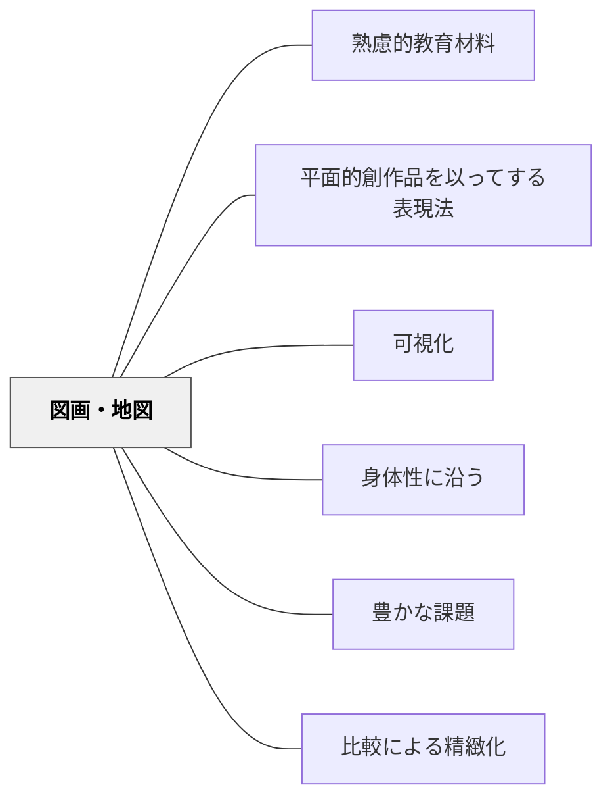

# 図画・地図

> 平面的な視覚表現は、概念・空間・関係を見える化する教育材料である。

## 背景（Context）

図・グラフ・地図・絵・写真などの平面的表現は、言語だけでは伝わりにくい空間的関係・量的関係・概念的構造を視覚化する。牧口常三郎の分類では「平面的創作品を以ってする表現法」に含まれ、図画・地図そのものが表現法を学ぶ教育材料でもある。

## 問題（Problem）

言語・数式だけで概念を扱うと、視覚的・空間的な理解が育たない。

## 力のかたち（Forces）

- 視覚表現は抽象的概念のイメージ化を助ける
- 作成（描く）活動を通じて理解が深まる
- デジタル地図・統計グラフなど現代的な形式も多様

## 解決（Solution）

**図・グラフ・地図などの視覚教材を意図的に活用し、描いたり作ったりする活動も組み込む。**

## 結果（Consequences）

- 概念・空間・関係の視覚的理解が深まる
- 情報リテラシー・表現力が育つ

## 関連パタン

- [[パタン/熟慮的教材教具]] — 親パタン
- [[パタン/平面的創作品を以ってする表現法]] — 牧口の表現法四分類における対応パタン
- [[パタン/可視化]] — 概念を図で示す

- [[パタン/身体性に沿う]] — 描く・貼る身体的操作が空間認識を深める
- [[パタン/豊かな課題]] — 図画地図を核にした豊かな課題設計
- [[パタン/比較による精緻化]] — 地図・図の比較が概念の精緻化を促す
## クラスター図

## Actionable Insight

- 教科書の図・グラフを「見る」だけでなく「手描きで再現する」活動を取り入れる——自分の手で描くことで図の構造が身体知として定着する
- 学習内容の関係を自分で地図・概念図として描かせる課題を1単元に1回設ける——描く行為が理解の深さを浮き彫りにし、自己評価の材料になる
- 「この図が言いたいことを一言で言うと？」と問いかけ図の読み取りを言語化させる——図を読む力が情報リテラシーの基盤として育つ

## 出典

- [[文献/熟慮的教育材料のパターンリスト（動画記録）]]
