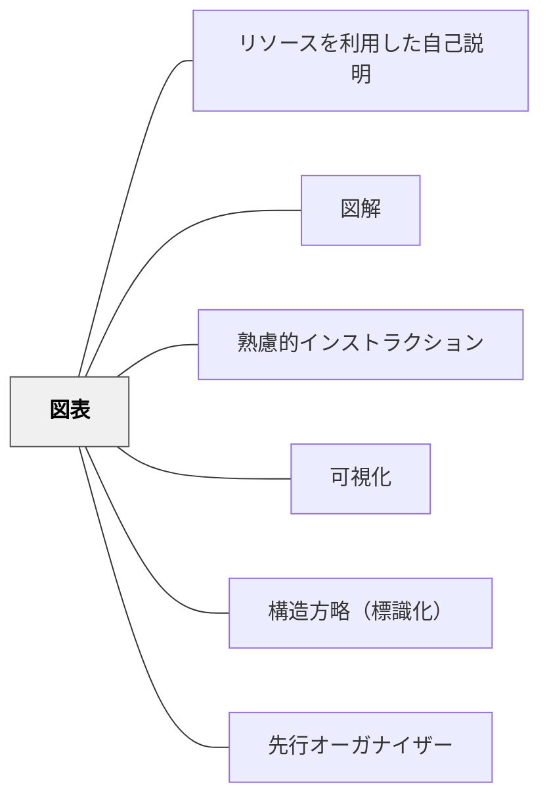

# 図表

> 表・グラフ・チャートで構造化された視覚情報を提示し、関係・比較・変化を一目で把握させる。

## 背景（Context）
言語による説明は線形であるため、複数の要素の関係・比較・変化を同時に提示することが難しい。表・グラフ・チャートなどの図表は、複雑な情報を構造化して一覧できる形にすることで、言語では伝えにくい関係性・パターン・差異を視覚的に把握させる。

## 問題（Problem）
数値・カテゴリ・関係性を言葉だけで説明すると、受け手は情報を順番に処理しなければならず、全体像の把握に時間がかかる。特に複数の要素を比較したり変化の傾向を伝えたりするとき、言語説明だけでは理解の精度と速度が下がりやすい。

## 力のかたち（Forces）
- 図表は情報の概覧には優れるが、文脈や解釈は言語説明が必要
- データの選択・可視化の方法が受け手の解釈を左右する
- シンプルな図表は複雑な図表より理解が早い
- 受け手のリテラシーによって図表の種類（棒グラフ・折れ線・マトリクスなど）を選ぶ必要がある

## 解決（Solution）
**比較・関係・変化・分類を伝えたいとき、表・グラフ・フローチャート・マトリクスなど適切な種類の図表を選び、言語説明と組み合わせて提示する。**
図表は言語説明の補完として使い、必ず「この図表が示していること」を言語で解説する。項目・単位・タイトルを明記し、受け手が自力で読めるように設計する。過度な装飾を避け、伝えたい情報に焦点を絞ったシンプルな図表にする。授業での板書図表は学習者がノートに写しやすいシンプルさを保つ。

## 結果（Consequences）
- 複雑な関係・比較・変化が視覚的に一目で把握できるようになる
- 言語説明と図表の組み合わせにより、多様な認知スタイルに対応できる
- 受け手の情報処理の負荷が下がり、説明の理解速度と精度が向上する

## クラスター図

## Actionable Insight

- 比較・分類を説明するとき「言葉の前に表を先に見せる」——視覚的な全体像が先にあることで、続く言語説明の理解速度と精度が上がる
- 「今日学んだ3つの概念を自分でマトリクス表にまとめてみよう」を授業の終わりに課す——表の作成が理解の構造化と自己評価を兼ねた活動になる
- 「この図表が示していることを1文で言うと？」を授業中に問いかける習慣をつける——図表読解の言語化がデータリテラシーの基盤として育つ

## 出典

- 一つの教育のパタン・ランゲージ（岩井輝久）

## 関連パタン
- [[教科/算数・数学で使うパタン]]
- [[パタン/リソースを利用した自己説明]]
- [[パタン/図解]]
- [[パタン/熟慮的インストラクション]] — 親パタン
- [[パタン/可視化]] — 情報を見える形にする全般
- [[パタン/構造方略（標識化）]] — 構造を明示する方略
- [[パタン/先行オーガナイザー]] — 全体構造を先に示す

## このパタンが働く実践

| 実践パタン | どのように図表が働くか |
|------------|------------------------|
| [[実践/カエルの算数：勝ちやすさを表で考えよう]] | 2つのサイコロの和の組み合わせを表に整理し、勝ちやすさを読み取る |
| [[教材/カエルの算数ゲームボード]] | ゲームの結果を、サイコロの組み合わせ表へ移して考えられるようにする |
| [[実践/個別支援級の複式算数：重さと面積をわたり・ずらしで学ぶ]] | 重さの関係を線分図で整理したり、単位の関係を表にまとめたりして考える |
