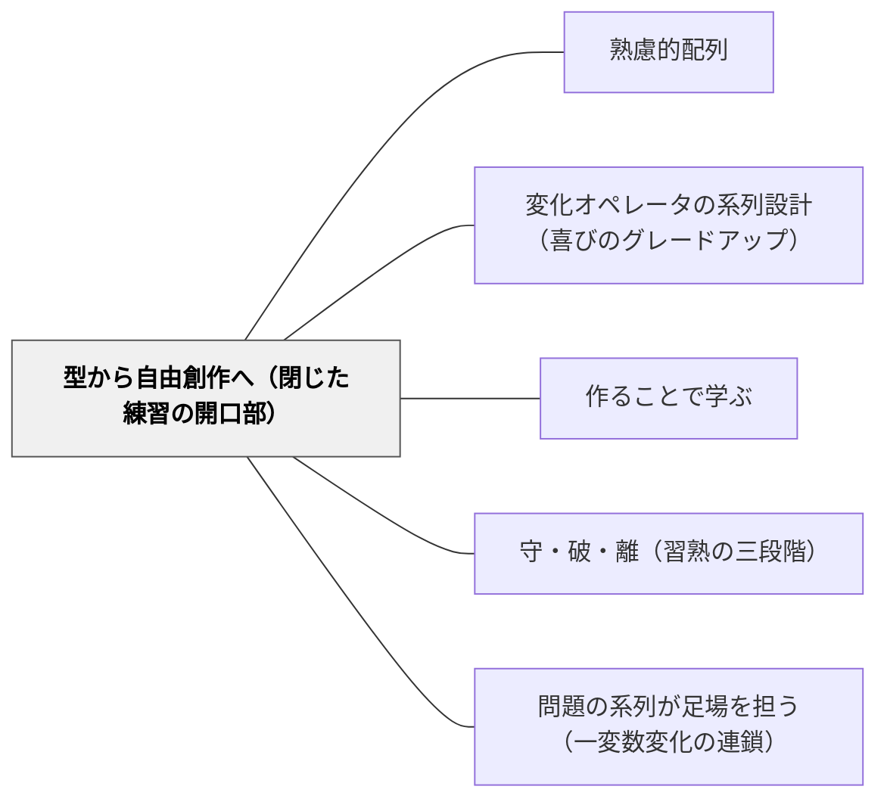

# 型から自由創作へ（閉じた練習の開口部）

> 型を学んだら終わりではない。型を使って何かを作る段階を最後に置いて、初めて型が学習者のものになる。

## 背景（Context）

算数の計算練習でも、国語の文型学習でも、「型の習得」が単元の中心になりやすい。型通りに解けるようになること——これは確かに重要な目標だ。しかし多くの単元は、型の習得で完結してしまう。「この型で問題を解けた」という経験があっても、「この型を使って自分の問題を作った」「この型で自分の物語を書いた」という経験は、多くの場合単元の外に追い出されている。

戸田城外（1930）『推理式指導算術』では、子どもが問題を自ら作る活動が教授サイクルの末尾に組み込まれていた——優秀な作問は練習問題として次の学習者に出題された。型を習得した者が、型を使って何かを生み出す。この転換が、型の習得を「もらった知識」から「自分の道具」へと変える。

Sawyer（2006）*Explaining Creativity* は「強い制約は創造性の母」という逆説的な知見を示す。制約なしの「自由」は逆に創造性を阻む——型という「強い制約」があるから、その制約の中で何を作るかという創造の問いが立ち上がる。型の習得と創造は対立しない。型が習得されるほど、創造の問いは自由で豊かになる。

## 問題（Problem）

型の習得練習が繰り返しで終わり、創造性・主体性と接続しない。学習者は「型を正確になぞる」技能は得るが、「型を使って自分の何かを作る」体験がないまま単元が終わる。

型を「もらった」だけの学習者は、型を「使う」場面で立ち止まる。「解法は分かっているが問題の意味が分からない」「パターンは分かるが文章に応用できない」という現象は、型の習得が「自分のものになっていない」ことのサインである。型を使って何かを生み出す体験が抜けているとき、型は「試験のための技術」に留まり、学習者の内側に根付かない。

## 力のかたち（Forces）

- **型の正確さ vs 創造の自由度**：型の練習は正確さを求める閉じた問いで評価しやすい。創造には正解がなく評価の設計が難しい。しかしこの非対称が、型練習だけで単元を閉じる原因になっている
- **評価のしやすさ（型練習）vs 驚きの豊かさ（自由創作）**：型練習の成果は点数化しやすく、管理が楽。自由創作の成果は多様で採点に時間がかかる。しかし豊かさは自由創作にしかない——採点コストを理由に自由創作を省くと、学習の完結が失われる
- **時間的制約（開口部を設ける余裕）**：単元時数の制約の中で型練習だけでも時間が足りないと感じることがある。開口部（制約付き作問・自由創作）を「余裕があれば行う」扱いにすると、常に省略される。最初から配列の中に組み込む設計だけが開口部を保証する

## 解決（Solution）

**系列の末尾に「同じ型を使って自分の問題・作品を作る」段階を組み込む。型の習得を自由創作の足場として使い、「閉じた練習」から「開いた創作」へとつなぐ。配列は3段階で設計する。**

### 配列の3段階

**① 型の習得（守）**：まず型通りに解く。[[パタン/変化オペレータの系列設計（喜びのグレードアップ）]] の同・逆・＋α という変化の段階を踏む。「型を完全に身につけた」と言える状態が次の段階の前提になる。

**② 制約付き作問（破の手前）**：「同じ型を使って、自分で数値や場面を変えた問題を作ってみよう」。型は守るが材料を自分で選ぶ。作った問題を互いに解き合う活動が可能で、クラス全体の「問題プール」が生まれる。型が「使える道具」として機能し始める段階。

**③ 自由創作（開口）**：「この型を使えば、どんな問題・作品・表現ができるか」を自由に試す。型は手段であり、何を表現するかは学習者が決める。評価の正解がなく、驚きのある作品が生まれやすい段階。

---

**算数の例：割合の作問**

基本原形：「30人の学級の40%は何人？」を使った3段階の設計。

| 段階 | 活動 | 子どもに渡す指示 |
|---|---|---|
| ①型の習得 | 変化オペレータで問題を解く系列（同・逆・＋α・質的変化） | 「この問題を解こう」 |
| ②制約付き作問 | 同じ割合の型を使い、数値・場面を自分で設定して問題を作る | 「割合を使った問題を1つ作って、隣の人に解いてもらおう」 |
| ③自由創作 | 割合の型を使って「クラス調査→グラフ→発表」「お店の特売チラシ作成」など | 「割合を使えば何が表現できる？自分でテーマを決めて作ってみよう」 |

②の段階で子どもが作った問題が「教室の問題プール」になり、次の学習者の練習問題として活用できる（戸田城外の実践と同じ構造）。

---

**国語の例：文型を使った物語創作**

基本原形：「〜たら、〜た（逆接型の展開）」の文型学習。

| 段階 | 活動 | 子どもに渡す指示 |
|---|---|---|
| ①型の習得 | 教科書の例文で文型の構造を確認し、類似した文を作る | 「この書き方で文を作ってみよう」 |
| ②制約付き作問 | 同じ文型を使い、場面・登場人物を自分で選んで短い文を作る | 「この書き方を使って、好きな場面の文を1つ作ろう」 |
| ③自由創作 | 文型を使って短い物語・詩・スケッチを書く。場面・テーマは完全に自由 | 「今日の文型を使って、自分だけの話を書いてみよう」 |

③で生まれた多様な作品を教室で共有すると、「同じ型なのに全然違う話になる」という驚きが生まれ、型の構造への注意が深まる。

## 結果（Consequences）

**利点**

- 「型を所有した」感覚が生まれる——自分で作った問題・作品があることで、型が「自分の道具」として内面化される
- 動機の内発化——「作ってみたい」という動機が型の練習を遡って意味づける。②③の体験があると、①の型練習が「将来使う道具の習得」として見える
- 多様な作品が教室リソースになる——②の制約付き作問で生まれた問題が次の学習者の練習問題になる（戸田城外のサイクル）。③の自由創作が作品集・展示・発表として教室を豊かにする
- 「型を知っている」から「型が使える」への質的な転換が可見化される——②③でうまくいかない子は、型の習得が不完全なサインとして機能する

**注意点・リスク**

- 自由創作の評価基準を事前に設計する必要がある——「なんでもよい」では学習の焦点が失われる。「この型を使っていること」「自分のテーマを選んでいること」など最小限の基準を提示する
- 制約付き作問への移行タイミングを見極める——①の型習得が不十分な段階で②に移ると、型の不確かさで作問が成立しない。「全員が③の基本問題を解ける」を移行の目安にする
- 時間の見積もりを甘く見ない——②③はそれぞれ①と同程度以上の時間を要する。単元計画に最初から組み込まない限り、授業後半で省略される

## 関連パタン

- [[パタン/熟慮的配列]] — 親パタン。本パタンは「型習得の末尾をどう開くか」という配列上の具体的設計——熟慮的配列が扱う「どの順で並べるか」の下位実装
- [[パタン/変化オペレータの系列設計（喜びのグレードアップ）]] — 変化オペレータ系列（同・逆・＋α）が型習得（①段階）を担う。本パタンはその延長線上に②③を追加する設計
- [[パタン/作ることで学ぶ]] — 制作行為そのものが学習という大パタン（上位）。本パタンはその配列的実装——型習得の末尾に創作を接続するという「いつ・どこに創作を置くか」の設計
- [[パタン/守・破・離（習熟の三段階）]] — マクロな習熟弧。本パタンは1単元内での「型（守）→制約付き創作（破の手前）→自由創作（離の入口）」というミクロな配列設計——守・破・離の「離」への入口を1単元内で意図的に設ける
- [[パタン/問題の系列が足場を担う（一変数変化の連鎖）]] — 同じ系列設計クラスター。本パタンはその末尾——一変数変化の連鎖で型を習得した後、その型を使って自由に作る段階をどう開くかを担う

## クラスター図

## Actionable Insight

- **単元の最後の1〜2時間を「作問の時間」にする**：型の習得練習が終わったら「その型を使って自分で問題を1つ作る」時間を単元計画に組み込む。作った問題を隣の席の人に解いてもらうだけで②段階が成立する
- **「誰かに出す問題」として作問を設定する**：「自分のために作る問題」より「誰かに解いてもらう問題」の方が質が上がる。作問活動は「相手に渡す」設定にする
- **③自由創作の入口に「型のパーツを使ったミニ作品」を置く**：いきなり自由な物語や作品を書くよりも、「この型を1回使った短い文を1つ書く」ところから始める。そこから自由に広げる方向に開く

## 出典

- 戸田城外（1930）『推理式指導算術』全3冊（教授サイクル——子どもが問題を作り、優秀な問題を練習問題として出題）
- Sawyer, R.K.（2006）*Explaining Creativity: The Science of Human Innovation*, Oxford University Press（「強い制約は創造性の母」§8.3）
