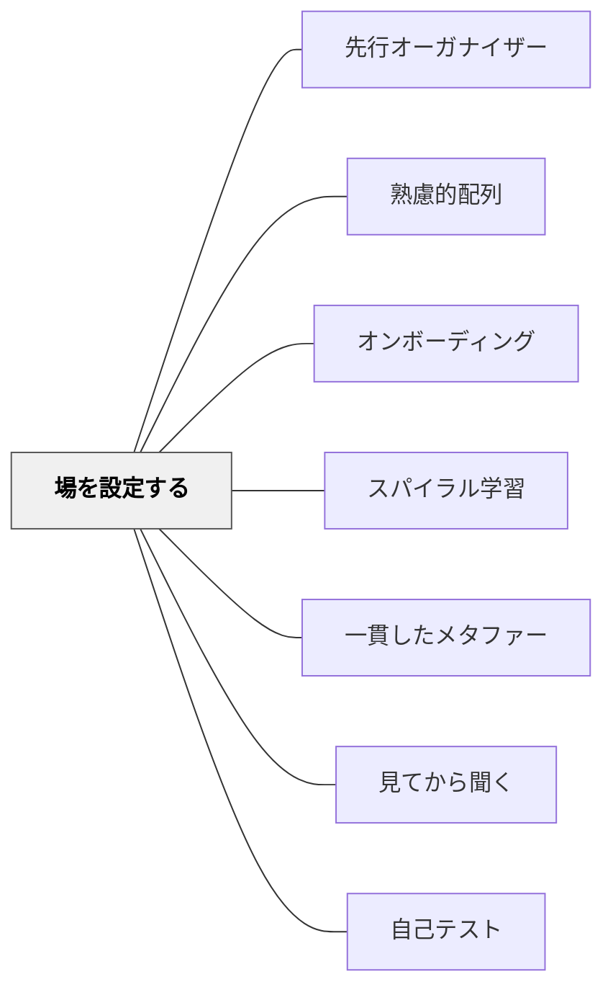

# 場を設定する

> 新しいトピックに入るとき、学習者の頭の中に「地図」を置く——それだけで理解の深さが変わる。

## [Pattern Connection]

- **既存パタンとの関連**：[[パタン/熟慮的配列]] の「配列の始まりを設計する」という問いに直接答える。[[パタン/先行オーガナイザー]] や [[パタン/オンボーディング]] とも本質的に連動し、学習者が「自分はどこにいて、どこへ向かっているのか」を把握する状態をつくる。
- **補強された点**：「導入」を「動機づけ」としてだけでなく、「認知的整理」の機能として捉え直す視点を補強する。本パタンの5点チェックリストは、導入設計を理念ではなく行動手順に変換する。
- **修正・拡張された点**：単元の最初だけでなく、「大きな話題の転換点」でも使えることを強調。同一単元内でも別トピックへ移るときにこのチェックリストを適用することで、学習者の混乱を防げる。
- **他のパタンへの波及**：[[パタン/スパイラル学習]] ——次の螺旋に入る前に「前回何を学んだか・今回はどこへ行くか」を設定することがスパイラルの節目を機能させる。[[パタン/一貫したメタファー]] ——場を設定する際に選んだメタファーが単元全体の認知の枠組みになる。

## 背景（Context）

新しいトピックを導入するとき、教師は「早く本題に入りたい」という衝動を持ちやすい。しかし、学習者の頭の中には前のトピックの記憶がまだ残っており、「どこで何が変わったのか」が整理されていない状態で新しい内容が流れ込んでくる。特に似たトピックが連続するとき、学習者は容易に混乱する。

## 問題（Problem）

準備なしに新しいトピックに入ると、学習者は「今何を学んでいるのか」「これは何の役に立つのか」「前に学んだことと何が違うのか」という基本的な問いを持ちながら聴くことになる。認知資源がこれらの問いに使われ、内容の理解に使える容量が減る。導入の設計なしでは、詳細な説明が逆に理解を妨げることがある。

## 力のかたち（Forces）

- 人間は「文脈」がないと新しい情報を整理しにくい
- 学習者は自分が「どこにいるか」がわかると安心して学べる
- 前提知識がない状態で進むと、それ以降のすべてが理解できなくなるリスクがある
- 目標が見えていると、学習者は要点を自分で選別できるようになる
- 見通しは不安を減らし、学習への集中力を高める

## 解決（Solution）

**新しいトピックを導入するとき、次の5点チェックリストで「場を設定する」準備をせよ。**

---

### 5点チェックリスト

**① トピックを名付ける（Name the Topic）**
- 今日扱うトピックの名前を明示する
- 授業全体を通してその名前を繰り返し使うことで、学習者の記憶に定着させる
- 「今日は〇〇について学びます」という宣言が、学習者に認知の枠を与える

**② 前提知識を確認する（Review Prerequisites）**
- 新しい内容を理解するために「すでに知っているべきこと」を確認する
- 「これを知っている人？」と問いかけるか、簡単に振り返りを行う
- 知っていない学習者には補足リソースへの道筋を示す

**③ ゴールを示す（Show the Target）**
- 「このトピックの最後には何ができるようになるのか」を明示する
- 「〇〇ができるようになります」という具体的な目標を言葉と板書で示す
- 学習の最後のイメージが先に見えることで、詳細が方向を持つ

**④ 文脈を示す（Show the Context）**
- このトピックが「より大きな全体のどこに位置するか」を示す
- 「先週学んだ〇〇と、今日の〇〇はこうつながっています」と関係を可視化する
- 学習指導要領の単元配列や、日常生活との接続でもよい

**⑤ 見通しを可視化する（Provide a Visible Outline）**
- 今日の授業の流れ・本単元の構造をボードや紙に書いて示す
- 学習者が「今どこにいるか」を授業中に自分で確認できるようにする

---

### 例：ハットを変える教授法

Berginが紹介するある教授の実践——同じ問題の異なる側面を扱うとき、それぞれの視点を表す帽子を変えながら話した。帽子を替えることで、学習者は「今から違う見方をする」というモードの切り替えを体感できた。「場を設定する」は言語だけでなく視覚的・身体的な合図でも実現できる。

---

### 小学校での実装例

- 算数の新単元「分数」に入る前：「今日から分数です（①）。足し算引き算はもうできますね（②）。分数ができると、ピザを何人で分けるかがわかります（③）。整数の次のステップです（④）。今日は分数とは何か・次の時間は分数の足し算・その次は文章題です（⑤）」
- 「今日から話し合いの仕方が変わります」という際に、黒板に「前の話し合い→今日の話し合い」の比較図を描いて見せる

## 結果（Consequences）

- 学習者は新しいトピックに入る前に認知的な準備が整う
- 前提知識の不足が早い段階で発見される
- 学習者はゴールを知っているため、要点を自分で選別できる
- 全体像と自分の現在地がわかることで、学習への安心感が生まれる
- 似たトピック間の混乱が減る

## 関連パタン
- [[パタン/先行オーガナイザー]]

- [[パタン/熟慮的配列]] — 配列の各「始まり」を設計する際に使う
- [[パタン/オンボーディング]] — 活動に学習者を乗せる準備
- [[パタン/スパイラル学習]] — 次の螺旋の入口で場を設定する
- [[パタン/一貫したメタファー]] — 場を設定する際に選んだメタファーが単元の枠組みになる
- [[パタン/見てから聞く]] — 体験を先行させる場合も、場の設定が体験の意味を定める
- [[パタン/自己テスト]] — 場を設定した後の確認に自己テストをつなげる

## クラスター図

## Actionable Insight

- 次の単元の1時間目の最初5分を「5点チェックリスト」で設計してみる——①トピック名を板書する、②「先週何をやったか覚えている？」と問う、③「今日の最後には〇〇できます」と言う、④前の単元とのつながりを一文で言う、⑤本時の流れを3ステップで板書する
- 授業中に「今、どの段階にいるか」を学習者が自分で確認できるよう、授業の流れを黒板の隅に残したままにする
- 似たトピックが連続するとき（例：たし算→ひき算）、「前はたし算でした、今日から切り替えてひき算です」という切り替えの合図を意識的に作る

## 出典

Bergin, J. (written by) in Bergin, J., Eckstein, J., Volter, M., Sipos, M., Wallingford, E., Marquardt, K., Chandler, J., Sharp, H., & Manns, M. L. (2012). *Pedagogical Patterns: Advice For Educators*. Joseph Bergin Software Tools. (CC BY-SA 3.0)  
https://www.pedagogicalpatterns.org/

> "Therefore set the stage for the new material by using the following checklist: Name the Topic... Review Prerequisites... Show the Target... Show the Context... Provide a Visible Outline..." — Bergin et al. (2012)

> "Joe Bergin once knew a professor who wore different hats when discussing different aspects of the same problem. Each hat was associated with a view. When he changed hats you knew that you needed to think a little differently." — Bergin et al. (2012)
