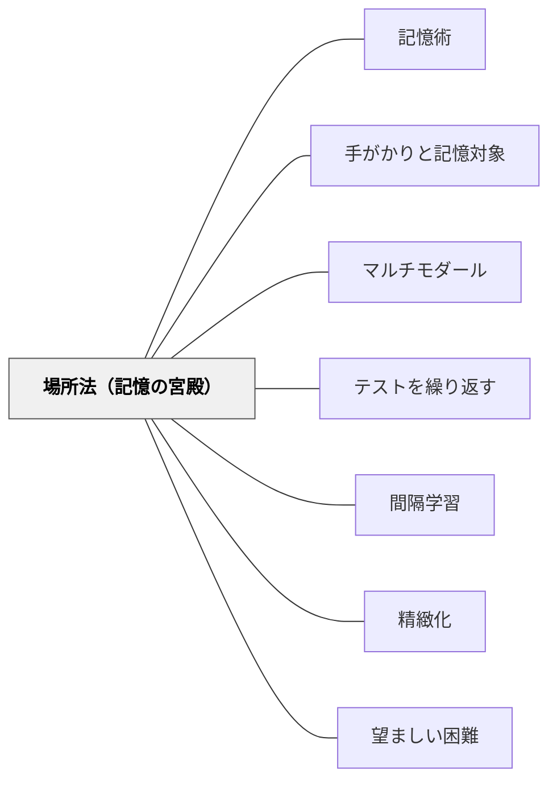

# 場所法（記憶の宮殿）

> 家の中を歩き回るだけで、20個の単語が5分で覚えられる。

---

## [Pattern Connection]

**Jo Rokuhara（年不詳）統合（2026-05-21）：**

本書が「世界記憶力選手権のプロが全員使い、2000年以上の歴史を持つ最強の記憶術」として詳述した場所法をパタン化した。

- **既存パタンとの関連**：[[パタン/記憶術]] の「場所法」分類をパタンとして独立させた。[[パタン/マルチモダール]] と連携する——場所法は視覚・触覚・運動感覚を活用する多感覚的記憶術。[[パタン/テストを繰り返す]] の「想起練習」と組み合わせると、ルートを頭の中で歩く行為そのものが検索練習になる。
- **補強された点**：人間の空間記憶は進化的に非常に頑健であるため（狩猟採集時代に「どこに何があるか」を覚えることが生存と直結していた）、抽象情報を空間的イメージに変換することで記憶効率が劇的に上がる。
- **他のパタンへの波及**：[[パタン/手がかりと記憶対象]] ——場所のポイントが「手がかり」として機能し、そこに置いた情報が「記憶対象」として引き出される。場所法はこの原理の最も明快な実装。[[パタン/間隔学習]] ——定着させるためには、作成後も時間を空けて複数回ルートを歩く想起練習が必要。

---

## [The Pattern]

> 家の中を歩き回るだけで、20個の単語が5分で覚えられる。

### 背景（Context）

学校での暗記学習は「書いて覚える」「繰り返し音読する」「フラッシュカードを見る」という方法が主流だ。これらは意味のない反復であり、記憶の定着効率が低い。

一方、人間の空間記憶は驚異的に優れている——多くの人が「祖母の家の間取り」「小学校の通学路」を数十年後も詳細に思い出せる。**場所法（記憶の宮殿）は、この空間記憶の強さを利用して抽象的な情報を記憶する技術だ。**

起源は紀元前500年頃の古代ギリシャ。詩人シモニデスが崩れた建物から犠牲者を識別するために「宴席の座席配置」を思い出したことが発端とされる。その後古代ローマの演説家が演説内容の暗記に使い、現代では世界記憶力選手権の選手が必ず使う技術として継承されている（5分で520桁の数字を記憶する記録が存在する）。

### 問題（Problem）

暗記が必要な情報が多い（語彙リスト・歴史年号・演説の構成・試験範囲など）とき、従来の反復暗記は時間がかかり、かつ試験本番での想起が不確実だ。「覚えた順序でしか思い出せない」「途中で抜けると後が思い出せない」という問題が起きる。

### 力のかたち（Forces）

- 人間の空間記憶は意味記憶よりはるかに頑健——「どこに何があるか」は忘れにくい
- 視覚的・感覚的に鮮明なイメージは記憶に残りやすい（奇妙・誇張・動く・感情的イメージが特に強い）
- ルートには順序が内在しているため、「この次は何？」という構造が自然に生まれる
- 途中のポイントを忘れても、前後のポイントから独立して想起できる（物語法と異なる利点）
- 家・通学路など「すでに知っている場所」をそのまま使えるため、準備コストが低い
- 20個以上の情報を一つの手がかりから順番に想起する必要がある場合、他の記憶術では対応が難しい

### 解決（Solution）

**よく知っている場所を「ルート」として設定し、各ポイントに記憶対象のイメージを鮮明に配置する。想起するときはルートを頭の中で「歩き回る」。**

---

#### Step 1：ルートを決める

自分がよく知っている場所を選ぶ。順序が決まっていて、何度でも同じ経路で歩けることが条件。

**推奨ルートの例**：
- 自分の家の中（玄関→廊下→リビング→キッチン→寝室→浴室）
- 通学路・通勤路
- 学校の廊下（昇降口→廊下→教室→理科室→体育館）

---

#### Step 2：ポイントを設定する

ルート上に「ポイント（記憶の置き場所）」を設定する。

**ポイント設定の基準**：
- 見落としにくい、目に付きやすいもの（50cm〜3mが目安）
- ポイント間の距離は1〜10m程度（近すぎると混同する）
- 各ポイントに特徴があること（電柱が5本並ぶような単調な配列はNG）
- 数は記憶したい情報数に合わせる（20個覚えるなら20ポイント）

**家の中のポイント例（10個）**：
玄関の靴箱→廊下の電灯→リビングのテーブル→ソファ→テレビ→キッチンのシンク→冷蔵庫→洗面所の鏡→浴槽→寝室のベッド

---

#### Step 3：ポイントを体に覚え込む

実際のルートを歩きながら（または想像しながら）、各ポイントで止まり、触れ、感覚を意識する。

「玄関の靴箱は木のにおいがする。扉を開けるときのガタッという音がする」——五感を使って各ポイントを鮮明にする。これを2〜3回繰り返す。

---

#### Step 4：記憶対象をイメージで配置する

覚えたい情報を各ポイントに置く。**鮮明で誇張されたイメージが重要**。

**イメージ作成のコツ**：
- 動いている（静止画より動画の方が記憶に残る）
- 大きい・小さい・奇妙（誇張されたイメージが印象に残る）
- 感情を伴う（驚き・笑い・嫌悪が記憶を強化する）
- 多感覚的（視覚だけでなく音・匂い・触感を想像する）
- 自分がその場にいる（傍観者でなく主体として関与する）

**例（英単語 apple = リンゴ を玄関の靴箱に置く場合）**：
「玄関を開けたら、靴箱の上に巨大なリンゴが乗っていて、そのリンゴから甘いにおいがして、靴箱がリンゴの重みでつぶれそうになっている」

**抽象的な情報の場合**：[[パタン/手がかりと記憶対象]] の関係法（仲介役）を使い、抽象情報をまず具体的なイメージに変換してから配置する。

---

#### Step 5：想起練習

配置が完了したら、すぐにルートを頭の中で「歩き」、各ポイントで配置したイメージを確認する。

- ルートを順方向に歩く（1回目）
- 逆方向に歩く（2回目）
- 数時間後、翌日にも同じルートを歩く（[[パタン/間隔学習]] の実装）

---

#### 複数ルートの準備

使ったルートをすぐ再利用すると干渉が起きる（前に置いたイメージが残っている）。10〜20ポイントのルートを3〜5本準備しておくと、様々な試験・場面に対応できる。

---

#### 情報数による使い分け

| 情報数 | 推奨方法 |
|--------|---------|
| 5個まで | 頭文字法（アクロニム）の方が手軽 |
| 5〜20個 | 物語法（一連法）でも可 |
| **20個以上** | **場所法が最適解** |

---

### 実践例（授業場面）

**例1：英単語20個を1時間で覚える（中学生）**
1. 教室→廊下→体育館のルートで20ポイントを設定（5分）
2. 各単語を日本語のイメージに変換してポイントに配置（15分）
3. 頭の中でルートを歩いて確認（5分）
4. ペアで確認し合う（10分）

**例2：スピーチ・プレゼンの構成を暗記する（小学校高学年〜）**
1. 自分の家のルートを使って、スピーチの各段落をポイントに置く
2. 「冒頭の書き出し→問題提起→具体例1→具体例2→結論」の5つをポイントに配置
3. 本番直前にルートを一度歩けば、原稿なしで話せる

**例3：歴史年号・人物・出来事の順序を覚える（小学校〜）**
1. 通学路のポイントに年号順で「人物が行動しているイメージ」を置く
2. 関係法で年号を具体的なイメージ（1868年→「一発ロック」→銃声）に変換してから配置

### 結果（Consequences）

- 20〜50個以上の情報を短時間（30分〜1時間）で暗記できる
- 想起がポイント主導で独立しているため、途中でつまずいても前後の情報に影響しない
- 繰り返し使えるルートは「記憶の宮殿」として整備でき、生涯の学習ツールになる
- 「暗記が苦手」と思っていた生徒が、この技法で劇的に成功体験を得ることがある
- ただし、**意味の理解を伴わない暗記になるリスク**がある——「なぜそうなるか」への理解と必ずセットにする
- ルート準備・イメージ作成のコストがあるため、少量の情報（5個以下）には過剰な方法

### 関連パタン

- [[パタン/記憶術]] — 場所法を含む6つの記憶術の全体マップ
- [[パタン/手がかりと記憶対象]] — 場所のポイント（手がかり）と配置情報（記憶対象）の原理
- [[パタン/マルチモダール]] — 多感覚的イメージ作成の根拠（視覚・触覚・聴覚・嗅覚の統合）
- [[パタン/テストを繰り返す]] — ルートを歩く想起練習そのものが検索練習
- [[パタン/間隔学習]] — 配置後の間隔を空けた想起で定着を強化
- [[パタン/精緻化]] — 抽象情報を具体的イメージに変換することが精緻化の一形態
- [[パタン/望ましい困難]] — 「思い出しにくさ」が記憶を強化するメカニズム
- [[文献/一流の記憶法（Jo Rokuhara）]] — 一次資料

---

## クラスター図

## Actionable Insight

- **授業の最初の5分**：「今日学ぶ3つのポイントを、自分の机の上の3か所に置こう（イメージで）」——場所法の最小版を毎回の授業に組み込む
- **語彙テスト前日**：「家の中の10か所に単語のイメージを貼り付けよう」という課題を出す——翌朝の確認テストで効果を実感させる
- **スピーチ授業**：原稿を覚えるために場所法を教える——「台本を持たずに3分話す」が1時間で達成できる
- **生徒に場所法を「教える」場面を設ける**——生徒が友達に説明することで技法の定着と自信が生まれる

---

## 出典

Jo Rokuhara（年不詳）『一流の記憶法：あなたの頭が劇的に良くなり「天才への扉」がひらく』知之鳥出版（Kindle版）

> 「現代でも、世界記憶力選手権に出るような記憶のプロはみな使っています。記憶術の中でも、場所法は別格です。」
