# 声を聞く仕組みを四段で確かめる（欄・行使・考慮・反映）

> 意見箱が廊下に置いてある。投書が一通、入る。その投書が、読まれる。そして、ルールが変わる。この四つは、別の出来事である。「声を聞く仕組みがある」という一文が、このどれを指しているのかを、分けられるようにする。

## [Pattern Connection]

本パタンは岩井（2026）『圏論的教育記述の公理化ノート 第3巻』第3章・第4章の**教室語版**であり、**理論の正は書籍にある**（定義・記号はこの Wiki に置かない）。ここに書くのは、教室で使える形に開いた確かめ方の手順だけである。

そして、このページには最初に釘を一本、打っておく。**このパタンは、記録をめぐる非対称の当否を判定しない。** 「欄を作るべきか」「反映しない学校は不当か」を、このパタンは一言も言わない。渡すのは**正確に記述する手順**であって、**あるべき姿**ではない。

この釘が要るのには、形式上の理由がある。出典の理論は、「これは、これを意味しない」という**否定の形**で書かれている。ところがパタンという器は、そもそも**命令形で書かれる**——「こうしなさい」「こう置きなさい」。つまり、パタンという器そのものが、この本の抑制とは逆を向く力を持っている。だから本ページは、命令形を使う場所を、**手順の側だけ**に限る。「四つを分けて書け」とは言う。「こうあるべきだ」とは言わない。

このWikiには、声を**集める**側のパタンがすでにある——[[パタン/被教育者からフィードバックを得る]]、[[パタン/保護者と他の学校協力者のフィードバック]]。本パタンはその隣に、**「集める仕組みがある」と書いてよいかを分ける側**を置く。声の集め方を設計する技術と、集まったかどうかを正確に書く技術は、別のものである。

[[概念/証拠不足と不成立の区別]] が「証拠がないことは、無いことではない」を一人の子の水準で確定したのに対し、本パタンは同じ手つきを**申立ての側**に使う。申し立てが一件も来ていないことは、「不満が無い」ことでも「納得している」ことでもない。**申し立てられる位置が無ければ、申し立ては現れようがない**からである。

## 背景（Context）

近年、学校には「声を聞く」ための欄が増えた。学校評価アンケートの自由記述欄。学級の「ふりかえりカード」の意見欄。通知表や評価の記録に、子どもが一言書き添えられる欄。学級会の意見箱。行事のあとの感想用紙。「先生へ」と印刷された四角い枠。

欄を作るのは、ふつう、善意である。書ける場所があったほうがよいと考えて、様式を一枚、書き足す。そして書き足したあとに、こういう一文が来る。

**「本校は、保護者の声を聞く学校です」。**
**「このクラスでは、子どもの意見を大事にしています」。**

学校評価の報告書にも、学級だよりにも、校内研の資料にも、この種の一文を書く欄が、毎年必ず来る。

手元にあるのは、様式である。書式が求めるのは、様式ではなく、**仕組みについての判断**である。そのあいだには、越えなければならない隔たりがある。しかもこの隔たりは、一段ではない。**四段ある。**

## 問題（Problem）

**「声を聞く仕組みがある」という一文は、四つの別の出来事のどれを指しているのかを、言わないまま通ってしまう。**

出典の著者は、これを三つの出来事の物語として言い直している。

> 意見箱が廊下に置いてある。投書が一通、入る。その投書が、読まれる。そして、ルールが変わる。この四つは、別の出来事である。

四つには、それぞれ**別の証人**がいる。

### ① 欄——応答を返せる欄が、様式に、最初からある

証人は、**その欄そのもの**である。用紙に四角い枠が印刷されている。意見箱が廊下に置いてある。それが証人になる。ここまでは、探せば必ず見つかる。作った本人が知っているからである。

### ② 行使——書かれる側が、実際に書いた

証人は、**書き込まれた記録と、その件数**である。ここで初めて、証人は自分の手を離れる。書くのは、こちらではないからである。

そして、ここに最初の落とし穴がある。**〇件のとき、何と書くか。** 「声が集まりませんでした」でも「不満はありませんでした」でもない。正確には——**「聞く形はあるが、まだ何も聞こえていない」**。欄は立っている。行使は、まだ〇件である。それが、そのときに立っている全部である。

### ③ 考慮——書かれたものが、読まれた

証人は、**集計や検討の記録**である。読んだという行為は、記録に残らないかぎり、あとから誰にも確かめられない。

用紙の束が、輪ゴムでまとめられたまま棚に置かれている——このとき、②は立っているが、**③は〇**である。悪意があるわけではない。ただ、読んだ記録が、どこにもない。

### ④ 反映——側の記録が、実際に動いた

証人は、**様式・案内文書・計画の、改訂の記録**である。次年度の用紙が変わった。学級のルールの掲示が書き換わった。案内文の一段落が差し替えられた。動いた跡が、残っている。

---

**四段とも、別の証人を持つ。どの段から次の段も、自動では出ない。**

欄があるからといって、書かれたことにはならない。書かれたからといって、読まれたことにはならない。読まれたからといって、何かが動いたことにはならない。四つの証人は、それぞれ別に立たせなければならない。

滑りの入口は、いつも同じところにある。**「仕組み」という一語が、四つを一つに畳み込んでしまう。** 畳み込まれると、読み手は、いちばん強い段を勝手に補う。「仕組みがあります」と聞いた人は、④まで来ていると読む。書いた人は①のつもりでも、である。

そして、この癖は、暴いても消えない。一度「欄があることは、聞かれたことではない」と学んでも、次の一文の前で、また滑る。だからこの確かめは、一度で済ませられず、毎回、四段に分けるところからやり直すことになる。

## 力のかたち（Forces）

- **欄を作ることの手軽さ vs 四段を通すことの重さ**——欄は、印刷の一手間で足せる。②③④は、それぞれ別の実務と別の時間を要する。手軽な①だけが、いくらでも増やせてしまう
- **「声を聞いている」と言いたい気持ち vs 記録で言えること**——言いたいのは本当である。嘘をつく気もない。ただ、手元の証人が支えている範囲は、言いたい範囲より狭い
- **読んだ記録を残す手間**——読むこと自体は、その気になれば十五分でできる。読んだと分かる形で残すことは、別の仕事である。そして残さなければ、③は〇のままになる
- **反映できないときに、欄を作ってよいのか**——予算も権限もない事柄について意見を集めることは、正しいのか。**このパタンは、その当否を言わない。** 言えるのは、四段のどこで止まっているかまでである
- **「書いても変わらない」と学習させてしまう懸念**——②が続いたのに④が動かない状態が繰り返されると、次の②が減る。これは記録の上でも観察できる。ただし、減った理由の認定は、この道具からは出ない
- **書式の締切 vs 確かめる時間**——報告書の提出前日に、四段を確かめる余裕はない。だから確かめは、書く直前ではなく、欄を作った日にはじめる
- **正直に書くと成果が小さく見える**——「①だけ立っています」は、報告として見栄えがしない。だが、①だけと書いた報告からは、次に何をすればよいかが出てくる

## 解決（Solution）

**「声を聞く仕組みがある」と書いてよい。ただし、四段のどれが立っているかを、分けて書く。**

これは禁止ではない。書いてはいけないのではなく、**四つのうちどれのことを言っているのかを、書く本人が分けられるようにする**。分けたうえで、立っている段の範囲で書けばよい。

四段の確かめは、次の四つの問いに縮められる。

1. **欄はあるか。**（証人＝様式・箱そのもの）
2. **書かれたか。何件か。**（証人＝書き込まれた記録と件数）
3. **読まれたか。読んだ記録はどこにあるか。**（証人＝集計・検討の記録）
4. **こちら側の記録が動いたか。**（証人＝様式・案内文書・計画の改訂）

四つとも、**証人を指させるかどうか**で答える。「たぶん読んだと思う」は、③の証人にならない。「気持ちとしては大事にしている」は、どの段の証人でもない。

---

### 中心の場面——保護者アンケートに自由記述欄を新設した

ある学校が、学校評価アンケートに自由記述欄を新設した。校長が言う——「これでうちは、保護者の声を聞く学校になりました」。

この一文を、四段に分けて検査する。

- **① 欄**——自由記述欄がある。証人は、新しい用紙そのもの。**立っている。**
- **② 行使**——保護者が実際に書いたか。証人は、記入済みの用紙とその件数。**まだ確かめていない。**
- **③ 考慮**——書かれたものが読まれたか。証人は、集計や職員会議での検討の記録。**まだ無い。**
- **④ 反映**——学校の側の記録が動いたか。証人は、案内文書・報告書・計画の改訂の記録。**まだ無い。**

立っている証人は、いまのところ、**①だけ**である。欄を作ったこと以上のことは、まだ証人を持たない。

だから、この一文は、立っている証人の範囲で、正確に言い直せる。

> **保護者の声を聞ける欄を作りました。「聞く学校になった」と言えるかは、書かれた記録・読まれた記録・動いた記録が、立ってからです。**

そして、ここが本パタンのいちばん大事な一行である。

> **これは、校長を責める言葉ではない。四段のどこまで来ているかを、見えるようにする言葉である。**

この道具は、**飛躍を消す道具ではない。飛躍がどこにあるかを、見えるようにする道具**である。①から④へ跳ぶことを禁じてはいない。跳ぶのなら、どこから跳んでいるかが見えている状態で跳めばよい、というだけである。

同僚にも、管理職にも、学校そのものにも、この道具を**裁くために向けない**。四段は、成績表ではない。いま何段目にいるかを指す地図である。地図は、遅れている人を責めない。

---

### もう一つの重要な非含意——申立ての不在は、異議の不在ではない

②が〇件だったとき、いちばん起きやすい読み替えが、これである。

**「意見が出なかった」を「不満が無かった」と読む。**

出典の理論は、ここを塞いでいる。申し立てられる位置が**無い**、あるいは**狭い**なら、申立てが無いことは、**位置の不在の反映でしかない**。

- 欄が用紙の最後の一行しかない
- 記名式で、誰が書いたかが分かる
- 提出先が、その意見の当事者本人である
- 締切が三日後で、家庭に届くのが前日である
- 日本語での記述しか受け付けない

これらはどれも、②が〇件になる理由になりうる。〇件から読み取れるのは、**「この欄・この条件では、書かれなかった」**までである。「不満が無い」も「納得している」も、そこからは出ない。

だから、②が〇件だったときにまず見るのは、子どもや保護者の側ではなく、**欄の側**である。

---

### さらにもう一つ——訂正を申し立てたことは、記録が直ることを意味しない

②が立ったとしても、④は別である。**行使の記録と、改訂の記録は、別の記録**である。

出典の例では、二件の記録が並ぶ。一件目は、児童が自分についての集約に**保留をつけた**記録——投書が一通、入った。二件目は、そのあと**記録が動かなかった**ことの記録——ルールは変わらなかった、という観察。

ここで、二件目の性格をはっきりさせておく。

> **これは「教師が無視した」という認定ではない。「記録が動かなかった」という事実までである。**

動かなかった理由は、いくらでもありうる。検討した結果そのままにした。時間がなかった。動かす権限がその人になかった。理由の認定は、この道具からは出ない。出るのは、**②は立ち、④は立たなかった**という事実の並びまでである。

そして、この並び自体には価値がある。「申し立てを受けたのに動かなかった」という状態が、**記録として見える**ようになるからである。見えれば、次に検討できる。見えなければ、次も無い。

---

### 具体例1：保護者アンケートの自由記述欄——〇件だったとき

年度末、学校評価アンケートを回収した。自由記述欄への記入は、**〇件**だった。

報告書に何と書くか。

書きたくなるのは、「特にご意見はありませんでした」である。これは②を④のように読んでいる。書けるのは、次までである。

> 自由記述欄を新設しました（①）。今年度の記入は〇件でした（②）。読まれた記録・改訂の記録は、まだありません（③④）。

そのうえで、②が〇件だった理由を、**欄の側から**見る。今回の欄は、用紙の裏面の最終行にあり、記名式で、担任経由の提出だった。来年度は、無記名にする・封筒を用意する・欄を表面に移す、のどれかを試す。

これは「保護者に書かせるための工夫」ではない。**〇件が、欄の条件の反映なのか、そうでないのかを、確かめられるようにするため**の変更である。

---

### 具体例2：学級の「ふりかえりカード」の意見欄

ふりかえりカードの下に、「先生へ」という三行の欄を作った。四月から使っている。

十月に、四段で確かめる。

- **①** 欄はある。カードの下三行。**立っている。**
- **②** 半年で、書き込みは十一件。書いた子は四人。**立っている。ただし四人。**
- **③** 読んではいる。だが、読んだ記録はどこにもない。カードは返してしまっている。**〇。**
- **④** 書かれたことを受けて変えたことが、二つある。座席の相談の日を作った。宿題の提出時刻を変えた。だが、どちらも**掲示にも学級通信にも残っていない**。**証人が無い。**

ここで分かるのは、③と④が「していない」のではなく、**「した証人が残っていない」**ということである。この二つは、対処がまったく違う。していないなら、始めればよい。証人が残っていないなら、残し方を変えればよい。

具体的には、返す前にカードの「先生へ」欄だけを写真に撮って一枚のノートに貼る（③の証人）。学級通信に「ふりかえりカードに書いてあったので、こうしました」と一行足す（④の証人）。どちらも一分で終わる。

そして、**書いた子が四人だった**ことを、「他の子は不満が無い」と読まない。書いた四人は、書ける四人である。それ以上のことは、この件数からは出ない。

---

### 具体例3：子どもが評価に異議を書ける欄

単元末の評価を返すとき、「思っていたのと違うところがあったら書いてください」という欄を、返却用紙の裏に作った。

一年間で、書き込みは三件。そのうち一件は、D児が「グループでやったときのは、自分が説明したところが入っていない」と書いたものだった。

四段で読む。

- **①** 欄はある。
- **②** 三件。D児の一件を含む。**一件は、証人一件である。**「例外だから」と落とさない
- **③** 三件とも読んで、それぞれ本人と一分話した。話した日付をメモに残した。**立っている。**
- **④** D児の件については、評価の記録を書き直した。**改訂の記録がある。** 残り二件については、話しただけで記録は動かなかった。**動かなかったことも、記録する。**

ここで書くのは、「三件のうち一件に対応しました」という達成の報告ではない。「三件あり、一件は記録が動き、二件は動かなかった」という**並び**である。動かなかった二件を消さないことが、この記録の値打ちである。

---

### 具体例4：学級会の意見箱

学級会用の意見箱を、教室の後ろに置いた。

- **①** 箱がある。
- **②** 二か月で四枚。**立っている。**
- **③** 四枚とも学級会で読み上げた。学級会ノートに議題として残っている。**立っている。**
- **④** 四枚のうち、二枚は学級のきまりの掲示が書き換わった。二枚は話し合って「今のままでいく」と決まった。**両方とも、記録がある。**

ここで大事なのは、**「今のままでいく」と決まった二枚も、④の記録を持っている**ということである。反映とは、要求どおりに変わることではない。**側の記録が動いたか**である。話し合った結果を書き残せば、それは動いた記録になる。

四段は、要求が通ったかどうかを測る目盛りではない。

---

### 具体例5：校内のアンケート——同僚に向けて報告する場面

校内研で、「本校は児童の声を聞く体制ができています」と報告したい。

四段の形で言い直すと、こうなる。

> 今年度、児童アンケートの自由記述欄を新設しました（①）。記入は延べ二十三件でした（②）。学年会で集計し、記録に残しています（③）。この集計をもとに、次年度の様式を一か所変えました（④）。児童が自分の評価に異議を書ける欄については、様式はありますが（①）、記入は今年度〇件です（②）。

言えることは減った。だが、この報告からは、**同僚が来年試せることが出てくる**。「異議の欄が〇件」と聞いた同僚は、自分の学級の欄がどこに印刷されているかを見に行く。「体制ができています」では、そこまで行かない。

そして、この報告は、**誰も責めていない**。〇件の欄を作った人を責める言葉は、一つも入っていない。

---

### 具体例6：自己教育での適用——自分に開いた欄を、自分で四段に分ける

このパタンは、大人が自分の学習に使うこともできる。

数学の自己学習を続けている人が、ノートの最後に「今日つまずいたこと」の欄を作ったとする。

- **①** 欄はある。ノートの毎ページの下三行。
- **②** 三十日のうち、書いたのは八日。**書かなかった二十二日は、「つまずかなかった日」ではない。** 書ける状態でなかった日でもありうる
- **③** 書いた八件を、読み返したか。読み返した記録はあるか
- **④** 読み返した結果、次に解く問題の選び方が変わったか。変わった跡が、どこかに残っているか

大人と子どもの差が出るのは、**②と③のあいだ**である。子どもの場合、③を担うのは多くの場合、教師である。自己教育の場合、②を書いた本人が③も担う。書いた本人が読み返さないかぎり、③は永遠に〇のまま立たない。だから自己教育では、**③の時間を、②とは別の日に置く**ことが要る。

## 結果（Consequences）

**利点**

- **書けなくなるのではなく、書けるようになる**——「言い過ぎかもしれない」という漠然とした不安が、「いま何段目か」という具体的な位置に変わる。位置が分かれば、その範囲で迷わず書ける
- **〇件の意味を取り違えなくなる**——「意見が出ない」を「不満が無い」と読む滑りが止まる。〇件から言えるのは「この欄・この条件では書かれなかった」までである、と分かる
- **次にやることが出てくる**——四段のうち止まっている段が特定されると、そこが次の手立てになる。③が〇なら、読んだ記録の残し方。②が〇なら、欄の条件
- **「したこと」と「証人が残っていること」を分けられる**——実際にはやっているのに記録が無い、という状態が見えるようになる。これは「やっていない」とはまったく別の状態で、対処もまったく違う
- **報告が共有できる情報になる**——「体制ができています」より、「①は立ち、②は二十三件、③は集計あり、④は様式を一か所改訂」のほうが、聞いた同僚が動ける
- **申し立てた記録と、動かなかった記録を、両方残せる**——「対応できた件」だけを残す報告から抜けられる。動かなかったことも記録として残るので、次に検討できる
- **子どもや保護者への説明が正確になる**——「聞いています」ではなく、「この欄に書かれたものは、こうやって読んで、こう扱います」と説明できる

**注意点・リスク**

- **このパタンは、当否を判定しない**——四段のどこで止まっているかは書ける。だが、その状態が**公正か・不当か**は、このパタンからは一言も出ない。「④まで来ていないのは悪い」も、「①だけで十分だ」も、この道具の外である。判断は、実践者の側にある
- **同僚・管理職・学校を裁く道具にしない**——四段は、誰かの落ち度を数える目盛りではない。中心の場面で確認したとおり、これは校長を責める言葉ではなく、四段のどこまで来ているかを見えるようにする言葉である。人に向けて使い始めた瞬間、この道具は本来と逆を向く
- **「反映されないなら欄を作るな」とは言っていない**——反映できない事柄について欄を作ることの是非は、このパタンの外である。言えるのは、そこが①で止まっている、という事実まで
- **四段が達成度の階段に見えてしまう**——④が「上」で①が「下」ではない。四つは**段位ではなく、別の出来事**である。④まで来ていることが、いつでも望ましいとはかぎらない（望ましいかどうかは、この道具の外である）
- **確かめが儀式になる**——四つの問いを唱えるだけで、証人を実際に探していない、という状態はありうる。**証人を指させたか**が、儀式か否かの分かれ目である
- **記録のために欄を増やす倒錯**——③④の証人を残したいがために、欄と手続きだけが増えていくことはありうる。欄は、声のためにある。記録のためにあるのではない
- **「変わらない」を学習させるリスクは残る**——②が続いて④が動かない状態が繰り返されると、次の②は減りうる。四段はこの現象を**見えるようにする**が、防ぐわけではない。防ぐかどうかは実践の判断である
- **件数を成果として扱わない**——②の件数が多いことが良いことだとは、この道具は言わない。件数は、行使の証人であって、質の指標ではない

## 関連パタン

- [[文献/圏論的教育記述の公理化ノート 第3巻（岩井）]] — 本パタンの出典。**理論の正はこの書籍にある**（定義・記号はこのWikiに置かない）
- [[パタン/誰が書けるかを明文と実効で読む]] — 同じ本の教室語版。誰が書き手・申立て手の位置に立てるかを読む。本パタンの②は、その申立て手位置の**行使**にあたる。位置が無ければ、②は現れようがない
- [[パタン/沈黙に値をつけているのは誰か]] — 同じ本の教室語版。②が〇件だったときに、その〇にどの値がついているかを扱う。本パタンの「申立ての不在は異議の不在ではない」を、記録の値の側から受ける
- [[概念/証拠不足と不成立の区別]] — 「証拠がないことは、無いことではない」を一人の子の水準で確定した概念。〇件を「不満が無い」と読まないことは、この区別の申立て版である
- [[パタン/返したことと届いたことを分ける（返却の五段）]] — 前巻の教室語版。返却を五段に分ける。同じ「一語を段に分ける」手つきを、返却の側で使ったもの
- [[パタン/一回できたことと続いていることを分ける（記録の列）]] — 前巻の教室語版。一件と列を分ける。四段の②の件数を「続いている」と読み替えないための歯止めがここにある
- [[パタン/学級の文化と書く前に三つを揃える]] — 前巻の教室語版。「文化がある」と書く前の手続き。「声を聞く学校です」も同じ種類の一文であり、書く前に何が立っているかを並べる点で対になる
- [[パタン/被教育者からフィードバックを得る]] — 声を**集める**側のパタン。本パタンはその隣で、集まったと言ってよいかを四段に分ける側を担う
- [[パタン/保護者と他の学校協力者のフィードバック]] — 保護者アンケートの場面で直接交わる。あちらは外部の視点を招く設計、こちらはその欄が四段のどこまで来ているかの確かめ
- [[パタン/自己記録]] — 自己教育での適用（具体例6）の場。書いた本人が③も担うという構造が、ここで問題になる
- [[パタン/振り返りでのねらいの共同構築]] — 子どもの声が④（側の記録の改訂）まで届く典型の場面。声が計画を動かした記録が残る
- [[パタン/さまざまなレベルの参加を奨励する]] — 参加の度合いを分けて見る発想。四段も、参加を一語で扱わずに分ける道具である
- [[パタン/自己選択自己決定]] — 子どもが決められる範囲を広げる側。本パタンは、いま現にどこまで開いているかを読む側。二つは対になる
- [[パタン/検査質問を一つだけ持って教室に入る]] — 四つの問いを、その場で引ける一問の形にする道具立て
- [[文献/圏論的教育記述の公理化ノート 第2巻（岩井）]] — 前巻。返却・記録の列・学級の文化を扱う。本パタンの「一語を段に分ける」手つきの原型がある

## クラスター図

```mermaid
flowchart LR
    ne5a3b0e38292e8819ee3818fe4bb95e7b584e381bfe38292e59b9be6aeb5e381a7e7a2bae3818be38281e3828befbc88e6ac84e383bbe8a18ce4bdbfe383bbe88083e685aee383bbe58f8de698a0efbc89["声を聞く仕組みを四段で確かめる（欄・行使・考慮・反映）"]
    ne8aab0e3818ce69bb8e38191e3828be3818be38292e6988ee69687e381a8e5ae9fe58ab9e381a7e8aaade38280["誰が書けるかを明文と実効で読む"]
    ne6b288e9bb99e381abe580a4e38292e381a4e38191e381a6e38184e3828be381aee381afe8aab0e3818b["沈黙に値をつけているのは誰か"]
    ne8bf94e38197e3819fe38193e381a8e381a8e5b18ae38184e3819fe38193e381a8e38292e58886e38191e3828befbc88e8bf94e58db4e381aee4ba94e6aeb5efbc89["返したことと届いたことを分ける（返却の五段）"]
    ne4b880e59b9ee381a7e3818de3819fe38193e381a8e381a8e7b69ae38184e381a6e38184e3828be38193e381a8e38292e58886e38191e3828befbc88e8a898e98cb2e381aee58897efbc89["一回できたことと続いていることを分ける（記録の列）"]
    ne5ada6e7b49ae381aee69687e58c96e381a8e69bb8e3818fe5898de381abe4b889e381a4e38292e68f83e38188e3828b["学級の文化と書く前に三つを揃える"]
    ne8a2abe69599e882b2e88085e3818be38289e38395e382a3e383bce38389e38390e38383e382afe38292e5be97e3828b["被教育者からフィードバックを得る"]
    ne4bf9de8adb7e88085e381a8e4bb96e381aee5ada6e6a0a1e58d94e58a9be88085e381aee38395e382a3e383bce38389e38390e38383e382af["保護者と他の学校協力者のフィードバック"]
    ne887aae5b7b1e8a898e98cb2["自己記録"]
    ne68cafe3828ae8bf94e3828ae381a7e381aee381ade38289e38184e381aee585b1e5908ce6a78be7af89["振り返りでのねらいの共同構築"]
    ne38195e381bee38196e381bee381aae383ace38399e383abe381aee58f82e58aa0e38292e5a5a8e58ab1e38199e3828b["さまざまなレベルの参加を奨励する"]
    ne887aae5b7b1e981b8e68a9ee887aae5b7b1e6b1bae5ae9a["自己選択自己決定"]
    ne6a49ce69fbbe8b3aae5958fe38292e4b880e381a4e381a0e38191e68c81e381a3e381a6e69599e5aea4e381abe585a5e3828b["検査質問を一つだけ持って教室に入る"]

    ne5a3b0e38292e8819ee3818fe4bb95e7b584e381bfe38292e59b9be6aeb5e381a7e7a2bae3818be38281e3828befbc88e6ac84e383bbe8a18ce4bdbfe383bbe88083e685aee383bbe58f8de698a0efbc89 --- ne8aab0e3818ce69bb8e38191e3828be3818be38292e6988ee69687e381a8e5ae9fe58ab9e381a7e8aaade38280
    ne5a3b0e38292e8819ee3818fe4bb95e7b584e381bfe38292e59b9be6aeb5e381a7e7a2bae3818be38281e3828befbc88e6ac84e383bbe8a18ce4bdbfe383bbe88083e685aee383bbe58f8de698a0efbc89 --- ne6b288e9bb99e381abe580a4e38292e381a4e38191e381a6e38184e3828be381aee381afe8aab0e3818b
    ne5a3b0e38292e8819ee3818fe4bb95e7b584e381bfe38292e59b9be6aeb5e381a7e7a2bae3818be38281e3828befbc88e6ac84e383bbe8a18ce4bdbfe383bbe88083e685aee383bbe58f8de698a0efbc89 --- ne8bf94e38197e3819fe38193e381a8e381a8e5b18ae38184e3819fe38193e381a8e38292e58886e38191e3828befbc88e8bf94e58db4e381aee4ba94e6aeb5efbc89
    ne5a3b0e38292e8819ee3818fe4bb95e7b584e381bfe38292e59b9be6aeb5e381a7e7a2bae3818be38281e3828befbc88e6ac84e383bbe8a18ce4bdbfe383bbe88083e685aee383bbe58f8de698a0efbc89 --- ne4b880e59b9ee381a7e3818de3819fe38193e381a8e381a8e7b69ae38184e381a6e38184e3828be38193e381a8e38292e58886e38191e3828befbc88e8a898e98cb2e381aee58897efbc89
    ne5a3b0e38292e8819ee3818fe4bb95e7b584e381bfe38292e59b9be6aeb5e381a7e7a2bae3818be38281e3828befbc88e6ac84e383bbe8a18ce4bdbfe383bbe88083e685aee383bbe58f8de698a0efbc89 --- ne5ada6e7b49ae381aee69687e58c96e381a8e69bb8e3818fe5898de381abe4b889e381a4e38292e68f83e38188e3828b
    ne5a3b0e38292e8819ee3818fe4bb95e7b584e381bfe38292e59b9be6aeb5e381a7e7a2bae3818be38281e3828befbc88e6ac84e383bbe8a18ce4bdbfe383bbe88083e685aee383bbe58f8de698a0efbc89 --- ne8a2abe69599e882b2e88085e3818be38289e38395e382a3e383bce38389e38390e38383e382afe38292e5be97e3828b
    ne5a3b0e38292e8819ee3818fe4bb95e7b584e381bfe38292e59b9be6aeb5e381a7e7a2bae3818be38281e3828befbc88e6ac84e383bbe8a18ce4bdbfe383bbe88083e685aee383bbe58f8de698a0efbc89 --- ne4bf9de8adb7e88085e381a8e4bb96e381aee5ada6e6a0a1e58d94e58a9be88085e381aee38395e382a3e383bce38389e38390e38383e382af
    ne5a3b0e38292e8819ee3818fe4bb95e7b584e381bfe38292e59b9be6aeb5e381a7e7a2bae3818be38281e3828befbc88e6ac84e383bbe8a18ce4bdbfe383bbe88083e685aee383bbe58f8de698a0efbc89 --- ne887aae5b7b1e8a898e98cb2
    ne5a3b0e38292e8819ee3818fe4bb95e7b584e381bfe38292e59b9be6aeb5e381a7e7a2bae3818be38281e3828befbc88e6ac84e383bbe8a18ce4bdbfe383bbe88083e685aee383bbe58f8de698a0efbc89 --- ne68cafe3828ae8bf94e3828ae381a7e381aee381ade38289e38184e381aee585b1e5908ce6a78be7af89
    ne5a3b0e38292e8819ee3818fe4bb95e7b584e381bfe38292e59b9be6aeb5e381a7e7a2bae3818be38281e3828befbc88e6ac84e383bbe8a18ce4bdbfe383bbe88083e685aee383bbe58f8de698a0efbc89 --- ne38195e381bee38196e381bee381aae383ace38399e383abe381aee58f82e58aa0e38292e5a5a8e58ab1e38199e3828b
    ne5a3b0e38292e8819ee3818fe4bb95e7b584e381bfe38292e59b9be6aeb5e381a7e7a2bae3818be38281e3828befbc88e6ac84e383bbe8a18ce4bdbfe383bbe88083e685aee383bbe58f8de698a0efbc89 --- ne887aae5b7b1e981b8e68a9ee887aae5b7b1e6b1bae5ae9a
    ne5a3b0e38292e8819ee3818fe4bb95e7b584e381bfe38292e59b9be6aeb5e381a7e7a2bae3818be38281e3828befbc88e6ac84e383bbe8a18ce4bdbfe383bbe88083e685aee383bbe58f8de698a0efbc89 --- ne6a49ce69fbbe8b3aae5958fe38292e4b880e381a4e381a0e38191e68c81e381a3e381a6e69599e5aea4e381abe585a5e3828b

    classDef hub fill:#f0f0f0,stroke:#555,color:#000,font-weight:bold
    class ne5a3b0e38292e8819ee3818fe4bb95e7b584e381bfe38292e59b9be6aeb5e381a7e7a2bae3818be38281e3828befbc88e6ac84e383bbe8a18ce4bdbfe383bbe88083e685aee383bbe58f8de698a0efbc89 hub
```

## Actionable Insight

**欄を作った日に、その場でやること（三分）**

- **その欄の四段のうち、いま何が立っているかを一行メモする**——たいてい①だけである。それを最初に書いておくと、あとで報告を書くときに嘘を書かずに済む
- **③の証人の置き場所を、先に決める**——「読んだ記録をどこに残すか」を、欄を作った日に決める。決めていなければ、③は必ず〇のままになる
- **④の証人の置き場所も、先に決める**——「変えたら、どこに一行書くか」。学級通信・掲示・次年度の様式。場所を決めておく

**「声を聞いています」と書く直前（一分）**

- **四つの問いを順に自分に聞く**——①欄はあるか。②何件書かれたか。③読んだ記録はどこか。④こちらの記録は動いたか
- **証人を指させない段を、そのまま書く**——「①は立っています。②はまだ〇件です」。立っていない段を、立っているように書かない
- **文を、立っている段の範囲まで縮める**——「声を聞く学校になりました」を「声を聞ける欄を作りました」に。長さはほとんど変わらない

**〇件だったときにやること（五分）**

- **「意見はありませんでした」と書かない**——書くのは「欄はある。行使はまだ〇件」。この二文を分けて書く
- **〇件の理由を、欄の側から見る**——記名か無記名か。提出先は誰か。欄はどこに印刷されているか。締切はいつか。子ども・保護者の側を先に見ない
- **来年度、条件を一つだけ変える**——二つ変えると、どちらが効いたか分からなくなる

**学期に一度、既にある欄を棚卸しする（十分）**

- **学級・学年・学校にある「書ける欄」を、紙に書き出す**——ふりかえりカード、意見箱、アンケート、評価への異議欄、連絡帳
- **それぞれに①②③④と書いて、立っている段に丸をつける**——たいてい①ばかりに丸がつく。それが現在地である
- **③が〇の欄を一つ選び、読んだ記録の残し方だけを決める**——四段のうち、いちばん少ない手間で立つのが③である

**申し立てが来たときにやること（その場で）**

- **来たこと自体を、記録に残す**——いつ・どの欄に・どういう趣旨で。中身の評価より先に、来た事実を残す
- **動かしたか、動かさなかったかを、両方記録する**——動かさなかった件を消さない。「話し合ったうえで、そのままにした」は、④の記録になる
- **「動かなかった」を「無視した」と書き換えない**——記録に書くのは、動かなかったという事実までである

## 出典

岩井輝久（2026）『圏論的教育記述の公理化ノート 第3巻——権力・沈黙・訂正に、異なる住所を与える』第3章・第4章・終章。

> 意見箱が置いてあることと、投書が入ったことと、ルールが変わったことは、別の出来事である。「声を聞く仕組みがある」という一文は、このどれを指すのかを、分けられるようにする。（第3章）

> 欄があること、行使があること、遷移があることは、別々の主張である。（第3章）

> これは「Tが無視した」という認定ではない。「記録が動かなかった」という事実までである。（第3章）

> 申立ての不在は、異議の不在ではない。申立ての位置が無い・狭いなら、不在は位置の不在の反映でしかない。（第3章）

> もし〇件なら、「聞く形はあるが、まだ何も聞こえていない」。（第4章）

> これは、校長を責める言葉ではない。四段のどこまで来ているかを、見えるようにする言葉である。（第4章）

> 本巻が扱うのは、記録をめぐる位置の非対称の記述であって、その非対称の当否ではない。記述は告発ではない。（第1章）

> 席は、空いている。（終章）

- 前巻：[[文献/圏論的教育記述の公理化ノート 第2巻（岩井）]]
- 数式ゼロで読む入口：[[文献/続・教育の見方が変わる十一の問い（岩井）]]
