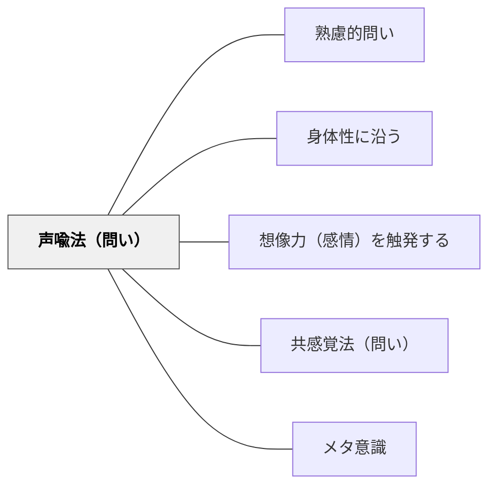

# 声喩法（問い）

> オノマトペを足して問いを情緒的にする

## 背景（Context）
声喩法（オノマトペの使用）は、音の響きによって感覚や情動を直接的に喚起する言語表現である。日本語はとりわけオノマトペが豊富であり、思考や感情の状態を音で描写することができる。問いにオノマトペを組み込むことで、学習者の感覚的・情緒的な回路を開き、抽象的なテーマへの接続を助ける。

## 問題（Problem）
問いが概念的・論理的な言葉だけで構成されると、学習者は感情を切り離した「正しい答え」を探そうとする。思考の手触りや感情の質感を問いに盛り込む手段がなければ、学習者の内的体験が議論から排除されてしまう。特に内省や創造的思考を促したいときに、論理的な言葉だけでは不十分なことがある。

## 力のかたち（Forces）
- 感情的・感覚的表現 vs 概念的・論理的表現
- 問いの親しみやすさ vs 厳密さ
- 個人の内的体験 vs 共有可能な言語
- 問いの遊び心 vs 問いの深刻さ

## 解決（Solution）
「ぐるぐると考えてみると、何が出てきそう？」「もやもやしている部分はどこ？」「この問題にパチンとはまる答えがあるとしたら？」のように、思考や感情の状態をオノマトペで描写した問いを使う。特に停滞感を打破したいとき、あるいは感情を安全に表現させたいときに有効である。

## 結果（Consequences）
- 学習者が感情と思考を統合して問いに向き合えるようになる
- 問いの雰囲気が和らぎ、発言のハードルが下がる
- 内的状態の言語化を促し、メタ認知が深まる

## 関連パタン
- [[パタン/熟慮的問い]] — 親パタン
- [[パタン/身体性に沿う]] — 感覚・身体的直感を学びに引き込む上位パタン
- [[パタン/想像力（感情）を触発する]] — オノマトペの問いが感情・想像力を動かす
- [[パタン/共感覚法（問い）]] — 五感全般に翻訳して問う兄弟パタン
- [[パタン/メタ意識]] — 内的状態の言語化がメタ認知を促す

## クラスター図

## Actionable Insight

- 「もやもやしている部分はどこ？」「ぐるぐると考えてみると何が出てきそう？」というオノマトペの問いを議論の停滞場面で使う——感情と思考を統合して問いに向き合えるようになる
- 「この問題にパチンとはまる答えがあるとしたら？」と問うことで発言のハードルが下がる——問いの雰囲気が和らぎ参加しやすくなる
- 内省の時間に「今どんな感じ？ぞわぞわ・わくわく・もやもやどれ？」とオノマトペで感情を引き出す——内的状態の言語化がメタ認知を促す

## 出典
- [[文献/熟慮的問いのパターンリスト（動画記録）]]
