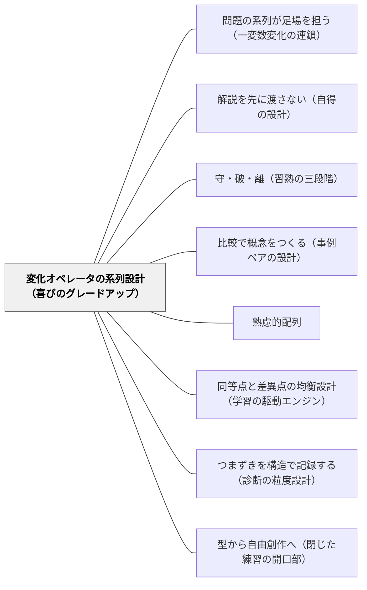

# 変化オペレータの系列設計（喜びのグレードアップ）

> 同じなのに違う。その感覚を育てるのは、変化の「種別」を意図して選ぶ設計者だけである。

## 背景（Context）

算数の練習といえば「同じ型の問題を繰り返す」か、「次第に難しくしていく」かの二択で考えられることが多い。前者は安心だが飽きが来る。後者は成長を促すが、難しさの中身が「難易度の一軸」しかないとき、学習者には「できる」か「できない」かしか見えない。

戸田城外（1930）『推理式指導算術』は600問超の算数問題を並べた教材だが、そこには単純な「易から難へ」では説明できない多様な変化が意図されていた。桝田尚之（2006）はこれを「差異点のバリエーション設計」と読み解いた——同等点（共通する構造）を保ちながら、差異点（変化させる部分）の種別を意図的に選ぶことで、考える必然性と喜びが生まれると論じた。

戸田（1930）『家庭教育学総論』は「同等性が全然ないこと、差異性が全然ないことが大禁物」と言い切る。同等点のない変化は迷子を生み、差異点のない同一は飽きを生む。両方が揃ったとき、「同じなのに違う」という洞察の感覚が育つ。

## 問題（Problem）

変化の「種別」を意識せずに問題を並べると、学習者には「できる/できない」の断絶しか見えない。教師が単に「難しくする」一軸だけで問題を変化させると、学習者は「何が変わったのか」を読む力が育たない。

問題を変化させる方向は実は複数ある——数値を変える、未知数の位置を交換する、条件を増やす、場面を丸ごと切り替える、複数の構造を組み合わせる。これらの種別を無自覚に混ぜたり、どれか一種に偏ったりすると、学習者が感じる変化の「グレードアップ」の感覚が壊れる。

## 力のかたち（Forces）

- **挑戦性 vs 安心感**：毎回全く違う問題では土台が積み上がらないが、同じ問題の単純反復では挑戦が生まれない。どちらも一方だけでは機能しない
- **発見の喜び vs 迷子になる恐れ**：変化の幅を広げるほど洞察の喜びは大きくなるが、変化が複数重なると「何が変わったか」が読めず迷子になる
- **設計コスト vs 教育効果**：変化の種別を意図して選ぶには教材研究が必要だが、一度設計した系列は繰り返し使える
- **系列の厳密さ vs 子どもの問いへの応答**：変化オペレータを順序立てて配列するほど系列の教育効果は高まるが、固定された配列は子どもの発見や問いに応答しにくくなる

## 解決（Solution）

**問題に加える変化の「種別（オペレータ）」を意図して設計し、同・逆・＋α・質的変化・複合という5種の変化を順序立てて配列する。同等点（構造）を保ちながら差異点の種別を段階的に広げることで、「同じなのに違う」感覚が育ち、考える喜びがグレードアップしていく。**

### 5つの変化オペレータ

**① 同（確認）**

数値や場面の表面的な部分を変えて、「同じ構造」と気づかせる。安心感と「またできた」という達成感を生む。構造の輪郭を強化する段階であり、系列の土台を固める。

**② 逆（未知数の位置交換）**

既知と未知の位置を入れ替える。「逆から考える」という新しい思考経路を開く。見かけ上は同じ数値・同じ場面なのに、考え方の向きが変わる——この「向きが変わった」という感覚が次の洞察への扉になる。

**③ ＋α（条件追加）**

情報を1つ追加する。「何が増えたか」を読む力を育てる。条件が1つ増えただけで問いの解き方が変わる経験が、情報の取捨選択という高次の思考を促す。

**④ 質的変化（表層転換・構造保存）**

場面を丸ごと変えるが、関係の構造は同じ（リンゴ→時間・距離→個数など）。「これもさっきと同じだ」という洞察の喜びが最も大きいオペレータ。表面が違うのに中身は同じという体験が、構造への注意を育てる。progressive alignment（Gentner）の遠い比較に対応する。

**⑤ 複合（複数文型の合成）**

2つ以上の構造を組み合わせる。習熟した学習者への挑戦的課題として機能する。①〜④が身についていて初めて複合が意味を持つ——基盤なしに複合だけ与えると単なる混乱になる。

---

### 具体例1：「割合」の学習における変化オペレータの系列

基本原形：「30人の学級の40%は何人？」

| 問 | オペレータ | 問題 | 変えたところ |
|---|---|---|---|
| ① | 同 | 50人の学級の40%は何人？ | 数値のみ変更 |
| ② | 逆 | 30人の学級の何%かが12人だった。何%？ | 未知数の位置を交換 |
| ③ | ＋α | 30人の学級の40%が給食を残した。残した人の60%は女子。女子は何人？ | 条件を1つ追加 |
| ④ | 質的変化 | 1000円の40%引きはいくら？ | 場面を「人数」から「金額」へ転換（構造は同じ） |
| ⑤ | 複合 | 30人の学級の40%が委員会に参加した。委員会全体の人数は1000円のお年玉で全員にチョコを配れる？（1枚100円） | ①〜④の要素を組み合わせ |

学習者は②で「逆から考える」、④で「あ、これ割合と同じだ」という洞察を体験する。⑤は①〜④が揃ってから与える。

---

### 具体例2：「速さ」以外の領域でのオペレータ活用（理科・社会・国語）

変化オペレータは算数に限らない。どの教科でも「構造を保ちながら表層を変える」設計が可能である。

理科「水の状態変化」：
- 同：水→氷の変化を別の温度で確認（確認オペレータ）
- 逆：「氷が水になる現象」から「水になる条件は何か」を逆引き（逆オペレータ）
- 質的変化：「水→水蒸気」（液体→気体）も同じ構造と気づく場面設計（質的変化オペレータ）

国語「物語の構造分析」：
- 同：同じ著者の別の物語で「起承転結」の型を確認
- 質的変化：異なるジャンル（昔話・現代の物語）で同じ構造が現れることに気づく

## 結果（Consequences）

**利点**

- 変化の種別を学習者が意識できるようになると、「次はどう変わるか」と自分で問う力が育つ
- 「④質的変化」の場面で「これもさっきと同じだ」という洞察体験が生まれる——この喜びは概念の転移力に直結する
- 系列の中で「同等点（構造）」と「差異点（変化した部分）」の両方が見えるため、学習者の「分かった気」を超えた本質的な理解が育ちやすい
- 教師の側に変化オペレータのストックが蓄積すると、単元ごとの問題配列設計が速くなる

**注意点・リスク**

- ④質的変化の設計が最も難しい——「表層が違うが構造は同じ」という問題を見つけるには、教師自身が構造を深く理解している必要がある
- ⑤複合を早すぎる段階で与えると、①〜④で積み上げた理解が崩れる。複合は「習熟した学習者への挑戦」として位置づけ、順序を守る
- 変化オペレータだけ設計して基本原形を疎かにすると系列全体が不安定になる——[[パタン/問題の系列が足場を担う（一変数変化の連鎖）]]の「基本原形の設計」と一緒に使う
- 変化オペレータは1問で1種に絞る。②と③を同時に行う（逆にして条件も追加する）と、何が変わったか読めなくなる

## 関連パタン

- [[パタン/問題の系列が足場を担う（一変数変化の連鎖）]] — 一変数に絞る設計（上位）と、何を・どの種別で変えるか設計する（本パタン）の分業。両パタンを組み合わせて使う
- [[パタン/解説を先に渡さない（自得の設計）]] — 変化種別の設計と、ヒント設計は相補的。特に④質的変化こそが「比較の指さし」が最も輝く場面——「さっきの問題と何が同じ？」の一言が鍵になる
- [[パタン/守・破・離（習熟の三段階）]] — マクロな習熟弧（守・破・離、単元・学年をまたぐ）と、ミクロな変化設計（本パタン、1単元・1系列内）の分業。④質的変化は「破」、⑤複合は「離」の入口に対応する
- [[パタン/比較で概念をつくる（事例ペアの設計）]] — 比較軸を何にするかの設計が共通。本パタンの④質的変化は「遠い比較（progressive alignment）」に対応し、構造的類似の洞察が最も大きく育つ
- [[パタン/熟慮的配列]] — 難易度次元での配列（上位）と、変化種別次元での配列（本パタン）の分業。難易度軸の中に本パタンの5種の変化が埋め込まれる
- [[パタン/同等点と差異点の均衡設計（学習の駆動エンジン）]] — 何の種別で変えるか（本パタン）と、同等点と差異点のバランスをどう保つか（均衡設計）の分業。均衡設計が前提として機能し、本パタンはその中の「何を変えるか」を担う
- [[パタン/つまずきを構造で記録する（診断の粒度設計）]] — 変化の種別設計（本パタン）と、種別ごとのつまずきを記録する設計（診断の粒度設計）は対になる。記録がなければ種別設計の効果が見えない
- [[パタン/型から自由創作へ（閉じた練習の開口部）]] — 変化オペレータ系列（同・逆・＋α）が型習得段階を担い、その延長線上に制約付き作問・自由創作が来る。本パタンが型習得の「中身」を設計し、型から自由創作へが「その後の開口部」を設計する

## クラスター図

## Actionable Insight

- **次の授業の練習問題を5問用意するとき、5つすべてに変化オペレータのラベルを貼る**——「同」「逆」「＋α」「質的変化」「複合」のどれかを明示してから並べる。ラベルがない問題は「何を変えたか」が曖昧なサイン
- **④質的変化の問題を1問だけ単元に入れてみる**——場面を丸ごと変えながら「さっきと同じ考え方で解ける？」と問う。「あ、同じだ」という反応を観察する——これが洞察体験の確認
- **⑤複合を出すタイミングを「①〜④が全員スムーズになってから」に決める**——複合を早く出しすぎるとオペレータの種別が見えなくなる。①〜④の達成を確認してから渡す手順を授業設計に明示する

## 出典

- 戸田城外（1930）『推理式指導算術』全3冊
- 戸田城外（1930）『家庭教育学総論』
- 桝田尚之（2006）「推理式指導の解明を中心に」『創価教育研究』第5号
