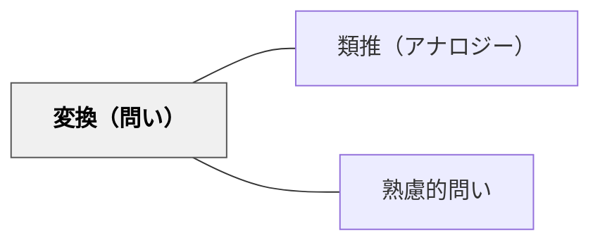

# 変換（問い）

> 「これを別の形式に変えると？」と問うことで、理解の深さと表現の多様性が試される。

## 背景（Context）

同じ内容でも、言葉・図・音楽・演技・数式など、異なる形式で表現すると、理解の新たな側面が浮かびあがる。学習者が一つの表現形式だけで理解を確認していると、その理解が本質的かどうかわかりにくい。形式変換を促す問いは、理解を多層的に検証する機会を与える。

## 問題（Problem）

言葉で説明できても、図で表せないことがある。図で示せても、具体例を挙げられないことがある。一つの形式での「理解」は、別の形式では機能しないことがあり、表面的な理解にとどまっている場合に変換の問いが弱点を明らかにする。

## 力のかたち（Forces）

- 変換先の形式が参加者にとって得意・不得意があり、公平性に注意が必要
- 形式変換を「創造活動」として楽しめる場合と、負担に感じる場合がある
- 変換の質の評価が難しく、教授者に判断力が求められる
- 複数の形式を組み合わせると理解の重層性が高まる

## 解決（Solution）

「これを図で表すとどうなる？」「別の言葉で言い換えると？」「もし音楽で表現するなら？」「子どもに説明するとしたら？」のように、表現・媒体・対象・形式を変えることを促す問いを投げかける。たとえば「今説明した概念を、一枚の絵で描いてみてください」や「この文章をスライド一枚に要約するなら？」のような課題として出すこともできる。

## 結果（Consequences）

- 理解の深さや偏りが別の形式を通じて可視化される
- 多様な表現力が育ち、学習者の創造性が刺激される
- 変換の正確さより「変換しようとする思考プロセス」に価値がある点を共有しておく必要がある

## 関連パタン
- [[パタン/類推（アナロジー）]]

- [[パタン/熟慮的問い]] — 親パタン

## クラスター図

## Actionable Insight

- 「今説明した概念を一枚の絵で描いてみて」という形式変換の課題を授業に取り入れる——言葉で理解しているつもりの内容を別形式で表現することで理解の深さと偏りが可視化される
- 「この文章をスライド一枚に要約するなら？」「子どもに説明するとしたら？」と対象や形式を変えて問う——複数の変換を経ることで理解の多層的な検証が自然と行われる
- 変換の「正確さ」より「変換しようとした思考プロセス」に価値があることを最初に伝える——プロセスへの評価が創造的な表現と探索的思考を安心して試す環境を作る

## 出典

- [[文献/熟慮的問いのパターンリスト（動画記録）]]
