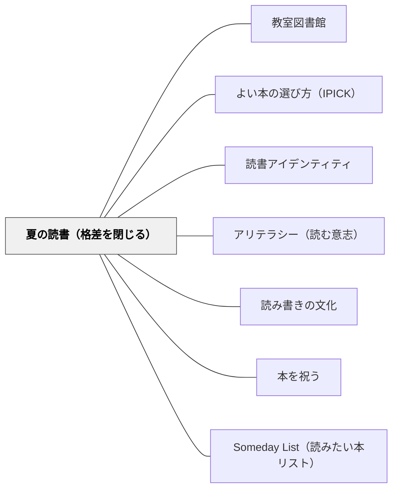

# 夏の読書（格差を閉じる）

> 夏休みは読書格差が生まれる季節だ——学校の蛇口は全員に開いているが、夏になると豊かな家庭の蛇口は開いたまま、貧しい家庭の蛇口は閉まる。本が手元にある子が成長し、本がない子が後退する。これを変えるのは難しくない。本を渡すことだ。

---

## Pattern Connection

**出典**: Allington, R. L., & McGill-Franzen, A.（Eds.）（2013）*Summer Reading: Closing the Rich/Poor Reading Achievement Gap*. Teachers College Press.

- **既存パタンとの関連**：[[パタン/読書アイデンティティ]] が「なぜ読む人間に育つか」を問うのに対し、本パタンは「なぜ貧しい子どもが読む人間になれないか」という構造的条件に焦点を当てる。[[パタン/教室図書館]] の「本が身近にある環境」設計は学年中を扱うが、本パタンは「学年外・夏休み」という最も格差が拡大する時間帯を補完する
- **補強された点**：[[パタン/よい本の選び方（IPICK）]] の「自己選択が最重要」という原則を、Lindsay（2013）メタ分析の選択あり d=.766 vs. 選択なし d=.402 という数値で実証的に裏付ける。選択は方法論ではなく、効果量2倍を生む決定的変数
- **修正・拡張された点**：[[パタン/アリテラシー（読む意志）]] の「WILL を育てる」という課題に対して、本パタンは「WILL が育つためには本へのアクセスという構造的条件が必要だ」という観点を加える。WILLは心理的課題だけでなく環境的・公平性の課題でもある
- **他のパタンへの波及**：[[パタン/読み書きの文化]] — 民主的社会の担い手を育てる読書教育は、夏休みの本のアクセス格差という現実に向き合うことなしには成立しない

**中核的エビデンス（Summer Reading, 2013）：**

- Hayes & Grether（1983）ニューヨーク600校：2年生入学時7か月差→6年生終了時2年7か月差。**差の80%超は夏休み4回で説明できる**
- Allington et al.（2010）フロリダRCT：17高貧困校・12冊/年・50ドル→効果量 d=0.14 = **サマースクール参加と同等**
- Lindsay（2013）メタ分析：本へのアクセス増加介入は平均的教育介入の**1〜4倍の効果量**
- Evans et al.（2010）27か国研究：本が豊富な家庭で育つことは**3年分の追加教育年数**に相当

---

## 背景（Context）

学力格差の議論は学校の中で起きていることに集中しがちだ。教師の質・授業の内容・カリキュラムの設計——これらは確かに重要だが、格差の構造を見誤らせる可能性がある。

Entwisle, Alexander & Olson（1997）の「蛇口理論（Faucet Theory）」は、格差の実態を正確に示す：

> 学校がある期間は、豊かな家庭の子にも貧しい家庭の子にも、平等に学びの蛇口が開いている。しかし夏休みになると、豊かな家庭の蛇口は開いたまま（本・旅行・習い事・家庭での読み聞かせが続く）、貧しい家庭の蛇口は閉まる。

この結果、格差は夏休みごとに拡大する。Hayes & Grether（1983）は、ニューヨーク市600校を追跡し、「格差の80%は4回の夏休みで生まれる」ことを示した。学年中の学力向上ペースは貧富間でほぼ同等——差を生むのは学校ではなく、夏だ。

## 問題（Problem）

低所得層の子どもは夏休みに本を読まない。なぜか。読む気がないからではなく、**本がないから**だ。

Neuman & Celano（2001）の調査：
- 豊かな地域で購入可能な児童書：**16,000冊**
- 貧しい地域で購入可能な児童書：**55冊**

学校・教室・地域の図書施設でも同様の格差がある。Duke（2000）は高貧困校の教室の蔵書が平均わずか3.8冊だったことを示した。夏休みに学校図書館が閉まると、もはや本にアクセスする術がなくなる。

この問題の悪循環：
1. 本がない → 読まない → 読書力が低下する（夏季読書喪失）
2. 夏の読書喪失が積み重なる（毎夏3か月分の格差＝6年間で2年分の差）
3. 読書力の低さが「自分は読めない」という自己像を固める
4. 「読めない」という自己像がさらに読書を避けさせる

## 力のかたち（Forces）

- 夏休みの長さ（10〜12週間）は成長にも後退にも十分な時間をもたらす——何をするかが結果を決める
- 本がなければ読めない——WILLがあってもアクセスがなければ読書は起きない
- 自己選択は動機の核心——他者に選ばれた本を読む義務感はWILLを壊す
- 独立読書レベル（90%以上の正確さ）の本でなければ読書量は増えない——難しすぎる本は読書そのものを止める
- kids' culture（大衆文化・人気シリーズ）を否定すると、子どもが本に近づくルートが塞がれる
- 「読書コミュニティ」の感覚（友達と同じ本を選んで話せる）が読書の社会的動機を生む
- 一回の提供より継続的な提供が効果を累積させる——3年間で統計的有意差が明確になる

## 解決（Solution）

**夏休み前に、子どもが自分で選んだ本を無料で持ち帰れる機会を設計する。本の選び方を事前に教え、読書の社会的動機を夏の間も維持する仕掛けを作る。**

---

### 具体例 1：夏前ブックフェア（Allington et al., 2010 のモデル）

毎年春の学年末に「ブックフェア」を開催する。400〜600タイトルを陳列し、子どもが自分で12〜15冊を選ぶ。4つのカテゴリを揃える：

| カテゴリ | 例 | 目的 |
|---|---|---|
| 人気シリーズ本 | Captain Underpants、ドラゴンボール等 | kids' culture接続・エンゲージメント |
| ポップカルチャー本 | 好きなアーティストの伝記・スポーツ選手 | ノンフィクション入口・有名人への共感 |
| 文化的多様性本 | 自分と似た登場人物が出る本 | 自分ごととして読む動機 |
| カリキュラム関連 | 科学・社会・算数テーマの読み物 | 教科内容の夏での自然な継続 |

Williams（2008）の研究では、低所得の黒人小学生が最も選んだのは上位2カテゴリ——kids' culture と文化的多様性本だった。有名女性の伝記は女子のノンフィクション読書への強力な入り口になった。

---

### 具体例 2：本の選び方3ステップ（夏前ミニレッスン）

ブックフェアの前週に全員に教える：

1. **裏表紙を読む**：「面白そうか？」を確かめる
2. **ランダムな1ページを読んでみる**：「読めるか？」を確かめる
3. **1〜2語以上わからなければ別の本**：わからない言葉が多すぎると読書が止まる

この3ステップは「苦手な読者が読める本を選ぶ」最も具体的な手続きだ。苦手な読者は、上手な友達と同じ難しい本を選んでしまう「社会的バイアス」があるため、この明示的指導が必要（Kim & Guryan, 2010：介入群の3分の2が読めない本を選択→効果なし、という失敗事例から学ぶ）。

---

### 具体例 3：中間読書交換イベント

夏の中盤（7月中旬）に「読んだ本を交換するイベント」を開催する。Bigelman（2013）のウォーターフォード学区では：

- 「Brownies and Books」「Burgers and Books」と命名
- 地域の飲食店・企業と連携（社会的な祭りとして設計）
- 子どもが「読んだ本について話す」機会になる
- 교師からのポストカード・留守番電話メッセージが読書の継続を励ます

これにより「夏の読書は孤独な義務」ではなく「地域の読書コミュニティへの参加」になる。

---

### 具体例 4：ブックモービル家庭訪問（Summer Books!）

Melosh（2013）のフロリダ農村部の事例：10週間・週1回・教師がピックアップトラックに1,000冊を積んで家庭を訪問。毎回ランニングレコードで読書レベルを確認→独立読書レベルに合った本を最大5冊選択。

- フル参加者（7〜10週）の効果量：d=0.54（中程度）
- コスト：伝統的サマースクールの1/3
- 「Jump Ahead」発展版（前半3週間：Reading Recoveryベース集中個別指導＋後半7週間：ブックモービル）の長期効果：参加者の**82%が4〜5年生の州テストで習熟レベル達成**

---

### 具体例 5：低コスト代替案

予算・人員が限られる場合の選択肢：

| 方法 | コスト | 特徴 |
|---|---|---|
| 夏前に学校図書館から本を貸出 | ほぼゼロ | 図書館司書との連携で可能 |
| 週1日だけ学校図書館を開放 | 人件費のみ | 選書の機会を継続 |
| ボイスメール録音（Willman, 1999） | 電話回線のみ | 26人の子どもが92回録音・全員が夏季ロスなし |
| 自己選択夏季読書スクール（Shin, 2001） | 25ドル/人 | 6週間・1人25ドルで約5か月分の成長 |

---

## 結果（Consequences）

**夏季読書プログラムの典型効果**：
- 3か月分の読書喪失を消去
- さらに3か月分の読書成長を追加
- 統制群比で**毎夏6か月分の読書向上**

**累積効果（3年継続）**：
- Allington et al.（2010）：3年間で 175〜225ドルの投資（= 12冊/年 × 3年）
- 効果量 d=0.14 は「年間成長の35〜40%に相当」
- 費用対効果：テスト対策教材・商業的読書プログラムと比べて圧倒的に高い

**意図せぬ効果**：
- 「ブックフェアの日」が学年末の儀式として機能し、読書コミュニティ感覚を生む
- kids' culture 本を「公認」することで、家庭での読書が「楽しみ」として位置づけられる
- 特別支援学級の児童にも同様の効果が確認されている（Bigelman, 2013）

## 関連パタン

- [[パタン/教室図書館]] — 年間を通じた本へのアクセス環境。夏は学校外へのアクセスが絶たれる問題の補完
- [[パタン/よい本の選び方（IPICK）]] — 自己選択スキルの指導。夏前ミニレッスンの核心
- [[パタン/読書アイデンティティ]] — 夏季読書喪失が読書アイデンティティの形成を構造的に妨げる問題
- [[パタン/アリテラシー（読む意志）]] — WILLの前提としての本へのアクセス
- [[パタン/読み書きの文化]] — 読書格差を民主主義・市民育成の問題として捉える
- [[パタン/本を祝う]] — 読書コミュニティを形成する祝祭的実践（中間交換イベントと対応）
- [[パタン/Someday List（読みたい本リスト）]] — 夏の読書リストを「義務」でなく「楽しみな予告」として設計する

## クラスター図

## Actionable Insight

- **今年の学年末に「夏の本選びブックフェア」を試してみる**：学校図書館の本を体育館に並べ、一人3〜5冊を自由に選ばせる。事前に「本の選び方3ステップ」をミニレッスンで教えると選書の質が上がる

- **kids' culture本を学級文庫に加える**：人気アニメ・スポーツ選手・ゲームキャラクターの関連本を「価値が低い」と除外しない。これらの本を「読書の入り口」として認め、教室に置く

- **「夏の本リスト」を子どもと一緒に作る**：教師が選んだリストではなく、子どもが「夏に読みたい」と言った本・シリーズを並べる。Collins（2004）の「reading contract（読書契約）」のように家族も巻き込んで夏の読書時間を合意する形で持ち帰らせる

- **夏休みに学校図書館から本を持ち帰れる仕組みを調べる**：日本の多くの公立小学校では夏休み中の学校図書館開放・貸出が可能なはず。何冊・何週間まで借りられるかを子どもと確認し、上限まで借りることを推奨する

## 出典

Allington, R. L., & McGill-Franzen, A. (Eds.). (2013). *Summer reading: Closing the rich/poor reading achievement gap*. Teachers College Press.

> 「夏の格差が2〜6年生の間の4つの夏において、経済的に有利な学校と貧困校の学力差の80%超を説明する」——Hayes & Grether（1983, p.64）

> 「本が豊富な家庭で育った子どもは、本がほとんどない家庭の子どもに比べて3年分の教育年数に相当する優位性を持つ」——Evans et al.（2010）

> 「Consider that distributing a dozen self-selected books to poor children produced positive results...」——Allington（本書後記断片）
