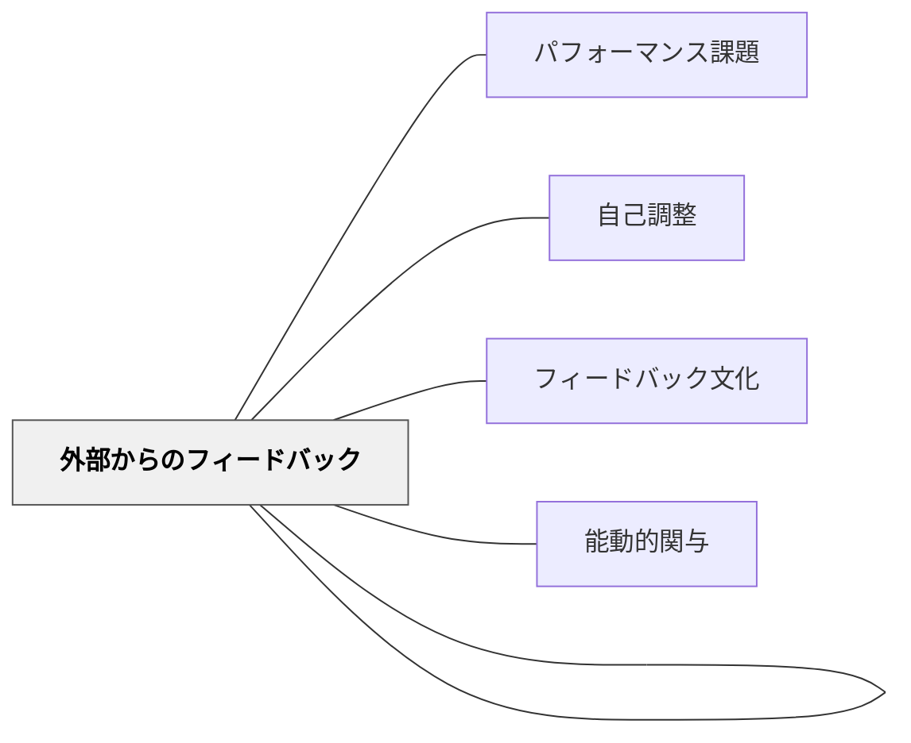

# 外部と内部の視点を取り入れる

> 外からの目と内からの目、その両方があって初めて学びが深まる。外部フィードバックは、自己評価と結びついたとき力を持つ。

## 背景（Context）

フィードバックには2種類の源がある——外部からのフィードバック（教師・専門家・読者・評価者など）と、内部から生まれる自己評価・省察だ。どちらか一方だけでは機能に限界がある。

外部フィードバックだけでは、学習者は受け身になり、「評価者が何を求めているか」に意識が向いてしまう。一方、内部（自己評価）だけでは、思い込みや死角を超えることが難しい。外部と内部を組み合わせることで、フィードバックは学習の力になる。

## 問題（Problem）

外部からのフィードバック（専門家コメント・他クラスからの評価など）を受け取っても、学習者がそれを自分の学習に接続できないことがある。一方、自己評価だけでは客観的な視点が欠け、改善のきっかけが見えにくい。

## 力のかたち（Forces）

- 外部の視点は客観性をもたらすが、受け身になるリスクがある
- 内部（自己評価・省察）は主体性をもたらすが、死角が生まれやすい
- 外部フィードバックを内面化するには「自分の言葉で解釈する」プロセスが必要
- 形成的評価の効果は、学習者が主体的に使うときに最も高まる

## 解決（Solution）

**外部フィードバックを受け取ったあと、内部（自己評価・省察）と接続する時間と問いを設けよ。**

---

### 外部→内部の接続プロセス

1. **外部フィードバックを受け取る**：専門家・他者・評価ルーブリックなどからコメントを得る
2. **フィードバックを読む・聞く**：まず受け取ることに集中する（判断を保留する）
3. **自己評価と照合する**：「自分が思っていたことと、外部からのフィードバックの共通点・違いは何か？」
4. **解釈する**：なぜこのフィードバックが来たのかを自分の言葉で説明する
5. **次の行動を決める**：フィードバックから何を活かすかを自己決定する

---

### パフォーマンス課題との組み合わせ

[[パタン/パフォーマンス課題]]では、本物の文脈・本物の読者に向けて作品を作る。そこに外部からのフィードバック（読者の反応・専門家のコメント）が加わると、外部と内部の接続が自然に生まれる。「読者が〇〇と感じた、自分では△△のつもりだった——なぜズレたか？」という問いが省察の起点になる。

---

### 外部フィードバックの質が接続の深さを決める

表面的なコメント（「良かったです」「もっと頑張って」）では内部との接続が起きにくい。具体的・観察的なフィードバック（「〜のシーンで〜と感じた」「〜の部分が〜だったので、〜がより明確になりそう」）が、自己評価との照合を可能にする。

## 結果（Consequences）

- 外部フィードバックが「評価」ではなく「学習の道具」として機能するようになる
- 自己評価の精度が上がり、独立した学習者としての力が育つ
- フィードバックを受け取ることへの抵抗感が下がり、積極的に求めるようになる

## 関連パタン

- [[パタン/外部からのフィードバック]] — 外部フィードバックの源と受け取り方
- [[パタン/パフォーマンス課題]] — 外部と内部の視点が交差する場をつくる
- [[パタン/自己調整]] — 内部の視点（自己評価・省察）の核
- [[パタン/フィードバック文化]] — フィードバックを学びの文化として根付かせる
- [[パタン/能動的関与]] — フィードバックへの主体的な関わりが学習を深める

## クラスター図

## Actionable Insight

- 外部フィードバックを渡したあと「自分が思っていたこととどこが同じ？どこが違った？」と1問だけ聞く——この問いが外部と内部を接続する
- フィードバックシートに「外部コメント」欄と「自分の解釈」欄の両方を設ける——書く行為が内面化を促す
- ルーブリック評価を行う前に自己評価を先に書かせる——外部評価との比較が省察の起点になる

## 出典

Hattie, J., & Timperley, H. (2007). The power of feedback. *Review of Educational Research*, 77(1), 81–112.  
岩井輝久「教育のパタン・ランゲージ（外部からのフィードバック・外部と内部の視点記述）」
