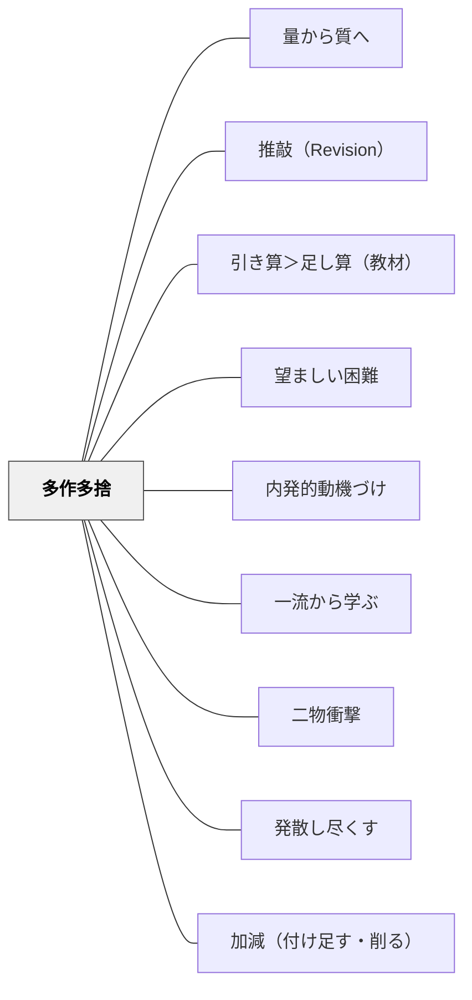

# 多作多捨

> 量を作り、大部分を捨てる——「捨てること」が選別眼を育て、残ったものに力が宿る。

## Pattern Connection

**北大路翼（2019）生き抜くための俳句塾 統合（2026-06-02）：多作多捨の実践論**

北大路翼は第一講「心構え10箇条」の中で多作多捨を核心原則として挙げる。

> 「反省するな、開き直れ。多作多捨（作ったらすぐ捨てろ）。」——北大路翼（2019）第一講

「反省するな」と「多作多捨」はセットである。反省（一句への執着）が多捨を妨げる。作ったらすぐ捨てることで、次の一句へ向かう流動性が保たれる。付録「廃人日記」では、句会のあと電車の中で句を作るという日常が描かれる——生活の隙間で作り続け、選ばれた数句だけが句集になる。

**芭蕉の「かるみ」との共鳴：**
北大路翼が第五講で取り上げた俳人の句群は、「軽み（かるみ）」——作為を捨てた軽やかな一句——を共通して持つ。金子兜太の「酒止めようかどの本能と遊ぼうか」の「軽み」は、たくさん作って捨てていく習慣の中で生まれる無執着の産物。

---

### Fletcher（1996）A Writer's Notebook 統合（2026-06-02）：「40ガロンの樹液から1ガロンのシロップ」——多捨の原理の比喩的根拠

Fletcher は Chapter 11（Rereading: Digging Out the Crystals）で Don Murray の言葉を引用する：

> 「Remember: It takes forty gallons of maple sap to make one gallon of maple syrup.」——Don Murray（Fletcher 1996 引用）

「カエデの樹液40ガロンから1ガロンのシロップができる。樹液はほとんどが水だ。シロップを作るにはその水を煮詰めなければならない。ノートに書くものの多くはその水っぽい樹液だ」——多作多捨の原理が、ライターズ・ノートの文脈で樹液とシロップの比喩によって表現される。

**「結晶を掘り出す」：**
Fletcher はノートを「岩石」に例える。岩の中に結晶が隠れているように、ノートの中に輝く素材が眠っている。しかしほとんどはただの石（duds / dead ends / eggs that don't hatch）。

> 「The bald truth is that most of the stuff in your writer's notebook never germinates.」——Fletcher（1996）

これが「多作多捨」の教育的意義の核心である——「使われないものを大量に書く」のはムダではなく、その中から光る結晶を見つけるために必要な作業なのだ。

**「再読は採掘作業」——多捨のためのプロセス：**
Fletcher の言う再読（Rereading）は「作業としての多捨」のプロセスに対応する：
1. ノートに蓄積した素材（raw material）を再読する
2. 「これは面白い…かもしれない」という感覚を持ったエントリーに印をつける
3. 印のないエントリーは放置（捨てに等しい）
4. 印のあるものだけを「種」として次の段階に持ち込む

これは北大路翼の「句会で選ぶ」という多捨の制度化と同じ構造——どちらも「作ったものの大部分を捨てること」を前提に、その上で「残すに値するものを選ぶ」という判断眼を育てる。

- **既存パタンとの関連**：北大路翼（2019）が「作ったらすぐ捨てろ」という行動的な多捨を示すとすれば、Fletcher（1996）は「多捨は多作を前提にした必然的選別過程」という認知的根拠を示す
- **補強された点**：「多くが使われない」ことへの心理的覚悟が、比喩（樹液/シロップ）によって伝えやすくなる——生徒に「使われなかった句は無駄じゃない」と言うより「40ガロンの樹液から1ガロン」と言う方が伝わる
- **他のパタンへの波及**：[[パタン/ライターズ・ノート]] — ノートの「再読・種探し」が多捨の実践場；[[パタン/引き算＞足し算（教材）]] — 「選ぶ」「削る」が価値を生む；[[文献/A Writer's Notebook（Fletcher）]] — 本統合の出典

---

## 背景（Context）

表現活動では「一つの作品を完璧にしようとする」圧力が働きやすい。俳句で言えば、一句を何時間も磨くより、百句作って一句残す方が俳人の実力を上げる。「反省・修正・完成」という完成品志向の練習観と対照的に、多作多捨は「産出・選別・廃棄」という流動的な練習観を提案する。

[[パタン/量から質へ]]が「まず量をこなして流暢さを育て、その後質へ」という段階論を示すとすれば、多作多捨はさらに一歩進んで「捨てること自体が学習の核心」であると言う。捨てるためには何が良くて何が良くないかの判断が必要——多捨は選別眼の訓練そのものである。

## 問題（Problem）

学習者が一つの作品・解答・アイデアに執着することで起きる問題：

1. **完成前に止まる**：「まだ完成していない」という感覚が次の産出を妨げる
2. **捨てられない**：自分が作ったものに執着して、より良いものへの更新ができない
3. **量が少ない**：一つを大切にしようとするあまり、試行の絶対数が減り上達が遅れる
4. **判断基準が曖昧**：「良い」「悪い」の基準を持たないまま量だけ作っても、多捨にならない

## 力のかたち（Forces）

- 「捨てること」には心理的抵抗がある——特に時間をかけたものほど捨てにくい
- 量だけ作っても、捨てる判断がなければ選別眼は育たない
- 作ったものをすぐ捨てる習慣は、完成品への執着より「次の一句」への向かいやすさを生む
- 俳句の場合、句会という場が多作多捨のリズムを制度化する——毎回5句持参して選ばれた1句が残る
- 「反省（過去への執着）」が多捨の最大の障壁——「もうちょっと直せば」という思いが廃棄を遅らせる
- 捨てたものが次の作品の素材になることがある——完全な廃棄ではなく「保留のファイル」として機能することも

## 解決（Solution）

**大量に作る時間と、選んで捨てる判断の時間を分離する。「作ること」と「評価すること」を同時にしない。量の段階では捨てることへの心理的許可を与え、選別の段階では選別眼（何が残るべきか）を問う。**

---

### 実践1：タイムリミット産出——5分で5句

時間を区切って強制的に量を作る。

- 5分間で俳句を5句作る（質は問わない）
- 書いた5句を並べて、「一番好きな1句」を選ぶ
- 残りの4句を「捨てる」（ノートに残しておいてもよい）
- 選んだ1句について「なぜこれを選んだか」を言葉にする

**捨てる判断の言語化が核心**：「なぜこれを選んで、なぜ他を捨てたか」が言語化できるとき、選別眼が育っている。

---

### 実践2：句会の制度——5句持参・1句選出

俳句の句会形式を教室に取り入れる。

- 各自5句を作って持参する（多作）
- 句会で全員の句を並べ、「一番心に残った句」を選ぶ（選別）
- 選ばれなかった句は次の句会への素材として「保留」（捨てと保留の中間）
- 選ばれた句について「なぜこれが選ばれたか」をみんなで話し合う

句会の選句プロセスは[[パタン/類推的学習①]]の「読み比べ→共通点の発見」と重なる——選んだ句と選ばなかった句の違いを分析することで、「良い句の要素」が帰納される。

---

### 実践3：フリーライティングの多作多捨版

作文・詩・短歌に応用できる多作多捨の基本形。

- **多作フェーズ**（10分）：止まらずに書き続ける。推敲なし、評価なし。
- **休憩・距離をおく**（翌日・翌週）：「自分のもの」という感覚を薄める
- **多捨フェーズ**：全体を読み返し、「これだけは残す」という一節・一行を選ぶ
- **推敲フェーズ**：選んだものだけを丁寧に仕上げる

**「反省するな」の意味**：捨てたものへの後悔や、選ばなかったものへの未練が多作の流れを止める。「捨てたものはもう向こうの世界のもの」という前向きな廃棄の姿勢が、次の多作を可能にする。

---

### 俳句以外への転用

| 教科・活動 | 多作の形 | 多捨の形 |
|---|---|---|
| 国語（詩・作文） | 10分フリーライティング | 一節・一文を選んで残りを削る |
| 算数（解き方の探索） | 複数の解法を試す | 最も簡潔な解法を選ぶ |
| 図工（スケッチ） | 5分で5枚のラフスケッチ | 一枚を選んで仕上げる |
| アイデア出し | ブレインストーミング（評価なし）| 選別フェーズで捨てる |
| 実験仮説 | 複数の仮説を立てる | 検証できるものに絞る |

---

## 結果（Consequences）

- 表現・産出への恐れが下がる——「どうせ捨てるかもしれない」という解放感が量を生む
- 選別眼が育つ——「何を残すか」の判断を繰り返すことで、良いものの感覚が身体化する
- 「完成品への執着」が薄れ、推敲や改善が軽やかになる
- 量の蓄積が質への無意識の学習になる——多くの句を書いた俳人は、書かなかった俳人より良い句を作れる
- ただし、多捨の判断基準（何が良いか）がなければ、ただの乱雑な産出で終わる——[[パタン/一流から学ぶ]]による質の基準の内面化が前提になる

## 関連パタン

- [[パタン/量から質へ]] — 量の産出から質への移行の親パタン的概念
- [[パタン/推敲（Revision）]] — 多捨は推敲の最も基本的な形（削る・捨てる）
- [[パタン/引き算＞足し算（教材）]] — 捨てることで残ったものが輝く
- [[パタン/望ましい困難]] — 「何を残すか」の判断困難が選別眼を育てる
- [[パタン/内発的動機づけ]] — 多作は評価なしの自由な産出から始まる（道楽としての句作）
- [[パタン/一流から学ぶ]] — 捨てる判断の基準は一流の作品への接触から生まれる
- [[パタン/二物衝撃]] — 多作の中で多数の取り合わせを試し、最も衝撃のある二物を選ぶ
- [[パタン/発散し尽くす]] — 多作は「発散し尽くす」の産出実践形態
- [[パタン/加減（付け足す・削る）]] — 多捨は削る（引き算）の実践
- [[文献/生き抜くための俳句塾（北大路翼）]] — 「反省するな、開き直れ。多作多捨」（北大路翼, 2019）

## クラスター図

## Actionable Insight

- **「5分で5句」を俳句の授業の冒頭に入れる**：評価なし・推敲なし。書いた5句の中から「一番好きな1句」を選ばせ、「なぜこれを選んだか」を隣の人に話す——多作と選別眼の訓練が5分でできる
- **句会の制度化**：俳句単元で毎回「5句持参・1句選出」のサイクルを回す——選ばれなかった4句を捨てる（または保留する）ことを制度として位置づける
- **「捨てる許可」を最初に与える**：フリーライティングや詩の下書きで「これはどうせ捨てていい。書いたもの全部が作品じゃなくていい」と言語化する——量を出す前に捨てる許可を与えることで産出量が上がる

## 出典

北大路翼（2019）. 『生き抜くための俳句塾』左右社.

> 「反省するな、開き直れ。多作多捨（作ったらすぐ捨てろ）。」——北大路翼（2019）第一講
