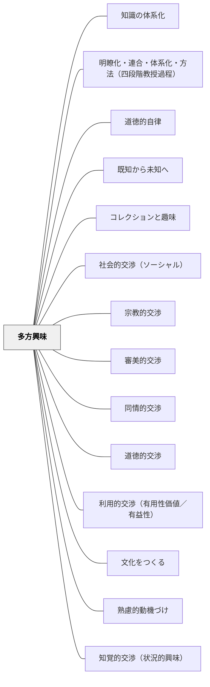

# 多方興味

> 優れた教師は、ビッグメッセージをもっている。

## Pattern Connection

### ヘルバルト（1806）教育学綱要統合——六種興味論の直接の源泉

本パタンの「多方興味」は、牧口常三郎が「ヘルバルト教育学の興味の六種類を修正して地理学に応用した」ものを、さらにパタン化したものである。したがってヘルバルトの六種興味論（§83）は、本パタンの直接の歴史的源泉である。

**ヘルバルトの六種興味と牧口の六種興味の対応**：

| ヘルバルト（1806） | 牧口の修正版 | 内容 |
|---|---|---|
| 経験的（empirisch） | 知覚的 | 対象の直接的な経験・感覚への興味 |
| 思弁的（spekulativ） | 研究的 | 因果・法則・原理への探究 |
| 美的（ästhetisch） | 審美的 | 美・形式・表現への関心 |
| 同情的（sympathetisch） | 同情的 | 他者への共感・人間理解 |
| 社会的（sozial） | 社会的 | 社会・共同体への関心 |
| 宗教的（religiös） | 宗教的 | 存在・意味への根本的関心 |

- **補強された点**：ヘルバルトは六種すべてが「一人ひとりに等しく発現することは期待できないが、集団として見れば必ず六種すべてを見いだす」と述べた。教師に六種の興味を設計する責任があるのは、個人の偏りを集団の多様性で補うためである。
- **一面性への警告**：「一種の興味だけが過度に発達すると人格の発達を妨げる」——授業設計で特定の興味型（例：思弁的のみ・知覚的のみ）に偏ることへの警告。
- **教師の多面性が先**：「教師みずからの多面性ある興味が生徒のうちに同種の興味を植えつける力の尺度である」（§63）——教師が六種の興味を持つことが設計の前提。
- **波及するパタン**：[[パタン/道徳的交渉]] — 社会的・同情的・宗教的興味の育成；[[パタン/省察]] — §117「教師もまた絶えず学び続けねばならない」；[[文献/教育学綱要（ヘルバルト）]] — 本統合の出典

---

### Dewey（1916）

Deweyの *Democracy and Education* Ch.10「Interest and Discipline」は、ヘルバルト→牧口の多方興味論と同じ問い——「なぜ学習者は学ぶのか」——に対する、もう一つの体系的な答えである。両者は異なる系譜から出発しながら、「真の興味を育てることが教育の核心」という点で収束する。

- **既存パタンとの関連**：多方興味の6種類（知覚的・研究的・審美的・同情的・道徳的・宗教的）は、学習者が世界と交渉する多様なチャンネルを分類したもの。DeweyのInterest論はこの「交渉」の質——本物か糖衣か——を問う補完的な視点を加える。
- **補強された点**：牧口の「興味は巧みに類化作用を誘導するより生ず」という命題に、Deweyの「真の関心 vs. 偽の関心」という判別軸が加わる。学習者を動機づけているのが内側から育った関心なのか、外から貼り付けた面白さなのかを見分ける基準になる。

**Deweyの関心（Interest）の3意味**

| 意味 | 説明 |
|---|---|
| 継続的活動への従事 | 何かに取り組み続けている状態 |
| 物事が個人に触れる点 | 自分と素材が交わっている場所 |
| 没頭・吸収される状態 | 自分と活動が同一化している状態 |

> "Interest signifies that self and world are engaged with each other in a developing situation."（Ch.10）

**真の関心 vs. 偽の関心（糖衣）**

| | 真の関心 | 偽の関心（糖衣） |
|---|---|---|
| 構造 | 素材と学習者の力・目的が自然に連結 | 外から面白さを貼り付けている |
| 動機の所在 | 内側（活動そのものへの従事） | 外側（報酬・罰・教師の期待） |
| 結果 | 活動が続く。発展する | 刺激が切れると止まる |
| 心の状態 | 統一された心 | 分割された心（divided mind） |

「分割された心（divided mind）」——建前で関与しながら内側は離脱している状態——は、多方興味の視点で見れば「交渉の表面だけを動かして、深層では接続していない」状態に対応する。

- **他のパタンへの波及**：[[パタン/熟慮的動機づけ]]（Deweyの関心論と多方興味を共に参照）・[[パタン/知覚的交渉（状況的興味）]]・[[パタン/研究的交渉]]——多方興味の6種のうち2種がすでにパタン化されており、Deweyの関心論はそれぞれに「本物の交渉を生んでいるか」という問いを加える。

---

### J.S. ミル（1867）大学教育について——「文科と理科の両輪」という補完的根拠

ミルのセント・アンドルーズ大学就任講演（1867年）は、多方興味の「なぜ多方面が必要か」という問いに対して、ヘルバルト・牧口とは独立した別系統からの歴史的根拠を与える。

- **補強された点**：ヘルバルトの六種興味論（§83）が「人間の興味の分類」として多方興味を基礎づけるなら、ミルは「どの方面を切り捨てても人格形成が不完全になる」という負の側面から同じ論理を補強する。自然科学のみを教えれば文学的感受性が育たない。文学のみを教えれば科学的方法（観察・推論）が育たない。
- **「科学の教育とは方法の教育である」**：ミルは自然科学の目的を「結果そのものを覚えること」ではなく「観察・推論の方法そのもの」を学ぶことだと述べた。これは多方興味の「研究的交渉」（因果・法則への探究）の本質と一致する。
- **「感情の陶冶」という第三の柱**：ミルは知的教育・道徳的教育に加え、詩・芸術を通じた「感情の陶冶」を第三の教養として位置づけた。これは多方興味の「審美的交渉」（美・形式・表現への関心）を「余暇」ではなく「人格形成の柱」として再定置する根拠となる。
- **「全領域の地図」という体系化の視点**：ミルは「個別科学を一つひとつ学ぶだけでなく、知識の全領域がどう関係するかを見渡す地図を持つこと」を大学教育の核心と述べた。多方興味は「個々の興味のカタログ」ではなく、学習者が世界と交渉する多様なチャンネルの体系として設計されるべき。
- **補強するパタン**：[[パタン/専門以前の人間形成]] — 多方面の人間形成が専門化に先行する；[[パタン/審美的交渉]] — 感情の陶冶を教育目標として位置づける
- **波及するパタン**：[[文献/大学教育について（J.S.ミル）]] — 本統合の出典

---

## 背景（Context）

ンチャー」を参照。

エクセレンスの文化や読む文化をつくるための具体的な手立てについては、ロン・バー

ガー（２０２３）やジェラルド・ドーソン（２０２１）、ナンシー・アトウェル（２０１

８）などを参照。

優れた教師は、ビッグメッセージをもっている。社会科が専門の先生には、提案しようと

いうメッセージをもっていて、授業や学校生活を通して提案する文化を教室につくってい

る方がいる。ビックメッセージについては、「パタン　ビッグメッセージ」を参照。

このように、文化をつくるとは、そのコミュニティの当たり前を変えて、コミュニティの

人々の信念や価値観、習慣などを形成していくことである。

「新しき大文化建設の揺籃たれ」池田大作

## 問題（Problem）

学習者が学習の土台に乗れず、本来の教育の価値が届かない。

## 力のかたち（Forces）

- 教育者の意図と学習者の実態のギャップ
- 個々の状況に応じた柔軟な対応の必要性
- 経済性（無駄なコスト・苦しみを省く）の原理

## 解決（Solution）

教育設計と教育実践によって、どのような文化が形成されていくのかよく考えること。

参考資料

ジェラルド・ドーソン（２０２１）『読む文化をハックする』新評論

ナンシー・アトウェル/小坂敦子、澤田英輔、吉田新一郎（２０１８）『イン・ザ・ミド

ル　ナンシー・アトウェルの教室』三省堂

ロン・バーガー（２０２３）『子どもの誇りに灯をともす』英治出版

パタン　多方興味

　多方興味は、人間の興味（交渉）のパタンであり、教育設計の基本的なパタンである。

♡♡♡

　教育設計の、教育教材の基本的な視点を欠くために軽重を付けられず、網羅的で無味乾

燥な教育になっている。

キーワード　多方興味　観念類化作用　

「教授の目的は興味にあり。智識其物を授くるよりは、これより生ずる愉快と奮励にあ

り」牧口常三郎

学習の楽しさや興味を引き出すことに成功したら、被教育者は、自ずと学び続けるようになる。

いかに被教育者の学ぶ喜び、興味を引き出せるか。

「興味は巧みに類化作用を誘導するより生ず。類化作用は児童各自の自動によりて行は

る。此点より見るときは、よく生徒をして自動し奮励するを得せしむれば、夫れ丈教師の

教授は不要に属す。 蓋ぞ殊更に華美の外観的教授を要せんや。児童をして自ら教授に奮進

せしめんとせば、即類化作用を軽快ならしめんとせば、旧観念と新観念の連絡点を明瞭た

らしめざるべからず」牧口常三郎

多方興味の視点で教育材料を分析、設計し、既習（既知）と未知へのつながりが明確になるよう

にすることによって、自ずと推理と理解（観念類化作用）が起きて、学習の喜びや興味を引き出

すことになる。

ここでは多方興味という教育パタンを紹介する。ここで紹介する多方興味は、ヘルバルト教育学

の「興味の六種類」を牧口常三郎が修正して地理学に応用したものを、さらに教育パタンとし

## 結果（Consequences）

- 学習者の力能（なしうる力）が増大する
- パタンの圧縮による教育の経済性が実現する
- 関連パタンと重ね合わせることで効果が高まる

## 関連パタン
- [[パタン/知識の体系化]]
- [[パタン/明瞭化・連合・体系化・方法（四段階教授過程）]]
- [[パタン/道徳的自律]]
- [[パタン/既知から未知へ]]
- [[パタン/コレクションと趣味]]
- [[パタン/社会的交渉（ソーシャル）]]
- [[パタン/宗教的交渉]]
- [[パタン/審美的交渉]]
- [[パタン/同情的交渉]]
- [[パタン/道徳的交渉]]
- [[パタン/利用的交渉（有用性価値／有益性）]]

- [[パタン/文化をつくる]]
- [[パタン/熟慮的動機づけ]]
- [[パタン/知覚的交渉（状況的興味）]]
- [[パタン/研究的交渉]]
- [[パタン/好奇心から多方興味へ]]
- [[パタン/内発的動機づけ]]
- [[パタン/専門以前の人間形成]] — 多方面の教養が人間形成の核心——ミル（1867）の自由主義的教養論との接続
- [[文献/大学教育について（J.S.ミル）]] — 「文科と理科の両輪」・「感情の陶冶」の歴史的根拠

## クラスター図

## Actionable Insight

- 学習者がどんなことに関心があるか1人ひとり把握し、それを読み物選択や作文テーマの選択肢に組み込む——多様な興味への対応が全員を学びに引き込む
- ミニレッスンを設計するとき「このクラスの子はどんな世界を持っているか」を問う——学習者の現実に接続した教材が動機づけの核になる
- 学習者が自分の好きなことを発表・紹介する機会を定期的に設ける——互いの興味を知ることがコミュニティと学びの多様性を育てる

## 出典

岩井輝久「岩井輝久『一つの教育のパタン・ランゲージ』」（2026-04-29 vault収録）
Herbart, J. F. (1806). *Allgemeine Pädagogik aus dem Zweck der Erziehung abgeleitet*. → [[文献/教育学綱要（ヘルバルト）]]
