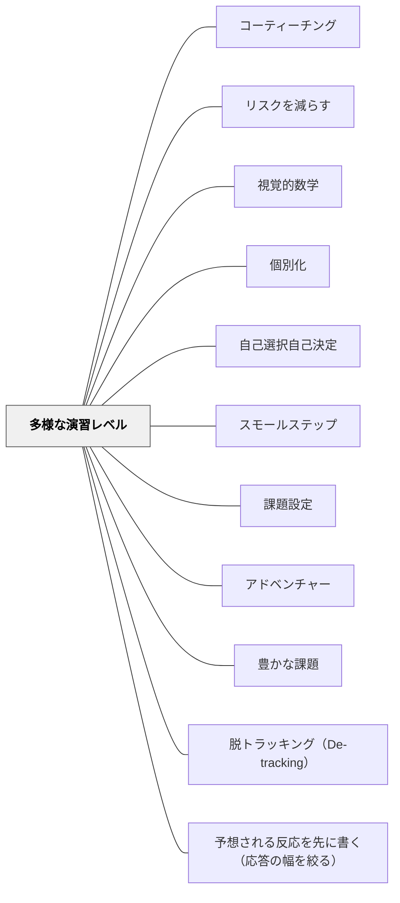

# 多様な演習レベル

> 全員に同じ課題を出すと、できる子は退屈し、苦労している子は挫折する。

## [Pattern Connection]

Bergin et al.（2012）の **Different Exercise Levels** パタンは、[[パタン/個別化]]を「課題の難易度・種類の設計」というレベルで具体化している。

- **補強点**：「個別最適な学び」（[[概念/個別最適な学びと協働的な学び]]）を実装するための最もシンプルな実践として機能する
- **拡張点**：「学習者が自分で難易度を選ぶ」オプション（[[パタン/自己選択自己決定]]との組み合わせ）を提案している
- **特別支援との接続**：特別支援学級では全員の「スタート地点」が大きく異なるため、このパタンは必須の設計要素

---

## 背景（Context）

演習の最も重要な役割は、学習者が新たに獲得したスキルを自力で使う機会を作ることにある。しかし一人一人の能力・経験・学習ペースは異なる。全員に同じ課題を出すと、得意な学習者は早く終わって暇になり、苦手な学習者はできず挫折する。どちらの学習者も「ちょうど良い」経験ができない。

## 問題（Problem）

単一難易度の課題は、クラスの中でうまく「学べる位置」にある学習者を一部に限定してしまう。「全員に同じ」は公平に見えて、実は全員にとって最適でない。

## 力のかたち（Forces）

- 学習者の習熟度・スキルはクラス内で常に差がある
- 差を埋めることを優先すると、得意な学習者が待たされる
- 「全員が成功できる」課題設計は動機を維持するために重要
- 課題の多様化は教師の準備コストを上げる
- 学習者に選ばせると「易しい課題だけ選ぶ」リスクがある

## 解決（Solution）

**同じ学習内容について、難易度・種類・テーマの異なる複数の課題を用意し、学習者が自分に合ったものを選べるようにする（または教師がガイドする）。**

設計のポイント：
- 同じ概念を扱いながら、「基本レベル」「応用レベル」「発展レベル」に分ける
- 「スキルレベル」の目安を課題に示す（例：★・★★・★★★）
- 学習者自身に選ばせることで自己評価と主体性を同時に育てる（[[パタン/自己選択自己決定]]）
- スタディ・グループで「早く終わった子が次の難易度に進む」流れをつくる

---

具体例①：算数「計算練習」
A問題（★）：一桁の掛け算
B問題（★★）：二桁×一桁
C問題（★★★）：二桁×二桁と文章題
学習者が自分でレベルを選び、終わったら次のレベルへ。

具体例②：国語「作文」
基本課題：50字以上でこの出来事を書く
応用課題：150字以上で出来事と自分の考えを書く
発展課題：300字以上で出来事・考え・読んだ人へのメッセージを書く

具体例③：特別支援「生活単元」
「食事の準備」の単元：
A：配膳の手順を見本通りに並べる
B：手順カードを見ながら自分で準備する
C：手順カードなしで準備し、忘れた時に自分で確認する
各学習者の「最近接発達領域」に合わせたレベルを設定する。

具体例④：「選択制」の実施形式
算数の演習時間に「3種類のシートを準備→学習者が今日の自分に合ったものを選ぶ→教師は巡回しながら次のレベルへの移行を促す」という流れ。選ぶ行為自体が自己評価の練習になる。

---

## 結果（Consequences）

- 全ての学習者が「ちょうど難しい」課題に取り組め、動機が維持される
- 得意な学習者が待たずに深化でき、苦手な学習者が挫折なく参加できる
- 学習者の自己評価スキルが育つ（自分に合ったレベルを判断する力）
- 教師は複数バージョンを準備する必要があるが、一度作れば繰り返し使える

## 関連パタン
- [[パタン/コーティーチング]]
- [[パタン/リスクを減らす]]
- [[パタン/視覚的数学]]

- [[パタン/個別化]] — 個別化の上位パタン
- [[パタン/自己選択自己決定]] — 学習者が課題レベルを選ぶ実装
- [[パタン/スモールステップ]] — 最も基本的なレベルを階段状に設計する
- [[パタン/課題設定]] — 課題全体の設計論
- [[パタン/アドベンチャー]] — 難しいレベルへの挑戦を楽しみとして設計する
- [[特別支援/特別支援級の算数指導]] — 多様な演習レベルの特別支援実装
- [[パタン/豊かな課題]] — 複数版を事前準備する代わりに「一つで全員が入れる」LFHC設計という別解
- [[パタン/脱トラッキング（De-tracking）]] — 多様なレベルへの対応を、グループ分けでなく課題設計で実現する

- [[概念/認知加速とダイナミック・アセスメント（学習する力そのものを狙う）]] — 支援があればできることと、成熟しつつある機能に働きかけることの違い
- [[パタン/予想される反応を先に書く（応答の幅を絞る）]] — 反応の幅を絞ることと、演習の幅を用意することは表裏の関係にある

## クラスター図

## Actionable Insight

- 次の演習プリントに「★（基本）」「★★（応用）」の2段階を作る——たった2段階でも全員が「自分に合ったスタート」を得られる
- 「終わったら次のレベルへ」をルールにする——早い子が待つ時間がなくなり、学習密度が全員で上がる
- 特別支援学級では各学習者の「今できること・次にできそうなこと」を把握し、それをそのまま課題の難易度設定に使う——個別の実態把握がそのまま課題設計になる

## 出典

Bergin, J. et al.（2012）"Different Exercise Levels." *Pedagogical Patterns: Advice For Educators.* Joseph Bergin Software Tools.（Markus Völter / Astrid Fricke）

> "If everyone is given the same exercise, then some participants will find it overly simple, and do not learn anything, while others consider the exercise too difficult, are frustrated because they can't do it, and do not learn either."
