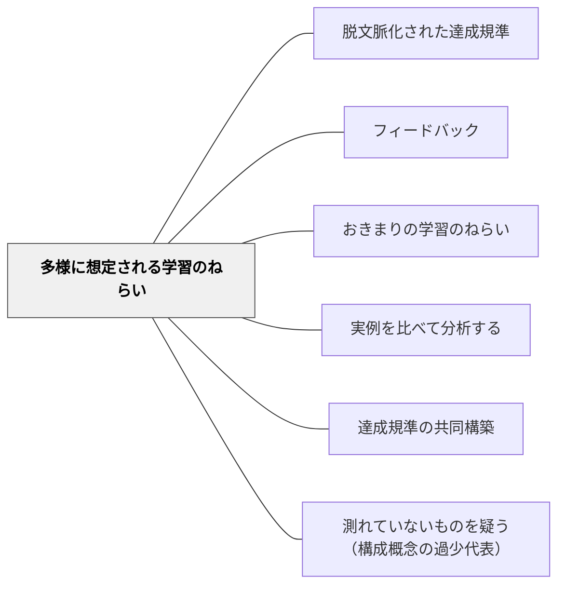

# 多様に想定される学習のねらい

> 「書き出しを工夫する」という目標に対して、正解は一つではない。

## 背景（Context）

作文の「書き出しを工夫する」「自分の言葉で表現する」という目標は、達成の形が学習者ごとに異なる。これは「多様に想定される学習のねらい」であり、一つの正解ではなく様々な優れた表現が現れることを期待する目標である。

## 問題（Problem）

多様に想定される目標を「おきまりの目標」と同じように評価しようとすると、画一的な「正解」を当てはめてしまい、多様な表現を評価できなくなる。

## 力のかたち（Forces）

- 多様な表現を受け入れる評価は、教師の判断力を必要とする
- 「いろんな形で達成できる」という設計が、学習者の個性と動機を引き出す
- 実例を比べることで、多様な達成の形を学習者自身が理解できる

## 解決（Solution）

**目標の種類を「おきまり」と「多様」に分け、多様に想定されるねらいについては複数の優れた実例を示しながら、多様な達成を認め評価する。**

例：
- 書き出しのインパクト（多様な技法が存在する）
- 説明の明確さ（様々な言い方がある）
- 問いの深さ（問いの形は人によって異なる）

## 結果（Consequences）

- 学習者が自分のやり方で「良い達成」を目指せるようになる
- 多様な表現が生まれ、学習がより豊かになる

## クラスター図

## Actionable Insight

- 「書き出しの工夫」などの表現目標に「正解はない、あなたの工夫を見せて」と伝える——多様な表現が生まれる許可を明示することで学習者の個性と動機が引き出される
- 単元の冒頭に多様な優れた実例（異なる表現形式）を並べて見せる——多様な達成の形を視覚的に体感させることで「自分のやり方で良い」という確信が生まれる
- 多様な目標に対しては「点数」より「あなたの表現の特徴を1つ言う」フィードバックを使う——個別化されたフィードバックが多様な表現を育てる評価文化を作る

## 出典

- 一つの教育のパタン・ランゲージ（岩井輝久）

## 関連パタン
- [[パタン/脱文脈化された達成規準]]

- [[パタン/フィードバック]] — 親パタン
- [[パタン/おきまりの学習のねらい]] — 必須目標との対比
- [[パタン/実例を比べて分析する]] — 多様な達成の形を見せる
- [[パタン/達成規準の共同構築]] — 多様な規準を共同で構築する
- [[パタン/測れていないものを疑う（構成概念の過少代表）]] — 想定したねらいのうち、評価に現れないものは実質的に消える

