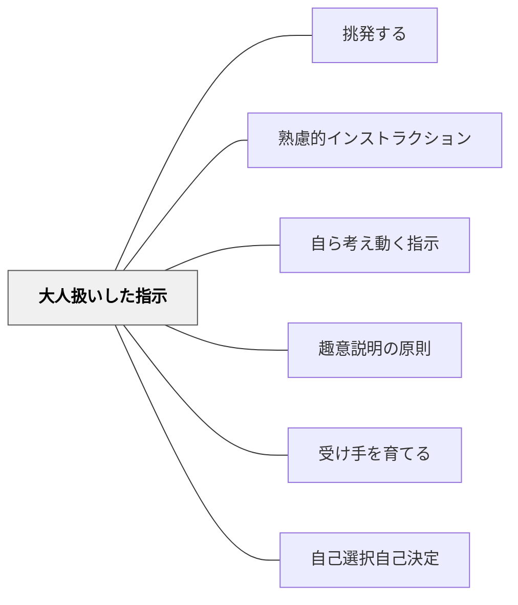

# 大人扱いした指示

> 目的を共有して判断を委ねる指示が、自律的な行動を引き出す。

## 背景（Context）
土居正博の指示論の一つである「大人扱いした指示」は、子どもを自律した判断主体として扱うことで、主体的な行動を引き出す指示の形である。細かく管理・監督するのではなく、目的と信頼を共有して行動の裁量を委ねる。

## 問題（Problem）
全ての手順を細かく管理し、指示通りにしか動けない状態を作り出していると、受け手は自分で考える必要がなくなり、指示がなければ動けなくなる。「やらされている感」が強まり、学習への主体性が育たない。

## 力のかたち（Forces）
- 信頼を与えられた受け手は期待に応えようとする心理が働く
- 自律性を尊重した指示には、十分な関係性と目的の共有が必要
- 全ての場面で大人扱いが機能するわけではなく、スキル・経験・状況による

## 解決（Solution）
**「みんなならどうすればいいかわかるよね」「目的は〇〇です。方法はみんなに任せます」という形で、目的を共有したうえで判断の裁量を受け手に委ねる。**

たとえば「この問題を10分で解決してください。方法はグループで相談して決めていい」のように、ゴールと制約だけを示して手順を受け手に委ねる。細かい管理を手放すことが、受け手の自律的な問題解決力を育てる。

## 結果（Consequences）
- 受け手が自ら考え、判断し、行動する力が育つ
- 指示がない状況でも自律的に動ける受け手が育つ
- 教師と受け手の関係が、管理者と被管理者から協働者へと変化する

## クラスター図

## Actionable Insight

- 「目的は○○です。方法はみんなに任せます」という形で指示を出す——目的の共有と裁量の委譲が自律的な問題解決の動機を生む
- 手順の細かい管理をやめ、ゴールと制約だけを示してグループに任せてみる——「どうすればいいかわかる？」と信頼を先に示すことが自律的行動の引き金になる
- 「みんならどうすればいいかわかるよね」という言葉で期待を示してから課題を渡す——信頼を先に受け取った学習者は期待に応えようとする一貫性の動機が働く

## 出典

- 一つの教育のパタン・ランゲージ（岩井輝久）

## 関連パタン
- [[パタン/挑発する]]
- [[パタン/熟慮的インストラクション]] — 親パタン
- [[パタン/自ら考え動く指示]] — 大人扱いの具体的な指示形態
- [[パタン/趣意説明の原則]] — 目的を共有する手段
- [[パタン/受け手を育てる]] — 受け手の指示受取能力の育成
- [[パタン/自己選択自己決定]] — 大人扱いと連動する選択の機会
