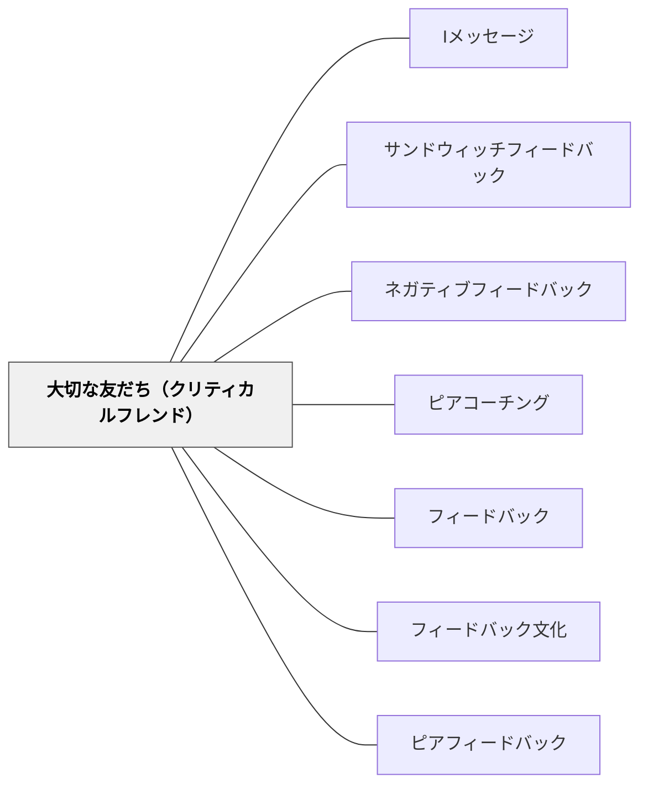

# 大切な友だち（クリティカルフレンド）

> 「あなたのことが大切だから正直に言う」——冷たい批判でも迎合でもなく、本当の友人として改善を促す。

## 背景（Context）

フィードバックには二つの失敗がある。一つは「冷たい批判」——正しいが関係性を壊す批評。もう一つは「迎合」——関係性を守るために本当のことを言わない称賛。どちらも学習者の改善には結びつかない。

教育の場でフィードバックを機能させるためには、「正直さ」と「関係性の温かさ」を同時に持つ文化とロールが必要である。クリティカルフレンド（Critical Friend）という概念は、教師教育・専門家の学習コミュニティから生まれ、「批評的であることと友好的であること」を両立させるフィードバックの関係性を指す。

## 問題（Problem）

批評は正確であっても、関係性がなければ受け取られない。逆に、関係性があっても批評を避けると、学習者は本当に改善が必要な点に気づけない。教師と学習者、あるいは学習者同士の関係でも、この緊張は常に存在する。

「よかったよ」という無難な言葉は学習者を傷つけないが、成長への情報をほとんど含まない。「ここが駄目だ」という言葉は改善の方向を示すが、受け取る側が心を閉じれば届かない。フィードバックが機能する関係性をどのように作るかが課題である。

## 力のかたち（Forces）

- 批評が正確であっても、関係性のない場では受け取られない
- 関係性を守ろうとすると批評が曖昧になり、学習改善に役立たない
- 「本当に大切に思っているから正直に言う」という姿勢がフィードバックの受け入れを促進する

## 解決（Solution）

クリティカルフレンドとして機能するためには、まず関係性の基盤（信頼・尊重・関心）を築くことが前提となる。その上で、フィードバックを与える際に「あなたのことが大切だから言う」という立場を明示的・暗黙的に伝える。

具体的には、「私はあなたの作品が良くなってほしいから、次の点を伝えたい」という文脈を作ることが重要である。批評を「攻撃」ではなく「贈り物」として受け取れる文化([[パタン/フィードバック文化]])を学習コミュニティ全体で育てることで、個々のフィードバックが機能しやすくなる。[[パタン/ピアフィードバック]]や[[パタン/ピアコーチング]]においても、クリティカルフレンドの姿勢はその基本となる。

## 結果（Consequences）

- 批評的な内容でも、関係性の基盤があれば学習者が受け取りやすくなる
- フィードバックが「攻撃」でなく「支援」として経験されるようになる
- クリティカルフレンドの関係を育てるには継続的な時間と相互の努力が必要である

## 関連パタン
- [[パタン/Iメッセージ]]
- [[パタン/サンドウィッチフィードバック]]
- [[パタン/ネガティブフィードバック]]
- [[パタン/ピアコーチング]]

- [[パタン/フィードバック]] — 親パタン
- [[パタン/フィードバック文化]] — クリティカルフレンドが機能するための文化的土台
- [[パタン/ピアフィードバック]] — クリティカルフレンドの関係性を学習者同士に展開する
## このパタンが働く実践

| 実践パタン | どのようにクリティカルフレンドが働くか |
|------------|----------------------------------------|
| [[パタン/ブッククラブ]] | 仲間の読みを尊重しながら、問い返しや違う見方で読みを深め合う |
| [[パタン/ピアフィードバック]] | 作品や考えをよりよくするために、正直で温かいフィードバックを行う |

## クラスター図

## Actionable Insight

- フィードバック前に「この人の成長を願うから正直に言う」という姿勢を一言添える——「大切に思っているから言う」という文脈が批評を贈り物として受け取らせる
- 批評を「あなたの作品が良くなってほしいから伝えたい」という形で始める習慣をつける——関係性の温かさと正直さを同時に示す言葉の練習がクリティカルフレンドを育てる
- ペアを定期的に固定してフィードバックを繰り返し行う——継続的な関係性があることで正直な批評が安全に機能するようになる

## 出典

Costa, A. L. & Kallick, B. (1993). Through the Lens of a Critical Friend. *Educational Leadership*, 51(2), 49–51.
