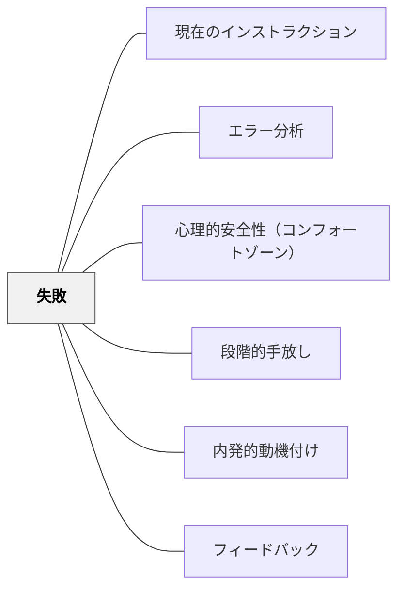

# 失敗

> 失敗は学習の敵ではなく、最も情報量の多い教師だ——間違いが安全に起きる環境においてのみ、学習者は本当に挑戦できる。

---

## 背景（Context）

Carol Dweck の**成長マインドセット（Growth Mindset）**は、「能力は固定されたものではなく努力によって成長する」という信念が、失敗への向き合い方を根本的に変えることを示した。

失敗を「能力の証明」として捉えると、失敗を避けるようになる——難しい課題を回避し、安全な範囲にとどまる。
失敗を「成長の情報」として捉えると、失敗から学ぼうとする——より難しい挑戦を選び、粘り強く取り組む。

[[パタン/エラー分析]] はこの考え方を授業に具体化したものだ。

## 問題（Problem）

多くの学校文化では、失敗（間違い）は恥ずかしいものとして扱われる——正解した子がほめられ、間違えた子は訂正される。

この文化のもとでは：
- 学習者は間違いを恐れ、挑戦しなくなる
- 「分からない」と言えなくなる
- 簡単な課題を選ぶようになる
- 結果として、ZPD（最近接発達領域）での学習が起きない

## 力のかたち（Forces）

- 「間違いを見せてくれてありがとう」という教師の姿勢が文化を作る
- 間違いが可視化されると（他者の間違いも含め）、「みんな間違える」という文化が生まれる
- 正解・不正解の評価より「どう考えたか」を問うことが失敗の恐怖を下げる
- 段階的手放し（[[パタン/段階的手放し]]）の設計が不適切だと「必然的な失敗」が起きる

## 解決（Solution）

**失敗を「情報・学習機会」として明示的に位置づけ、間違いが安全に起きる文化を設計する。**

### 実践の形

- 「間違いを教えてくれてありがとう——これを考える材料にしよう」と明示する
- ナンバートーク（[[パタン/ナンバートーク]]）で複数の解法（間違いを含む）を並べて検討する
- 「もし○○だったら、どう考えが変わる？」と反事実的な問いで失敗を学習材料にする
- [[パタン/エラー分析]] でつまずきのパターンを分析する

## 結果（Consequences）

- 「失敗してもやり直せる」文化が挑戦意欲を育てる
- 間違いから学ぶ習慣が、自律的な問題解決力につながる
- 教師にとって「間違いのパターン」が指導の情報源になる

## 関連パタン
- [[学級経営/文化をつくる]]
- [[パタン/現在のインストラクション]]

- [[パタン/エラー分析]] — 失敗のパターンを分析して指導に生かす
- [[パタン/心理的安全性（コンフォートゾーン）]] — 失敗が安全な環境の土台
- [[パタン/段階的手放し]] — 失敗のリスクを適切に設計する
- [[パタン/内発的動機付け]] — 失敗への向き合い方が内発的動機の質を決める
- [[パタン/フィードバック]] — 失敗をどう伝えるかがフィードバックの核

---

## クラスター図

## Actionable Insight

- **「面白い間違いを見つけた」と言う日を作る**——自分の間違いを見せてくれた子をほめることが文化を作る
- **算数の授業で意図的に「どこで間違えやすいか」を先に教える**——失敗の予告が失敗を安全にする

## 出典

- 一つの教育のパタン・ランゲージ（岩井輝久）
