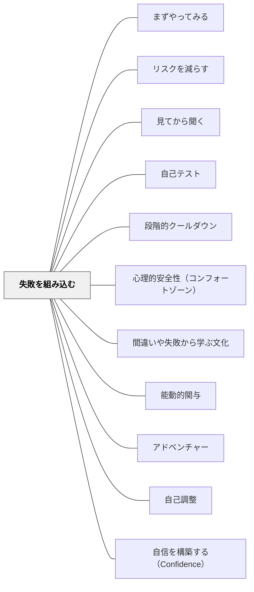

# 失敗を組み込む

> 陶芸の授業で「完璧な壺を1つ」作るよう言われたクラスより、「できるだけたくさん」作るよう言われたクラスの方が、良い壺を作った。

## [Pattern Connection]

Bergin et al.（2012）の **Built-In Failure** パタンは、[[パタン/心理的安全性（コンフォートゾーン）]]の「なぜ心理的安全性が必要か」という根拠を補強し、さらに「失敗を予防するのではなく、意図的に設計する」という逆転を提案する。

- **補強点**：「失敗を恐れる文化」が学習を阻害するメカニズムを、学習者の自信形成の観点から詳細に記述
- **修正・拡張点**：「失敗は避けるべき」という前提を崩し、「失敗するよう設計された活動」を意図的に作ることを推奨する
- **他のパタンへの波及**：[[パタン/能動的関与]]・[[パタン/アドベンチャー]]・[[パタン/間違いや失敗から学ぶ文化]]

---

## 背景（Context）

学習は経験から生まれ、多くの有益な経験は失敗から来る。しかし学習者が自信を持っていなければ、失敗を恐れ、その恐れが学習を妨げる。自信のある学習者は失敗を将来の成功への投資として使う——「間違いは誤解を発見するチャンス」として知識を「修理」できる。

学校では、成功が称えられ失敗は成績によって罰せられることが多い。社員は雇用主に「能力がない」と見られることを恐れる。結果として、「失敗を受け入れる自信」は稀になり、育てるのが難しい。

## 問題（Problem）

失敗を学習プロセスの外に置く（罰・評価によって回避させる）と、学習者は挑戦を避け、リスクのある思考・実験・表現をしなくなる。

## 力のかたち（Forces）

- 評価制度は失敗に対してネガティブな結果を与えがち
- 失敗の経験なしに「失敗から学ぶ」スキルは育たない
- 失敗を「期待される結果」にすることで、失敗への恐れを除去できる
- 全員が同じ失敗を経験する活動でないと、一部の学習者だけが「失敗した」という烙印を押されるリスクがある

## 解決（Solution）

**失敗を学習プロセスの一部として設計することで、失敗への恐れを学習の障壁から取り除く。**

設計のポイント：
- すべての学習者が「間違いを経験する」活動を作る（正しい答えだけを目指す活動にしない）
- 間違いを分析・振り返る時間を必ず入れる（正解を示して終わりにしない）
- 失敗の結果と正解の結果を同等に「振り返り対象」とする
- 評価（成績）から切り離した練習の場として設計する

---

具体例①：インライン・スケートを学ぶ
転び方を先に学ぶ。うまく転べるようになってから走り方を学ぶ。転ぶことを「失敗」ではなく「スキルの一つ」として扱う。

具体例②：陶芸の授業（リチャード・ガブリエルの故事）
「完璧な壺を1つ」作るよう言われたクラスは1つを丁寧に作ったが、「できるだけ重く（たくさん）」作るよう言われたクラスは数をこなす中で本物の技術を身につけた。後者の方が良い壺を作った。

具体例③：算数の「間違い探し」
わざと間違いを含んだ計算式を提示し、「どこが間違っているか」を探させる。間違いを探すことを目的にすることで、自分も「間違うかもしれない」という恐れが薄れる。

具体例④：特別支援「わざとできないゲーム」
教師が意図的に「下手にやる」場面を見せ、失敗をおかしいもの・恥ずかしいものではなく普通のこととして教室に見せる。その後で学習者が挑戦する。

具体例⑤：作家の時間（ライティング・ワークショップ）
初稿は完璧でなくていい——むしろ「ドラフト」というコンセプト自体が「この段階では失敗してよい」という許可を与える。

---

## 結果（Consequences）

- 失敗への恐れが薄れ、挑戦的な学習行動が生まれる
- 学習者が「間違いから学ぶ」スキルを身につける
- 教師に対する「正解を持っている人」という権威主義的関係が崩れ、学習者同士の協力が生まれやすくなる
- 活動の設計は工夫が要るが、一度設計できると繰り返し使える

## 関連パタン
- [[パタン/まずやってみる]]
- [[パタン/リスクを減らす]]
- [[パタン/見てから聞く]]
- [[パタン/自己テスト]]
- [[パタン/段階的クールダウン]]

- [[パタン/心理的安全性（コンフォートゾーン）]] — 失敗を許容する環境の基盤
- [[パタン/間違いや失敗から学ぶ文化]] — 文化として定着させる上位パタン
- [[パタン/能動的関与]] — 挑戦が能動的関与の前提
- [[パタン/アドベンチャー]] — リスクを取ることを楽しみとして設計する
- [[パタン/自己調整]] — 失敗を自分でモニターし軌道修正するスキル
- [[パタン/自信を構築する（Confidence）]] — 失敗を恐れずに試みる自信の構築

## クラスター図

## Actionable Insight

- 1つの授業に「正解のない探索」か「全員が間違える可能性がある課題」を1つ入れる——「失敗しても大丈夫」という空気は、活動の設計から生まれる
- 教師自身が「わからないこと」「失敗したこと」を授業中に話す——教師が失敗を開示することが最も強いモデリングになる
- 「ドラフト」「試し書き」「実験」という言葉を積極的に使う——言葉が「ここでは失敗していい」というシグナルになる

## 出典

Bergin, J. et al.（2012）"Built-In Failure." *Pedagogical Patterns: Advice For Educators.* Joseph Bergin Software Tools.（原著：Kent Beck の Three Bears / Eugene Wallingford 改訂）

> "Learning comes from experience, and much useful experience comes from failure. But a learner who lacks confidence will fear failure, and this fear impedes or even prevents learning."
[[文献/Pedagogical Patterns Advice For Educators（Berginほか）]]
